# Get started with Power BI Desktop

[!INCLUDE [applies-yes-desktop-yes-service](../includes/applies-yes-desktop-yes-service.md)]

Welcome to the getting started guide for Power BI Desktop. This tour shows you how Power BI Desktop works, what it can do, and how to build robust data models and amazing reports to amplify your business intelligence.

For a quick overview of how Power BI Desktop works and how to use it, you can scan the screens in this guide in just a few minutes. For a more thorough understanding, you can read through each section, perform the steps, and create your own Power BI Desktop file to post on the [Power BI service](https://app.powerbi.com/) and share with others.

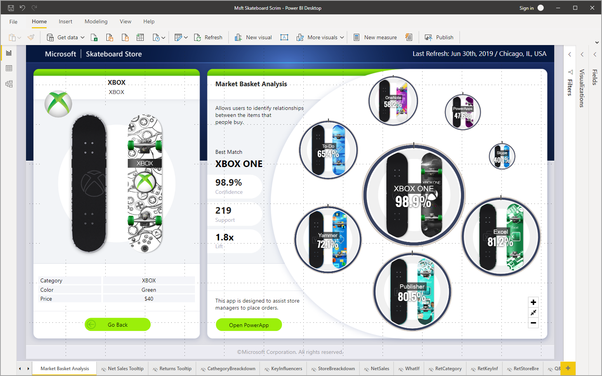

You can also watch the [Getting Started with the Power BI Desktop](https://www.youtube.com/watch?v=Qgam9M8I0xA) video, and download the [Financial Sample](https://go.microsoft.com/fwlink/?LinkID=521962) Excel workbook to follow along with the video.

> [!IMPORTANT]
> You can get the most recent version of Power BI Desktop from the [Windows Store](https://aka.ms/pbidesktopstore), or as a single executable containing all supported languages that you [download](https://www.microsoft.com/download/details.aspx?id=58494) and install on your computer.

## How Power BI Desktop works

With Power BI Desktop, you can:

1. Connect to data, including multiple data sources.
1. Shape the data with queries that build insightful, compelling data models.
1. Use the data models to create visualizations and reports. 
1. Share your report files for others to leverage, build upon, and share. You can share Power BI Desktop *.pbix* files like any other files, but the most compelling method is to upload them to the [Power BI service](https://preview.powerbi.com/). 

Power BI Desktop integrates proven Microsoft query engine, data modeling, and visualization technologies. Data analysts and others can create collections of queries, data connections, models, and reports, and easily share them with others. Through the combination of Power BI Desktop and the Power BI service, new insights from the world of data are easier to model, build, share, and extend.

Power BI Desktop centralizes, simplifies, and streamlines what can otherwise be a scattered, disconnected, and arduous process of designing and creating business intelligence repositories and reports.
Ready to give it a try? Let's get started.

## Install and run Power BI Desktop
To download Power BI Desktop, go to the [Power BI Desktop download page](https://powerbi.microsoft.com/desktop) and select **Download Free**. Or for download options, select [See download or language options](https://www.microsoft.com/download/details.aspx?id=58494). 

You can also download Power BI Desktop from the Power BI service. Select the **Download** icon in the top menu bar, and then select **Power BI Desktop**.

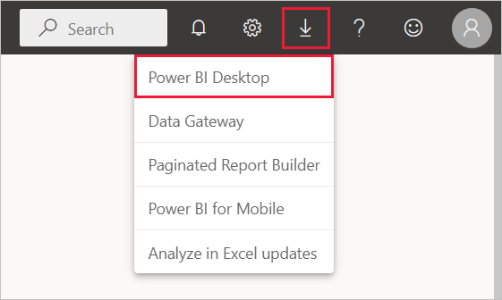

On the Microsoft Store page, select **Get**, and follow the prompts to install Power BI Desktop on your computer. Start Power BI Desktop from the Windows **Start** menu or from the icon in the Windows taskbar.

The first time Power BI Desktop starts, it displays the **Welcome** screen.

From the **Welcome** screen, you can **Get data**, see **Recent sources**, open recent reports, **Open other reports**, or select other links. Select the close icon to close the **Welcome** screen.

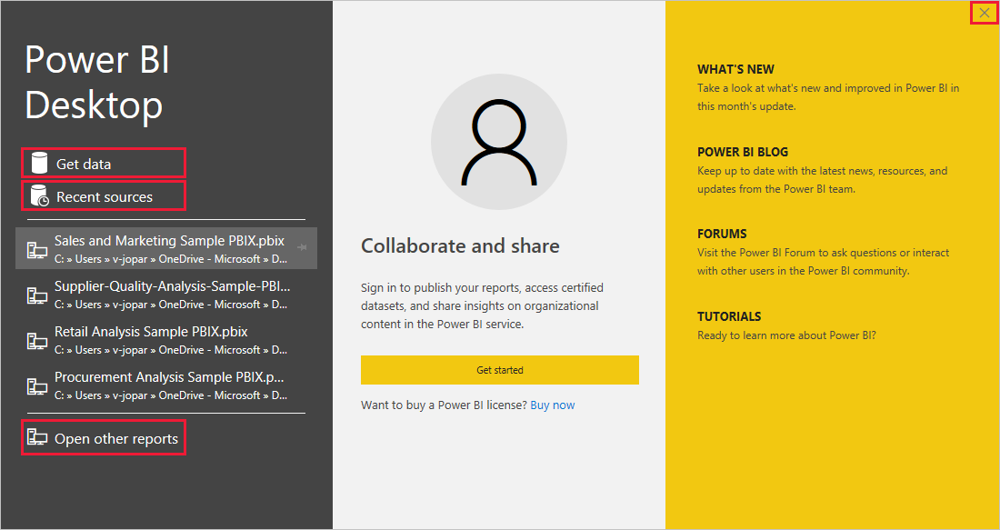

Along the left side of Power BI Desktop are icons for the three Power BI Desktop views: **Report**, **Data**, and **Model**, from top to bottom. The current view is indicated by the yellow bar along the left, and you can change views by selecting any of the icons. 

If you're using keyboard navigation, press Ctrl + F6 to move focus to that section of buttons in the window.  To learn more about accessibility and Power BI, visit our [accessibility articles](../create-reports/desktop-accessibility-creating-tools.md).

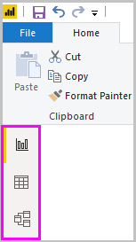

**Report** view is the default view. 

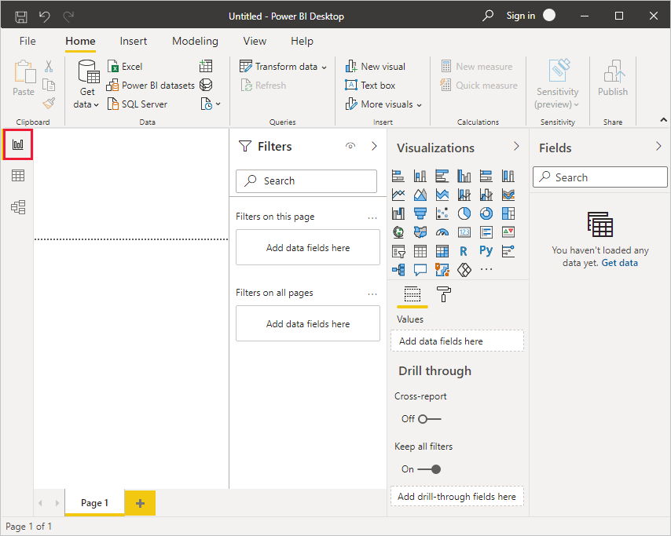

Power BI Desktop also includes the **Power Query Editor**, which opens in a separate window. In **Power Query Editor**, you can build queries and transform data, then load the refined data model into Power BI Desktop to create reports.

## Connect to data
With Power BI Desktop installed, you're ready to connect to the ever-expanding world of data. To see the many types of data sources available, select **Get Data** > **More** in the Power BI Desktop **Home** tab, and in the **Get Data** window, scroll through the list of **All** data sources. In this quick tour, you connect to a couple of different **Web** data sources.

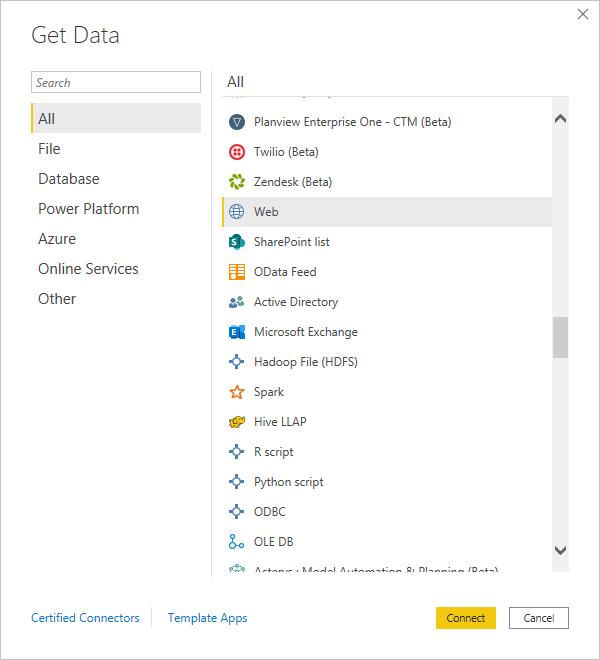

Imagine you're a data analyst working for a sunglasses retailer. You want to help your client target sunglasses sales where the sun shines most frequently. So you might want to find some information on the web about sunny locations.

On the Power BI Desktop **Home** tab, select **Get Data** > **Web** to connect to a web data source. 

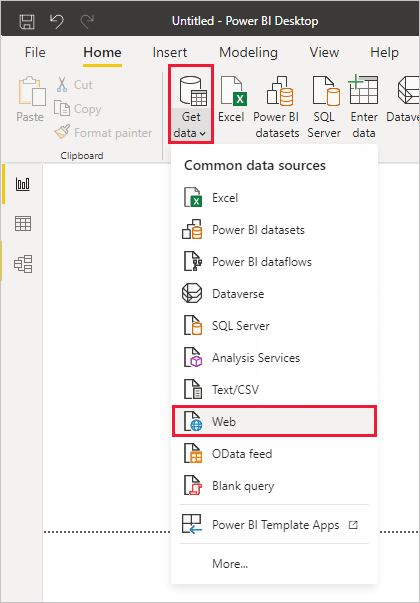

In the **From Web** dialog box, paste an address about sunny locations into the **URL** field, and select **OK**.

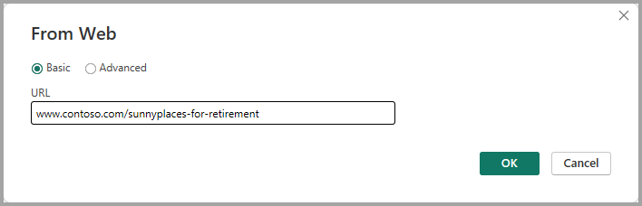

> [!NOTE]
> The URL used in this example is fictitious, you can find your own data in various tables and sites on the web.

If prompted, on the **Access Web Content** screen, select **Connect** to use anonymous access. 

The query functionality of Power BI Desktop goes to work and contacts the web resource. The **Navigator** window returns what it found on the web page, in this case an HTML table called **Ranking of best and worst states for retirement**, and five other suggested tables. You're interested in the HTML table, so select it to see a preview.

At this point you can select **Load** to load the table, or **Transform data** to make changes in the table before you load it.

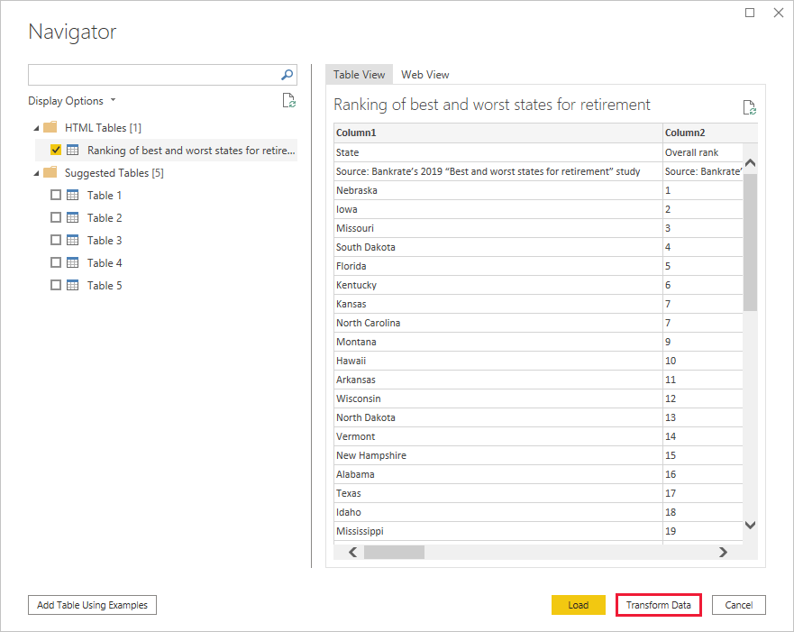

When you select **Transform data**, Power Query Editor launches, with a representative view of the table. The **Query Settings** pane is on the right, or you can always show it by selecting **Query Settings** on the **View** tab of Power Query Editor.

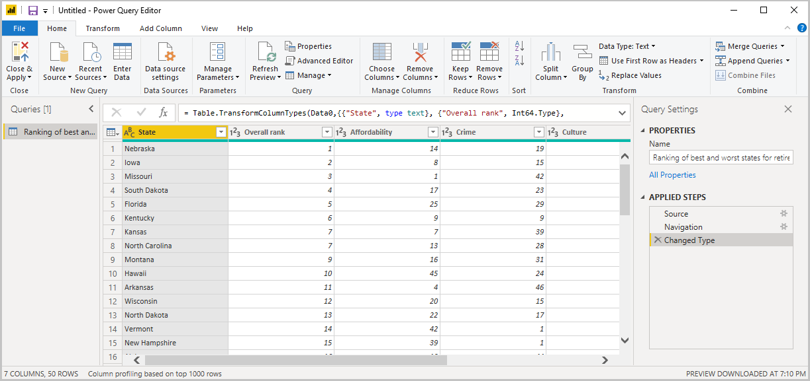

For more information about connecting to data, see [Connect to data in Power BI Desktop](../connect-data/desktop-connect-to-data.md).

## Shape data
Now that you're connected to a data source, you can adjust the data to meet your needs. To *shape* data, you provide Power Query Editor with step-by-step instructions for adjusting the data while loading and presenting it. Shaping doesn't affect the original data source, only this particular view of the data. 

> [!NOTE]
> The table data used in this guide is fictitious and for illustrative purposes. As such, the steps you need to follow with the data you find and use might vary, requiring you to be creative about how you adjust steps or outcomes, which is all part of the fun of learning. 

Shaping can mean *transforming* the data, such as renaming columns or tables, removing rows or columns, or changing data types. Power Query Editor captures these steps sequentially under **Applied Steps** in the **Query Settings** pane. Each time this query connects to the data source, those steps are carried out, so the data is always shaped the way you specify. This process occurs when you use the query in Power BI Desktop, or when anyone uses your shared query, such as in the Power BI service. 

Notice that the **Applied Steps** in **Query Settings** already contain a few steps. You can select each step to see its effect in the Power Query Editor. First, you specified a web source, and then you previewed the table in the **Navigator** window. In the third step, **Changed type**, Power BI recognized whole number data when importing it, and automatically changed the original web **Text** *data type* to **Whole numbers**. 

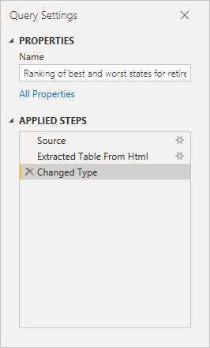

If you need to change a data type, select the column or columns to change. Hold down the **Shift** key to select several adjacent columns, or **Ctrl** to select non-adjacent columns. Either right-click a column header, select **Change Type**, and choose a new data type from the menu, or drop down the list next to **Data Type** in the **Transform** group of the **Home** tab, and select a new data type.

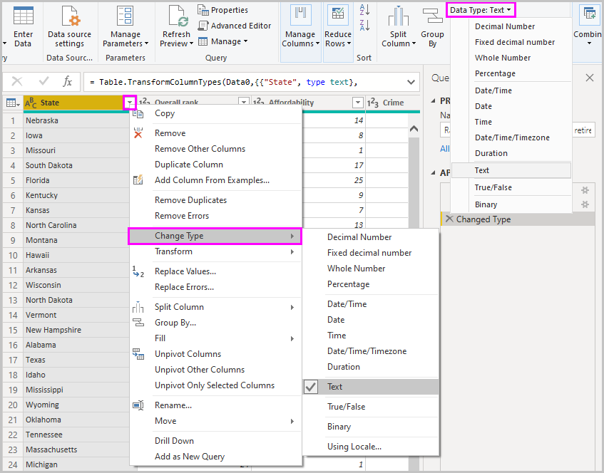

> [!NOTE]
> The Power Query Editor in Power BI Desktop uses the ribbon or the right-click menus for available tasks. Most of the tasks you can select on the **Home** or **Transform** tabs of the ribbon are also available by right-clicking an item and choosing from the menu that appears.

You can now apply your own changes and transformations to the data and see them in **Applied Steps**. 

For example, for sunglasses sales you're most interested in the weather ranking, so you decide to sort the table by the **Weather** column instead of by **Overall rank**. Drop down the arrow next to the **Weather** header, and select **Sort ascending**. The data now appears sorted by weather ranking, and the step **Sorted Rows** appears in **Applied Steps**. 

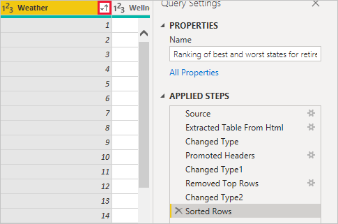

You're not very interested in selling sunglasses to the worst weather states, so you decide to remove them from the table. From the **Home** tab, select **Reduce Rows** > **Remove Rows** > **Remove Bottom Rows**. In the **Remove Bottom Rows** dialog box, enter *10*, and then select **OK**.

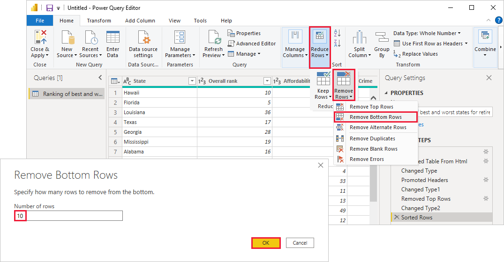

The bottom 10 worst weather rows are removed from the table, and the step **Removed Bottom Rows** appears in **Applied Steps**.

You decide the table has too much extra information for your needs, and to remove the **Affordability**, **Crime**, **Culture**, and **Wellness** columns. Select the header of each column that you want to remove. Hold down the **Shift** key to select several adjacent columns, or **Ctrl** to select non-adjacent columns. 

Then, from the **Manage Columns** group of the **Home** tab, select **Remove Columns**. You can also right-click one of the selected column headers and select **Remove Columns** from the menu. The selected columns are removed, and the step **Removed Columns** appears in **Applied Steps**.

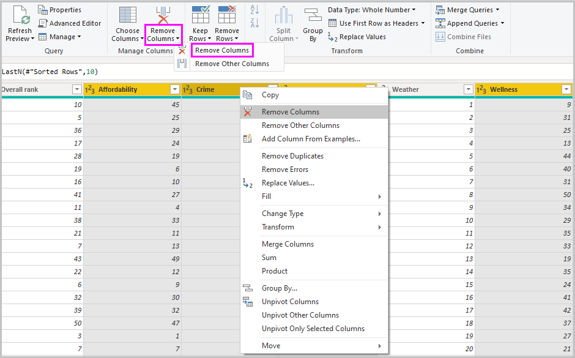

On second thought, **Affordability** might be relevant to sunglasses sales after all. You'd like to get that column back. You can easily undo the last step in the **Applied Steps** pane by selecting the **X** delete icon next to the step. Now redo the step, selecting only the columns you want to delete. For more flexibility, you could delete each column as a separate step. 

You can right-click any step in the **Applied Steps** pane and choose to delete it, rename it, move it up or down in the sequence, or add or delete steps after it. For intermediate steps, Power BI Desktop will warn you if the change could affect later steps and break your query.  

For example, if you no longer wanted to sort the table by **Weather**, you might try to delete the **Sorted Rows** step. Power BI Desktop warns you that deleting this step could cause your query to break. You removed the bottom 10 rows after you sorted by weather, so if you remove the sort, different rows will be removed. You also get a warning if you select the **Sorted Rows** step and try to add a new intermediate step at that point.  

Finally, you change the table title to be about sunglass sales instead of retirement. Under **Properties** in the **Query Settings** pane, replace the old title with *Best states for sunglass sales*.

The finished query for your shaped data looks like this:

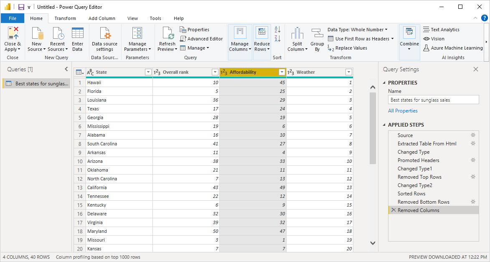

For more information about shaping data, see [Shape and combine data in Power BI Desktop](../connect-data/desktop-shape-and-combine-data.md).

## Combine data
The data about various states is interesting, and will be useful for building additional analysis efforts and queries. But there's one problem: most data out there uses two-letter abbreviations for state codes, not the full names of the states. To use that data, you need some way to associate your state names with their abbreviations.

You're in luck. Another public data source does just that, but the data will need a fair amount of shaping before you can *combine* it with your sunglass table.

To import the state abbreviations data into Power Query Editor, select **New Source** > **Web** from the **New Query** group on the **Home** tab of the ribbon. 

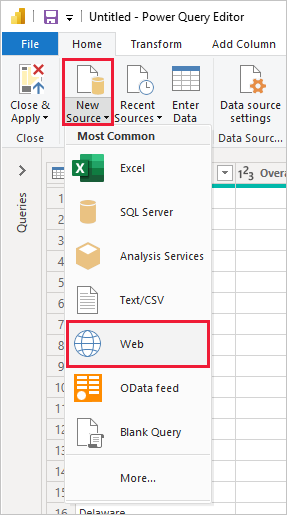

In the **From Web** dialog box, enter the URL for the state abbreviations site: *https:\//en.wikipedia.org/wiki/List_of_U.S._state_abbreviations*.

In the **Navigator** window, select the table **Codes and abbreviations for U.S. states, federal district, territories, and other regions**, and then select **OK**. The table opens in Power Query Editor.

Remove all columns except for **Name and status of region**, **Name and status of region**, and **ANSI**. To keep only these columns, hold down **Ctrl** and select the columns. Then, either right-click one of the column headers and select **Remove Other Columns**, or, from the **Manage Columns** group of the **Home** tab, select **Remove Other Columns**. 

Drop down the arrow next to the **Name and status of region_1** column header, and select **Filters** > **Equals**. In the **Filter Rows** dialog box, drop down the **Enter or select a value** field next to **equals** and select **State**. Select **OK**.

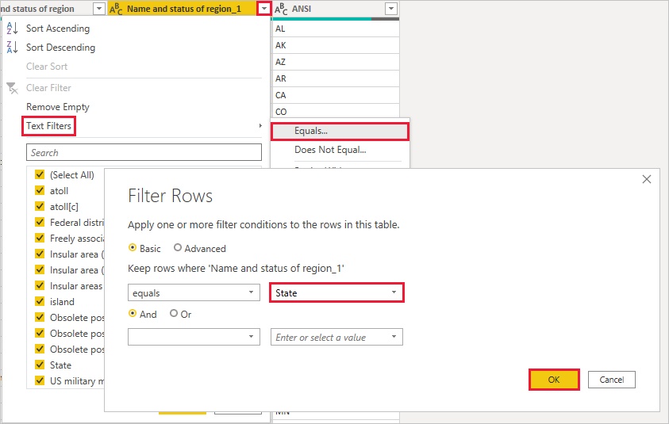

With extra values like **Federal district** and **island** removed, you now have a list of the 50 states and their official two-letter abbreviations. You can rename the columns to make more sense, for example **State name**, **Status**, and **Abbreviation**, by right-clicking the column headers and selecting **Rename**.

Note that all of these steps are recorded under **Applied Steps** in the **Query Settings** pane.

Your shaped table now looks like this:

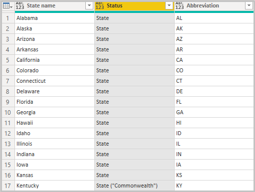

Retitle the table to *State codes* in the **Properties** field of **Query Settings**. 

With the **State codes** table shaped, you can *combine* these two tables into one. Since the tables you now have are a result of queries you applied to the data, they're also called *queries*. There are two primary ways of combining queries: *merge* and *append*. 

When you have one or more columns you'd like to add to another query, you *merge* the queries. When you have additional rows of data you'd like to add to an existing query, you *append* the query.

In this case, you want to *merge* the **State codes** query into the **Best states for sunglasses** query. To merge the queries, switch to the **Best states for sunglasses** query by selecting it from the **Queries** pane on the left side of Power Query Editor. Then select **Merge Queries** from the **Combine** group in the **Home** tab of the ribbon.

In the **Merge** window, drop down the field to select **State codes** from the other queries available. Select the column to match from each table, in this case **State** from the **Best states for sunglasses** query and **State name** from the **State codes** query. 

If you get a **Privacy levels** dialog, select **Ignore privacy levels checks for this file** and then select **Save**. Select **OK**. 

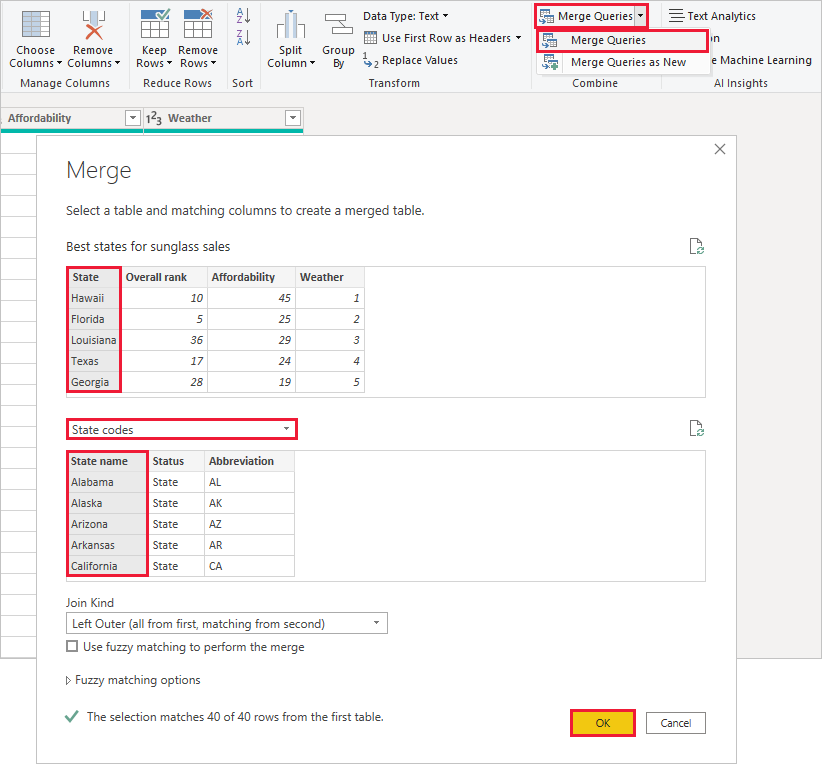

A new column called **State codes** appears on the right of the **Best states for sunglass sales** table. It contains the state code query that you merged with the best states for sunglass sales query. All the columns from the merged table are condensed into the **State codes** column. You can *expand* the merged table and include only the columns you want. 

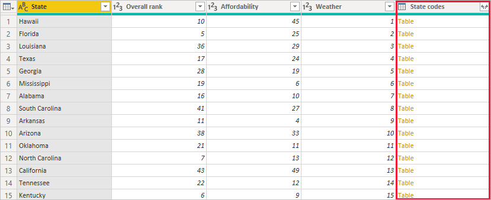

To expand the merged table and select which columns to include, select the **Expand** icon in the column header. In the **Expand** dialog box, select only the **Abbreviation** column. Deselect **Use original column name as prefix**, and then select **OK**. 

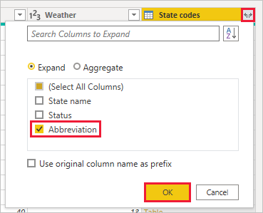

> [!NOTE]
> You can play around with how to bring in the **State codes** table. Experiment a bit, and if you don't like the results, just delete that step from the **Applied Steps** list in the **Query Settings** pane. It's a free do-over, which you can do as many times as you like until the expand process looks the way you want it.

For a more complete description of the shape and combine data steps, see [Shape and combine data in Power BI Desktop](../connect-data/desktop-shape-and-combine-data.md).

You now have a single query table that combines two data sources, each of which has been shaped to meet your needs. This query can serve as a basis for more interesting data connections, such as demographics, wealth levels, or recreational opportunities in the states.

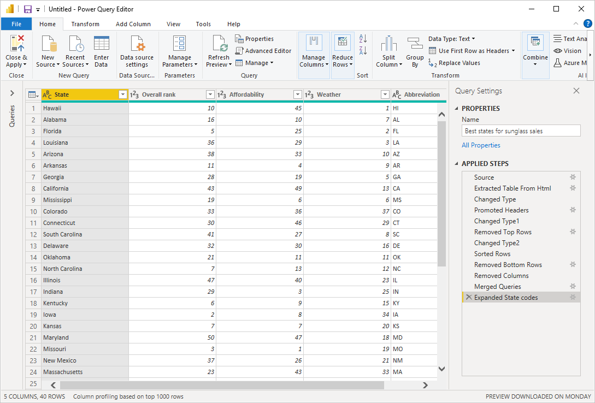

For now, you have enough data to create an interesting report in Power BI Desktop. Since this is a milestone, apply the changes in **Power Query Editor** and load them into Power BI Desktop by selecting **Close & Apply** from the **Home** tab of the ribbon. You can also select just **Apply** to keep the query open in Power Query Editor while you work in Power BI Desktop. 

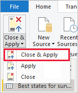

You can make more changes to a table after it's loaded into Power BI Desktop, and reload the model to apply any changes you make. To reopen **Power Query Editor** from Power BI Desktop, select **Transform Data** on the **Home** tab of the Power BI Desktop ribbon. 

## Build reports
In Power BI Desktop **Report** view, you can build visualizations and reports. The **Report** view has six main areas:

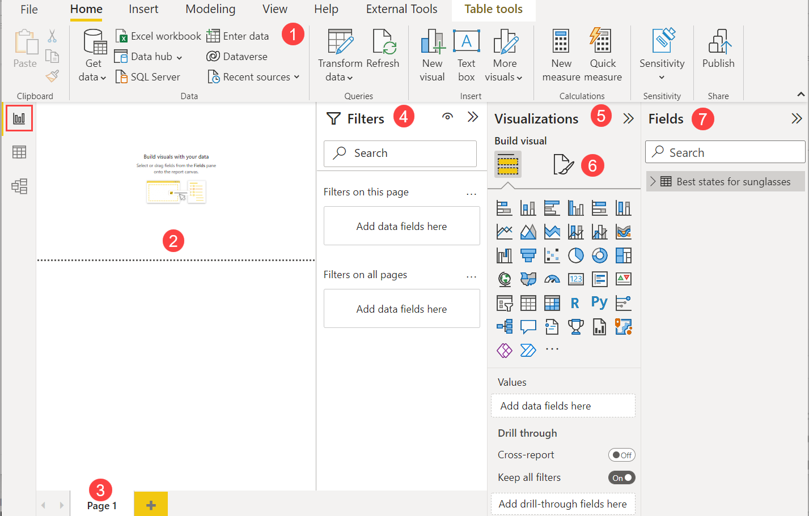

1. The ribbon at the top, which displays common tasks associated with reports and visualizations.
2. The canvas area in the middle, where you create and arrange visualizations.
3. The pages tab area at the bottom, which lets you select or add report pages.
4. The **Filters** pane, where you can filter data visualizations.
5. The **Visualizations** pane, where you can add, change, or customize visualizations, and apply drillthrough.
1. The **Format** pane, where you design the report and visualizations.
1. The **Fields** pane, which shows the available fields in your queries. You can drag these fields onto the canvas, the **Filters** pane, or the **Visualizations** pane to create or modify visualizations.

You can expand and collapse the **Filters**, **Visualizations**, and **Fields** panes by selecting the arrows at the tops of the panes. Collapsing the panes provides more space on the canvas to build cool visualizations. 

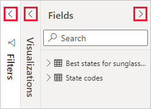

To create a simple visualization, just select any field in the fields list, or drag the field from the **Fields** list onto the canvas. For example, drag the **State** field from **Best states for sunglass sales** onto the canvas, and see what happens.

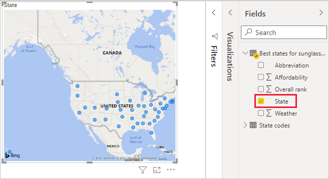

Look at that! Power BI Desktop recognized that the **State** field contained geolocation data and automatically created a map-based visualization. The visualization shows data points for the 40 states from your data model. 

The **Visualizations** pane shows information about the visualization and lets you modify it. 

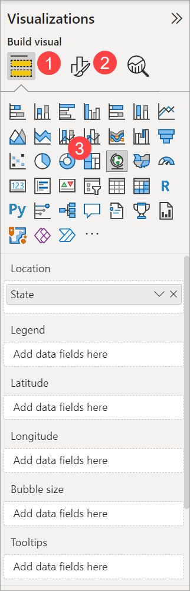

1. The **Fields** option in the **Visualization** pane lets you drag data fields to **Legend** and other field wells in the pane.
1. The **Format** option lets you apply formatting and other controls to visualizations.
1. The icons show the type of visualization created. You can change the type of a selected visualization by selecting a different icon, or create a new visualization by selecting an icon with no existing visualization selected.

The options available in the **Fields** and **Format** areas depend on the type of visualization and data you have.

You want your map visualization to show only the top 10 weather states. To show only the top 10 states, in the **Filters** pane, hover over **State is (All)** and expand the arrow that appears. Under **Filter type**, drop down and select **Top N**. Under **Show items**, select **Bottom**, because you want to show the items with the lowest numerical ranks, and enter *10* in the next field.

Drag the **Weather** field from the **Fields** pane into the **By value** field, and then select **Apply filter**.

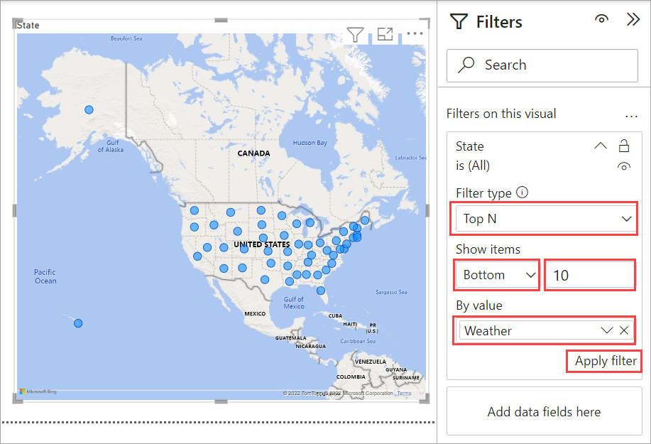

You now see only the top 10 weather states in the map visualization. 

You can retitle your visualization. Select the **Format** icon in the **Visualization** pane, and type *title* in the **Search** box. In the **Title** card, type *Top 10 weather states* under **Text**. 

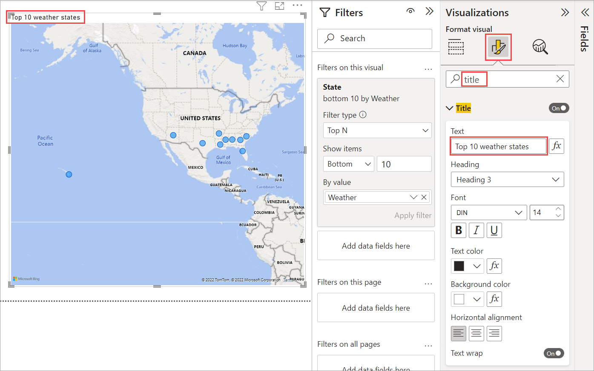

To add a visualization that shows the names of the top 10 weather states and their ranks from 1 to 10, select a blank area of the canvas and then select the **Clustered column chart** icon from the **Visualization** pane. In the **Fields** pane, select **State** and **Weather**. A column chart shows the 40 states in your query, ranked from highest to lowest numerical rank, or worst to best weather. 

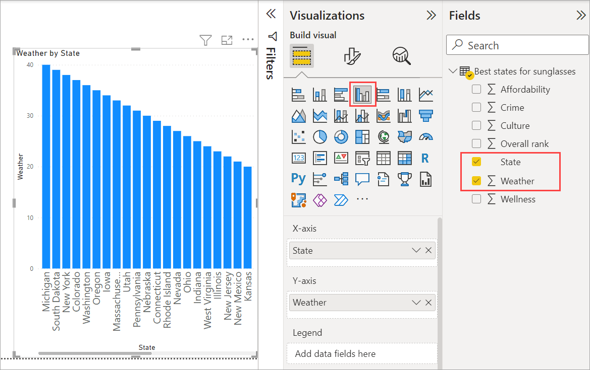

To switch the order of the ranking so that number 1 appears first, select **More options (...)** at the upper right of the visualization, and select **Sort ascending** from the menu. 

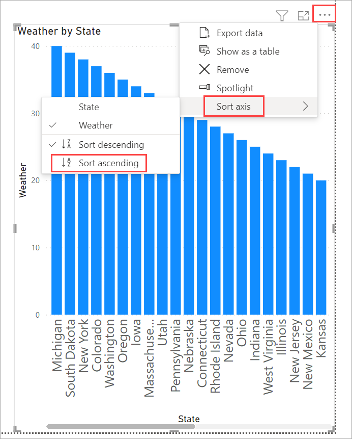

To limit the table to the top 10 states, apply the same bottom 10 filter as you did for the map visualization.

Retitle the visualization the same way as for the map visualization. Also in the **Format** section of the **Visualization** pane, change **Y axis** > **Axis title** from **Weather** to *Weather ranking* to make it more understandable. Then, turn the **Y axis** selector to **Off**. Search for **Zoom slider** and set it to **On**, and turn **Data labels** to **On**.

Now, the top 10 weather states appear in ranked order along with their numerical rankings.

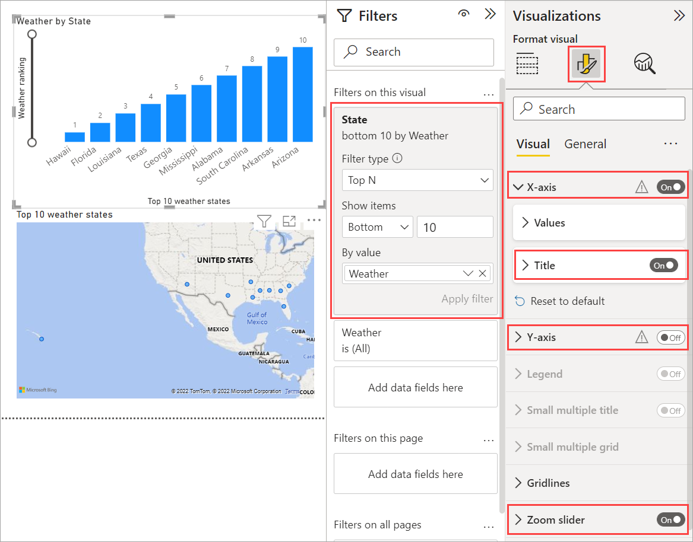

You can make similar or other visualizations for the **Affordability** and **Overall ranking** fields, or combine several fields into one visualization. There are all sorts of interesting reports and visualizations you can create. These **Table** and **Line and clustered column chart** visualizations shows the top 10 weather states along with their affordability and overall rankings:

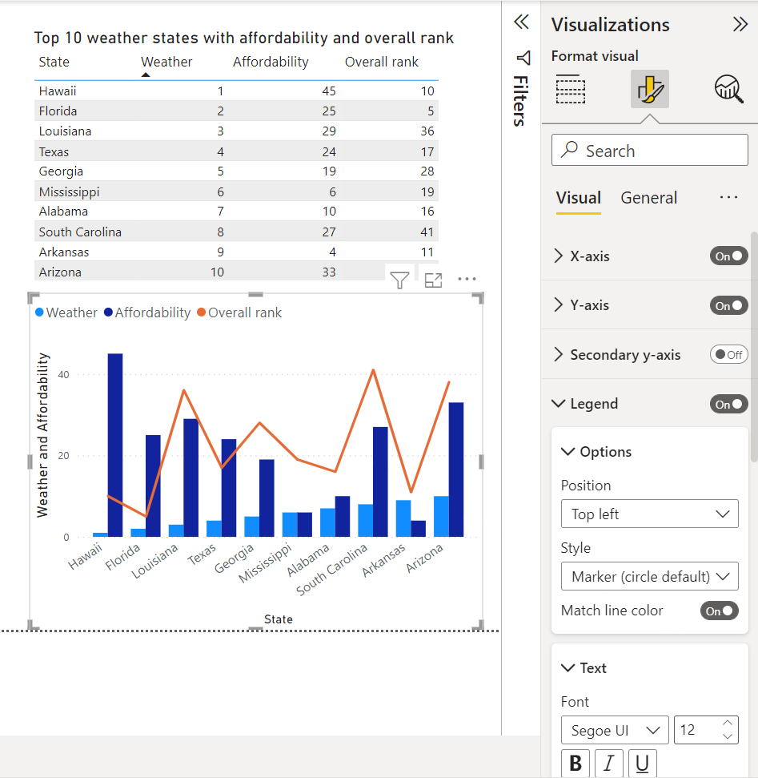

You can show different visualizations on different report pages. To add a new page, select the **+** symbol next to the existing pages on the pages bar, or select **Insert** > **New Page** in the **Home** tab of the ribbon. To rename a page, double-click the page name in the pages bar, or right-click it and select **Rename Page**, and then type the new name. To go to a different page of the report, select the page from the pages bar. 

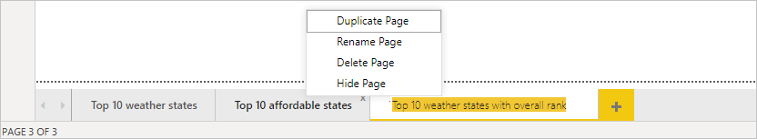

You can add text boxes, images, and buttons to your report pages from the **Insert** group of the **Home** tab. To set formatting options for visualizations, select a visualization and then select the **Format** icon in the **Visualizations** pane. To configure page sizes, backgrounds, and other page information, select the **Format** icon with no visualization selected.

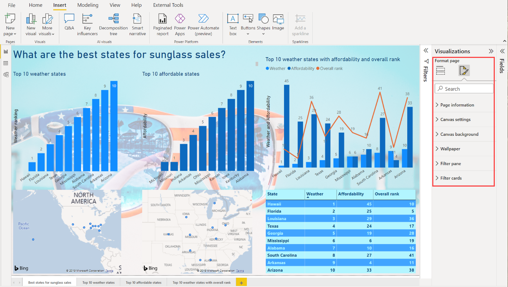

When you finish creating your pages and visualizations, select **File** > **Save** and save your report. For more information about reports, see [Report View in Power BI Desktop](../create-reports/desktop-report-view.md).

## Share your work
Now that you have a Power BI Desktop report, you can share it with others. There are a few ways to share your work. You can distribute the report *.pbix* file like any other file, you can upload the *.pbix* file from the Power BI service, or you can publish directly from Power BI Desktop to the Power BI service. You must have a Power BI account to be able to publish or upload reports to Power BI service. 

To publish to the **Power BI** service from Power BI Desktop, from the **Home** tab of the ribbon, select **Publish**.

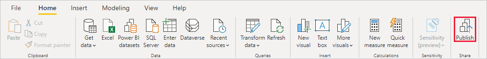

You might be prompted to sign in to Power BI, or to select a destination.

When the publish process is complete, you see the following dialog:

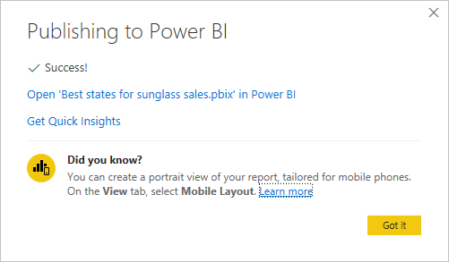

When you select the link to open the report in Power BI, your report opens in your Power BI site under **My workspace** > **Reports**. 

Another way to share your work is to load it from within the **Power BI** service. Go to *https:\//app.powerbi.com* to open Power BI in a browser. On your Power BI **Home** page, select **Get data** at lower left to start the process of loading your Power BI Desktop report.

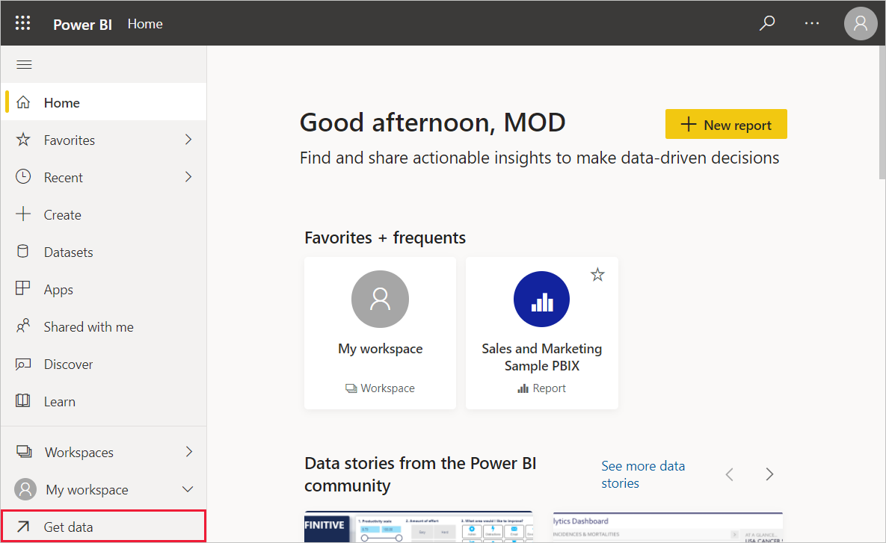

On the next page, select **Get** from the **Files** section.

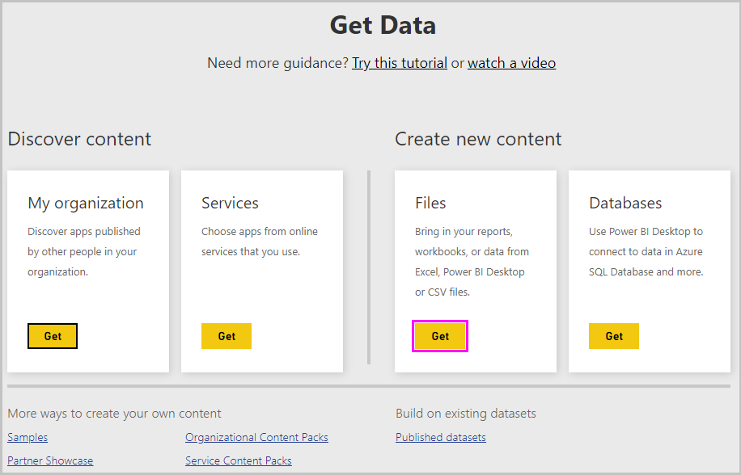

On the next page, select **Local File**. Browse to and select your Power BI Desktop *.pbix* file, and select **Open**. 

After the file imports, you can see it listed under **My workspace** > **Reports** in the left pane of the Power BI service.

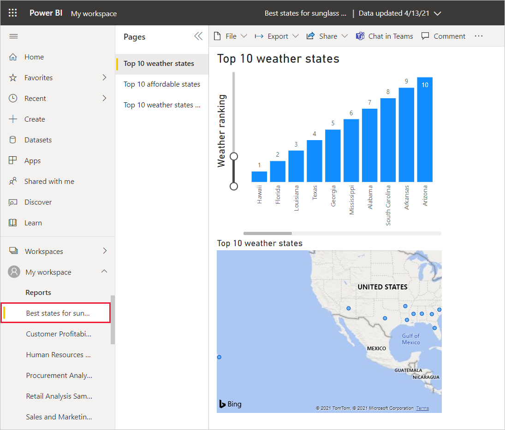

When you select the file, the first page of the report appears. You can select different pages from the tabs at the left of the report. 

You can make changes to a report in the **Power BI** service by selecting **More options** > **Edit** from the top of the report canvas.

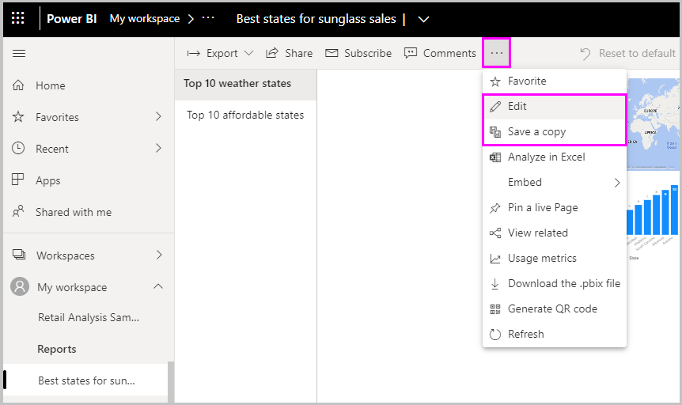

To save your changes, select **File** > **Save a copy**.

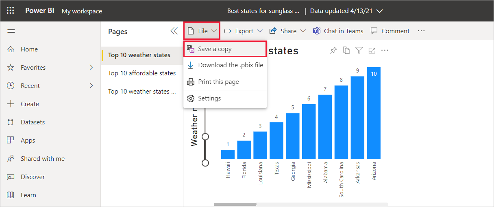

There are all sorts of interesting visuals you can create from your report in the **Power BI** service, which you can pin to a *dashboard*. To learn about dashboards in the **Power BI** service, see [Tips for designing a great dashboard](../create-reports/service-dashboards-design-tips.md). For more information about creating, sharing, and modifying dashboards, see [Share a dashboard](../collaborate-share/service-share-dashboards.md).

To share a report or dashboard, select **Share** > **Report** at the top of the open report or dashboard page, or select the **Share** icon next to the report or dashboard name in the **My workspace** > **Reports** or **My workspace** > **Dashboards** lists.

Complete the **Share report** or **Share dashboard** screen to send an email or get a link to share your report or dashboard with others. 

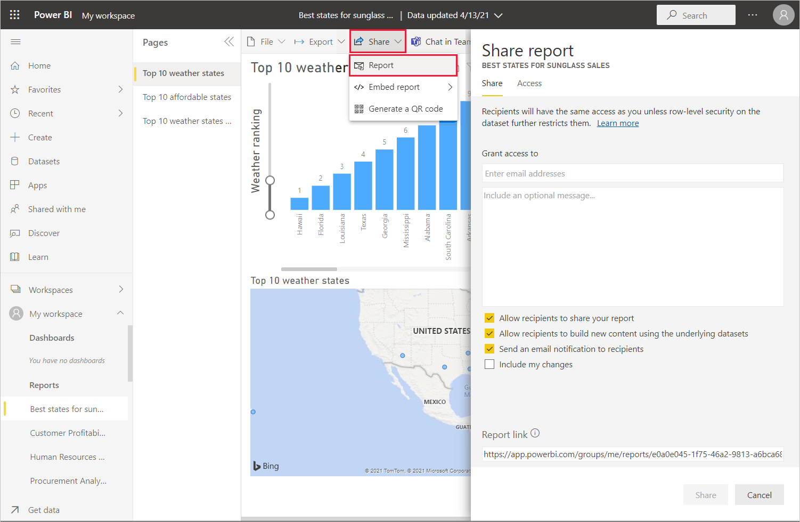

There are many compelling data-related mash-ups and visualizations you can do with Power BI Desktop and the Power BI service.

## Considerations and limitations

- Power BI Desktop is updated and released on a monthly basis, incorporating customer feedback and new features. Only the most recent version of Power BI Desktop is supported. If you contact support for Power BI Desktop, you'll be asked to upgrade to the most recent version.
- For data and reporting that must remain on-premises, there's a separate and specialized version of Power BI called [Power BI Report Server](../report-server/get-started.md). Power BI Report Server uses a separate and specialized version of Power BI Desktop called [Power BI Desktop for Power BI Report Server](../report-server/install-powerbi-desktop.md), which updates three times a year. This article describes standard Power BI Desktop.

## Related content
Power BI Desktop supports connecting to a diagnostics port. The diagnostics port allows other tools to connect to and perform traces for diagnostic purposes. When you're using the diagnostics port, *making any changes to the model isn't supported. Changes to the model may lead to corruption and data loss.*

For more information on the many capabilities of Power BI Desktop, check out the following resources:

* [Query overview in Power BI Desktop](../transform-model/desktop-query-overview.md)
* [Data sources in Power BI Desktop](../connect-data/desktop-data-sources.md)
* [Connect to data in Power BI Desktop](../connect-data/desktop-connect-to-data.md)
* [Tutorial: Shape and combine data with Power BI Desktop](../connect-data/desktop-shape-and-combine-data.md)
* [Common query tasks in Power BI Desktop](../transform-model/desktop-common-query-tasks.md)
