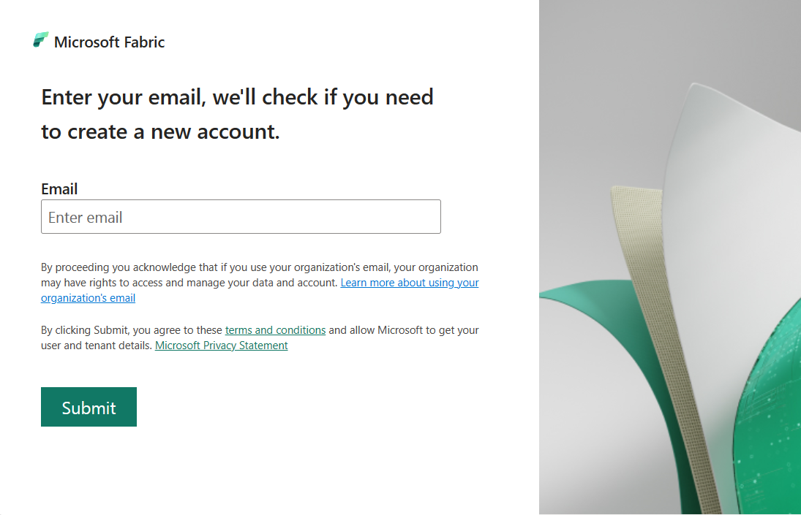

  
<!-- --------------------------------------

- Use this template with pattern instructions for:

Quickstart

- Use the Quickstart pattern when you want to show a user 
how to complete a task to get started with a product or 
service in their own environment.

- Before you sign off or merge:

Remove all comments except the customer intent.

- Feedback:

https://aka.ms/patterns-feedback

-->

# Quickstart: Learn how to use self-service to try or buy Fabric and Power BI

This article explains the self-service process for signing up, trialing, or buying Microsoft Fabric and Power BI. Self-service means that you don't rely on an admin or other colleague to complete the steps for you. You are the person who decides to buy, sign up for free, or start a trial. 

> [!NOTE]
> The Power BI service is available as a standalone service and as one of the services that's integrated with [Microsoft Fabric](/fabric/get-started/microsoft-fabric-overview). Administration and licensing of the Power BI service is now integrated with Microsoft Fabric.

There are many self-service scenarios, and this article covers the scenario of an individual user within a company. The company has an organizational subscription for Fabric. You have a work email address. And, your admin hasn't disable self-service. 

If you don't have a Microsoft subscription or a work or school email account, and you'd like to follow along with this quickstart, [sign up for Power BI and Fabric with a free Office 365 E5 trial account](../enterprise/service-admin-signing-up-for-power-bi-with-a-new-office-365-trial.md).

## Prerequisites

- A work or school email account
- Your admin has enabled self-service purchase, self-service trial, and self-service sign-up 

## Use self-service to buy or try Fabric

This quickstart covers the following steps for getting a free per-user license for Fabric and Power BI.
- Initiate the sign-up process
- Validate your email account
- Open Fabric with a Fabric free license
- Sign up for a Fabric trial capacity
- (optional) Upgrade your Power BI user license

## Open Fabric

This quickstart covers two scenarios.  In the first, you select a "Try it" link.  In the second, a colleague sends you an email with a link to content in Fabric.  

1. Select **Try free** or **Get started** from [powerbi.microsoft.com](https://powerbi.com). Or open Fabric (fabric.microsoft.com).

    Or, select an email link to a Fabric dashboard, report, or app.

    :::image type="content" source="media/service-self-service-signup-for-power-bi/power-bi-emails.png" alt-text="Screenshot of Power BI service showing an email being sent from powerbi.com.":::

1. When prompted, sign in using your organizational account.

    

1. In this example, Microsoft recognizes you and knows that you already have at least one other Microsoft service installed. Select **Sign in** for a Fabric free user license.

    :::image type="content" source="media/service-self-service-signup-for-power-bi/power-bi-recognizes.png" alt-text="Screenshot of Power BI service showing that Microsoft recognizes the email.":::

Fabric opens in your browser. 

## Use self-service to start a Fabric trial

You now have a Fabric free license to explore the free features of all of the Fabric experiences, including the Power BI service. If a Fabric free license is sufficient, you don't have to do anything else. Often, a Fabric free license is sufficent for working in the Power BI service. But, to work in other Fabric services, you'll need a Fabric capacity. One way to get a Fabric capacity is to use self-service to [start a Fabric trial](/fabric/get-started/fabric-trial).

## Use self-service to purchase Power BI Pro or Premium-per-user (PPU)

Some features of Power BI require a Pro or PPU license. You can buy these licenses or start a trial.  For more information, see:
- [Start a trial of the paid features of Power BI.](x)
- Purchase Power BI Pro or PPU [purchase Power BI.](#use-self-service-purchase-to-buy-an-individual-power-bi-license)

## Clean up resources

<!-- Optional: Steps to clean up resources - H2

Provide steps the user takes to clean up resources that
were created to complete the article.

-->

## Next step -or- Related content

> [!div class="nextstepaction"]
> [Next sequential article title](link.md)

-or-

- [Related article title](link.md)
- [Related article title](link.md)
- [Related article title](link.md)

<!-- Optional: Next step or Related content - H2

Consider adding one of these H2 sections (not both):

A "Next step" section that uses 1 link in a blue box 
to point to a next, consecutive article in a sequence.

-or- 

If the quickstart is not part of a sequence, use a 
"Related content" section that lists links to 
1 to 3 articles the user might find helpful.

-->

<!--

Remove all comments except the customer intent
before you sign off or merge to the main branch.

-->