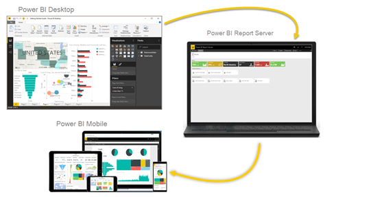

# What is Power BI?

Power BI is a collection of software services, apps, and connectors that work together to turn your unrelated sources of data into coherent, visually immersive, and interactive insights. Your data might be an Excel spreadsheet, or a collection of cloud-based and on-premises hybrid data warehouses. Power BI lets you easily connect to your data sources, visualize and discover what's important, and share that with anyone or everyone you want.

## The parts of Power BI

Power BI consists of several elements that all work together, starting with these three basics:

- A Windows desktop application called *Power BI Desktop*.
- An online software as a service (SaaS) service called the *Power BI service*.
- Power BI Mobile apps for Windows, iOS, and Android devices.

:::image type="content" source="media/power-bi-overview/power-bi-overview-blocks.png" alt-text="Screenshot of Diagram of Power BI Desktop, Service, and Mobile showing their integration.":::

These three elements&mdash;Power BI Desktop, the service, and the mobile apps&mdash;are designed to let you create, share, and consume business insights in the way that serves you and your role most effectively.

Beyond those three, Power BI also features two other elements:

- **Power BI Report Builder**, for creating paginated reports to share in the Power BI service. Read more about [paginated reports](#paginated-reports-in-the-power-bi-service) later in this article.
- **Power BI Report Server**, an on-premises report server where you can publish your Power BI reports, after creating them in Power BI Desktop. Read more about [Power BI Report Server](#on-premises-reporting-with-power-bi-report-server) later in this article.

## How Power BI matches your role

How you use Power BI depends on your role in a project or on a team. Other people, in other roles, might use Power BI differently.

For example, you might primarily use the Power BI service to view reports and dashboards. Your number-crunching, business-report-creating coworker might make extensive use of Power BI Desktop or Power BI Report Builder to create reports, then publish those reports to the Power BI service, where you view them. Another coworker, in sales, might mainly use the Power BI Mobile app to monitor progress on sales quotas, and to drill into new sales lead details.

If you're a developer, you might use Power BI APIs to push data into semantic models or to embed dashboards and reports into your own custom applications. Have an idea for a new visual? Build it yourself and share it with others.  

You also might use each element of Power BI at different times, depending on what you're trying to achieve or your role for a given project.

How you use Power BI can be based on which feature or service of Power BI is the best tool for your situation. For example, you can use Power BI Desktop to create reports for your own team about customer engagement statistics and you can view inventory and manufacturing progress in a real-time dashboard in the Power BI service. You can create a paginated report of mailable invoices, based on a Power BI semantic model. Each part of Power BI is available to you, which is why it's so flexible and compelling.

Explore documents that pertain to your role:

- Power BI for [*business users*](../consumer/end-user-consumer.md)
- Power BI Desktop for [*report creators*](desktop-what-is-desktop.md)
- Power BI Report Builder for [*enterprise report creators*](../paginated-reports/paginated-reports-report-builder-power-bi.md)
- Power BI for [*administrators*](/fabric/admin/microsoft-fabric-admin)
- Power BI for *developers*
  - [What is Power BI embedded analytics?](../developer/embedded/embedded-analytics-power-bi.md)
  - [Create your own visuals in Power BI](../developer/visuals/develop-power-bi-visuals.md)
  - [What can developers do with the Power BI API?](/rest/api/power-bi/)

## The flow of work in Power BI

One common workflow in Power BI begins by connecting to data sources in Power BI Desktop and building a report. You then publish that report from Power BI Desktop to the Power BI service, and share it so business users in the Power BI service and on mobile devices can view and interact with the report.

This workflow is common, and shows how the three main Power BI elements complement one another.

### Use the deployment pipeline tool

In the Power BI service, you can use the [deployment pipeline tool](/fabric/cicd/deployment-pipelines/intro-to-deployment-pipelines) to test your content before you release it to your users. The deployment pipeline tool can help you deploy reports, dashboards, semantic models, and paginated reports. Read about how to [get started with deployment pipelines](/fabric/cicd/deployment-pipelines/get-started-with-deployment-pipelines) in the Power BI service.

## How Microsoft Fabric works with Power BI

[Microsoft Fabric](/fabric/get-started/microsoft-fabric-overview) is an offering that combines data + services in a unified environment, making it easier to perform analysis and analytics on various sets of data. **Power BI** is an example of one of the *services* that's integrated with Microsoft Fabric, and your organization's **OneLake** data store is an example of the *data* that can be used, analyzed, or visualized. Large organizations find Microsoft Fabric particularly useful, since it can corral and then bring greater value to large stores of data, then using services (like Power BI) to bring such data to business life.

Administration of Power BI is now handled by Microsoft Fabric, but your favorite tools like the **Power BI service** and **Power BI Desktop** still operate like they always have - as a service that can turn your data, whether in OneLake or in Excel, into powerful business intelligence insights.

## Paginated reports in the Power BI service

Another workflow involves paginated reports in the Power BI service. Enterprise report creators design paginated reports to be printed or shared. They can also share these reports in the Power BI service. They're called *paginated* because they're formatted to fit well on a page. They're often used for operational reports, or for printing forms such as invoices or transcripts. They display all the data in a table, even if the table spans multiple pages. Power BI Report Builder is the standalone tool for authoring paginated reports.

:::image type="content" source="media/power-bi-overview/paginated-report-invoice-power-bi-service.png" alt-text="Screenshot of paginated report in the Power BI service.":::

Read more about [paginated reports](../paginated-reports/paginated-reports-report-builder-power-bi.md) in the Power BI service.

## On-premises reporting with Power BI Report Server

What if you need to keep your reports on premises, say, behind a firewall?  Read on.

You can create, deploy, and manage Power BI reports in Power BI Desktop, and paginated reports in Report Builder, with the ready-to-use tools and services that Power BI Report Server provides.

Power BI Report Server is a solution that you deploy behind your firewall and then deliver your reports to the right users in different ways, whether that's viewing them in a web browser, on a mobile device, or as an email. And because Power BI Report Server is compatible with Power BI in the cloud, you can move to the cloud when you're ready.

Read more about [Power BI Report Server](../report-server/get-started.md).

## Related content

- [What is Microsoft Fabric?](/fabric/get-started/microsoft-fabric-overview) 
- [Comparison of Power BI Desktop and the Power BI service](../fundamentals/service-service-vs-desktop.md)
- [Tutorial: Learn your way around the Power BI service](../consumer/end-user-experience.md)
- [Tutorial: Get started with the Power BI service](service-get-started.md)
- [Quickstart: Connect to data in Power BI Desktop](../connect-data/desktop-quickstart-connect-to-data.md)
