# Tutorial: Get started creating with the Power BI service
This tutorial is an introduction to some of the features of the *Power BI service*. In it, you connect to data, create a report and a dashboard, and ask questions of your data. You can do much more in the Power BI service; this tutorial is just to whet your appetite. For an understanding of how the Power BI service fits in with the other Power BI offerings, we recommend reading [What is Power BI](power-bi-overview.md).

Are you a report *reader* rather than a creator? [Getting around in the Power BI service](../consumer/end-user-experience.md) is a good starting place for you.

In this tutorial, you complete the following steps:

> [!div class="checklist"]
> * Sign in to your Power BI online account, or sign up, if you don't have an account yet.
> * Open the Power BI service.
> * Get some data and open it in report view.
> * Use that data to create visualizations and save it as a report.
> * Create a dashboard by pinning tiles from the report.
> * Add other visualizations to your dashboard by using the Q&A natural-language tool.
> * Resize, rearrange, and interact with the tiles on the dashboard.
> * Clean up resources by deleting the dataset, report, and dashboard.

## Sign up for the Power BI service
You need a Power BI Pro license to create content in Power BI. If you don't have a Power BI account, [sign up for a free Power BI Pro trial](https://app.powerbi.com/signupredirect?pbi_source=web) before you begin.

## Step 1: Get data

Often when you want to create a Power BI report, you start in Power BI Desktop. Power BI Desktop offers more power. You can transform, shape, and model data, before you start designing report. This time though, we're going to start from scratch creating a report in the Power BI service.

In this tutorial, we get data from a simple Microsoft Excel file. Want to follow along? [Download the Financial Sample file](https://go.microsoft.com/fwlink/?LinkID=521962).

1. To begin, open the Power BI service (app.powerbi.com) in your browser. 

    Don’t have an account? No worries, you can [sign up for a free Power BI Pro trial](https://app.powerbi.com/signupredirect?pbi_source=web)

1. Select **My workspace** in the navigation pane.

1. In **My workspace**, select **New** > **Upload a file**.

    The **Get Data** page opens.   

3. Under the **Create new content** section, make sure **Files** is selected, then select the location where you saved the Excel file.
   
    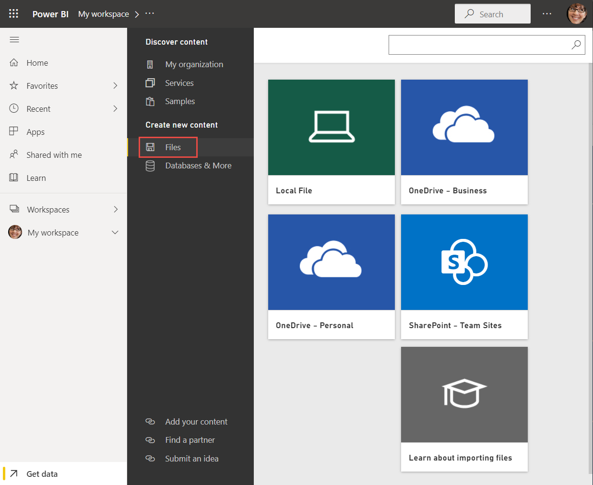

5. Browse to the file on your computer, and choose **Open**.

5. For this tutorial, we select **Import** to add the Excel file as a dataset, which we can then use to create reports and dashboards. If you select **Upload**, the entire Excel workbook is uploaded to Power BI, where you can open and edit it in Excel Online.
   
   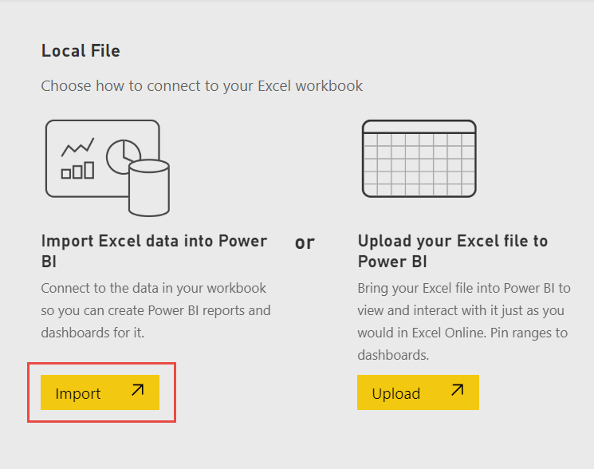
6. When your dataset is ready, select **More options (...)** next to your Financial Sample dataset, then select **Create report**.
1. open the report editor. 

    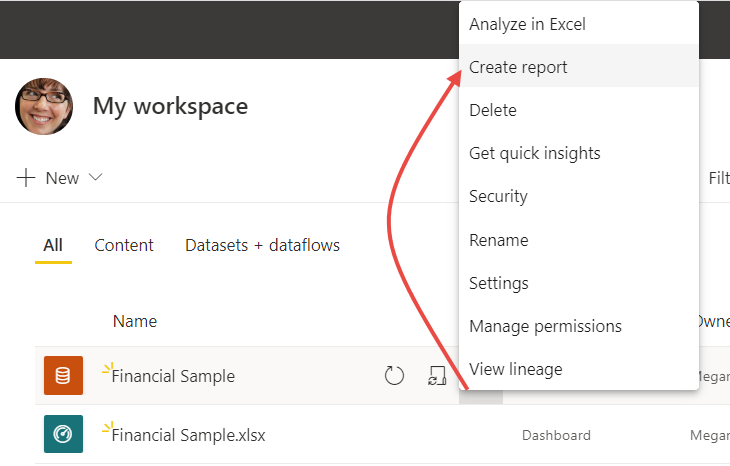

    The report canvas is blank. We see the **Filters**, **Visualizations**, and **Fields** panes on the right.

    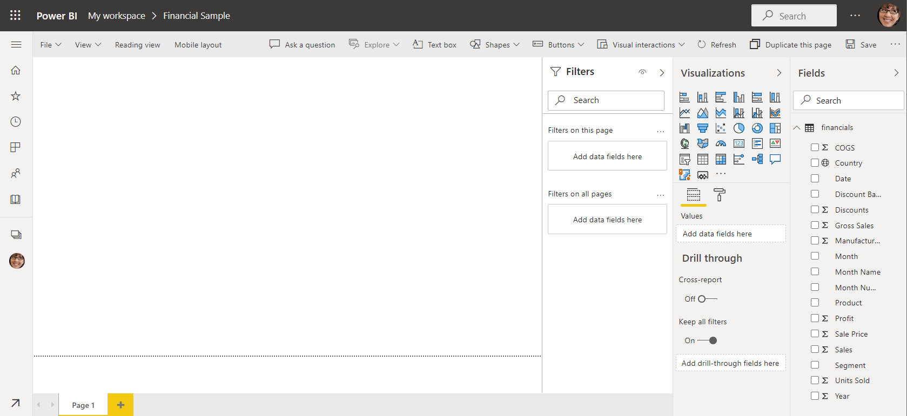

    > [!TIP]
    > Select the global navigation button in the upper-left corner to collapse the navigation pane. That way your canvas has more room.

    :::image type="content" source="media/service-get-started/power-bi-global-nav-button.png" alt-text="Global navigation button":::

7. You're currently in Editing view. Notice the **Reading view** option in the menu bar. 

    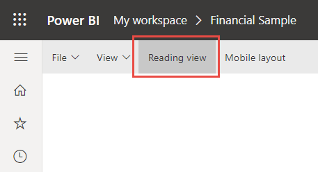

    While in Editing view, you can modify reports, because you're the *owner* and *creator* of the report. When you share your report with colleagues, often they can only interact with the report in Reading view. They are *consumers* of reports in your **My workspace**. 

## Step 2: Create a chart in a report
Now that you've connected to data, start exploring. When you've found something interesting, you can save it on the report canvas. Then you can pin it to a dashboard to monitor it and see how it changes over time. But first things first.
    
1. In the report editor, start in the **Fields** pane on the right side of the page to build a visualization. Select the  **Gross Sales** field, then the **Date** field.
   
   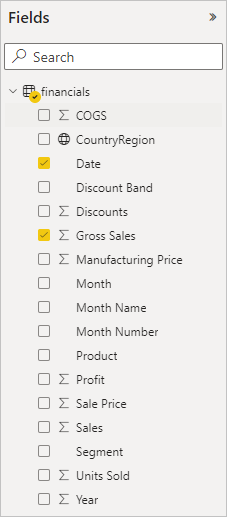

    Power BI analyzes the data and creates a column chart visualization. 

    > [!NOTE]
    > If you selected the **Date** field first instead of **Gross Sales**, you see a table. No worries! We're going to change the visualization in the next step.

    Some fields have sigma symbols next to them because Power BI detected that they contain numeric values.

    :::image type="content" source="media/service-get-started/power-bi-sigma-fields.png" alt-text="Fields with sigma symbols":::

2. Let's switch to a different way of displaying this data. Line charts are good visuals for displaying values over time. Select the **Line chart** icon from the **Visualizations** pane.
   
   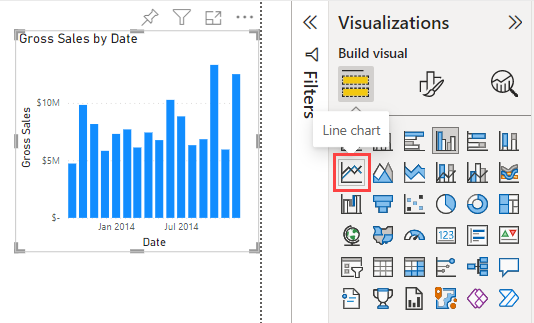

3. This chart looks interesting, so let's *pin* it to a dashboard. Hover over the visualization and select the pin icon.
   
   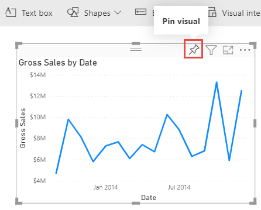

4. Because this report is new, you're prompted to save it before you can pin a visualization to a dashboard. Give your report a name (for example, *Financial Sample report*), then **Save**. 

    Now you're looking at the report in Reading view. 

6. Select the **Pin** icon again.
 
5. Select **New dashboard** and name it *Financial Sample dashboard*, for example. 
   
   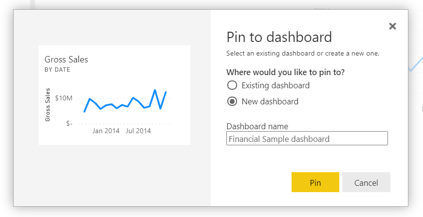
  
    A success message (near the top-right corner) lets you know the visualization was added as a tile to your dashboard.
   
    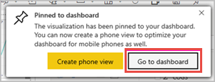

    Now that you've pinned this visualization, it's stored on your dashboard. The data stays up-to-date so you can track the latest value at a glance. However, if you change the visualization type in the report, the visualization on the dashboard doesn't change.

7. Select **Go to dashboard** to see your new dashboard with the line chart that you pinned to it as a tile. 
   
   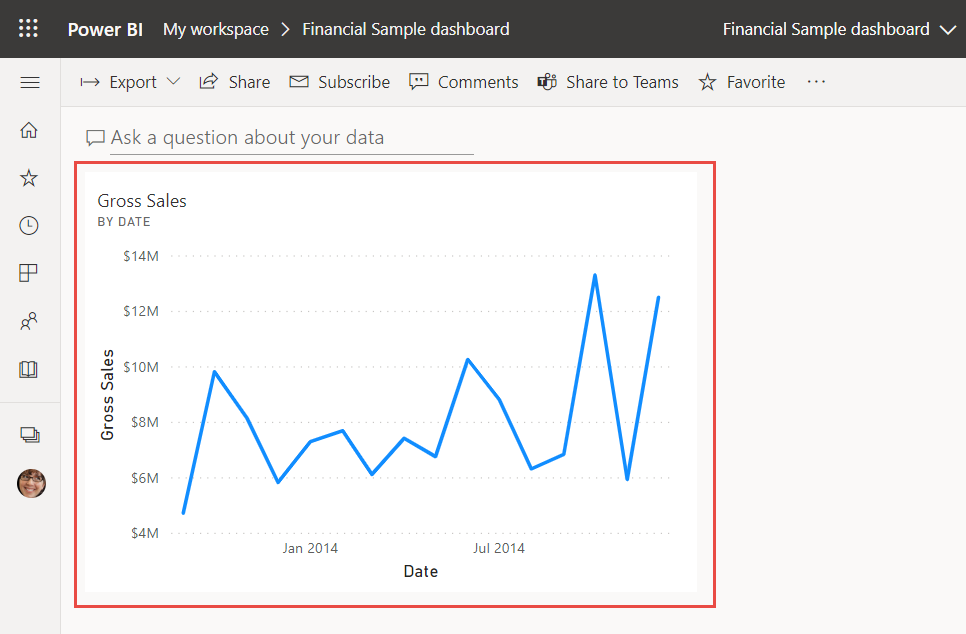
   
8. Select the new tile on your dashboard. Power BI returns you to the report in Reading view.power-bi-service-edit-report

1. To switch back to Editing view, select **More options** (...) in the menu bar > **Edit**.

    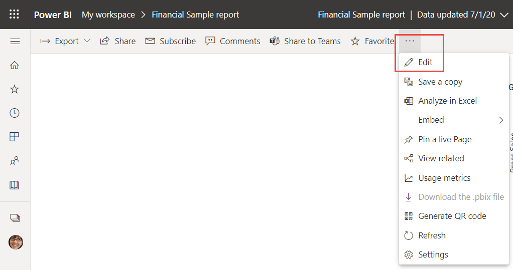

    Back in Editing view, you can continue to explore and pin tiles.

## Step 3: Explore with Q&A

For a quick exploration of your data, try asking a question in the Q&A question box. Q&A lets you ask natural-language queries about your data. In a dashboard, the Q&A box is at the top (**Ask a question about your data**) under the menu bar. In a report, it's in the top menu bar (**Ask a question**).

1. To go back to the dashboard, select **My workspace** in the black **Power BI** bar.

    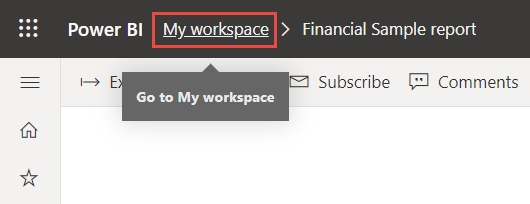

1. In **My workspace**, select your dashboard.

    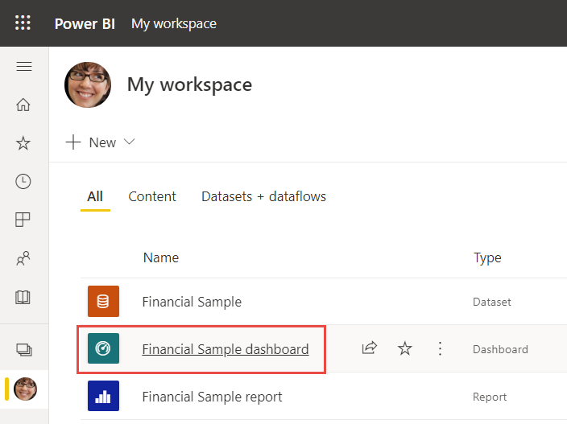

1. Select **Ask a question about your data**. 

    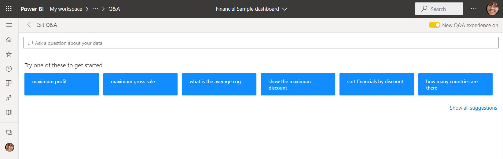

    Q&A automatically offers a number of suggestions.

    > [!NOTE]
    > If you don't see the suggestions, turn on **New Q&A experience**.

1. Some suggestions return a single value. For example, select **maximum profit**.

    Q&A searches for an answer and presents it in the form of a *card* visualization.

3. Select **Pin visual** and pin this visualization on the Financial sample for tutorial dashboard.

    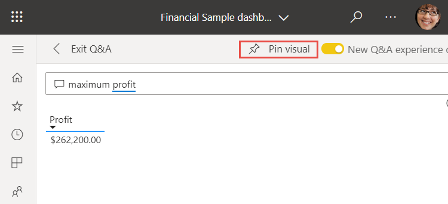

1. On the dashboard, resize the new tile to the smallest size.
1. Go back to Q&A and select **Show all suggestions**.
1. Select **total profit by country**. 

    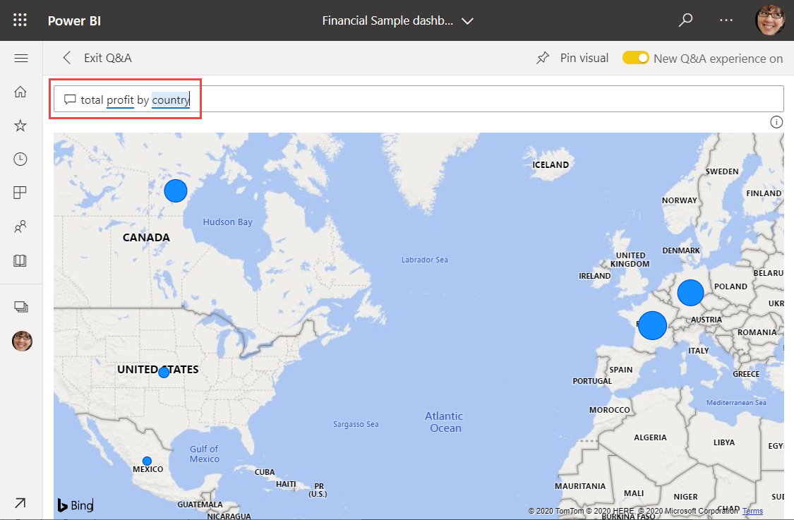

1. Pin the map to the **Financial Sample dashboard**, too.

1. On the dashboard, select the map you just pinned. See how it opens Q&A again? 
1. Place the cursor after *by country* in the Q&A box and type *as bar*. Power BI creates a bar chart with the results.

    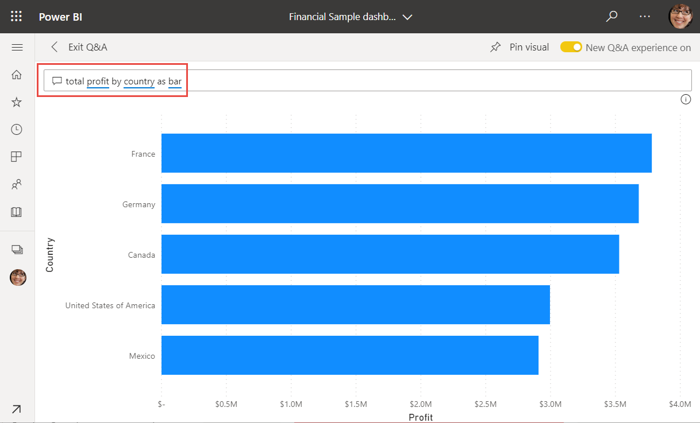

1. Pin the bar chart to the **Financial Sample dashboard**, too.

4. Select **Exit Q&A** to return to your dashboard, where you see the new tiles you created. 

   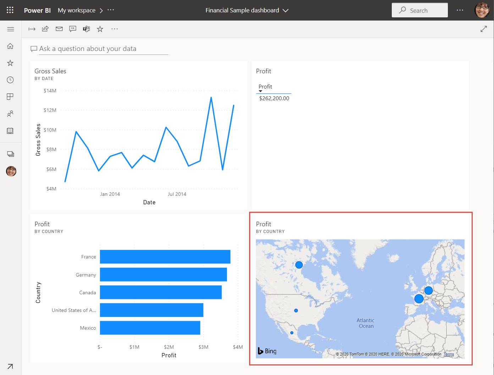

   You see that even though you changed the map to a bar chart, the tile remained a map because it was a map when you pinned it. 

## Step 4: Reposition tiles

The dashboard is wide. We can rearrange the tiles to make better use of the dashboard space.

1. Drag the lower-right corner of the *Gross Sales* line chart tile upward, until it snaps at the same height as the Sales tile, then release it.

    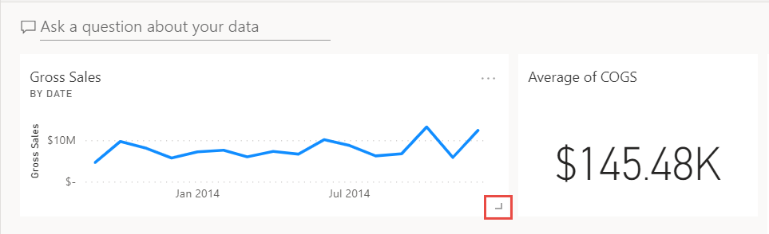

    Now the two tiles are the same height.

    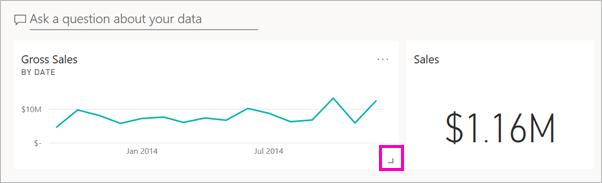

1. Drag the *Average of COGS* bar chart tile until it fits under the *Gross Sales* line chart.

    That looks better.

    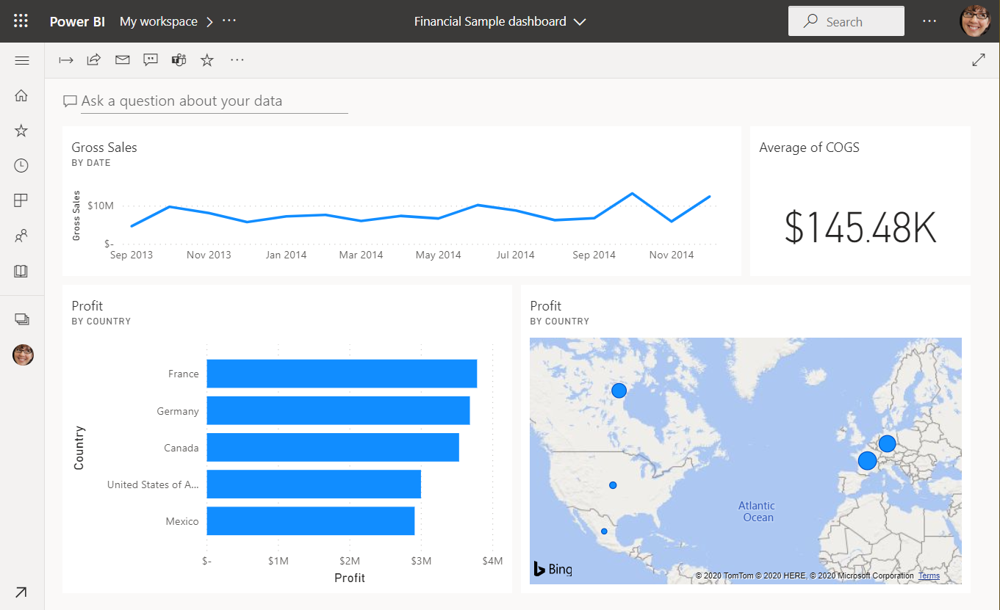

## Step 5: Interact with tiles

Here's one last interaction to observe, before you start making your own dashboards and reports. Selecting the different tiles delivers different results. 

1. First select the *Gross Sales* line chart tile you pinned from the report. 

    Power BI opens the report in Reading view. 

2. Select the browser back button. 

1. Now select the *Average of COGS* bar chart tile you created in Q&A. 

    Power BI doesn't open the report. Q&A opens instead, because you created this chart there.

## Clean up resources
Now that you've finished the tutorial, you can delete the dataset, report, and dashboard. 

1. In the nav pane, make sure you're in **My Workspace**.
2. Select the **Datasets** tab and locate the dataset you imported for this tutorial.  
3. Select **More options** (...) > **Delete**.

    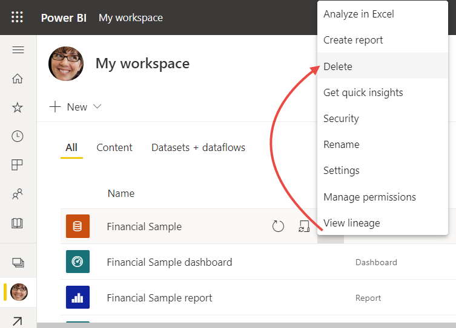

    When you delete the dataset, you see a warning that **All reports and dashboard tiles containing data from this dataset will also be deleted**.

4. Select **Delete**.

## Next steps

Make dashboards even better by adding more visualization tiles and [renaming, resizing, linking, and repositioning them](../create-reports/service-dashboard-edit-tile.md).
