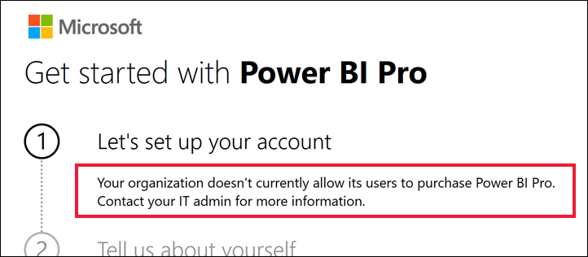

# What to do if self-service is disabled

You try to start a trial, sign up for a free license, or purchase a Power BI license. You perform these actions on your own, which is referred to as ["self-service](/microsoft-365/admin/misc/self-service-sign-up)." It doesn't work and you get a message that self-service is disabled. For various reasons, some organizations block members from self-service sign-up, self-service trial, and self-service purchase. For example, your organization might have a policy that all licenses and subscriptions are managed by a centralized IT department or help desk, even free licenses.

## Solution
To finish your purchase, contact your IT department or help desk and ask them to [follow these instructions to provide you with a license](/microsoft-365/commerce/subscriptions/manage-self-service-purchases-admins).

There are scenarios where you yourself used self-service to purchase or trial Power BI. This gives you limited access to the Microsoft 365 admin center. Use the admin center to add and manage your users' self-service licenses, trials, and purchases. Follow the instructions in [Manage self-service purchases and trials (for users)](microsoft-365/commerce/subscriptions/manage-self-service-purchases-users) to learn how to enable and disable self-service for your tenant. 

## Related content

- [Power BI features by license type](service-features-license-type.md)
- [Self-service for Power BI](service-self-service-signup-purchase-for-power-bi.md)