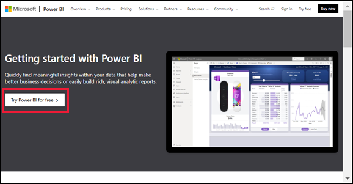
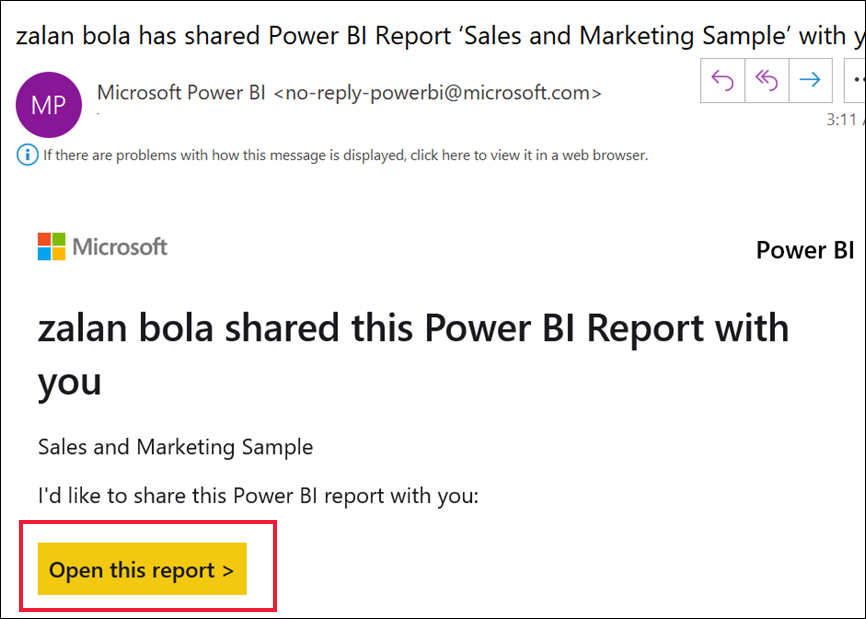
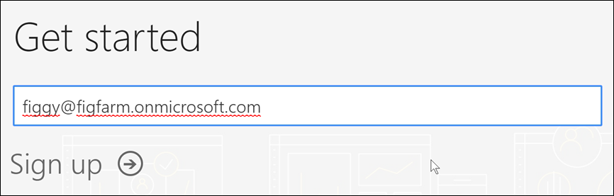
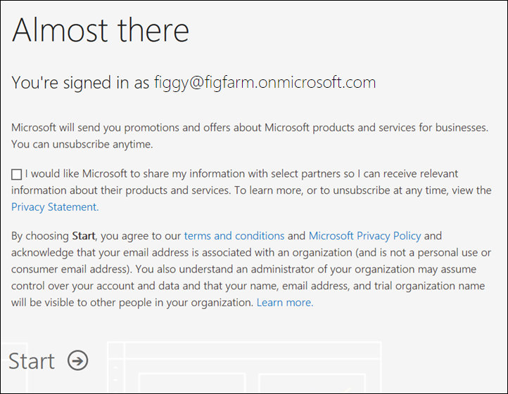
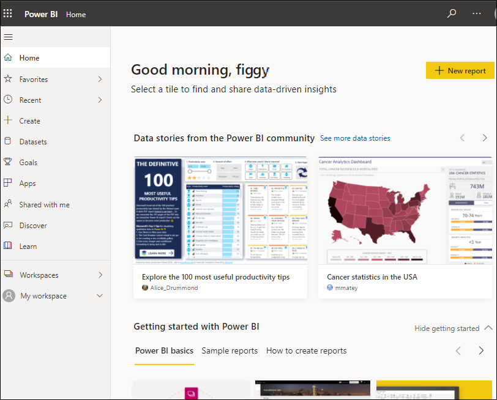
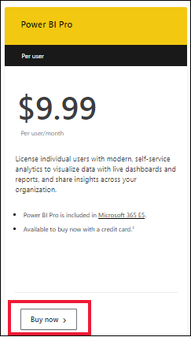
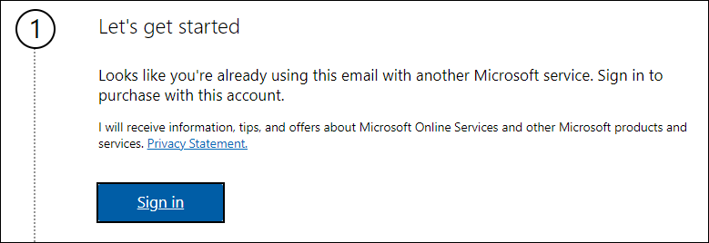
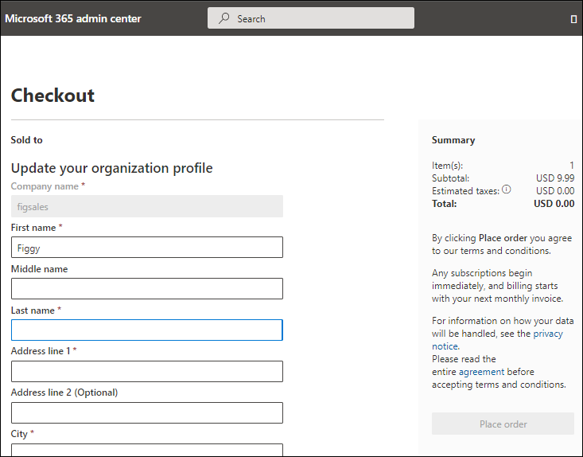

 
# Sign up for or purchase the Power BI service as an individual

Power BI can be your personal data analysis and visualization tool, and can also serve as the analytics and decision engine behind group projects, divisions, or entire corporations. This article explains how individuals can use **self-service sign-up** and **self-service purchase** to get a Power BI license for themselves.  If you're a global administrator or billing administrator, see [Power BI licensing for your organization](../admin/service-admin-licensing-organization.md).

For definitions and an overview of self-service-sign-up and self-service purchase, visit [Self-service for Power BI](service-self-service-signup-purchase-for-power-bi.md).

## Supported email addresses

Before you start the self-service process, it's important to learn which types of email addresses you can use to sign-up for or purchase Power BI:

* Power BI requires that you use a work or school email address. You can't sign up or purchase using email addresses provided by consumer email services or telecommunication providers. This includes outlook.com, hotmail.com, gmail.com, and others. If you don't have a work or school account, [learn about alternate ways to sign up.](../admin/service-admin-signing-up-for-power-bi-with-a-new-office-365-trial.md)

* You can sign-up for or purchase Power BI with .gov or .mil addresses, but this requires a different process. For more info, see [Enroll your US Government organization in the Power BI service](../admin/service-govus-signup.md).

## Use self-service sign-up to get an individual Power BI license

Follow these steps to sign up for a Power BI service account. Once you complete this process you will have a Power BI (free) license which you can use to try the Power BI service on your own using My Workspace, consume content from a Power BI workspace assigned to a Power BI Premium capacity, or initiate an individual Power BI trial. For more information, see [Power BI features by license type](service-features-license-type.md). 

The exact steps for sign up can vary depending on your organization and what you click to start the process. For this reason, you may not be presented with all of the screens shown below. There are many different ways to sign up for the Power BI service as an individual, and the steps in this article apply to the two most common.
- you select a **Try free** or **Start free** button1.     
- you receive an email with a link to a Power BI dashboard, report, or app. You haven't previously signed in to your Power BI account.

    1You'll find the **Try free** type of buttons on powerbi.microsoft.com, in related Microsoft products, and in documentation and marketing articles.

### Step 1

- Select **Try free** from [powerbi.microsoft.com](https://powerbi.com). You may then be prompted to select **Try Power BI for free**.

        

                

- Or, select an email link to a Power BI dashboard, report, or app.

    

1. When prompted, sign in using your organizational account.

    

1. In this example, Microsoft 365 recognizes you and knows that you already have at least one other Microsoft service installed. Select **Sign in**.

    

1. You may receive one of these dialog boxes. 

    - If you get a message like this, make sure that you are using a work or school email address and not a consumer address like hotmail, gmail, or outlook. See [supported email addresses, above.](#supported-email-addresses)

       

    - If you get a message like this, review the terms and conditions. If you agree, select **Start**. 

        

1. At this point, you may have to wait if Microsoft is [setting up a new tenant](../admin/service-admin-signing-up-for-power-bi-with-a-new-office-365-trial.md). Otherwise, the Power BI service opens in your browser.

        

## Use self-service sign-up to start an individual trial of Power BI Pro

Congratulations on signing into your Power BI account for the first time! You now have a free license2. As you start to explore the Power BI service, you may see pop-ups asking if you want to upgrade to an individual trial of the paid version of Power BI. If you do, select **Try now**. In some organizations, if you try to use a feature that requires a Pro or Premium Per User license, Power BI will automatically initiate a 60 day trial of the paid version of Power BI. [Some features of the Power BI service require a Pro or PPU license](../consumer/end-user-license.md). If you'd like to start a free 60 day individual trial, select **Start trial**.  

2 In some organizations, your default Power BI account may be a Power BI **Pro** license. For example, some versions of Microsoft 365 include a Power BI Pro license. To learn how to look up your user license, see [what license do I have?](../consumer/end-user-license.md)

If a Power BI (free) license is sufficient, you don't have to do anything else. To take advantage of Power BI Pro or Premium Per User features, you can upgrade your license using self-service purchase.

### Trial expiration

When your free individual trial of Power BI expires, or you cancel your trial, your license changes back to its previous version of Power BI, either free or Pro. The trial cannot be extended. For more information, see [Features by license type](service-features-license-type.md). 

If you'd like to cancel your trial before the expiration date, select your account icon and choose **Cancel trial**. 

## Use self-service purchase to buy an individual Power BI license

Individuals can make a self-service purchase online from the Power BI website or from in-product purchase prompts. Individuals are first asked to enter an email address to ensure that their email address is already associated with at least one other Microsoft online service. If they're recognized by Microsoft, they're next directed to sign in. After signing in, the individual is asked to select how many subscriptions they want to buy, and to provide credit card payment. When the purchase is complete, they can start using their subscription. The purchaser has access to a limited view of the Microsoft 365 admin center where they can assign licenses for the product to other people in their organization.

If you have additional questions about self-service purchase, visit the [Self-service purchase FAQ](/microsoft-365/commerce/subscriptions/self-service-purchase-faq).

 To purchase a Power BI Pro license, select **Buy now** when prompted, or visit [Power BI pricing](https://powerbi.microsoft.com/pricing). Self-service purchase is also available for Power BI Premium Per User, and the steps are similar.

Enter your email address. In this example, the individual already has a free Power BI license and is recognized by Microsoft. 

Complete the order form to purchase Power BI Pro. 

If self-service purchase is not available, contact your administrator about purchasing a Power BI Pro license.

## Troubleshooting the self-service process

In most cases, you can sign up for the Power BI service by following the described process. Some of the issues that may prevent you from signing up are described below, with possible workarounds.

**Personal email addresses**
 You attempt to sign up using a personal email addresses (for example nancy@gmail.com) and you receive a message similar to one of these: 

*You entered a personal email address: Please enter your work email address so we can securely store your company's data*.

or

*That looks like a personal email address. Enter your work address so we can connect you with others in your company. And don't worry. We won't share your address with anyone*.

**Solution**
The Power BI service doesn't support email addresses provided by consumer email services or telecommunications providers. To finish signing up, try again using an email address assigned by your work or school. 

If you still can't sign up and are willing to complete a more advanced setup process, you can [register for a new Microsoft 365 trial subscription and use that email address to sign up](../admin/service-admin-signing-up-for-power-bi-with-a-new-office-365-trial.md). 

You can also have an existing user [invite you as a guest](../admin/service-admin-azure-ad-b2b.md). 

[!INCLUDE[self-service-signup](../includes/self-service-signup-help.md)]

**Your email address isn't a Microsoft 365 ID**
You attempt to sign up or purchase and receive a message like this:

*We can't find you at contoso.com.  Do you use a different ID at work or school?  Try signing in with that, and if it doesn't work, contact your IT department.*

**Solution**
Your organization uses IDs (that are different than your email address) to sign in to Microsoft 365 and other Microsoft services.  For example, your email address might be zalan.bola@contoso.com but your ID is zalanb@contoso.com.

To finish signing up or purchasing, use the ID that your organization has assigned to you for signing in to Microsoft 365 or other Microsoft services.  If you don't know what this is, contact your global administrator.  

If you still can't sign up or purchase and are willing to complete a more advanced setup process, you can [register for a new Microsoft 365 trial subscription and use that email address to sign up](../admin/service-admin-signing-up-for-power-bi-with-a-new-office-365-trial.md).

**Power BI sign in doesn't recognize your password**

**Solution**
Sometimes it takes a few tries. If you retry your password several times and you still can't log in, try running your browser in Incognito (Chrome) or InPrivate (Edge) mode.

**You don't receive in-product prompts**
You don't see prompts to upgrade (Buy now) or start a trial (Try now), and the UI doesn't display Try now or Buy now buttons.

**Solution**
The type of upgrade and trial options that you are offered will depend on how your administrator has set up your domain. Your administrators have the ability to disable all trials, disable self-service purchase, and more. 
 

## Next steps

[Self-service purchase FAQ](/microsoft-365/commerce/subscriptions/self-service-purchase-faq)

[Power BI features by license type](../consumer/end-user-features.md)    
[Tips for finding help](../fundamentals/service-tips-for-finding-help.md)    

More questions? [Try asking the Power BI Community](https://community.powerbi.com/)