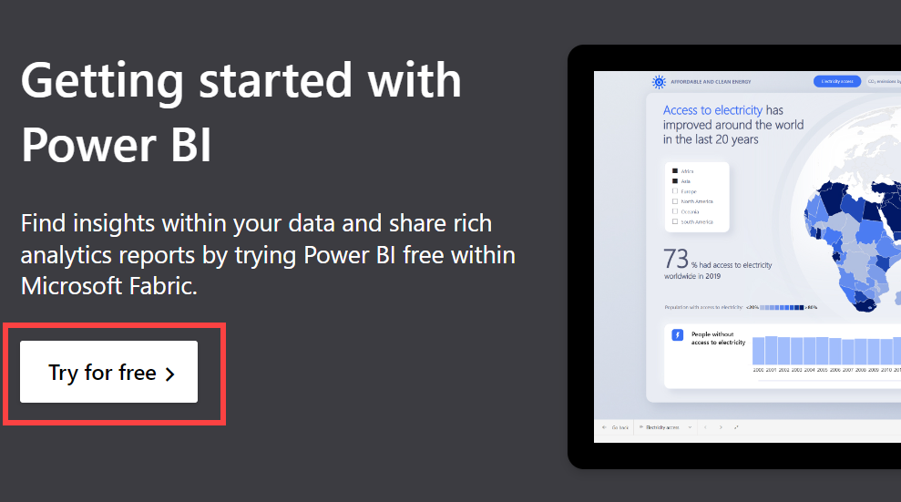
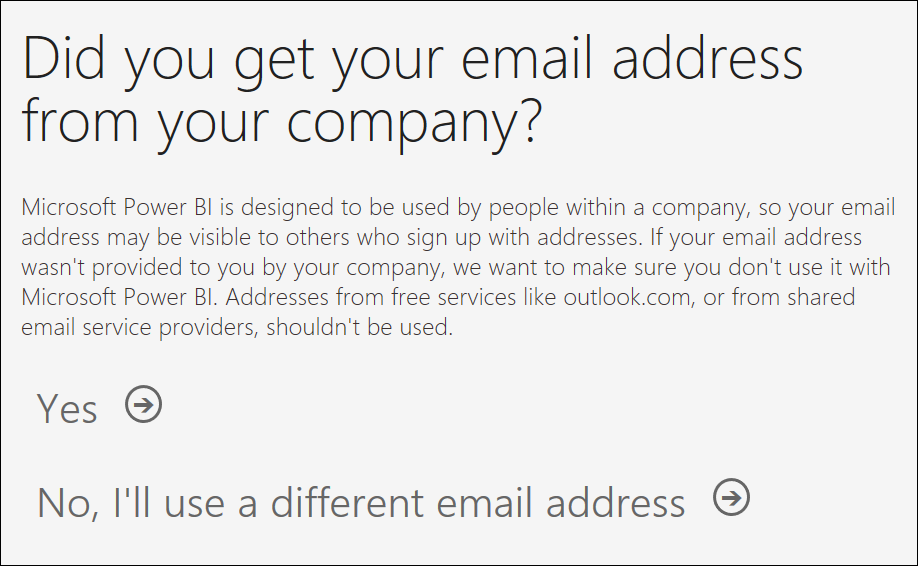
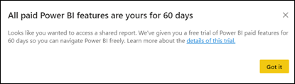

 
# Sign up for or purchase the Power BI service as an individual

***Power BI service*** can be your personal data analysis and visualization tool, and can also serve as the analytics and decision engine behind group projects, divisions, or entire corporations. This article explains how individuals can use *self-service sign-up* and *self-service purchase* to get a free, paid, or trial license for the Power BI service for themselves. If you're a global administrator or billing administrator, see [Power BI licensing for your organization](../enterprise/service-admin-licensing-organization.md). To download the free Power BI Desktop, see [Get Power BI Desktop](desktop-get-the-desktop.md).

For definitions and an overview of self-service-sign-up and self-service purchase, visit [Self-service for Power BI](service-self-service-signup-purchase-for-power-bi.md).

For descriptions of the license and subscription options for Power BI and Fabric, see [Microsoft Fabric concepts and licenses.](/fabric/enterprise/licenses)

## Power BI and Fabric

Microsoft Fabric is a platform that allows users to get, create, share, and visualize data using various tools. To share content and collaborate in Microsoft Fabric, your organization needs to have a capacity subscription and at least one per-user license. The per-user licenses are: Fabric free, Power BI Pro, and Power BI Premium per user. For more information, see the **Capacity licenses** and **User licenses** sections of the [Fabric licenses article.](/fabric/enterprise/licenses)

Power BI is one of the experiences available in Microsoft Fabric. Power BI is one component of Fabric. Power BI is also available as a standalone service. You might be someone who uses only the Power BI experience and you might be someone who works with more than one of the Fabric experiences.

- For more information, see [What is Microsoft Fabric.](/fabric/get-started/microsoft-fabric-overview)

## License scenarios

Use this chart to help determine which type of license and subscription you need. Power BI Desktop is always free. Fabric offers a Fabric free license, a Fabric capacity trial, and paid Power BI license options (Pro and PPU). Power BI offers three licenses: Fabric free, Power BI Pro, and PPU.

- A Microsoft Fabric free license gives you an opportunity to use the Power BI features available to free users.
- - A Microsoft Fabric free license gives you an opportunity to try all of the Fabric features available to free users. To use collaboration and sharing features, you'll also need access to an organizational Premium capacity. Premium capacity is where your Pro and PPU colleagues share content with you. 
- A Fabric 60-day trial provides a trial capacity for you to create and work with all of the item types available in Fabric (including Power BI). Otherwise, to fully use a Fabric free license, purchase Fabric capacity. 
- A Power BI Pro 60-day trial provides the paid features of Pro. You become the admin for the subscription and can add users and assign free licenses for Power BI and Fabric.
- A paid per-user license for Power BI (Pro or PPU) provides access to paid features of Power BI Pro. The access includes standalone Power BI and the Power BI experience within Fabric.

To learn more about licenses and subscriptions, see [Licenses and subscriptions.](service-features-license-type.md)

When deciding which license + subscription model you need, ask yourself these questions. "Will I be using only Power BI or will I be using other experiences in Fabric?" "Will I be creating content or will I only be consuming content created by others?" "Will I be sharing my content with others?", "Do I have access to a Power BI Premium capacity subscription?" For help with answering these questions, see the [Power BI feature list for consumers](../consumer/end-user-features.md), [What is Premium](../enterprise/service-premium-what-is.md), and [Licenses and subscriptions for business users and consumers](../consumer/end-user-license.md).

| Scenario  | Creator  | Consumer |
|-----------|----------|----------|
| You create a report in Power BI Desktop (.PBIX). Then you publish it to your **My Workspace** on the Power BI service. | As a creator, you only need the free Desktop app and a Fabric free license to publish to your My Workspace in the Power BI service for your own use. However, to share that content with others requires a paid Power BI Pro or PPU license. | Consumers can't see content in other people's My Workspace unless the owners decide to share. To see shared content requires a paid license. |
| You create a report in Power BI Desktop (.PBIX) and share the PBIX file to other people who open the file in Power BI Desktop. | No licensing needed, only the Power BI Desktop app to be downloaded and installed. | No licensing needed, only the Power BI Desktop app to be downloaded and installed. |
| You create a report in Power BI Desktop (.PBIX) and publish it to a shared workspace in the Power BI service. |   Paid license needed to publish to shared workspaces. | Paid license required to view the content unless the workspace is hosted in Premium capacity. For workspaces in Premium capacity, the consumer only needs a Fabric (free) license to view that report. |
| You're sent a link to a report hosted on the Power BI service and want to view it. | You need a paid license to share a link. You need a Fabric (free) license to share a link to a report that is in Premium capacity. | A paid license is required to view the report unless the report is hosted in Premium capacity. For reports hosted in Premium capacity, the consumer only needs a Fabric (free) license to view that report. |

## Supported email addresses

Before you start the self-service process, it's important to learn which types of email addresses you can use to sign up for or purchase Power BI.

Power BI requires that you use a work or school email address. You can't sign up or purchase using email addresses provided by consumer email services or telecommunication providers. These services include `outlook.com`, `hotmail.com`, `gmail.com`, and others. If you don't have a work or school account, [learn about alternate ways to sign up](../enterprise/service-admin-signing-up-for-power-bi-with-a-new-office-365-trial.md).

You can sign up for or purchase Power BI with .gov or .mil addresses, but this approach requires a different process. For more information, see [Enroll your US Government organization in the Power BI service](../enterprise/service-govus-signup.md).

## Use self-service sign-up to get a free individual license for Fabric and Power BI

Follow these steps to sign up for an account for the Power BI service. Each account requires a license and the options are free, Pro, PPU (Premium Per User), or trial. This section covers the signup process for a free license. With a free license you can try the Power BI service on your own using My Workspace, consume content from a Power BI workspace assigned to a Power BI Premium capacity, and initiate an individual Fabric trial. For more information, see [Power BI features by license type](service-features-license-type.md).

The exact steps for signup vary depending on your organization and what you select to start the process. There are many different ways to sign up for the Power BI service as an individual, and the steps in this article apply to the two most common.

- Select a **Try free** or **Start free** button. Find these types of buttons on `powerbi.microsoft.com`, in related Microsoft products, and in documentation and marketing articles.
- Receive an email with a link to a Power BI dashboard, report, or app. And, clicking the link is your first time signing in to this Power BI account.

> [!NOTE]
> Power BI is one of the experiences available in Microsoft Fabric. Microsoft Fabric is a comprehensive suite of analytics services, all in one place. To learn more about Fabric, see [What is Microsoft Fabric?](/fabric/get-started/microsoft-fabric-overview)

1. Select **Try free** or **Get started** from [powerbi.microsoft.com](https://powerbi.com).

   

   Or, select an email link to a Power BI dashboard, report, or app.

    :::image type="content" source="media/service-self-service-signup-for-power-bi/power-bi-emails.png" alt-text="Screenshot of Power BI service showing an email being sent from powerbi.com.":::

1. When prompted, sign in using your organizational account.

    :::image type="content" source="media/service-self-service-signup-for-power-bi/power-bi-get-started.png" alt-text="Screenshot of Power BI service showing a prompt to enter new email address.":::

1. In this example, Microsoft 365 recognizes you and knows that you already have at least one other Microsoft service installed. Select **Sign in**.

    :::image type="content" source="media/service-self-service-signup-for-power-bi/power-bi-recognizes.png" alt-text="Screenshot of Power BI service showing that Microsoft recognizes the email.":::

1. If you get a message like this, make sure that your email address isn't a consumer address like Hotmail, Gmail, or Outlook. See [supported email addresses.](#supported-email-addresses) 

   

1. At this point, you might have to wait if Microsoft is [setting up a new tenant](../enterprise/service-admin-signing-up-for-power-bi-with-a-new-office-365-trial.md). Otherwise, the Power BI service opens in your browser. 

You now have a Fabric free license to explore the free features of all of the Fabric experiences, including the Power BI service. If a Fabric free license is sufficient, you don't have to do anything else. If you find that you need to upgrade, start a trial or purchase a paid license.

## Use self-service sign-up to start an individual Fabric trial

Congratulations on signing into your Fabric account for the first time. You now have a free license. This section describes how to start a trial. To purchase a paid license for Power BI, see [purchase Power BI.](#use-self-service-purchase-to-buy-an-individual-power-bi-license)

If a Fabric free license is sufficient, you don't have to do anything else. There's [plenty to do in the Power BI service with a free license](../consumer/end-user-license.md), especially if Power BI creators share their content with you in [Premium capacity.](../enterprise/service-premium-what-is.md) 

However, to share content and collaborate in the other Fabric services, you need [a Fabric capacity.](/fabric/enterprise/licenses) And to take advantage of paid features in the Power BI service, you need a Power BI Pro or PPU license. If all of the content that you need is saved in Premium capacity, then a Pro or PPU license mmight not be necessary.

A Fabric trial includes a license for the paid version of Power BI, which includes Power BI Pro and Power BI Premium Per User (PPU). The trial also includes a trial Fabric capacity to use for exploring all of the Fabric experiences.

Customers typically start a trial one of two ways:

- As you start to explore the Power BI service or any of the other services in Fabric, you try to use a feature that requires a paid license or a capacity. Fabric automatically initiates the Fabric trial. [Some features of the Power BI service require a Pro or PPU license](../consumer/end-user-license.md).  

    

- Trials can also be initiated from your Account manager. Open your Account manager by selecting the tiny photo in the upper right corner.  

    :::image type="content" source="media/service-self-service-signup-for-power-bi/power-bi-me.png" alt-text="Screenshot showing an Account manager and the Start trial button.":::

    :::image type="content" source="media/service-self-service-signup-for-power-bi/power-bi-trial.png" alt-text="Screenshot showing the dialog to select Start trial.":::

The trial license upgrades you with a Microsoft Fabric trial capacity. Create and work with any Fabric item types and access the paid features of the Power BI service. 

:::image type="content" source="media/service-self-service-signup-for-power-bi/power-bi-fabric-home.png" alt-text="Screenshot showing the Fabric Home screen.":::

For more information about trials, see [Fabric trial](/fabric/get-started

### Trial expiration

You can cancel your trial from the Account manager. If you cancel your trial, you might not be able to start another trial. 

When you cancel your Fabric trial, or your trial expires, the trial capacity is deleted. This deletion includes deletion of all of the capacity's [workspaces](/fabric/get-started/workspaces) and related data. To migrate your workspaces and data, [purchase a Fabric capacity](/fabric/enterprise/buy-subscription).  

When your trial expires, or you cancel your trial, your license changes back to its previous version, either Fabric free or Power BI Pro. The trial can't be automatically extended. For more information, see [Features by license type](service-features-license-type.md). 

If you'd like to cancel your trial before the expiration date, select your account icon and choose **Cancel trial**.

:::image type="content" source="media/service-self-service-signup-for-power-bi/power-bi-cancel-trial.png" alt-text="Screenshot of your account screen with Cancel trial selected.":::

## Use self-service purchase to buy an individual Power BI license

You can use self-service to purchase Power BI Pro from the Power BI website or from in-product purchase prompts. 

:::image type="content" source="media/service-self-service-signup-for-power-bi/power-bi-buy-pro.png" alt-text="Screenshot of your Account manager with a red arrow pointing to Buy Pro now.":::

You're first asked to enter an email address to ensure that your email address is already associated with at least one other Microsoft online service. If you're recognized by Microsoft, you're next directed to sign in. After you sign in, you're asked to select how many subscriptions you want to buy, and to provide credit card payment. When the purchase is complete, you can start using your subscription. You also have access to a limited view of the Microsoft 365 admin center where you can assign licenses for the product to other people in their organization.

If your email is not recognized, you have the option to start with a free trial. For instructions, see [Sign up for Power BI with a free trial](service-admin-signing-up-for-power-bi-with-a-new-office-365-trial.md) or see [Sign up for a free Fabric trial](/fabric/get-started/fabric-trial).

If you have more questions about self-service purchase, visit the [Self-service purchase FAQ](/microsoft-365/commerce/subscriptions/self-service-purchase-faq).

To purchase a Power BI Pro license, select **Buy now** when prompted, or visit [Power BI pricing](https://powerbi.microsoft.com/pricing). Self-service purchase is also available for Power BI Premium Per User, and the steps are similar.

If self-service purchase isn't available, contact your administrator about purchasing a Power BI Pro license.

To sign up for Power BI Pro:

1. Go to [Power BI Pro signup](https://signup.microsoft.com/create-account/signup?OfferId=d59682f3-3e3b-4686-9c00-7c7c1c736085&ali=1&products=d59682f3-3e3b-4686-9c00-7c7c1c736085) and enter an email address. Select **Next**.

     :::image type="content" source="../media/service-admin-get-started-email.png" alt-text="Screenshot showing the get started window.":::

1. The email address you entered is evaluated. Select **Set up account** or **Change my email** to enter a different address.

   > [!NOTE]
   >If your email address is already in use with another Microsoft service, you can **Sign in** or **Create a new account instead**. If you choose to create a new account, continue to the next step.

1. Complete the **Tell us about yourself** form and select **Next**. The country/region selected determines where your data is stored. For more information, see [Find the default region for your organization](../admin/service-admin-where-is-my-tenant-located.md#find-the-default-region-for-your-organization). The country/region doesn't have to match your physical location, but should match the location for most of your users.

   :::image type="content" source="../media/service-admin-tell-us-dialog.png" alt-text="Screenshot showing the tell us about yourself window.":::

1. Select whether you want to receive a verification code by text or call. Enter a phone number where the verification code will be sent. Select **Send verification code**.

1. Enter the verification code, and then select **Verify**.

1. Complete the **How you'll sign in** form. This step creates your user ID and password to sign in to your account. You can change the pre-filled username and domain. Domain name is validated to ensure that it isn't a duplicate. Once validated, the domain name is used to create your organization in the datacenter as a subdomain of `onmicrosoft.com`. Create and confirm a password. Select **Next**.

   :::image type="content" source="../media/business-identity-dialog.png" alt-text="Screenshot showing the window for creating the onmicrosoft.com subdomain.":::

Review the confirmation details. The account you created is now the global admin of a new Power BI Pro trial tenant. Sign in to the [Microsoft 365 admin center](https://admin.microsoft.com) to add more users, set up a custom domain, purchase more services, and manage your Power BI subscription.

## Considerations and limitations

In most cases, you can sign up for the Power BI service and for Fabric by following the described processes. Some of the issues that might prevent you from signing up are described here, with possible workarounds.

### Can't access your Fabric items

- If you're using a Power BI Premium capacity, Microsoft Fabric items aren't supported. To enable support for Microsoft Fabric items on your Power BI capacity, [enable Microsoft Fabric](/fabric/admin/fabric-switch).

- If you're using Microsoft 365, certain versions include a free Fabric license and a free or paid Power BI license. For example, the E5 SKU includes a Fabric free license (but no capacity) and a Power BI Pro license. Without a trial or purchased capacity, you might not be able to access your Fabric items. To learn how to look up your user license, see [what license do I have?](../consumer/end-user-license.md)

### Personal email addresses

**Personal email addresses**
 You attempted to sign up using a personal email address (for example nancy@gmail.com) and you received a prompt similar to one of these messages. 

*You entered a personal email address: Enter your work email address so we can securely store your company's data*.

*That looks like a personal email address. Enter your work address so we can connect you with others in your company. And don't worry. We don't share your address with anyone*.

The Power BI service doesn't support email addresses provided by consumer email services or telecommunications providers. To finish signing up, try again using an email address assigned by your work or school. 

If signup still doesn't work, try a more advanced setup process.  [Register for a new Microsoft 365 trial subscription and use that email address to sign up.](../enterprise/service-admin-signing-up-for-power-bi-with-a-new-office-365-trial.md)

You can also have an existing user [invite you as a guest](../enterprise/service-admin-azure-ad-b2b.md).

[!INCLUDE[self-service-signup](../includes/self-service-signup-help.md)]

### Your email address isn't a Microsoft 365 ID

You attempt to sign up or purchase and receive a message like this:

*We can't find you at contoso.com. Do you use a different ID at work or school? Try signing in with that ID. If it doesn't work, contact your IT department.*

Your organization uses IDs that are different than your email address to sign in to Microsoft 365 and other Microsoft services. For example, your email address might be `zalan.bola@contoso.com` but your ID is `zalanb@contoso.com`.

To finish signing up or purchasing, use the ID that your organization assigned to you for signing in to Microsoft 365 or other Microsoft services. If you don't know what this ID is, contact your global administrator.  

If you still can't sign up or purchase there is a more advanced setup process available. [Register for a new Microsoft 365 trial subscription and use that email address to sign up](../enterprise/service-admin-signing-up-for-power-bi-with-a-new-office-365-trial.md).

### Sign-in doesn't recognize your password

Sometimes it takes a few tries. If you retry your password several times and you still can't sign in, try running your browser in Incognito (Chrome) or InPrivate (Microsoft Edge) mode.

### You don't receive in-product prompts

You don't see prompts to upgrade (Buy now) or start a trial (Try now), and the UI doesn't display **Try now** or **Buy now** buttons.

The type of upgrade and trial options that you're offered depends on how your administrator set up your domain. Your administrators have the ability to disable all trials, disable self-service purchase, and more. 

## Related content

- [Self-service purchase FAQ](/microsoft-365/commerce/subscriptions/self-service-purchase-faq)
- [Power BI features by license type](../consumer/end-user-features.md)
- [Tips for finding help](../support/service-tips-for-finding-help.md)
- More questions? [Try asking the Power BI Community](https://community.powerbi.com/)
