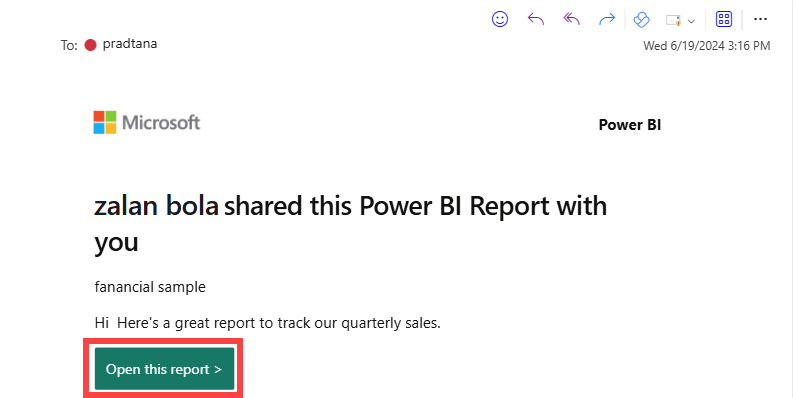
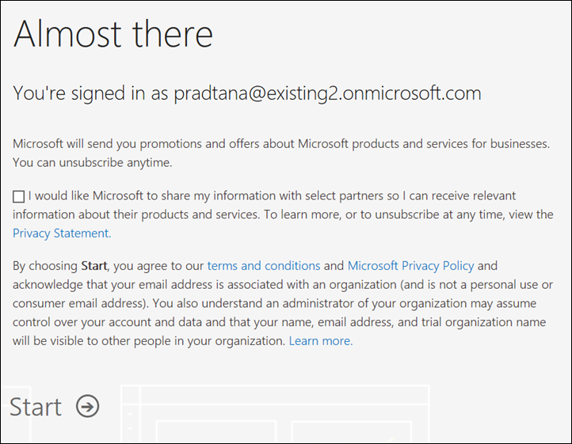
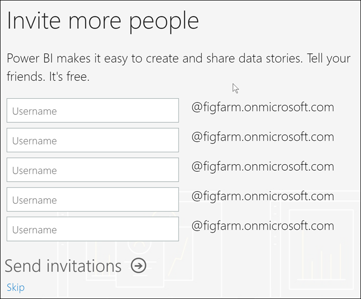
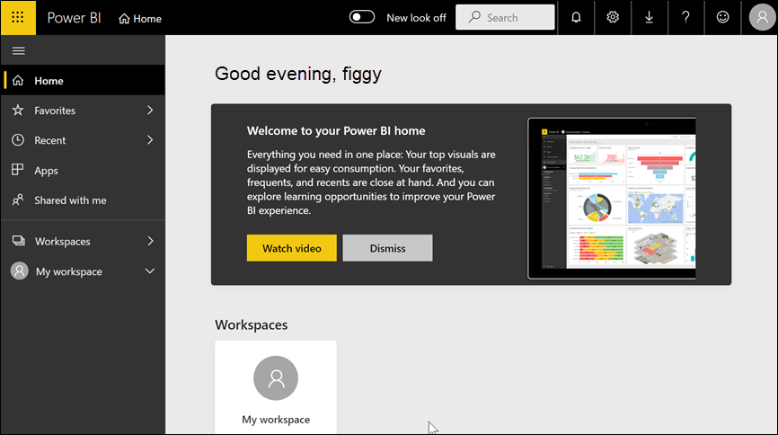
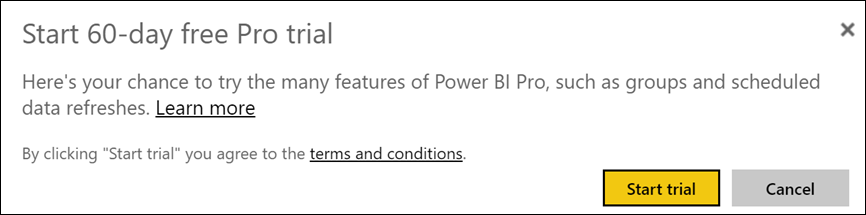

# Sign up for the Power BI service as an individual

Power BI can be your personal data analysis and visualization tool, and can also serve as the analytics and decision engine behind group projects, divisions, or entire corporations. This article explains how to sign up for Power BI as an individual. If you're a global administrator or billing administrator, see [Power BI licensing for your organization](../admin/service-admin-licensing-organization.md).

## What is Power BI?
Power BI is a unified self-service and enterprise business intelligence platform that combines an intuitive user experience with intelligent data visualizations to provide greater depth of data insight. Reports can be shared within Microsoft tools like Teams, SharePoint, PowerPoint, or within other productivity products. It is offered as an online SaaS (Software as a Service) offering with two companion applications: a Microsoft Windows desktop application called Power BI Desktop for creating reports and native mobile BI apps for consuming reports on iOS and Android devices. 

These three elements—Desktop, the service, and the mobile apps—are designed to let people create, share, and consume business insights in the way that serves them, or their role, most effectively.

## Signing up for the Power BI service
This article describes the steps to sign up for **the Power BI service** as an individual. If you are looking for help downloading Power BI Desktop or installing the mobile apps, please refer to these articles instead:
- [Power BI Desktop (it's also a totally free download)](desktop-get-the-desktop.md)    
- [Power BI mobile apps (also a totally free download)](../consumer/mobile/mobile-apps-for-mobile-devices.md)

## Supported email addresses

Before you start the sign-up process, it's important to learn which types of email addresses that you can use to sign-up for Power BI:

* Power BI requires that you use a work or school email address to sign up. You can't sign up using email addresses provided by consumer email services or telecommunication providers. This includes outlook.com, hotmail.com, gmail.com, and others. If you don't have a work or school account, [learn about alternate ways to sign up.](../admin/service-admin-signing-up-for-power-bi-with-a-new-office-365-trial.md)

* You can sign-up for Power BI with .gov or .mil addresses, but this requires a different process. For more info, see [Enroll your US Government organization in the Power BI service](../admin/service-govus-signup.md).

## Sign up for the Power BI service

Follow these steps to sign up for a Power BI account. Once you complete this process you will have a Power BI (free) license which you can use to try the Power BI service on your own using My Workspace, consume content from a Power BI workspace assigned to a Power BI Premium capacity, or initiate an individual Power BI Pro trial. For more information, see [Power BI features by license type](service-features-license-type.md). 

The exact steps for sign up can vary depending on your organization and what you click to start the process. For this reason, you may not be presented with all of the screens shown below. There are many different ways to sign up for the Power BI service as an individual, and the steps in this article apply to the two most common.
- you select a **Try free** or **Start free** button1.     
- you receive an email with a link to a Power BI dashboard, report, or app. You haven't previously signed in to your Power BI account.

    1You'll find the **Try free** type of buttons on powerbi.microsoft.com, in related Microsoft products, and in documentation and marketing articles.

### Step 1

- Select **Start free** or **Try free** from [powerbi.microsoft.com](https://powerbi.com). You may have to select a button twice.

        

- Or, select an email link to a Power BI dashboard, report, or app.

    

1. Microsoft 365 recognizes you and knows that you already have a Microsoft service installed. Select **Sign in**.

    

1. You may receive one of these dialog boxes. 
    - If you're prompted, sign in using your organizational account.

        

    - If you get a message like this, make sure that you are using a work or school email address and not a consumer address like hotmail, gmail, or outlook. See [supported email addresses, above.](#supported-email-addresses)

       

    - If you get a message like this, review the terms and conditions. If you agree, select **Start**. 

        

1. Optionally, invite some colleagues to join you.

       

1. At this point, you may have to wait if Microsoft is [setting up a new tenant](../admin/service-admin-signing-up-for-power-bi-with-a-new-office-365-trial.md). Otherwise, the Power BI service opens in your browser.

        

## Sign up for an individual trial of Power BI Pro
Congratulations on signing into your Power BI account for the first time! You now have a free license2. As you start to explore the Power BI service, you'll see pop-ups asking if you want to upgrade to an individual trial of Power BI Pro. [Some features of the Power BI service require a Pro license](../consumer/end-user-license.md). If you'd like to start a free 60 day individual trial of Power BI Pro, select **Start trial**.  

2 In some organizations, your default Power BI account may be a Power BI **Pro** license. For example, some versions of Microsoft 365 include a Power BI Pro license. To learn how to look up your user license, see [what license do I have?](../consumer/end-user-license.md)

## Trial expiration

When your free individual trial of Power BI Pro expires, your license changes back to a Power BI (free) license. The trial cannot be extended. You will no longer have access to features that require a Power BI Pro license. For more information, see [Features by license type](service-features-license-type.md).

If a Power BI (free) license is sufficient, you don't have to do anything else. To take advantage of Power BI Pro features, purchase a Pro license by selecting **Buy now** or visiting [Power BI pricing](https://powerbi.microsoft.com/pricing).

If self-service purchase is not available, contact your administrator about purchasing a Power BI Pro license.

## Troubleshooting the sign-up process

In most cases, you can sign up for Power BI by following the described process. Some of the issues that may prevent you from signing up are described below, with possible workarounds.

**Personal email addresses**
 You attempt to sign up using a personal email addresses (for example nancy@gmail.com) and you receive a message similar to one of these: 

*You entered a personal email address: Please enter your work email address so we can securely store your company's data*.

or

*That looks like a personal email address. Enter your work address so we can connect you with others in your company. And don't worry. We won't share your address with anyone*.

**Solution**
Power BI doesn't support email addresses provided by consumer email services or telecommunications providers. To finish signing up, try again using an email address assigned by your work or school. 

If you still can't sign up and are willing to complete a more advanced setup process, you can [register for a new Microsoft 365 trial subscription and use that email address to sign up](../admin/service-admin-signing-up-for-power-bi-with-a-new-office-365-trial.md). 

You can also have an existing user [invite you as a guest](../admin/service-admin-azure-ad-b2b.md). 

[!INCLUDE[self-service-signup](../includes/self-service-signup-help.md)]

**Your email address isn't a Microsoft 365 ID**
You attempt to sign up and receive a message like this:

*We can't find you at contoso.com.  Do you use a different ID at work or school?  Try signing in with that, and if it doesn't work, contact your IT department.*

**Solution**
Your organization uses IDs (that are different than your email address) to sign in to Microsoft 365 and other Microsoft services.  For example, your email address might be zalan.bola@contoso.com but your ID is zalanb@contoso.com.

To finish signing up, use the ID that your organization has assigned to you for signing in to Microsoft 365 or other Microsoft services.  If you don't know what this is, contact your Global administrator.  

If you still can't sign up and are willing to complete a more advanced setup process, you can [register for a new Microsoft 365 trial subscription and use that email address to sign up](../admin/service-admin-signing-up-for-power-bi-with-a-new-office-365-trial.md).

**Power BI sign in doesn't recognize your password**

**Solution**
Sometimes it takes a few tries. If you retry your password several times and you still can't log in, try running your browser in Incognito (Chrome) or InPrivate (Edge) mode.

## Next steps

[Power BI features by license type](../consumer/end-user-features.md)    
[Tips for finding help](../fundamentals/service-tips-for-finding-help.md)    

More questions? [Try asking the Power BI Community](https://community.powerbi.com/)
