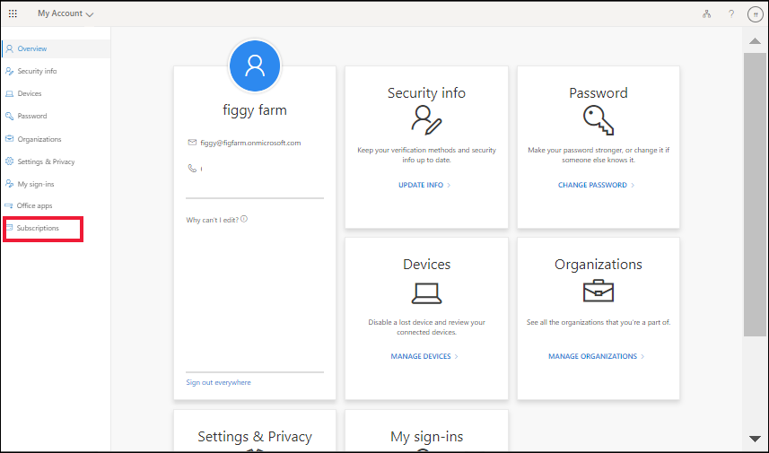
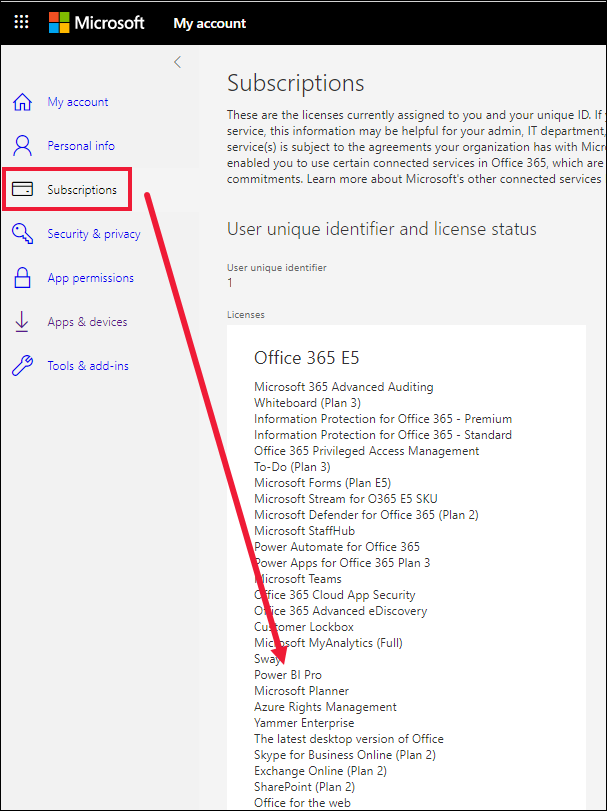
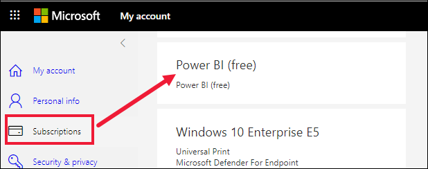
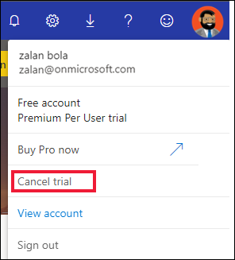

---
# Sign up or purchase the Power BI service as an individual

Power BI can serve as the analytics, visualization, and decision engine behind group projects, divisions, or entire corporations but it can also be your personal data analysis and visualization tool. This article explains the options you have to sign up for or purchase Power BI as an individual.    

There are two ways for individuals to get a Power BI license. They can sign up for or purchase a license for themselves, or they can rely on an administrator to assign them a license.  This article explains the first option, which is called **self-service**.   
For an overview of self-service, visit [Self-service for Microsoft 365 products and services](/microsoft-365/commerce/subscriptions/manage-self-service-purchases-admins).

To skip ahead to using self-service, visit [How to use self-service sign-up and self-service purchase](service-self-service-signup-for-power-bi.md).

## Self-service sign-up versus self-service purchase
The **self-service sign-up** feature is used by individuals who sign themselves up for free and trial licenses. **Self-service purchase** is the feature used by individuals to buy a Pro or Premium Per User license for themselves.     

### Self-service for the Power BI service
This article describes the self-service process for the  **Power BI service**. If you are looking for help downloading Power BI Desktop or installing the mobile apps, please refer to these articles instead:
- [Power BI Desktop (it's a totally free download)](desktop-get-the-desktop.md)    
- [Power BI mobile apps (also a totally free download)](../consumer/mobile/mobile-apps-for-mobile-devices.md)

## Get an individual user license for the Power BI service
There are many different ways to get a per-user license for the Power BI service. These include:
* If your organization already has a subscription for Power BI, you may be able to self-assign a license. The type of licenses available will depend on what type of subscriptions your organization has purchased and how your admin has configured Power BI. 
* You can visit powerbi.com and click a "Try free" or "Buy now" link. Then, follow the prompts to complete the sign up or purchase. 
* If you already have a license and try to use an advanced feature, Power BI may prompt you to upgrade or try a free trial.  Users with a Power BI (free) license may be presented with the opportunity to upgrade their account to Power BI Pro while using the service. Users who already hold a Power BI Pro license may be prompted to upgrade to a Power BI Premium Per User license.    
 
For step-by-step instructions on using self-service sign-up and self-service purchase, see [How to sign up for Power BI as an individual](service-self-service-signup-for-power-bi.md)

### Power BI license types
Before you sign-up or purchase, determine which [license type](../admin/service-admin-licensing-organization.md) you need. Power BI offers several per-user licenses: free, Pro, and Premium Per User. Power BI also offers a free trial upgrade for Premium Per User. When an individual signs-up or purchases Power BI, they're assigned a Power BI license automatically.  Not sure what type of license you need?  
* With a free license, you can explore Power BI for personal data analysis and visualization using My Workspace, but you can't share with other users. A Power BI Pro or Power BI Premium Per User license is required to share content. 
* With a Pro license, you can collaborate with Premium per-user and Pro users by creating and sharing content. If that content is in Premium capacity, a Pro user can collaborate with free, Premium per user, and Pro users by creating and sharing content.	
* With a Premium Per User license, you can access Premium features for yourself and other users who also have a Premium Per User license.  A Power BI Premium subscription unlocks access to a variety of features, capabilities, and types of content that are only available through Premium. Power BI Premium is available as an add-on to Power BI Pro.
 For information about Premium subscriptions, see [What is Power BI Premium?](../admin/service-premium-what-is.md).

> [!NOTE]
> Direct purchase of or upgrade to Pro or Premium Per User isn't available to educational organizations or organizations deployed to Azure Government, Azure Germany, or Azure China 21Vianet clouds.
For more information about licenses and subscriptions, see [Licensing in Power BI](../admin/service-admin-licensing-organization.md).

### Look up your current license
You may already have access to Power BI. Perhaps your organization has already added you to a Power BI subscription. Also, some versions of product licenses, such as Office 365 E5, include a Power BI Pro license, so no separate sign-up for Power BI is needed. 

Check to see if you can already sign in. Open the Power BI service with this URL: app.powerbi.com. If Power BI opens, from the upper right corner, select the **Me** icon to see your current license(s). 
 

If you are unable to log in to the Power BI service, or you want an alternate way to look up your Power BI licenses, open your Microsoft account instead.  The URL is: myaccount.microsoft.com. 

1. Sign in with the same work or school account you will use with the Power BI service. 

2. From the menu on the left, select **Subscriptions**

    

3. Scroll through your subscriptions and look for **Power BI**.  In this example, the individual has both a free license and a Pro license.  The Pro license is included with their Office 365 **E5**.

    

    

## Information about Power BI trials
One of the ways to get an individual license is to sign up for a free trial of the paid version of Power BI Premium Per user. Typically, trials last for one or two months. If you don’t purchase the upgrade at the end of the trial period, your license reverts back to free or Pro, depending on which you had before starting the trial.

To cancel a trial, select **Cancel trial** from the **Me** icon. 

### Unable to sign-up or purchase Power BI
If you are unable to use self-service to get your own Power BI license it may be that your administrator has disabled this option. The admins who manage the domain can disable self-service sign-ups,  self-service purchases, upgrades, and free trials. For help when you can't use self-service, see [Self-service purchase help](service-self-service-purchase-help.md).

## Considerations and troubleshooting
•	If you are part of an organization and have used self-service to purchase Power BI,  the global or billing admin for your organization can  [**takeover** ownership](/azure/active-directory/enterprise-users/domains-admin-takeover) of your subscription, and then assign or unassign licenses.   
•	If you don’t purchase Premium Per User at the end of the trial period, you still have either a Pro or free license. Also, you will still have access to the workspace, but content that requires the Premium Per User license will be unavailable.  

## Next steps
•	For step by step instructions for using self-service sign up and self-service purchase to get your own Power BI free or trial license, visit [Power BI self-service for individuals](service-self-service-signup-for-power-bi.md) 
   

•	To learn more about the concepts of self-service sign up and self-service purchase, visit [What is self-service](/microsoft-365/admin/misc/self-service-sign-up)    

•	If you're a global administrator or billing administrator, see [Power BI licensing for your organization](../admin/service-admin-licensing-organization.md).    

•	If you are a global administrator or billing administrator and don't want users in your organization to use self-service sign-up, see [Enable or disable self-service](../admin/service-admin-disable-self-service.md) to learn how to turn it off.    

