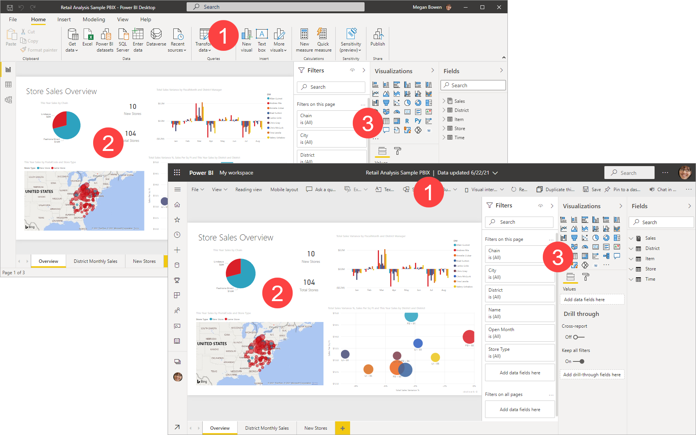

# Comparing Power BI Desktop and the Power BI service

**Power BI Desktop** is an application that you download and install for free on your local computer. Desktop is a complete data analysis and report creation tool that is used to connect to, transform, visualize, and analyze your data. It includes the Query Editor, in which you can connect to many different sources of data, and combine them (often called modeling) into a data model. Then you design a report based on that data model. Reports can be shared with others directly or by publishing to the Power BI service. The [Power BI Desktop getting started guide](desktop-getting-started.md) walks through the process.

The **Power BI service** is a cloud-based service, or *software as a service* (SaaS). It supports report editing and collaboration for teams and organizations. You can connect to data sources in the Power BI service, too, but modeling is limited. The Power BI service is used to do things such as creating dashboards, creating and sharing apps, analyzing and exploring your data to uncover business insights, and much more. [What is the Power BI service](power-bi-service-overview.md) details many of the capabilities of the Power BI service.

Most Power BI report designers who work on business intelligence projects use **Power BI Desktop** to create Power BI reports, and then use the **Power BI service** to collaborate and distribute their reports.

The Power BI service also hosts *paginated reports* in workspaces backed by a Power BI Premium capacity. You create paginated reports with Power BI Report Builder. See [Compare Power BI reports and paginated reports](../paginated-reports/paginated-reports-report-builder-power-bi.md#compare-power-bi-reports-and-paginated-reports) in the article "What are paginated reports in Power BI Premium?" for more information.

In a Venn diagram comparing Power BI Desktop and the Power BI service, the area in the middle shows some of the areas where the two overlap. Some tasks you can do in either Power BI Desktop or the service. The two outer sides of the Venn diagram show the features that are unique to either the Desktop application or to the Power BI service.  

## Editing Power BI reports

In both the application and the service, you build and edit Power BI *reports*. A report can have one or many pages, with visuals and collections of visuals. Add bookmarks, buttons, filters, and drillthrough, to enhance navigation in your reports.

The report editors in Power BI Desktop and in the service are similar. They're made up of three sections:  

1. The top nav panes, different in Power BI Desktop and the service    
2. The report canvas     
3. The **Fields**, **Visualizations**, and **Filters** panes

This video shows the report editor in Power BI Desktop. 

> [!NOTE]  
> This video might use earlier versions of Power BI Desktop or the Power BI service.

<iframe width="560" height="315" src="https://www.youtube.com/embed/IkJda4O7oGs" frameborder="0" allowfullscreen></iframe>

## Working in the Power BI service

### Collaborating

After you've created your reports, you can save them to a *workspace* in the **Power BI service**, where you and your colleagues collaborate. You build *dashboards* on top of those reports. Then, you share those dashboards and reports with report consumers inside and outside your organization. Your report consumers view them in the Power BI service in a *Reading view*, not Editing view. They don't have access to all the features available to report creators.  You can also share your datasets and let others build their own reports from them. Read more about [collaborating in the Power BI service](../collaborate-share/service-new-workspaces.md).

### Self-service data prep with dataflows

Dataflows help organizations unify data from disparate sources and prepare it for modeling. Analysts can easily create dataflows, using familiar, self-service tools. Analysts use dataflows to ingest, transform, integrate, and enrich big data by defining data source connections, ETL logic, refresh schedules, and more. Read more about [self-service data prep with dataflows](../transform-model/dataflows/dataflows-introduction-self-service.md).

## Next steps

[What is Power BI Desktop?](desktop-what-is-desktop.md)

[Create a report](../create-reports/service-report-create-new.md) in the Power BI service

[Basic concepts for report designers](service-basic-concepts.md)

More questions? [Try the Power BI Community](https://community.powerbi.com/)
