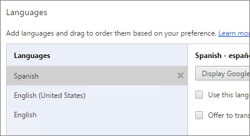
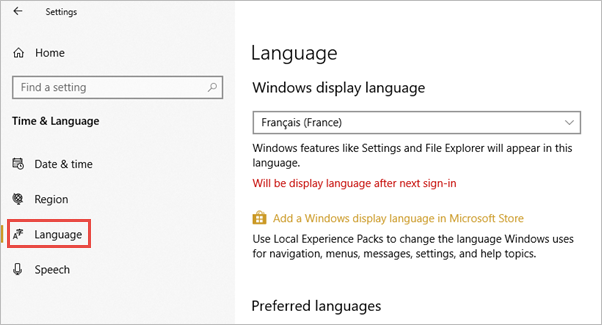

# Supported languages and countries/regions for Power BI

This article covers supported languages and countries/regions for the Power BI service, Power BI Desktop, and Power BI documentation.

## Countries and regions where Power BI is available
For a list of countries and regions where Power BI is available, see the [international availability list](https://products.office.com/business/international-availability). 

## Languages for the Power BI service
The Power BI service (in the browser) is available in the following 44 languages:

* Arabic
* Basque - Basque
* Bulgarian - Български
* Catalan - català
* Chinese (Simplified) - 中文(简体)
* Chinese (Traditional) - 中文(繁體)
* Croatian - hrvatski
* Czech - čeština
* Danish - dansk
* Dutch - Nederlands
* English - English
* Estonian - eesti
* Finnish - suomi
* French - français
* Galician - galego
* German - Deutsch
* Greek - Ελληνικά
* Hebrew
* Hindi - हिंदी
* Hungarian - magyar
* Indonesian - Bahasa Indonesia
* Italian - italiano
* Japanese - 日本語
* Kazakh - Қазақ
* Korean - 한국어
* Latvian - latviešu
* Lithuanian - lietuvių
* Malay - Bahasa Melayu
* Norwegian (Bokmål) - norsk (bokmål)
* Polish - Polski
* Portuguese (Brazil) - Português
* Portuguese (Portugal) - português
* Romanian - română
* Russian - Русский
* Serbian (Cyrillic) - српски
* Serbian (Latin) - srpski
* Slovak - slovenčina
* Slovenian - slovenski
* Spanish - español
* Swedish - svenska
* Thai - ไทย
* Turkish - Türkçe
* Ukrainian - українська
* Vietnamese - Tiếng Việt

### What's translated
Power BI translates menus, buttons, messages, and other elements of the experience into your language. For example, Power BI translates report content such as automatically generated titles, filters, and tooltips. However, your data isn't automatically translated. Inside reports, the layout of visuals doesn't change if you're using a right-to-left language such as Hebrew.

At this time, a few features are available in English only:

* Dashboards and reports that Power BI creates when you connect to services such as Microsoft Dynamics CRM, Google Analytics, and Salesforce. You can still create your own dashboards and reports in your own language.
* Exploring your data with Q&A.

Stay tuned as we work to bring additional features to other languages. 

### Choose your language in the Power BI service
1. In the Power BI service, select the **Settings** icon  > **Settings**.
2. On the **General** tab > **Language**.
3. Select your language > **Apply**.

### Choose your language in the browser
Power BI detects your language based on the language preferences on your computer. The way you access and change these preferences may vary depending on your operating system and browser. Here's how to access these preferences from Internet Explorer and Google Chrome.

#### Internet Explorer (version 11)
1. Click the **Tools** button in the top-right corner of your browser window:
   
   
2. Click **Internet Options**.
3. In the Internet Options dialog, on the General tab under Appearance, click the **Languages** button.

#### Google Chrome (version 42)
1. Click the menu button in the top-right corner of your browser window:
   
   
2. Click **Settings**.
3. Click **Show advanced settings**.
4. Under Languages, click the **Language and input settings** button.
5. Click **Add**, select a language, and click **OK**.
   
   
   
   The new language is at the end of the list. 
6. Drag the new language to the top of the list, and click **Display Google Chrome in this language**.
   
   
   
   You may need to close and reopen your browser to see the change.

## Choose the language or locale of Power BI Desktop
You have two ways of getting Power BI Desktop: You can download it as a standalone installer, or install it from the Windows Store.

* When you install Power BI Desktop from the Windows Store, it installs all the languages and by default shows the language that corresponds to the Windows default language.
* When you download Power BI Desktop as a standalone installer, you choose the default language when you run the installer. You can change it at a later date.
* You can also [choose a locale to be used when importing data](#choose-the-locale-for-importing-data-into-power-bi-desktop) for a specific report.

> [!NOTE]
> If you're installing the version of Power BI Desktop that's optimized for Power BI Report Server, you choose the language when you download. See [Install Power BI Desktop optimized for Power BI Report Server](../report-server/install-powerbi-desktop.md) for details.

### Choose a language for Power BI Desktop 
1. Install Power BI Desktop [from the Windows Store](https://aka.ms/pbidesktopstore), or as a [standalone installer](https://aka.ms/pbiSingleInstaller).
2. To change the language, on the Windows menu select **Settings**

3. In **Windows Settings**, select **Time & language**.
   
     
4. Select **Language** and select a language. Select **Add a Windows display language in Microsoft Store** if necessary.
   
     
   
     The next time you start Power BI Desktop it will use the language you set as the default. 

To override the default and use Power BI Desktop in a language other than your Windows language do the following.
1. In Power BI Desktop, go to **File** > **Options and settings** > **Options**.
2. Under **Global Settings**, select **Regional Settings**.
3. In the **Application Language** box, select a different locale. 

Language support in Power BI Desktop is limited to the languages displayed in the Application Language dropdown.

### Verify Power BI Desktop default number and date formatting

Power BI Desktop gets its default number and date formatting from the Windows Region settings. You can check or change those settings, if needed.

1. On the Windows menu select **Settings**

2. In **Windows Settings**, select **Time & language**.
   
     

3. Select **Region** > **Additional date, time, and regional settings**.

    :::image type="content" source="media/supported-languages-countries-regions/power-bi-service-region-settings.png" alt-text="Additional date, time, and regional settings":::

4. In **Clock and Region**, select **Change date, time, or number formats**.

    :::image type="content" source="media/supported-languages-countries-regions/power-bi-service-check-region-settings.png" alt-text="Clock and region settings":::

5. Make sure **Match Windows display language** is selected, or change it if necessary.

    :::image type="content" source="media/supported-languages-countries-regions/power-bi-service-match-windows.png" alt-text="Match Windows display language":::

### Choose the locale for importing data into Power BI Desktop
Whether you download Power BI Desktop or install it from the Windows Store, you can choose a locale for a specific report to be something other than the locale in your version of Power BI Desktop. The locale changes the way Power BI interprets data when it's imported from your data source. For example, is "3/4/2017" interpreted as 3 April or March 4?

1. In Power BI Desktop, go to **File** > **Options and settings** > **Options**.
2. Under **Current file**, select **Regional Settings**.
3. In the **Locale for import** box, select a different locale. 
   
   
4. Select **OK**.

### Choose the language for the model in Power BI Desktop

Besides setting the language for the Power BI Desktop application, you can also set the model language. The model language affects chiefly two things:

- How we compare and sort strings. For example, because Turkish has two of the letter i, depending on the collation of your database, the two can end up in different orders when sorting. 
- The language Power BI Desktop uses when creating hidden date tables from date fields. For example, fields are called Month/Monat/Mois, and so on.

> [!NOTE]
> The Power BI model currently uses a locale that is not case-sensitive (or kana-sensitive) so "ABC" and "abc" will be treated as equivalent. If "ABC" is loaded into the database first, other strings that differ only by case such as "Abc" won't be loaded as a separate value.
> 
>

Here's how to set the model language.

1. In Power BI Desktop, go to **File** > **Options and settings** > **Options**.
2. Under **Global**, select **Regional Settings**.
3. In the **Model language** box, select a different language. 

    

> [!NOTE]
> Once created, the language of a Power BI model can't be changed.
> 
>

## Languages for the help documentation
Help is localized in these 10 languages: 

* Chinese (Simplified) - 中文(简体)
* Chinese (Traditional) - 中文(繁體)
* French - français
* German - Deutsch
* Italian - italiano
* Japanese - 日本語
* Korean - 한국어
* Portuguese (Brazil) - Português
* Russian - Русский
* Spanish - español

## Next steps
* Are you using one of the Power BI mobile apps? See [Supported languages in the Power BI mobile apps](../consumer/mobile/mobile-apps-supported-languages.md) for details.
* Questions? Try asking the [Power BI Community](https://community.powerbi.com/).
* Still have an issue? Visit the [Power BI support page](https://powerbi.microsoft.com/support/).
