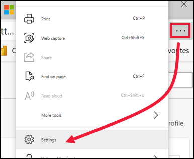
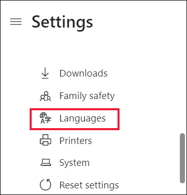
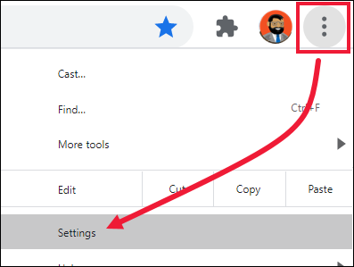
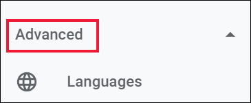
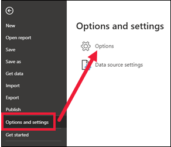
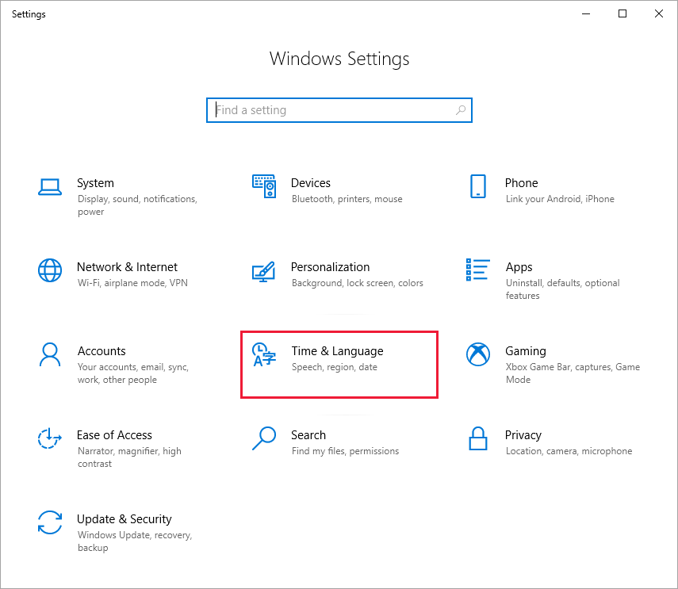

# Supported languages and countries/regions for Power BI

This article covers supported languages and countries/regions for the Power BI service, Power BI Desktop, and Power BI documentation. It also provides information about locale and regional features that make it possible to build multi-language reports. For example, you can design a Power BI report that renders in English for some users while rendering in Spanish, German, Japanese, or Hindi for other users. 

A company or organization might want to build Power BI reports that support multiple languages. Doing so doesn't require them to clone and maintain a separate PBIX project file for each language. Instead, they increase usage and lower report maintenance by designing and implementing a strategy for building multi-language reports. To try it out yourself, use the Translations Builder tutorial to [build multi language reports in Power BI.](https://github.com/PowerBiDevCamp/TranslationsBuilder/blob/main/Docs/Building%20Multi-language%20Reports%20in%20Power%20BI.md)

## Countries and regions where Power BI is available

For a list of countries and regions where Power BI is available, see the [international availability list](https://products.office.com/business/international-availability). 

## Languages for the Power BI service

The Power BI service (in the browser) is available in the following 44 languages:

* Arabic
* Basque - Basque
* Bulgarian - Български
* Catalan - català
* Chinese (Simplified) - 中文(简体)
* Chinese (Traditional) - 中文(繁體)
* Croatian - hrvatski
* Czech - čeština
* Danish - dansk
* Dutch - Nederlands
* English - English
* Estonian - eesti
* Finnish - suomi
* French - français
* Galician - galego
* German - Deutsch
* Greek - Ελληνικά
* Hebrew - עברית
* Hindi - हिंदी
* Hungarian - magyar
* Indonesian - Bahasa Indonesia
* Italian - italiano
* Japanese - 日本語
* Kazakh - Қазақ
* Korean - 한국어
* Latvian - latviešu
* Lithuanian - lietuvių
* Malay - Bahasa Melayu
* Norwegian (Bokmål) - norsk (bokmål)
* Polish - Polski
* Portuguese (Brazil) - Português
* Portuguese (Portugal) - português
* Romanian - română
* Russian - Русский
* Serbian (Cyrillic) - српски
* Serbian (Latin) - srpski
* Slovak - slovenčina
* Slovenian - slovenski
* Spanish - español
* Swedish - svenska
* Thai - ไทย
* Turkish - Türkçe
* Ukrainian - українська
* Vietnamese - Tiếng Việt

### Report or dashboard subscription language

When you create a subscription for a report or dashboard, you may be surprised to see that the subscription is in U.S. English, even though Power BI is in another language. If so, you need to specify a language for your browser. See [The language in my subscription isn't correct](../collaborate-share/service-troubleshoot-subscribe.yml) in the article "Troubleshoot Power BI subscriptions."

## Languages for Power BI Desktop

Power BI Desktop is available in the same languages as the Power BI service, except Hebrew and Arabic. Desktop doesn't support right-to-left languages.

### What's translated

Power BI translates menus, buttons, messages, and other elements of the experience into your language. For example, Power BI translates report content such as automatically generated titles, filters, and tooltips. However, your data isn't automatically translated. Inside reports, the layout of visuals doesn't change if you're using a right-to-left language such as Hebrew.

At this time, a few features are available in English only:

* Dashboards and reports that Power BI creates when you connect to services such as Microsoft Dynamics CRM, Google Analytics, and Salesforce. You can still create your own dashboards and reports in your own language.
* Exploring your data with Q&A.

>[!NOTE]
>The [auto date/time feature](../transform-model/desktop-auto-date-time.md) generates localized month names using the "MMMM" format string. Since most Eastern Asia languages use "OOOO" as the format string, the month names generated by the auto date/time feature aren't localized to those languages.

### Choose your language in the Power BI service

1. In the Power BI service, select the **Settings** icon  > **Settings**.
2. On the **General** tab, select **Language**.
3. Use the language already set for your browser, or select a separate language for the Power BI service.  

### Choose your language in the browser

Power BI detects your language based on the language preferences on your computer. The way you access and change these preferences may vary depending on your operating system and browser. Here's how to access these preferences from Microsoft Edge and Google Chrome.

#### Microsoft Edge (version 91)

1. Select the **Settings and more** ellipses (...) from the upper right corner of your browser window, and choose **Settings**. 
    

1. Select the **Settings** icon in the upper left corner of your browser window, and choose **Languages**.
   
   

1. Select your preferred language.

#### Google Chrome (version 91)

1. Select the menu button in the upper right corner of your browser window, and choose **Settings**.
   
   
 
1. Expand the main menu in the upper left corer and choose **Languages**.

    

1. To add a new language, select **Add languages**.
   
   You may need to close and reopen your browser to see the change.

## Choose the language or locale of Power BI Desktop

You have two ways of getting Power BI Desktop. You can download it as a standalone installer, or install it from the Windows Store. 

* When you install Power BI Desktop from the Windows Store, it installs all the languages (currently, 42 languages) and by default shows the language that corresponds to the Windows default language.
* When you download Power BI Desktop as a standalone installer, you choose the default language when you run the installer. You can change it at a later date.
* You can also [choose a locale to be used when importing data](#choose-the-locale-for-importing-data-into-power-bi-desktop) for a specific report.

> [!NOTE]
> If you're installing the version of Power BI Desktop that's optimized for Power BI Report Server, you choose the language when you download. See [Install Power BI Desktop optimized for Power BI Report Server](../report-server/install-powerbi-desktop.md) for details.

### Choose a language for Power BI Desktop

1. Install Power BI Desktop [from the Windows Store](https://aka.ms/pbidesktopstore), or as a [standalone installer](https://aka.ms/pbiSingleInstaller).
1. To change the language, open Desktop and in the upper left corner select **File** > **Options and settings** > **Options**.    

   

1. Select **Regional settings** and set or change your language preferences.

Language support in Power BI Desktop is limited to the languages displayed in the Application Language dropdown.

### Verify Power BI Desktop default number and date formatting

Power BI Desktop gets its default number and date formatting from the Windows Region settings. You can check or change those settings, if needed.

1. On the Windows menu, select **Settings.**

1. In **Windows Settings**, select **Time & language**.
   
     

1. Select **Language & Region** > **Additional date, time, and regional settings**. If you don't see this option, scroll down to **Region**. Check and modify the **Country or region** and **Regional format** settings as needed.

    :::image type="content" source="media/supported-languages-countries-regions/power-bi-check-dates.png" alt-text="Screenshot showing additional date, time, and regional settings.":::

### Choose the locale for importing data into Power BI Desktop

Whether you download Power BI Desktop or install it from the Windows Store, you can choose a locale for a specific report to be something other than the locale in your version of Power BI Desktop. The locale changes the way Power BI interprets data when importing from your data source. For example, is "3/4/2017" interpreted as 3 April or March 4?

1. In Power BI Desktop, go to **File** > **Options and settings** > **Options**.
2. Under **Current file**, select **Regional Settings**.
3. In the **Locale for import** box, select a different locale. 
   
   
4. Select **OK**.

### Choose the language for the model in Power BI Desktop

Besides setting the language for the Power BI Desktop application, you can also set the model language. The model language affects chiefly two things:

- How we compare and sort strings. For example, because Turkish has two of the letter i, depending on the collation of your database, the two can end up in different orders when sorting. 
- The language Power BI Desktop uses when creating hidden date tables from date fields. For example, fields are called Month/Monat/Mois, and so on.

> [!NOTE]
> The Power BI model currently uses a locale that isn't case-sensitive (or kana-sensitive) so "ABC" and "abc" will be treated as equivalent. If "ABC" is loaded into the database first, other strings that differ only by case such as "Abc" don't load as a separate value.
> 
>

Here's how to set the model language.

1. In Power BI Desktop, go to **File** > **Options and settings** > **Options**.
2. Under **Global**, select **Regional Settings**.
3. In the **Model language** box, select a different language. 

    

> [!NOTE]
> Once created, the language of a Power BI model can't be changed.
>

### Choose the DAX separators in Power BI Desktop

By default, DAX uses commas (,) to separate items in a list and periods (.) to indicate the decimal place in a number. While we do recommend using the defaults, you can use the DAX separators based on your Windows locale settings.

> [!NOTE]
> The **DAX separators** section isn't shown if your Windows locale settings are set to "English US".

Here's how to make Power BI Desktop use localized DAX separators:

1. In Power BI Desktop, go to **File** > **Options and settings** > **Options**.
2. Under **Global**, select **Regional Settings**.
3. Under **DAX separators** select **Use localized DAX separators**.

    :::image type="content" source="media/supported-languages-countries-regions/power-bi-dax-separators.png" alt-text="Screenshot of Power BI Desktop showing how to choose the DAX separators." :::

> [!NOTE]
> The **DAX separators** section won't be shown if your Windows locale settings are set to "English US".

## Languages for the help documentation

Help is localized in these 10 languages: 

* Chinese (Simplified) - 中文(简体)
* Chinese (Traditional) - 中文(繁體)
* French - français
* German - Deutsch
* Italian - italiano
* Japanese - 日本語
* Korean - 한국어
* Portuguese (Brazil) - Português
* Russian - Русский
* Spanish - español

## Related content

* [Locale settings for paginated reports.](/sql/reporting-services/report-design/set-the-locale-for-a-report-or-text-box-reporting-services?view=sql-server-ver16&preserve-view=true)
* Are you using one of the Power BI mobile apps? See [Supported languages in the Power BI mobile apps.](../consumer/mobile/mobile-apps-supported-languages.md) for details.
* Questions? Try asking the [Power BI Community](https://community.powerbi.com/).
* Still have an issue? Visit the [Power BI support page.](https://powerbi.microsoft.com/support/).
