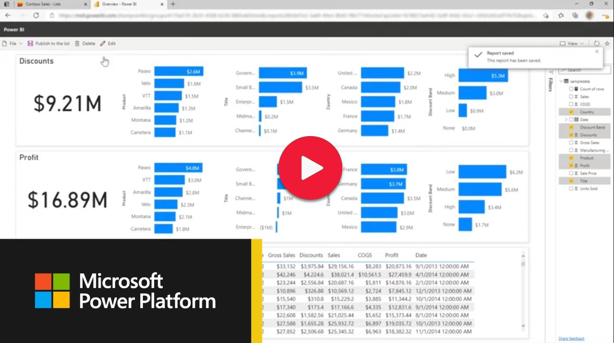
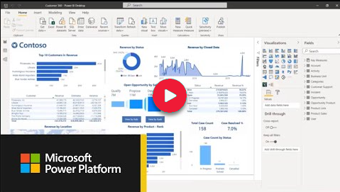
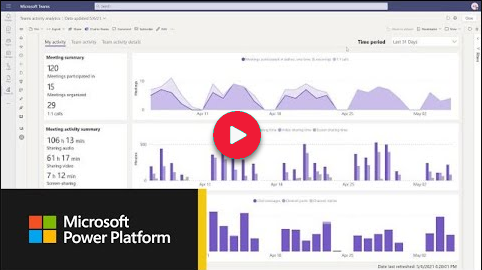

# Power BI videos

You'll find Power BI videos embedded in our documentation, organized into channels and playlists on YouTube, and in the Community video gallery. Our videos come in many different flavors:
- How-to videos that teach you how to *do something* in Power BI
- Conceptual videos that explain things like: terminology, the logic behind how something works, and foundational information
- Video *series* that are combined into a course or certification
- Community webinars that we've hosted in the past
- Customer success stories
- Videos from conferences (Ignite, Data Insights, and more) that we've hosted 
- Monthly product update videos that describe and show new features

> [!NOTE]  
  > Videos might use earlier versions of Power BI Desktop or the Power BI service.

## Subscribe to the Power BI video channel

Our video channel includes curated playlists to make it easy to find the content you need. The "Analyzing and visualizing data" playlist, for example, includes how-to and conceptual videos narrated by Power BI PMs (Project Managers).  

We’re continually adding to our collection, so [subscribe to the Power BI video channel](https://www.youtube.com/c/MSPowerBI/) to be notified when we add new videos. Explore our playlists to discover videos focused on where you are in the business intelligence journey.

## Featured video

In this featured video, we show how to create quick reports in the Power BI service. This new way to create reports lets you paste data directly into the Power BI service, instead of downloading Power BI Desktop.

Catch up on these recent videos you may have missed:

| [Learn about new data protection enhancements](http://www.youtube.com/watch?v=RxsT9TtOYok)  | [New enhancements in Power BI app for Teams](http://www.youtube.com/watch?v=abTASA8iOjQ) | 
| ------| ------ | 
|  |  |

## Featured playlists

Related Power BI videos are collected into playlists to help you easily find subjects of interest to you. Go to [the Microsoft Power BI playlists on our YouTube channel](https://www.youtube.com/c/MSPowerBI/playlists) to explore all our playlists. The list below is a sampling of the topics you’ll find featured as playlists:
* [Power BI Desktop](https://www.youtube.com/playlist?list=PL1N57mwBHtN2q1WbU5O29rrn_A0lkVv9p)
* [Dashboards, Reports, and Design](https://www.youtube.com/playlist?list=PL1N57mwBHtN0ufit2dISWvcOAIetKcstk) 
* [Administration and Governance](https://www.youtube.com/playlist?list=PL1N57mwBHtN2RuqlRQV4b4TNlcBJ_NgSR)
* [Analyze and Visualize Data](https://www.youtube.com/playlist?list=PL1N57mwBHtN0JFoKSR0n-tBkUJHeMP2cP)
* [Data Prep and Modeling](https://www.youtube.com/playlist?list=PL1N57mwBHtN2NhxTvyO6TquHuZOMh4BMq)

## Microsoft Power BI Community videos and webinars

[The Community gallery](https://community.powerbi.com/t5/Webinars-and-Video-Gallery/bd-p/VideoTipsTricks/) curates videos from hosted events and from our community members. Explore videos organized by date, top kudo-ed, featured, and live events. 

## Next steps

* [Power BI on Microsoft Learn](/learn/powerplatform/power-bi?WT.mc_id=powerbi_video-docs-link)
* [Watch Power BI demos](https://powerbi.microsoft.com/demo/)
* Discover [videos from Azure about Power BI Embedded and Synapse Analytics](https://azure.microsoft.com/search/videos/?q=power+bi)
 
More questions? [Try asking the Power BI Community](https://community.powerbi.com/)