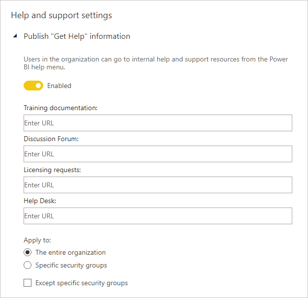
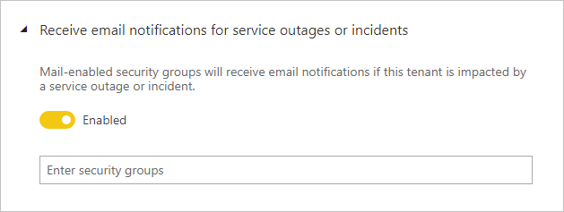
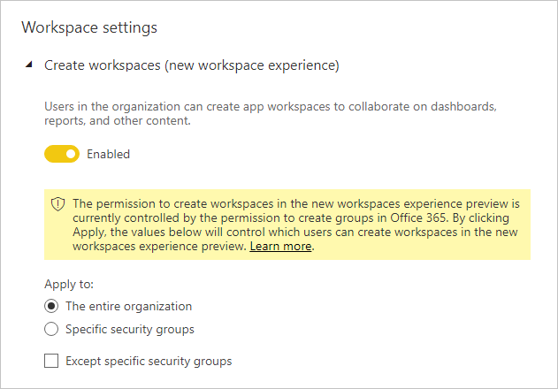
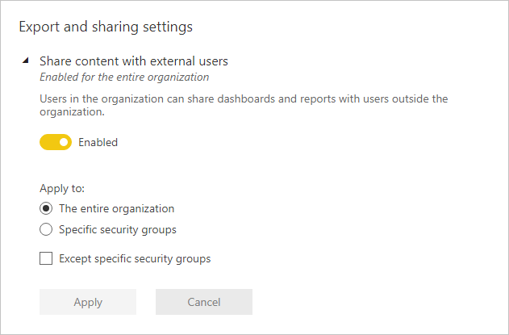
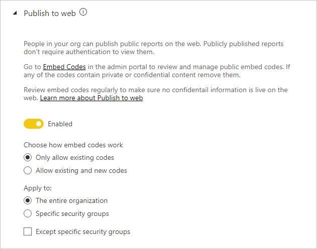
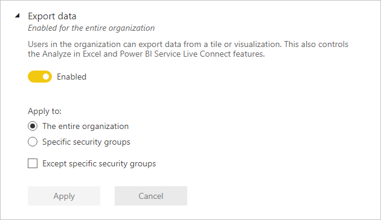
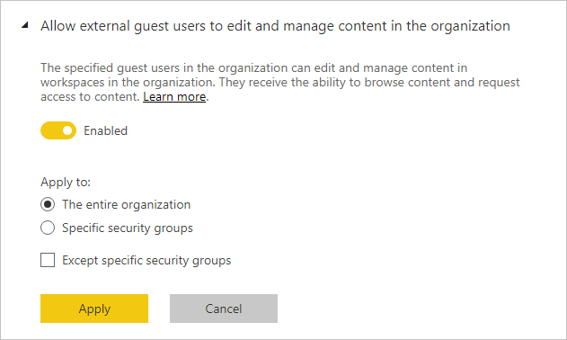
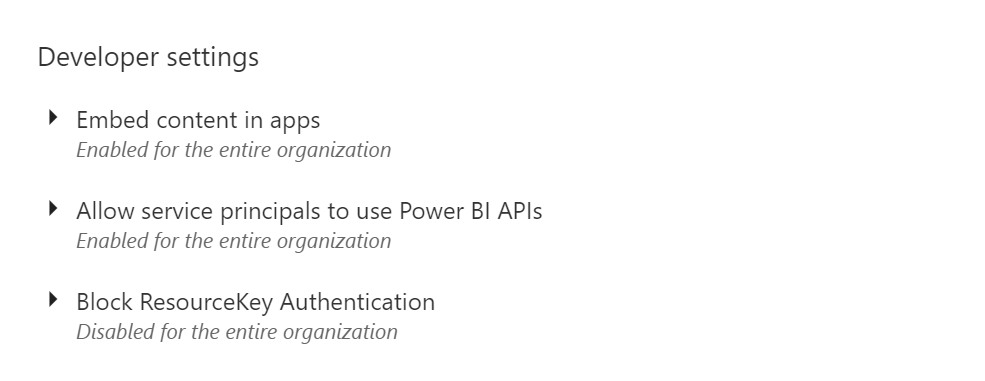

# Tenant admin settings guidance

This article targets Power BI administrators who are responsible for setting up and configuring the Power BI environment in their organization.

We provide guidance for specific tenant settings that help improve the Power BI experience, or could expose your organization to risk. We recommend you always configure your tenant to align with your organization's policies and processes.

[Tenant settings](../service-admin-portal.md#tenant-settings) are managed in the [Admin portal](https://app.powerbi.com/admin-portal/tenantSettings), and can be configured by a [Power BI service administrator](../service-admin-administering-power-bi-in-your-organization.md#administrator-roles-related-to-power-bi). Many tenant settings can restrict capabilities and features to a limited set of users. So, we recommend you first become familiar with the settings to plan the security groups you'll need. You might find that you can apply the same security group to multiple settings.

## Improve Power BI experience

### Publish "Get Help" information

We encourage you to set up internal Power BI-related sites using [Microsoft Teams](/microsoftteams), or other collaboration platform. These sites can be used to store training documentation, host discussions, make requests for licenses, or respond to help.

If you do so, we recommend you then enable the **Publish "Get Help" information** setting _for the entire organization_. It's found in the **Help and support settings** group. You can set URLs for your:

- Training documentation
- Discussion forum
- Licensing requests
- Help desk

These URLs will become available as links in the Power BI help menu.

> [!NOTE]
> Supplying the **Licensing requests** URL will prevent individual users from signing up for the free 60-day Power BI Pro trial. Instead, they'll be directed to your internal site with information on how to acquire a license—Free or Pro.

## Manage risk

### Receive email notification service outages or incidents

You can be notified by email if your tenant is impacted by a service outage or incident. This way, you can proactively respond to incidents.

We recommend you enable the **Receive email notification service outages or incidents** setting. It's found in the **Help and support settings** group. Assign one or more _mail-enabled_ security groups.

### Information protection

Information protection allows enforcing protection settings—such as encryption or watermarks—when exporting data from the Power BI service.

There are two tenant settings related to information protection. By default, both settings are disabled for the entire organization.

We recommend you enable these settings when you need to handle and protect sensitive data. For more information, see [Data protection in Power BI](../admin/service-security-data-protection-overview.md).

### Create workspaces

You can restrict users from creating workspaces. This way, you can govern what is created within your organization.

> [!NOTE]
> Currently there's a transition period between the old workspace experience and the new. This tenant setting applies only to the new experience.

The **Create workspaces** setting is enabled by default for the entire organization. It's found in the **Workspace settings** group.

We recommend you assign one or more security groups. These groups can be granted _or denied_ permission to create workspaces.

Be sure to include instructions in your documentation letting users (who don't have workspace creation rights) know how they can request a new workspace.

### Share content with external users

Users can share reports and dashboards with people outside your organization.

The **Share content with external users** setting is enabled by default for the entire organization. It's found in the **Export and sharing settings** group.

We recommend you assign one or more security groups. These groups can be granted _or denied_ permission to share content with external users.

### Publish to web

The [publish to web](../service-publish-to-web.md) feature allows publishing public reports on the web. If used inappropriately, there's risk that confidential information could be made available live on the web.

The **Publish to web** setting is enabled by default for the entire organization, but restricting the ability for non-admin users to create embed codes. It's found in the **Export and sharing settings** group.

If enabled, we recommend you assign one or more security groups. These groups can be granted _or denied_ permission to publish reports.

Further, there's an option to choose how your embed codes work. By default, it's set to **Only allow existing codes**. It means users will be asked to contact a Power BI admin to create an embed code.

We also recommend you review [publish to web embed codes](https://app.powerbi.com/admin-portal/embedCodes) regularly. Remove codes if they result in the publication of private or confidential information.

### Export data

You can restrict users from exporting data from dashboard tiles or report visuals.

The **Export data** setting is enabled by default for the entire organization. It's found in the **Export and sharing settings** group.

We recommend you assign one or more security groups. These groups can be granted _or denied_ permission to publish reports.

> [!IMPORTANT]
> Disabling this setting also restricts the use of the [Analyze in Excel](../service-analyze-in-excel.md) and Power BI service [live connection](../desktop-report-lifecycle-datasets.md#using-a-power-bi-service-live-connection-for-report-lifecycle-management) features.

> [!NOTE]
> If users allow users to export data, you can add a layer of protection by enforcing [data protection](../admin/service-security-data-protection-overview.md). When configured, unauthorized users will be blocked from exporting content with sensitivity labels.

### Allow external guest users to edit and manage content in the organization

It's possible that external guest users can edit and manage Power BI content. For more information, see [Distribute Power BI content to external guest users with Azure AD B2B](../service-admin-azure-ad-b2b.md).

The **Allow external guest users to edit and manage content in the organization** setting is disabled by default for the entire organization. It's found in the **Export and sharing settings** group.

If you need to authorize external users to edit and manage content, we recommend you assign one or more security groups. These groups can be granted _or denied_ permission to publish reports.

### Developer settings

There are two tenant settings related to [embedding Power BI content](../developer/embedding.md). They are:

- Embed content in apps (enabled by default)
- Allow service principals to user Power BI APIs (disabled by default)

If you have no intention of using the developer APIs to embed content, we recommend you disable them. Or, at least configure specific security groups that would be doing this work.

## Next steps

For more information related to this article, check out the following resources:

- [What is Power BI administration?](../service-admin-administering-power-bi-in-your-organization.md)
- [Administering Power BI in the admin portal](../service-admin-portal.md)
- Questions? [Try asking the Power BI Community](https://community.powerbi.com/)
- Suggestions? [Contribute ideas to improve Power BI](https://ideas.powerbi.com)
