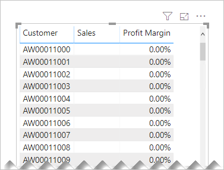
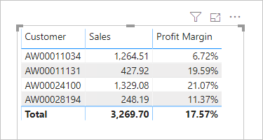

# DAX: Avoid converting BLANKs to values

As a data modeler, when writing measure expressions you might come across cases where a meaningful value can't be returned. In these instances, you may be tempted to return a value—like zero—instead. We suggest you carefully determine whether this design is efficient and practical.

Consider the following measure definition that explicitly converts BLANK results to zero.

```dax
Sales (No Blank) =
IF(
    ISBLANK([Sales]),
    0,
    [Sales]
)
```

Consider another measure definition that also converts BLANK results to zero.

```dax
Profit Margin =
DIVIDE([Profit], [Sales], 0)
```

The [DIVIDE](/dax/divide-function-dax) function divides the **Profit** measure by the **Sales** measure. Should the result be zero or BLANK, the third argument—the alternate result (which is optional)—is returned. In this example, because zero is passed as the alternate result, the measure is guaranteed to always return a value.

These measure designs are inefficient and lead to poor report designs.

When they're added to a report visual, Power BI attempts to retrieve all groupings within the filter context. The evaluation and retrieval of large query results often leads to slow report rendering. Each example measure effectively turns a sparse calculation into a dense one, forcing Power BI to use more memory than necessary.

Also, too many groupings often overwhelm your report users.

Let's see what happens when the **Profit Margin** measure is added to a table visual, grouping by customer.



The table visual displays an overwhelming number of rows. (There are in fact 18,484 customers in the model, and so the table attempts to display all of them.) Notice that the customers in view haven't achieved any sales. Yet, because the **Profit Margin** measure always returns a value, they are displayed.

> [!NOTE]
> When there are too many data points to display in a visual, Power BI may use data reduction strategies to remove or summarize large query results. For more information, see [Data point limits and strategies by visual type](../visuals/power-bi-data-points.md).

Let's see what happens when the **Profit Margin** measure definition is improved. It now returns a value only when the **Sales** measure isn't BLANK (or zero).

```dax
Profit Margin =
DIVIDE([Profit], [Sales])
```

The table visual now displays only customers who have made sales within the current filter context. The improved measure results in a more efficient and practical experience for your report users.



> [!TIP]
> When necessary, you can configure a visual to display all groupings (that return values or BLANK) within the filter context by enabling the [Show Items With No Data](../create-reports/desktop-show-items-no-data.md) option.

## Recommendation

We recommend that your measures return BLANK when a meaningful value cannot be returned.

This design approach is efficient, allowing Power BI to render reports faster. Also, returning BLANK is better because report visuals—by default—eliminate groupings when summarizations are BLANK.

## Next steps

For more information about this article, check out the following resources:

- [Data Analysis Expressions (DAX) Reference](/dax/)
- Learning path: [Use DAX in Power BI Desktop](/learn/paths/dax-power-bi/)
- Questions? [Try asking the Power BI Community](https://community.powerbi.com/)
- Suggestions? [Contribute ideas to improve Power BI](https://ideas.powerbi.com)