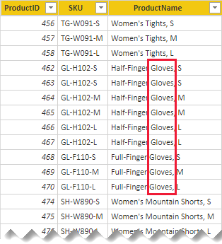
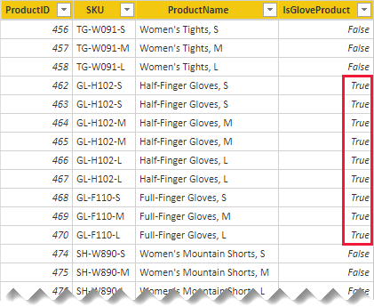

# DAX: Avoid using SEARCH in measures

As a data modeler, sometimes you might need to write a DAX expression that tests whether specific characters exist within a text value. The [SEARCH](/dax/search-function-dax) DAX function let's you do this test. But, this function involves scanning, which is an expensive operation—especially when Power BI must scan many text values (column values within filter context).

Consider a requirement to report on total sales results for products that are gloves. The model has a **Product** table that stores thousands of rows, and the text "gloves" is found in the **ProductName** column for some rows.



The following measure definition uses the SEARCH function to calculate the total sales result for gloves.

```dax
Glove Sales =
CALCULATE(
    [Sales],
    SEARCH("Gloves", 'Product'[ProductName], , -1) <> -1
)
```

While this calculation produces the correct result, it forces Power BI to do an expensive scan of the **ProductName** column values _each time the measure is evaluated_.

Let's now consider a more efficient design. In this design, the search result is stored in a calculated column. This way, it's evaluated only when the **Product** table is refreshed.

```dax
IsGloveProduct = (SEARCH("Gloves", 'Product'[ProductName], , -1) <> -1)
```



The improved **Glove Sales** measure definition now filters by the **IsGloveProduct** column. It avoids the use of the SEARCH function.

```dax
Glove Sales =
CALCULATE(
    [Sales],
    'Product'[IsGloveProduct]
)
```

## Recommendation

For best performance, we recommend you avoid using the SEARCH function in measures. Instead, store the SEARCH function result in a calculated column, and then use this column to filter measure expressions.

## Next steps

For more information about this article, check out the following resources:

- [Data Analysis Expressions (DAX) Reference](/dax/)
- Questions? [Try asking the Power BI Community](https://community.powerbi.com/)
