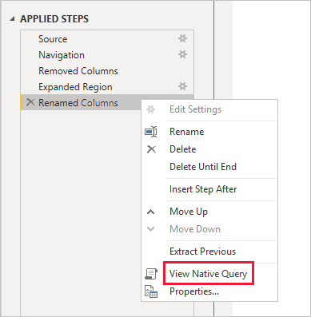
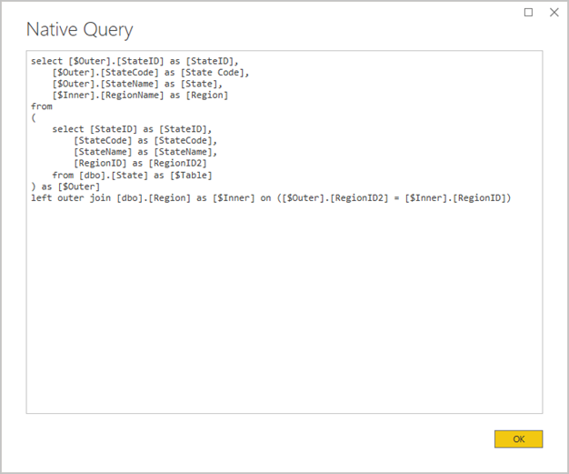
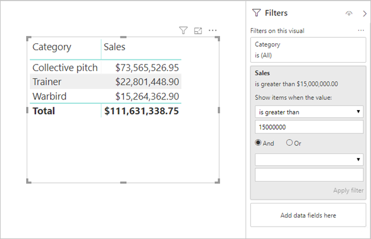

# DirectQuery model guidance in Power BI Desktop

This article targets data modelers developing Power BI DirectQuery models, developed by using either Power BI Desktop or the Power BI service. It describes DirectQuery use cases, limitations, and guidance. Specifically, the guidance is designed to help you determine whether DirectQuery is the appropriate mode for your model, and to improve the performance of your reports based on DirectQuery models. This article applies to DirectQuery models hosted in the Power BI service or Power BI Report Server.

This article isn't intended to provide a complete discussion on DirectQuery model design. For an introduction, refer to the [DirectQuery models in Power BI Desktop](../connect-data/desktop-directquery-about.md) article. For a deeper discussion, refer directly to the [DirectQuery in SQL Server 2016 Analysis Services](https://download.microsoft.com/download/F/6/F/F6FBC1FC-F956-49A1-80CD-2941C3B6E417/DirectQuery%20in%20Analysis%20Services%20-%20Whitepaper.pdf) whitepaper. Bear in mind that the whitepaper describes using DirectQuery in SQL Server Analysis Services. Much of the content, however, is still applicable to Power BI DirectQuery models.

> [!NOTE]
> For considerations when using DirectQuery storage mode for Dataverse, see [Power BI modeling guidance for Power Platform](powerbi-modeling-guidance-for-power-platform.md#considerations-for-directquery).

This article doesn't directly cover composite models. A Composite model consists of at least one DirectQuery source, and possibly more. The guidance described in this article is still relevant—at least in part—to Composite model design. However, the implications of combining Import tables with DirectQuery tables aren't in scope for this article. For more information, see [Use composite models in Power BI Desktop](../transform-model/desktop-composite-models.md).

It's important to understand that DirectQuery models impose a different workload on the Power BI environment (Power BI service or Power BI Report Server) and also on the underlying data sources. If you determine that DirectQuery is the appropriate design approach, we recommend that you engage the right people on the project. We often see that a successful DirectQuery model deployment is the result of a team of IT professionals working closely together. The team usually consists of model developers and the source database administrators. It can also involve data architects, and data warehouse and ETL developers. Often, optimizations need to be applied directly to the data source to achieve good performance results.

## Optimize data source performance

The relational database source can be optimized in several ways, as described in the following bulleted list.

> [!NOTE]
> We understand that not all modelers have the permissions or skills to optimize a relational database. While it is the preferred layer to prepare the data for a DirectQuery model, some optimizations can also be achieved in the model design, without modifying the source database. However, best optimization results are often achieved by applying optimizations to the source database.

- **Ensure data integrity is complete:** It's especially important that dimension-type tables contain a column of unique values (dimension key) that maps to the fact-type table(s). It's also important that fact-type dimension columns contain valid dimension key values. They'll allow configuring more efficient model relationships that expect matched values on both sides of relationships. When the source data lacks integrity, it's recommended that an "unknown" dimension record is added to effectively repair the data. For example, you can add a row to the **Product** table to represent an unknown product, and then assign it an out-of-range key, like -1. If rows in the **Sales** table contain a missing product key value, substitute them with -1. It ensures every **Sales** product key value has a corresponding row in the **Product** table.
- **Add indexes:** Define appropriate indexes—on tables or views—to support the efficient retrieval of data for the expected report visual filtering and grouping. For SQL Server, Azure SQL Database or Azure Synapse Analytics (formerly SQL Data Warehouse) sources, see [SQL Server Index Architecture and Design Guide](/sql/relational-databases/sql-server-index-design-guide) for helpful information on index design guidance. For SQL Server or Azure SQL Database volatile sources, see [Get started with Columnstore for real-time operational analytics](/sql/relational-databases/indexes/get-started-with-columnstore-for-real-time-operational-analytics).
- **Design distributed tables:** For Azure Synapse Analytics (formerly SQL Data Warehouse) sources, which use Massively Parallel Processing (MPP) architecture, consider configuring large fact-type tables as hash distributed, and dimension-type tables to replicate across all the compute nodes. For more information, see [Guidance for designing distributed tables in Azure Synapse Analytics (formerly SQL Data Warehouse)](/azure/sql-data-warehouse/sql-data-warehouse-tables-distribute#what-is-a-distributed-table).
- **Ensure required data transformations are materialized:** For SQL Server relational database sources (and other relational database sources), computed columns can be added to tables. These columns are based on an expression, like **Quantity** multiplied by **UnitPrice**. Computed columns can be persisted (materialized) and, like regular columns, sometimes they can be indexed. For more information, see [Indexes on Computed Columns](/sql/relational-databases/indexes/indexes-on-computed-columns).

    Consider also indexed views that can pre-aggregate fact table data at a higher grain. For example, if the **Sales** table stores data at order line level, you could create a view to summarize this data. The view could be based on a SELECT statement that groups the **Sales** table data by date (at month level), customer, product, and summarizes measure values like sales, quantity, etc. The view can then be indexed. For SQL Server or Azure SQL Database sources, see [Create Indexed Views](/sql/relational-databases/views/create-indexed-views).
- **Materialize a date table:** A common modeling requirement involves adding a date table to support time-based filtering. To support the known time-based filters in your organization, create a table in the source database, and ensure it's loaded with a range of dates encompassing the fact table dates. Also ensure that it includes columns for useful time periods, like year, quarter, month, week, etc.

## Optimize model design

A DirectQuery model can be optimized in many ways, as described in the following bulleted list.

- **Avoid complex Power Query queries:** An efficient model design can be achieved by removing the need for the Power Query queries to apply any transformations. It means that each query maps to a single relational database source table or view. You can preview a representation of the actual SQL query statement for a Power Query applied step, by selecting the **View Native Query** option.

    
    
    

- **Examine the use of calculated columns and data type changes:** DirectQuery models support adding calculations and Power Query steps to convert data types. However, better performance is often achieved by materializing transformation results in the relational database source, when possible.
- **Do not use Power Query relative date filtering:** It's possible to define relative date filtering in a Power Query query. For example, to retrieve to the sales orders that were created in the last year (relative to today's date). This type of filter translates to an inefficient native query, as follows:

    ```SQL
    …
    from [dbo].[Sales] as [_]
    where [_].[OrderDate] >= convert(datetime2, '2018-01-01 00:00:00') and [_].[OrderDate] < convert(datetime2, '2019-01-01 00:00:00'))  
    ```
    
    A better design approach is to include relative time columns in the date table. These columns store offset values relative to the current date. For example, in a **RelativeYear** column, the value zero represents current year, -1 represents previous year, etc. Preferably, the **RelativeYear** column is materialized in the date table. While less efficient, it could also be added as a model calculated column, based on the expression using the [TODAY](/dax/today-function-dax) and [DATE](/dax/date-function-dax) DAX functions.

- **Keep measures simple:** At least initially, it's recommended to limit measures to simple aggregates. The aggregate functions include SUM, COUNT, MIN, MAX, and AVERAGE. Then, if the measures are sufficiently responsive, you can experiment with more complex measures, but paying attention to the performance for each. While the [CALCULATE](/dax/calculate-function-dax) DAX function can be used to produce sophisticated measure expressions that manipulate filter context, they can generate expensive native queries that don't perform well.
- **Avoid relationships on calculated columns:** Model relationships can only relate a single column in one table to a single column in a different table. Sometimes, however, it's necessary to relate tables by using multiple columns. For example, the **Sales** and **Geography** tables are related by two columns: **CountryRegion** and **City**. To create a relationship between the tables, a single column is required, and in the **Geography** table, the column must contain unique values. Concatenating the country/region and city with a hyphen separator could achieve this result.

    The combined column can be created with either a Power Query custom column, or in the model as a calculated column. However, it should be avoided as the calculation expression will be embedded into the source queries. Not only is it inefficient, it commonly prevents the use of indexes. Instead, add materialized columns in the relational database source, and consider indexing them. You can also consider adding surrogate key columns to dimension-type tables, which is a common practice in relational data warehouse designs.
    
    There's one exception to this guidance, and it concerns the use of the [COMBINEVALUES](/dax/combinevalues-function-dax) DAX function. The purpose of this function is to support multi-column model relationships. Rather than generate an expression that the relationship uses, it generates a multi-column SQL join predicate.
- **Avoid relationships on "Unique Identifier" columns:** Power BI doesn't natively support the unique identifier (GUID) data type. When defining a relationship between columns of this type, Power BI generates a source query with a join involving a cast. This query-time data conversion commonly results in poor performance. Until this case is optimized, the only workaround is to materialize columns of an alternative data type in the underlying database.
- **Hide the one-side column of relationships:** The one-side column of a relationship should be hidden. (It's usually the primary key column of dimension-type tables.) When hidden, it isn't available in the **Fields** pane and so can't be used to configure a visual. The many-side column can remain visible if it is useful to group or filter reports by the column values. For example, consider a model where a relationship exists between **Sales** and **Product** tables. The relationship columns contain product SKU (Stock-Keeping Unit) values. If product SKU must be added to visuals, it should be visible only in the **Sales** table. When this column is used to filter or group in a visual, Power BI generates a query that doesn't need to join the **Sales** and **Product** tables.
- **Set relationships to enforce integrity:** The **Assume Referential Integrity** property of DirectQuery relationships determines whether Power BI generates source queries using an inner join rather than an outer join. It generally improves query performance, though it does depend on the specifics of the relational database source. For more information, see [Assume referential integrity settings in Power BI Desktop](/power-bi/connect-data/desktop-assume-referential-integrity).
- **Avoid use of bi-directional relationship filtering:** Use of bi-directional relationship filtering can lead to query statements that don't perform well. Only use this relationship feature when necessary, and it's usually the case when implementing a many-to-many relationship across a bridging table. For more information, see [Relationships with a many-many cardinality in Power BI Desktop](/power-bi/transform-model/desktop-many-to-many-relationships).
- **Limit parallel queries:** You can set the maximum number of connections DirectQuery opens for each underlying data source. It controls the number of queries concurrently sent to the data source.
  - The setting is only enabled when there's at least one DirectQuery source in the model. The value applies to all DirectQuery sources, and to any new DirectQuery sources added to the model.
  - Increasing the **Maximum Connections per Data Source** value ensures more queries (up to the maximum number specified) can be sent to the underlying data source, which is useful when numerous visuals are on a single page, or many users access a report at the same time. Once the maximum number of connections is reached, further queries are queued until a connection becomes available. Increasing this limit does result in more load on the underlying data source, so the setting isn't guaranteed to improve overall performance.
  - When the model is published to Power BI, the maximum number of concurrent queries sent to the underlying data source also depends on the environment. Different environments (such as Power BI, Power BI Premium, or Power BI Report Server) each can impose different throughput constraints. For more information about Power BI Premium capacity resource limitations, see [Deploying and Managing Power BI Premium Capacities](whitepaper-powerbi-premium-deployment.md).

## Optimize report designs

Reports based on a DirectQuery semantic model ([previously known as a dataset](../connect-data/service-datasets-rename.md)) can be optimized in many ways, as described in the following bulleted list.

- **Enable query reduction techniques:** Power BI Desktop _Options and Settings_ includes a Query Reduction page. This page has three helpful options. It's possible to disable cross-highlighting and cross-filtering by default, though it can be overridden by editing interactions. It's also possible to show an Apply button on slicers and filters. The slicer or filter options won't be applied until the report user clicks the button. If you enable these options, we recommend that you do so when first creating the report.    
- **Apply filters first:** When first designing reports, we recommend that you apply any applicable filters—at report, page, or visual level—before mapping fields to the visual fields. For example, rather than dragging in the **CountryRegion** and **Sales** measures, and then filtering by a particular year, apply the filter on the **Year** field first. It's because each step of building a visual will send a query, and while it's possible to then make another change before the first query has completed, it still places unnecessary load on the underlying data source. By applying filters early, it generally makes those intermediate queries less costly and faster. Also, failing to apply filters early can result in exceeding the 1 million-row limit, as described in [about DirectQuery](../connect-data/desktop-directquery-about.md#general-implications).
- **Limit the number of visuals on a page:** When a report page is opened (and when page filters are applied) all of the visuals on a page are refreshed. However, there's a limit on the number of queries that can be sent in parallel, imposed by the Power BI environment and the **Maximum Connections per Data Source** model setting, as described above. So, as the number of page visuals increases, there's higher chance that they'll be refreshed in a serial manner. It increases the time taken to refresh the entire page, and it also increases the chance that visuals may display inconsistent results (for volatile data sources). For these reasons, it's recommended to limit the number of visuals on any page, and instead have more simpler pages. Replacing multiple card visuals with a single multi-row card visual can achieve a similar page layout.
- **Switch off interaction between visuals:** Cross-highlighting and cross-filtering interactions require queries be submitted to the underlying source. Unless these interactions are necessary, it's recommended they be switched off if the time taken to respond to users' selections would be unreasonably long. These interactions can be switched off, either for the entire report (as described above for Query Reduction options), or on a case-by-case basis. For more information, see [How visuals cross-filter each other in a Power BI report](/power-bi/consumer/end-user-interactions).

In addition to the above list of optimization techniques, each of the following reporting capabilities can contribute to performance issues:

- **Measure filters:** Visuals containing measures (or aggregates of columns) can have filters applied to those measures. For example, the visual below shows **Sales** by **Category**, but only for categories with more than $15 million of sales.

    
    
    
    It may result in two queries being sent to the underlying source:
    
    - The first query will retrieve the categories meeting the condition (Sales > $15 million)
    - The second query will then retrieve the necessary data for the visual, adding the categories that met the condition to the WHERE clause
    
    It generally performs fine if there are hundreds or thousands of categories, as in this example. Performance can degrade, however, if the number of categories is much larger (and indeed, the query will fail if there are more than 1 million categories meeting the condition, due to the 1 million-row limit discussed above).
- **TopN filters:** Advanced filters can be defined to filter on only the top (or bottom) N values ranked by a measure. For example, to display only the top five categories in the above visual. Like the measure filters, it will also result in two queries being sent to the underlying data source. However, the first query will return all categories from the underlying source, and then the top N are determined based on the returned results. Depending on the cardinality of the column involved, it can lead to performance issues (or query failures due to the 1 million-row limit).
- **Median:** Generally, any aggregation (Sum, Count Distinct, etc.) is pushed to the underlying source. However, it's not true for Median, as this aggregate isn't supported by the underlying source. In such cases, detail data is retrieved from the underlying source, and Power BI evaluates the median from the returned results. It's fine when the median is to be calculated over a relatively small number of results, but performance issues (or query failures due to the 1 million-row limit) will occur if the cardinality is large. For example, median country/region population might be reasonable, but median sales price might not be.
- **Multi-select slicers:** Allowing multi-selection in slicers and filters can cause performance issues. It's because as the user selects additional slicer items (for example, building up to the 10 products they're interested in), each new selection results in a new query being sent to the underlying source. While the user can select the next item prior to the query completing, it results in extra load on the underlying source. This situation can be avoided by showing the Apply button, as described above in the query reduction techniques.
- **Visual totals:** By default, tables and matrices display totals and subtotals. In many cases, additional queries must be sent to the underlying source to obtain the values for the totals. It applies whenever using Count Distinct or Median aggregates, and in all cases when using DirectQuery over SAP HANA or SAP Business Warehouse. Such totals should be switched off (by using the Format pane) if not necessary.

## Convert to a Composite Model

The benefits of Import and DirectQuery models can be combined into a single model by configuring the storage mode of the model tables. The table storage mode can be Import or DirectQuery, or both, known as Dual. When a model contains tables with different storage modes, it's known as a Composite model. For more information, see [Use composite models in Power BI Desktop](/power-bi/transform-model/desktop-composite-models).

There are many functional and performance enhancements that can be achieved by converting a DirectQuery model to a Composite model. A Composite model can integrate more than one DirectQuery source, and it can also include aggregations. Aggregation tables can be added to DirectQuery tables to import a summarized representation of the table. They can achieve dramatic performance enhancements when visuals query higher-level aggregates. For more information, see [Aggregations in Power BI Desktop](/power-bi/enterprise/aggregations-auto).

## Educate users

It's important to educate your users on how to efficiently work with reports based on DirectQuery semantic models. Your report authors should be educated on the content described in the [Optimize report designs](#optimize-report-designs) section.

We recommend that you educate your report consumers about your reports that are based on DirectQuery semantic models. It can be helpful for them to understand the general data architecture, including any relevant limitations described in this article. Let them know to expect that refresh responses and interactive filtering may at times be slow. When report users understand why performance degradation happens, they're less likely to lose trust in the reports and data.

When delivering reports on volatile data sources, be sure to educate report users on the use of the Refresh button. Let them know also that it may be possible to see inconsistent results, and that a refresh of the report can resolve any inconsistencies on the report page.

## Related content

For more information about DirectQuery, check out the following resources:

- [DirectQuery models in Power BI Desktop](/power-bi/connect-data/desktop-directquery-about)
- [Use DirectQuery in Power BI Desktop](/power-bi/connect-data/desktop-use-directquery)
- [DirectQuery model troubleshooting in Power BI Desktop](/power-bi/connect-data/desktop-directquery-troubleshoot)
- Questions? [Try asking the Power BI Community](https://community.powerbi.com/)
- Suggestions? [Contribute ideas to improve Power BI](https://ideas.powerbi.com/)
