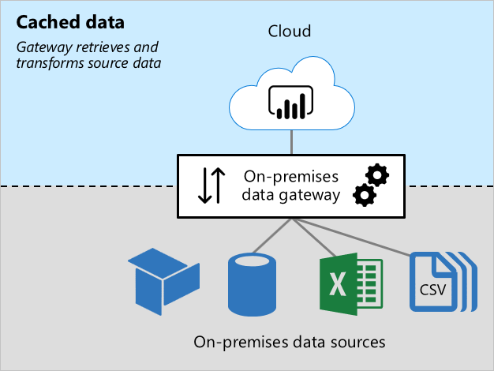
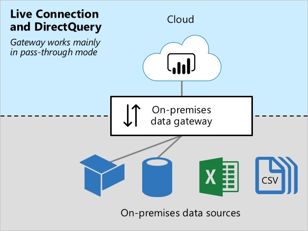

# On-premises data gateway sizing

This article targets Power BI administrators who need to install and manage the [on-premises data gateway](../connect-data/service-gateway-onprem.md).

The gateway is required whenever Power BI must access data that isn't accessible directly over the Internet. It can be installed on a server on-premises, or VM-hosted infrastructure as a service (IaaS).

## Gateway workloads

The on-premises data gateway supports two workloads. It's important you first understand these workloads before we discuss gateway sizing and recommendations.

### Cached data workload

The _Cached data_ workload retrieves and transforms source data for loading into Power BI semantic models ([previously known as datasets](../connect-data/service-datasets-rename.md)). It does so in three steps:

1. **Connection**: The gateway connects to source data.
1. **Data retrieval and transformation**: Data is retrieved, and when necessary, transformed. Whenever possible, the Power Query mashup engine pushes transformation steps to the data source—it's known as _[query folding](power-query-folding.md)_. When it's not possible, transformations must be done by the gateway. In this case, the gateway will consume more CPU and memory resources.
1. **Transfer**: Data is transferred to the Power BI service—a reliable and fast Internet connection is important, especially for large data volumes.

### Live Connection and DirectQuery workloads

The _Live Connection and DirectQuery_ workload works mostly in pass-through mode. The Power BI service sends queries, and the gateway responds with query results. Generally, query results are small in size.

- For more information about Live Connection, see [Semantic models in the Power BI service (Externally-hosted models)](../connect-data/service-datasets-understand.md#external-hosted-models).
- For more information about DirectQuery, see [Semantic model modes in the Power BI service (DirectQuery mode)](../connect-data/service-dataset-modes-understand.md#directquery-mode).

This workload requires CPU resources for routing queries and query results. Usually there's much less demand for CPU than is required by the Cache data workload—especially when it's required to transform data for caching.

Reliable, fast, and consistent connectivity is important to ensure report users have responsive experiences.

## Sizing considerations

Determining the correct sizing for your gateway machine can depend on the following variables:

- **For Cache data workloads:**
  - The number of concurrent semantic model refreshes
  - The types of data sources (relational database, analytic database, data feeds, or files)
  - The volume of data to be retrieved from data sources
  - Any transformations required to be done by the Power Query mashup engine
  - The volume of data to be transferred to the Power BI service
- **For Live Connection and DirectQuery workloads:**
  - The number of concurrent report users
  - The number of visuals on report pages (each visual sends at least one query)
  - The frequency of Power BI dashboard query cache updates
  - The number of real-time reports using the [Automatic page refresh](../create-reports/desktop-automatic-page-refresh.md) feature
  - Whether semantic models enforce [Row-level Security (RLS)](/fabric/security/service-admin-row-level-security)

Generally, Live Connection and DirectQuery workloads require sufficient CPU, while Cache data workloads require more CPU and memory. Both workloads depend on good connectivity with the Power BI service, and the data sources.

> [!NOTE]
> Power BI capacities impose limits on model refresh parallelism, and Live Connection and DirectQuery throughput. There's no point sizing your gateways to deliver more than what the Power BI service supports. Limits differ by Premium SKU (and equivalently sized A SKU). For more information, see [Microsoft Fabric capacity licenses](/fabric/enterprise/licenses#capacity-license) and [What is Power BI Premium? (Capacity nodes)](../enterprise/service-premium-what-is.md#capacities-and-skus).

[!INCLUDE [powerbi-premium-notification](includes/powerbi-premium-notification.md)]

## Recommendations

Gateway sizing recommendations depend on many variables. In this section, we provide you with general recommendations that you can take into consideration.

### Initial sizing

It can be difficult to accurately estimate the right size. We recommend that you start with a machine with at least 8 CPU cores, 8 GB of RAM, and multiple Gigabit network adapters. You can then measure a typical gateway workload by logging CPU and memory system counters. For more information, see [Monitor and optimize on-premises data gateway performance](/data-integration/gateway/service-gateway-performance).

### Connectivity

Plan for the best possible connectivity between the Power BI service and your gateway, and your gateway and the data sources.

- Strive for reliability, fast speeds, and low, consistent latencies.
- Eliminate—or reduce—machine hops between the gateway and your data sources.
- Remove any network throttling imposed by your firewall proxy layer. For more information about Power BI endpoints, see [Add Power BI URLs to your allow list](/fabric/security/power-bi-allow-list-urls).
- Set up [Azure ExpressRoute](/azure/expressroute/expressroute-introduction) to establish private, managed connections to Power BI.
- For data sources in Azure VMs, ensure the VMs are [colocated with the Power BI service](../admin/service-admin-where-is-my-tenant-located.md).
- For Live Connection workloads to SQL Server Analysis Services (SSAS) involving dynamic RLS, ensure good connectivity between the gateway machine and the on-premises Active Directory.

### Clustering

For large-scale deployments, you can create a gateway with multiple cluster members. Clusters avoid single points of failure, and can load balance traffic across gateways. You can:

- Install one or more gateways in a cluster.
- Isolate workloads to standalone gateways, or clusters of gateway servers.

For more information, see [Manage on-premises data gateway high-availability clusters and load balancing](/data-integration/gateway/service-gateway-high-availability-clusters).

### Semantic model design and settings

Semantic model design, and their settings, can impact on gateway workloads. To reduce gateway workload, you can consider the following actions.

For Import semantic models:

- Set up less frequent data refresh.
- Set up [incremental refresh](../connect-data/incremental-refresh-overview.md) to minimize the amount of data to transfer.
- Whenever possible, ensure [query folding](power-query-folding.md) takes place.
- Especially for large data volumes or a need for low-latency results, convert the design to a DirectQuery or [Composite](../connect-data/service-dataset-modes-understand.md#composite-mode) model.

For DirectQuery semantic models:

- Optimize data sources, model, and report designs—for more information, see [DirectQuery model guidance in Power BI Desktop](directquery-model-guidance.md).
- Create [aggregations](../enterprise/aggregations-auto.md) to cache higher-level results to reduce the number of DirectQuery requests.
- Restrict [Automatic page refresh](../create-reports/desktop-automatic-page-refresh.md) intervals, in report designs and capacity settings.
- Especially when dynamic RLS is enforced, restrict dashboard cache update frequency.
- Especially for smaller data volumes or for non-volatile data, convert the design to an Import or [Composite](../connect-data/service-dataset-modes-understand.md#composite-mode) model.

For Live Connection semantic models:

- Especially when dynamic RLS is enforced, restrict dashboard cache update frequency.

## Related content

For more information related to this article, check out the following resources:

- [Power BI implementation planning: Data gateways](powerbi-implementation-planning-data-gateways.md)
- [Guidance for deploying a data gateway for Power BI](../connect-data/service-gateway-deployment-guidance.md)
- [Configure proxy settings for the on-premises data gateway](/data-integration/gateway/service-gateway-proxy)
- [Monitor and optimize on-premises data gateway performance](/data-integration/gateway/service-gateway-performance)
- [Troubleshoot gateways - Power BI](../connect-data/service-gateway-onprem-tshoot.md)
- [Troubleshoot the on-premises data gateway](/data-integration/gateway/service-gateway-tshoot)
- [The importance of query folding](power-query-folding.md)
- Questions? [Try asking the Power BI Community](https://community.powerbi.com/)
- Suggestions? [Contribute ideas to improve Power BI](https://ideas.powerbi.com)
