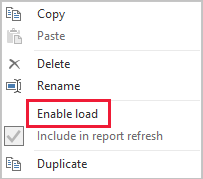

# Data reduction techniques for Import modeling

This article targets Power BI Desktop data modelers developing Import models. It describes different techniques to help reduce the data loaded into Import models.

Import models are loaded with data that is compressed and optimized and then stored to disk by the VertiPaq storage engine. When source data is loaded into memory, it's possible to see 10x compression, and so it's reasonable to expect that 10 GB of source data can compress to about 1 GB in size. Further, when persisted to disk an extra 20% reduction can be achieved.

Despite the efficiencies achieved by the VertiPaq storage engine, it's important that you strive to minimize the data that is to be loaded into your models. It's especially true for large models, or models that you anticipate will grow to become large over time. Four compelling reasons include:

- Larger model sizes may not be supported by your capacity. Shared capacity can host models up to 1 GB in size, while Premium capacities can host larger models depending on the SKU. For further information, read the [Power BI Premium support for large semantic models](../enterprise/service-premium-what-is.md) article. (Semantic models were [previously known as datasets](../connect-data/service-datasets-rename.md).)
- Smaller model sizes reduce contention for capacity resources, in particular memory. It allows more models to be concurrently loaded for longer periods of time, resulting in lower eviction rates.
- Smaller models achieve faster data refresh, resulting in lower latency reporting, higher semantic model refresh throughput, and less pressure on source system and capacity resources.
- Smaller table row counts can result in faster calculation evaluations, which can deliver better overall query performance.

[!INCLUDE [powerbi-premium-notification](includes/powerbi-premium-notification.md)]

There are eight different data reduction techniques covered in this article. These techniques include:

- [Remove unnecessary columns](#remove-unnecessary-columns)
- [Remove unnecessary rows](#remove-unnecessary-rows)
- [Group by and summarize](#group-by-and-summarize)
- [Optimize column data types](#optimize-column-data-types)
- [Preference for custom columns](#preference-for-custom-columns)
- [Disable Power Query query load](#disable-power-query-query-load)
- [Disable auto date/time](#disable-auto-datetime)
- [Switch to Mixed mode](#switch-to-mixed-mode)

## Remove unnecessary columns

Model table columns serve two main purposes:

- **Reporting**, to achieve report designs that appropriate filter, group, and summarize model data
- **Model structure**, by supporting model relationships, model calculations, security roles, and even data color formatting

Columns that don't serve these purposes can probably be removed. Removing columns is referred to as _vertical filtering_.

We recommend that you design models with exactly the right number of columns based on the known reporting requirements. Your requirements may change over time, but bear in mind that it's easier to add columns later than it's to remove them later. Removing columns can break reports or the model structure.

## Remove unnecessary rows

Model tables should be loaded with as few rows as possible. It can be achieved by loading filtered rowsets into model tables for two different reasons: to filter by entity or by time. Removing rows is referred to as _horizontal filtering_.

**Filtering by entity** involves loading a subset of source data into the model. For example, instead of loading sales facts for all sales regions, only load facts for a single region. This design approach will result in many smaller models, and it can also eliminate the need to define row-level security (but will require granting specific semantic model permissions in the Power BI service, and creating "duplicate" reports that connect to each semantic model). You can leverage the use of Power Query parameters and Power BI Template files to simplify management and publication. For further information, read the [Deep Dive into Query Parameters and Power BI Templates](https://powerbi.microsoft.com/blog/deep-dive-into-query-parameters-and-power-bi-templates/) blog entry

**Filtering by time** involves limiting the amount of _data history_ loaded into fact-type tables (and limiting the date rows loaded into the model date tables). We suggest you don't automatically load all available history, unless it's a known reporting requirement. It's helpful to understand that time-based Power Query filters can be parameterized, and even set to use relative time periods (relative to the refresh date, for example, the past five years). Also, bear in mind that retrospective changes to time filters won't break reports; it will just result in less (or more) data history available in reports.

## Group by and summarize

Perhaps the most effective technique to reduce a model size is to load pre-summarized data. This technique can be used to raise the grain of fact-type tables. There's a distinct trade-off, however, resulting in loss of detail.

For example, a source sales fact table stores one row per order line. Significant data reduction could be achieved by summarizing all sales metrics, grouping by date, customer, and product. Consider then that an even more significant data reduction could be achieved by grouping by date _at month level_. It could achieve a possible 99% reduction in model size, but reporting at day level—or individual order level—is no longer possible. Deciding to summarize fact-type data always involves tradeoffs. Tradeoff could be mitigated by a Mixed model design, and this option is described in the [Switch to Mixed mode](#switch-to-mixed-mode) technique.

## Optimize column data types

The VertiPaq storage engine uses separate data structures for each column. By design, these data structures achieve the highest optimizations for numeric column data, which use value encoding. Text and other non-numeric data, however, uses hash encoding. It requires the storage engine to assign a numeric identifier to each unique text value contained in the column. It's the numeric identifier, then, that is then stored in the data structure, requiring a hash lookup during storage and querying.

In some specific instances, you can convert source text data into numeric values. For example, a sales order number may be consistently prefixed by a text value (for example "SO123456"). The prefix could be removed, and the order number value converted to whole number. For large tables, it can result in significant data reduction, especially when the column contains unique or high cardinality values.

In this example, we recommend that you set the column Default Summarization property to "Do Not Summarize". It helps to minimize the inappropriate summarization of the order number values.

## Preference for custom columns

The VertiPaq storage engine stores model calculated columns (defined in DAX) just like regular Power Query-sourced columns. However, the data structures are stored slightly differently, and typically achieve less efficient compression. Also, they're built once all Power Query tables are loaded, which can result in extended data refresh times. It's therefore less efficient to add table columns as _calculated_ columns than Power Query _computed_ columns (defined in M).

Preference should be creating custom columns in Power Query. When the source is a database, you can achieve greater load efficiency in two ways. The calculation can be defined in the SQL statement (using the native query language of the provider), or it can be materialized as a column in the data source.

However, in some instances, model calculated columns may be the better choice. It can be the case when the formula involves evaluating measures, or it requires specific modeling functionality only supported in DAX functions. For information on one such example, refer to the [Understanding functions for parent-child hierarchies in DAX](/dax/understanding-functions-for-parent-child-hierarchies-in-dax) article.

## Disable Power Query query load

Power Query queries that are intended support data integration with other queries shouldn't be loaded to the model. To avoid loading the query to the model, take care to ensure that you disable query load in these instances.

## Disable auto date/time

Power BI Desktop includes an option called _Auto date/time_. When enabled, it creates a hidden auto date/time table for date columns to support report authors when configuring filters, grouping, and drill-down actions for calendar time periods. The hidden tables are in fact calculated tables that will increase the size of the model. For guidance about using this option, refer to the [Auto date/time guidance in Power BI Desktop](../transform-model/desktop-auto-date-time.md) article.

## Switch to Mixed mode

In Power BI Desktop, a Mixed mode design produces a Composite model. Essentially, it allows you to determine storage mode _for each table_. Therefore, each table can have its Storage Mode property set as Import or DirectQuery (Dual is another option).

An effective technique to reduce the model size is to set the Storage Mode property for larger fact-type tables to DirectQuery. Consider that this design approach could work well in conjunction with the [Group by and summarize](#group-by-and-summarize) technique introduced earlier. For example, summarized sales data could be used to achieve high performance "summary" reporting. A drill through page could display granular sales for specific (and narrow) filter context, displaying all in-context sales orders. In this example, the drillthrough page would include visuals based on a DirectQuery table to retrieve the sales order data.

There are, however, many security and performance implications related to Composite models. For further information, read the [Use composite models in Power BI Desktop](../transform-model/desktop-composite-models.md) article.

## Related content

For more information about Power BI Import model design, see the following articles:

- [Use composite models in Power BI Desktop](../transform-model/desktop-composite-models.md)
- [Storage mode in Power BI Desktop](../transform-model/desktop-storage-mode.md)
- Questions? [Try asking the Power BI Community](https://community.powerbi.com/)
