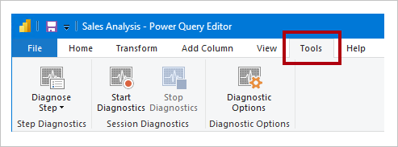

# Monitor report performance in Power BI

Monitor report performance in Power BI Desktop using the [Performance Analyzer](../create-reports/desktop-performance-analyzer.md). Monitoring will help you learn where the bottlenecks are, and how you can improve report performance.

Monitoring performance is relevant in the following situations:

- Your Import data model refresh is slow.
- Your DirectQuery or Live Connection reports are slow.
- Your model calculations are slow.

Slow queries or report visuals should be a focal point of continued optimization.


> [!NOTE]
> The Performance Analyzer cannot be used to monitor Premium Per User (PPU) activities or capacity.

## Use Query Diagnostics

Use [Query Diagnostics](/power-query/QueryDiagnostics) in Power BI Desktop to determine what Power Query is doing when previewing or applying queries. Further, use the _Diagnose Step_ function to record detailed evaluation information for each query step. The results are made available in a Power Query, and you can apply transformations to better understand query execution.



## Use Performance Analyzer

Use [Performance Analyzer](../create-reports/desktop-performance-analyzer.md) in Power BI Desktop to find out how each of your report elements—such as visuals and DAX formulas—are doing. It's especially useful to determine whether it's the query or visual rendering that's contributing to performance issues.

## Use SQL Server Profiler

You can also use [SQL Server Profiler](/sql/tools/sql-server-profiler/sql-server-profiler) to identify queries that are slow.

> [!NOTE]
> SQL Server Profiler is available as part of [SQL Server Management Studio](/sql/ssms/download-sql-server-management-studio-ssms).

Use SQL Server Profiler when your data source is either:

- SQL Server
- SQL Server Analysis Services
- Azure Analysis Services

> [!CAUTION]
> Power BI Desktop supports connecting to a diagnostics port. The diagnostic port allows for other tools to make connections to perform traces for diagnostic purposes. Making any changes to the Power Desktop data model is supported [only for specific operations](/power-bi/transform-model/desktop-external-tools#supported-write-operations). Other changes to the data model with operations that aren't supported may lead to corruption and data loss.

To create a SQL Server Profiler trace, follow these instructions:

1. Open your Power BI Desktop report (so it will be easy to locate the port in the next step, close any other open reports).
1. To determine the port being used by Power BI Desktop, in PowerShell (with administrator privileges), or at the Command Prompt, enter the following command:
    ```powershell
    netstat -b -n
    ```
    The output will be a list of applications and their open ports. Look for the port used by **msmdsrv.exe**, and record it for later use. It's your instance of Power BI Desktop.
1. To connect SQL Server Profiler to your Power BI Desktop report:
    1. Open SQL Server Profiler.
    1. In SQL Server Profiler, on the _File_ menu, select _New Trace_.
    1. For **Server Type**, select _Analysis Services_.
    1. For **Server Name**, enter _localhost:[port recorded earlier]_.
    1. Click _Run_—now the SQL Server Profiler trace is live, and is actively profiling Power BI Desktop queries.
1. As Power BI Desktop queries are executed, you'll see their respective durations and CPU times. Depending on the data source type, you may see other events indicating how the query was executed. Using this information, you can determine which queries are the bottlenecks.

A benefit of using SQL Server Profiler is that it's possible to save a SQL Server (relational) database trace. The trace can become an input to the [Database Engine Tuning Advisor](/sql/relational-databases/performance/start-and-use-the-database-engine-tuning-advisor). This way, you can receive recommendations on how to tune your data source.

## Monitor Premium metrics

Monitor performance of content deployed into your organization's Power BI Premium capacity with the help of the [Microsoft Fabric Capacity Metrics app](/fabric/enterprise/metrics-app).

## Related content

For more information about this article, check out the following resources:

- [Query Diagnostics](/power-query/QueryDiagnostics)
- [Performance Analyzer](../create-reports/desktop-performance-analyzer.md)
- [Troubleshoot report performance in Power BI](report-performance-troubleshoot.md)
- Questions? [Try asking the Power BI Community](https://community.powerbi.com/)
- Suggestions? [Contribute ideas to improve Power BI](https://ideas.powerbi.com/)
