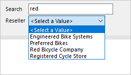

# Use cascading parameters in paginated reports

This article targets you as a report author designing Power BI [paginated reports](../paginated-reports/paginated-reports-report-builder-power-bi.md). It provides scenarios for designing cascading parameters. Cascading parameters are report parameters with dependencies. When a report user selects a parameter value (or values), it's used to set available values for another parameter.

> [!NOTE]
> An introduction to cascading parameters, and how to configure them, isn't covered in this article. If you're not completely familiar with cascading parameters, we recommend you first read [Add Cascading Parameters to a Report in Power BI Report Builder](../paginated-reports/parameters/add-cascading-parameters-report-builder.md).

## Design scenarios

There are two design scenarios for using cascading parameters. They can be effectively used to:

- Filter _large sets_ of items
- Present _relevant_ items

### Example database

The examples presented in this article are based on an Azure SQL Database. The database records sales operations, and contains various tables storing resellers, products, and sales orders.

A table named **Reseller** stores one record for each reseller, and it contains many thousands of records. The **Reseller** table has these columns:

- ResellerCode (integer)
- ResellerName
- Country-Region
- State-Province
- City
- PostalCode

There's a table named **Sales**, too. It stores sales order records, and has a foreign key relationship to the **Reseller** table, on the **ResellerCode** column.

### Example requirement

There's a requirement to develop a Reseller Profile report. The report must be designed to display information for a single reseller. It's not appropriate to have the report user enter a reseller code, as they rarely memorize them.

## Filter large sets of items

Let's take a look at three examples to help you limit large sets of available items, like resellers. They are:

- [Filter by related columns](#filter-by-related-columns)
- [Filter by a grouping column](#filter-by-a-grouping-column)
- [Filter by search pattern](#filter-by-search-pattern)

### Filter by related columns

In this example, the report user interacts with five report parameters. They must select country-region, state-province, city, and then postal code. A final parameter then lists resellers that reside in that geographic location.


Here's how you can develop the cascading parameters:

1. Create the five report parameters, ordered in the correct sequence.
2. Create the **CountryRegion** dataset that retrieves distinct country-region values, using the following query statement:

    ```sql
    SELECT DISTINCT
      [Country-Region]
    FROM
      [Reseller]
    ORDER BY
      [Country-Region]
    ```

3. Create the **StateProvince** dataset that retrieves distinct state-province values for the selected country-region, using the following query statement:

    ```sql
    SELECT DISTINCT
      [State-Province]
    FROM
      [Reseller]
    WHERE
      [Country-Region] = @CountryRegion
    ORDER BY
      [State-Province]
    ```

4. Create the **City** dataset that retrieves distinct city values for the selected country-region and state-province, using the following query statement:

    ```sql
    SELECT DISTINCT
      [City]
    FROM
      [Reseller]
    WHERE
      [Country-Region] = @CountryRegion
      AND [State-Province] = @StateProvince
    ORDER BY
      [City]
    ```

5. Continue this pattern to create the **PostalCode** dataset.
6. Create the **Reseller** dataset to retrieve all resellers for the selected geographic values, using the following query statement:

    ```sql
    SELECT
      [ResellerCode],
      [ResellerName]
    FROM
      [Reseller]
    WHERE
      [Country-Region] = @CountryRegion
      AND [State-Province] = @StateProvince
      AND [City] = @City
      AND [PostalCode] = @PostalCode
    ORDER BY
      [ResellerName]
    ```

7. For each dataset except the first, map the query parameters to the corresponding report parameters.

> [!NOTE]
> All query parameters (prefixed with the @ symbol) shown in these examples could be embedded within SELECT statements, or passed to stored procedures.
>
> Generally, stored procedures are a better design approach. It's because their query plans are cached for quicker execution, and they allow you develop more sophisticated logic, when needed. However, they aren't currently supported for gateway relational data sources, which means SQL Server, Oracle, and Teradata.
>
> Lastly, you should always ensure suitable indexes exist to support efficient data retrieval. Otherwise, your report parameters could be slow to populate, and the database could become overburdened. For more information about SQL Server indexing, see [SQL Server Index Architecture and Design Guide](/sql/relational-databases/sql-server-index-design-guide).

### Filter by a grouping column

In this example, the report user interacts with a report parameter to select the first letter of the reseller. A second parameter then lists resellers when the name commences with the selected letter.


Here's how you can develop the cascading parameters:

1. Create the **ReportGroup** and **Reseller** report parameters, ordered in the correct sequence.
2. Create the **ReportGroup** dataset to retrieve the first letters used by all resellers, using the following query statement:

    ```sql
    SELECT DISTINCT
      LEFT([ResellerName], 1) AS [ReportGroup]
    FROM
      [Reseller]
    ORDER BY
      [ReportGroup]
    ```

3. Create the **Reseller** dataset to retrieve all resellers that commence with the selected letter, using the following query statement:

    ```sql
    SELECT
      [ResellerCode],
      [ResellerName]
    FROM
      [Reseller]
    WHERE
      LEFT([ResellerName], 1) = @ReportGroup
    ORDER BY
      [ResellerName]
    ```

4. Map the query parameter of the **Reseller** dataset to the corresponding report parameter.

It's more efficient to add the grouping column to the **Reseller** table. When persisted and indexed, it delivers the best result. For more information, see [Specify Computed Columns in a Table](/sql/relational-databases/tables/specify-computed-columns-in-a-table).

```sql
ALTER TABLE [Reseller]
ADD [ReportGroup] AS LEFT([ResellerName], 1) PERSISTED
```

This technique can deliver even greater potential. Consider the following script that adds a new grouping column to filter resellers by _pre-defined bands of letters_. It also creates an index to efficiently retrieve the data required by the report parameters.

```sql
ALTER TABLE [Reseller]
ADD [ReportGroup2] AS CASE
  WHEN [ResellerName] LIKE '[A-C]%' THEN 'A-C'
  WHEN [ResellerName] LIKE '[D-H]%' THEN 'D-H'
  WHEN [ResellerName] LIKE '[I-M]%' THEN 'I-M'
  WHEN [ResellerName] LIKE '[N-S]%' THEN 'N-S'
  WHEN [ResellerName] LIKE '[T-Z]%' THEN 'T-Z'
  ELSE '[Other]'
END PERSISTED
GO

CREATE NONCLUSTERED INDEX [Reseller_ReportGroup2]
ON [Reseller] ([ReportGroup2]) INCLUDE ([ResellerCode], [ResellerName])
GO
```

### Filter by search pattern

In this example, the report user interacts with a report parameter to enter a search pattern. A second parameter then lists resellers when the name contains the pattern.



Here's how you can develop the cascading parameters:

1. Create the **Search** and **Reseller** report parameters, ordered in the correct sequence.
2. Create the **Reseller** dataset to retrieve all resellers that contain the search text, using the following query statement:

    ```sql
    SELECT
      [ResellerCode],
      [ResellerName]
    FROM
      [Reseller]
    WHERE
      [ResellerName] LIKE '%' + @Search + '%'
    ORDER BY
      [ResellerName]
    ```

3. Map the query parameter of the **Reseller** dataset to the corresponding report parameter.

> [!TIP]
> You can improve upon this design to provide more control for your report users. It lets them define their own pattern matching value. For example, the search value "red%" will filter to resellers with names that _commence_ with the characters "red".
>
> For more information, see [LIKE (Transact-SQL)](/sql/t-sql/language-elements/like-transact-sql#using-the--wildcard-character).

Here's how you can let the report users define their own pattern.

```sql
WHERE
  [ResellerName] LIKE @Search
```

Many non-database professionals, however, don't know about the percentage (%) wildcard character. Instead, they're familiar with the asterisk (*) character. By modifying the WHERE clause, you can let them use this character.

```sql
WHERE
  [ResellerName] LIKE SUBSTITUTE(@Search, '%', '*')
```

## Present relevant items

In this scenario, you can use fact data to limit available values. Report users will be presented with items where activity has been recorded.

In this example, the report user interacts with three report parameter. The first two set a date range of sales order dates. The third parameter then lists resellers where orders have been created during that time period.


Here's how you can develop the cascading parameters:

1. Create the **OrderDateStart**, **OrderDateEnd**, and **Reseller** report parameters, ordered in the correct sequence.
2. Create the **Reseller** dataset to retrieve all resellers that created orders in the date period, using the following query statement:

    ```sql
    SELECT DISTINCT
      [r].[ResellerCode],
      [r].[ResellerName]
    FROM
      [Reseller] AS [r]
    INNER JOIN [Sales] AS [s]
      ON [s].[ResellerCode] = [r].[ResellerCode]
    WHERE
      [s].[OrderDate] >= @OrderDateStart
      AND [s].[OrderDate] < DATEADD(DAY, 1, @OrderDateEnd)
    ORDER BY
      [r].[ResellerName]
    ```

## Recommendations

We recommend you design your reports with cascading parameters, whenever possible. It's because they:

- Provide intuitive and helpful experiences for your report users
- Are efficient, because they retrieve smaller sets of available values

Be sure to optimize your data sources by:

- Using stored procedures, whenever possible
- Adding appropriate indexes for efficient data retrieval
- Materializing column values—and even rows—to avoid expensive query-time evaluations

## Related content

For more information related to this article, check out the following resources:

- [Report parameters in Power BI Report Builder](../paginated-reports/parameters/report-builder-parameters.md)
- [Add Cascading Parameters to a Report (Report Builder)](../paginated-reports/parameters/add-cascading-parameters-report-builder.md)
- Questions? [Try asking the Power BI Community](https://community.powerbi.com/)
- Suggestions? [Contribute ideas to improve Power BI](https://ideas.powerbi.com)
