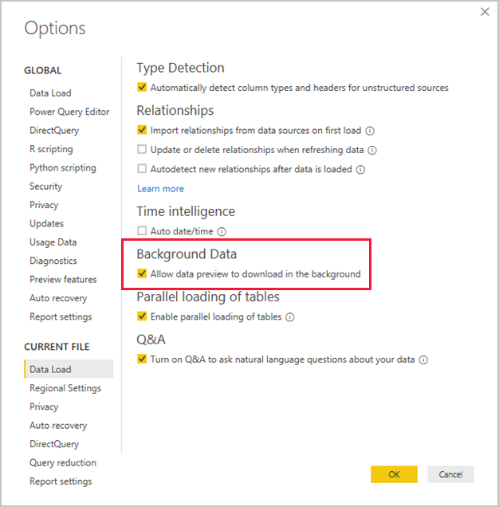
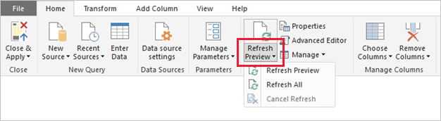

# Power Query: Disable background refresh

This article targets Import data modelers working with Power BI Desktop.

## Background

By default, when Power Query imports data it also caches up to 1000 rows of preview data for each query. The preview data helps to present you with a quick preview of source data and of transformation results for each step of your queries. It is stored separately on-disk and not inside the Power BI Desktop file.

However, when your Power BI Desktop file contains many queries, retrieving and storing preview data can extend the time it takes to complete a refresh.

## Recommendation

You can achieve a faster refresh by setting the Power BI Desktop file to update the preview cache in the background. In Power BI Desktop select File > Options and settings > Options, and then select the Data Load page. Then turn on the **Allow data preview to download in the background** option. Note that this option can only be set for the current file.

Turning on this option can result in the preview data becoming out of date. When this occurs, the Power Query Editor will notify you with a warning like the following:

It is always possible to update the preview cache for a single query or for all queries by using the **Refresh Preview** command on the **Home** ribbon of the Power Query Editor window.

