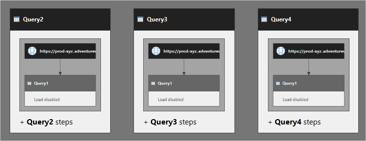

# Referencing Power Query queries

This article targets you as a data modeler working with Power BI Desktop. The focus of this article provides guidance when defining Power Query queries that reference other queries. A referenced query is one that uses the output of another query as its source.

Consider several queries: **Query1** sources data from a web service, and its load is disabled. **Query2**, **Query3**, and **Query4** all reference **Query1**, and their outputs are loaded to the data model.

When the data model is refreshed, it's often assumed that Power Query retrieves the **Query1** result, and that it's reused by referenced queries. This thinking is incorrect. In fact, Power Query executes **Query2**, **Query3**, and **Query4** separately.

You can think that **Query2** has the **Query1** _step logic_ embedded within it. It's the case for **Query3** and **Query4**, too. The following diagram presents a clearer picture of how the queries are executed.

**Query1** is executed three times. The multiple executions can result in slow data refresh, and negatively impact on the data source.

The use of the [Table.Buffer](/powerquery-m/table-buffer) function in **Query1** won't eliminate the additional data retrieval. This function buffers a table to memory. The buffered table can only be used within the _same_ query. So, in the example, if **Query1** were buffered, **Query2**, **Query3**, and **Query4** couldn't use it. It could in fact compound the negative performance, because the table will be buffered by each referencing queries.

> [!NOTE]
> Power Query caching is a complex, and it's not the focus of this article. Power Query can cache data retrieved from a data source. However, when it executes a query, it may retrieve the data from the data source more than once.

## Recommendations

Generally, we recommend you reference queries to avoid the duplication of logic across your queries. However, as discussed in this article, this design approach can contribute to slow data refreshes, and overburden data sources.

We recommend you create a [dataflow](../service-dataflows-overview.md) instead. Using a dataflow can improve data refresh time, and reduce impact on your data sources.

You can design the dataflow to encapsulate the source data and transformations. As the dataflow is a persisted store of data in the Power BI service, its data retrieval is fast. So, even when referencing queries result in multiple requests for the dataflow, data refresh times can be improved.

In the example, **Query1** could import from the dataflow. **Query2**, **Query3**, and **Query4** could reference **Query1**.

## Next steps

For more information related to this article, check out the following resources:

- [Self-service data prep in Power BI](../service-dataflows-overview.md)
- [Creating and using dataflows in Power BI](../service-dataflows-create-use.md)
- Guy in a Cube video: [Inside Power Query reference queries for Power BI and Excel](https://www.youtube.com/watch?v=3uKNNZqBIkg)
- Questions? [Try asking the Power BI Community](https://community.powerbi.com/)
