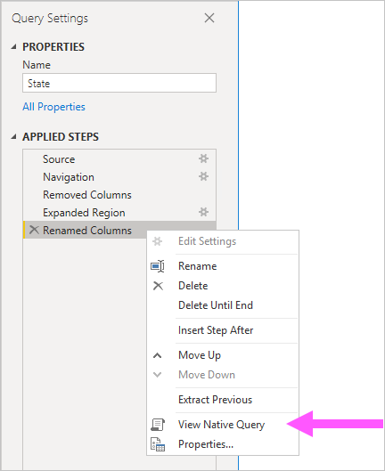
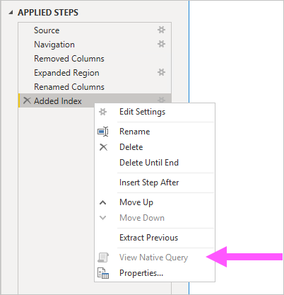

# The Importance of Query Folding

This article targets data modelers developing models in Power BI Desktop. It describes what query folding is, and why it is important. It also describes the data sources and transformations that may achieve query folding, and how to determine that your Power Query queries can be folded, whether fully or partially. Lastly, it provides best practice guidance on when and how to achieve query folding.

## Background

Query folding is the ability for a Power Query query to generate a single query statement to retrieve and transform source data. The Power Query mashup engine strives to achieve query folding whenever possible as it results in the most efficient path to connect a Power BI model table to its underlying data source.

Query folding is an important topic for data modeling for several reasons:

- **Import model tables:** Data refresh will take place efficiently for Import model tables, in terms of resource utilization and refresh duration
- **DirectQuery and Dual storage mode tables:** Each DirectQuery and Dual storage mode table must be based on a Power Query query that can be folded
- **Incremental refresh:** Incremental data refresh will be efficient, in terms of resource utilization and refresh duration. In fact, the Incremental Refresh configuration window will notify you of a warning should it detects that query folding for the table cannot be achieved. If it cannot be achieved, the objective of incremental refresh is defeated. The mashup engine would then be required to retrieve all source rows, and then apply filters to isolate incremental changes.

Query folding may occur for an entire Power Query query, or for a subset of its steps. When query folding cannot be achieved—either partially or fully—the Power Query mashup engine in Power BI must compensate by processing data transformations itself. This could involve retrieving source query results, which for large datasets is very resource intensive and slow.

We recommend that data modelers strive to achieve efficiency in their Import model designs by ensuring query folding occurs whenever possible.

## Sources that support query folding

Most data sources that have the concept of a query language support query folding. These can include relational databases, OData feeds (including SharePoint lists), Exchange and Active Directory. However, data sources like flat files, blobs, and web typically do not.

## Transformations that can achieve query folding

Relational data source transformations that can be query folded are those that can be written as a single SELECT statement. A SELECT statement can be constructed with appropriate WHERE, GROUP BY and JOIN clauses. It can also contain column expressions (calculations) that use common built-in functions supported by SQL databases.

Generally, the following bulleted list describes transformations that can be query folded.

- Removing columns
- Renaming columns (SELECT column aliases)
- Filtering rows, with static values or Power Query parameters (WHERE clause predicates)
- Grouping and summarizing (GROUP BY clause)
- Expanding record columns (source foreign key columns) to achieve a join of two source tables (JOIN clause)
- Non-fuzzy merging of fold-able queries based on the same source (JOIN clause)
- Appending fold-able queries based on the same source (UNION ALL operator)
- Adding custom columns with _simple logic_ (SELECT column expressions). Simple logic implies the use of M functions that have equivalent functions in the SQL data source, like mathematic, or text manipulation functions.
- Pivoting and unpivoting (PIVOT and UNPIVOT operators)

## Transformations that prevent query folding

Generally, the following bulleted list describes transformations that prevent query folding. This is not intended to be an exhaustive list.

- Merging queries based on different sources
- Appending (union-ing) queries based on different sources
- Adding custom columns with _complex logic_. Complex logic implies the use of M functions that have no equivalent functions in the data source
- Adding index columns
- Changing a column data type

Note that when a Power Query query encompasses multiple data sources, incompatibility of data source privacy levels can prevent query folding from taking place. For more information, read the [Power BI Desktop privacy levels](../desktop-privacy-levels) article.

## Determining when a query can be folded

In the Power Query Editor window, it is possible to determine when a Power Query query can be folded. In the **Query Settings** pane, when you right-click the last applied step, if the **View Native Query** option is enabled (not greyed out), then the query can be folded.

To view the folded query, go ahead and select the **View Native Query** option. You will then be presented with the native query that Power Query will use to source data.

If the **View Native Query** option is not enabled (greyed out), this is evidence that all query steps cannot be folded. However, it could mean that a subset of steps can still be folded. Working backwards from the last step, you can check each step to see if the **View Native Query** option becomes enabled. If this is the case, then you have learned where, in the sequence of steps, query folding could no longer be achieved.

## Best practice guidance

In short, for a DirectQuery or Dual storage mode table, the Power Query query must achieve query folding. For an Import table based on a relational source and when a single SELECT statement can be constructed, _best data refresh performance_ is achieved by ensuring that query folding occurs. If the mashup engine is still required to process transformations, you should strive to minimize the work it needs to do, especially for large datasets.

The following bulleted list provides best practice guidance.

- **Delegate as much processing to the data source as possible:** When all steps of a Power Query query cannot be folded, discover the step that prevents query folding. When possible, move subsequent steps earlier in sequence so they may be factored into the query folding. Note that the Power Query mashup engine may be smart enough to reorder your query steps when it generates the source query.

For a relational data source, if the step that prevents query folding could be achieved in a single SELECT statement, or within the procedural logic of a stored procedure, consider using a native query statement, as described next.

- **Use a native SQL query:** When a Power Query query retrieves data from a relational source, it is possible to use a native SQL query. The query can in fact be any valid statement, including a stored procedure execution. If the statement produces multiple result sets, only the first will be returned. Parameters can be declared in the statement, and we recommend that you use the [Value.NativeQuery](../powerquery-m/value-nativequery) M function to safely and conveniently pass parameter values. Note that if the Power Query query is for a DirectQuery model table, the query must be a SELECT statement, and it cannot use Common Table Expressions (CTEs).

>>> [!IMPORTANT]
>>> A native query can potentially do more than retrieve data. Any valid statement can be executed, including one that modifies or deletes data. It is important to apply the principle of least privilege to ensure that the account used to access the database has only read permission on required data.

- **Prepare and transformation data in the source:** If you identify that certain Power Query query steps cannot be folded, it may be possible to apply the transformations in the data source. This could be achieved by writing a database view that logically transforms source data, or by physically preparing and materializing data, in advance of Power BI querying it. A relational data warehouse is an excellent example of prepared data, usually consisting of pre-integrated sources of organizational data.

## Next steps

For more information about Query Folding and related topic, check out the following resources:

- [Use composite models in Power BI Desktop](../desktop-composite-models)
- [Incremental refresh in Power BI Premium](../service-premium-incremental-refresh)
- [Using Table.View to Implement Query Folding](../power-query/handlingqueryfolding)
- Questions? [Try asking the Power BI Community](https://community.powerbi.com/)