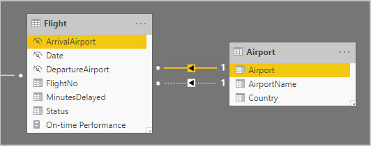
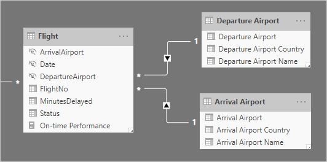
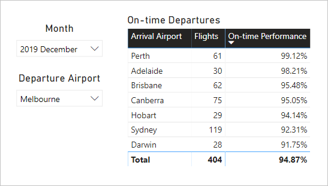
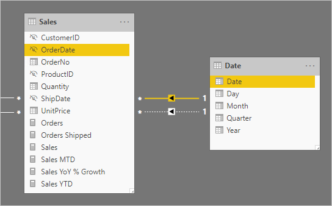
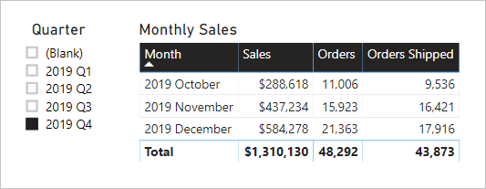

# Active vs inactive relationship guidance

This article targets you as a data modeler working with Power BI Desktop. It provides you with guidance on when to create active or inactive model relationships. By default, active relationships propagate filters to other tables. Inactive relationship, however, only propagate filters when a DAX expression activates (uses) the relationship.

[!INCLUDE [relationships-prerequisite-reading](includes/relationships-prerequisite-reading.md)]

## Active relationships

Generally, we recommend defining active relationships whenever possible. They widen the scope and potential of how your model can be used by report authors, and users working with Q&A.

Consider an example of an Import model designed to analyze airline flight on-time performance (OTP). The model has a **Flight** table, which is a fact-type table storing one row per flight. Each row records the flight date, flight number, departure and arrival airports, and any delay time (in minutes). There's also an **Airport** table, which is a dimension-type table storing one row per airport. Each row describes the airport code, airport name, and the country or region.

Here's a partial model diagram of the two tables.



There are two model relationships between the **Flight** and **Airport** tables. In the **Flight** table, the **DepartureAirport** and **ArrivalAirport** columns relate to the **Airport** column of the **Airport** table. In star schema design, the **Airport** table is described as a [role-playing dimension](star-schema.md#role-playing-dimensions). In this model, the two roles are _departure airport_ and _arrival airport_.

While this design works well for relational star schema designs, it doesn't for Power BI models. It's because model relationships are paths for filter propagation, and these paths must be deterministic. For more information on ensuring that filter propagation paths are deterministic see [resolve relationship path ambiguity](../transform-model/desktop-relationships-understand.md#resolve-relationship-path-ambiguity).Therefore—as described in this example—one relationship is active while the other is inactive (represented by the dashed line). Specifically, it's the relationship to the **ArrivalAirport** column that's active. This means filters applied to the **Airport** table automatically propagate to the **ArrivalAirport** column of the **Flight** table.

This model design imposes severe limitations on how the data can be reported. Specifically, it's not possible to filter the **Airport** table to automatically isolate flight details for a departure airport. As reporting requirements involve filtering (or grouping) by departure and arrival airports _at the same time_, two active relationships are needed. Translating this requirement into a Power BI model design means the model must have two airport tables.

Here's the improved model design.



The model now has two airport tables: **Departure Airport** and **Arrival Airport**. The model relationships between these tables and the **Flight** table are active. Notice also that the column names in the **Departure Airport** and **Arrival Airport** tables are prefixed with the word _Departure_ or _Arrival_.

The improved model design supports producing the following report design.



The report page filters by Melbourne as the departure airport, and the table visual groups by arrival airports.

> [!NOTE]
> For Import models, the additional table has resulted in an increased model size, and longer refresh times. As such, it contradicts the recommendations described in the [Data reduction techniques for Import modeling](import-modeling-data-reduction.md) article. However, in the example, the requirement to have only active relationships overrides these recommendations.
>
> Further, it's common that dimension-type tables contain low row counts relative to fact-type table row counts. So, the increased model size and refresh times aren't likely to be excessively large.

### Refactoring methodology

Here's a methodology to refactor a model from a single role-playing dimension-type table, to a design with _one table per role_.

1. Remove any inactive relationships.
2. Consider renaming the role-playing dimension-type table to better describe its role. In the example, the **Airport** table is related to the **ArrivalAirport** column of the **Flight** table, so it's renamed as **Arrival Airport**.
3. Create a copy of the role-playing table, providing it with a name that reflects its role. If it's an Import table, we recommend defining a calculated table. If it's a DirectQuery table, you can duplicate the Power Query query.

    In the example, the **Departure Airport** table was created by using the following calculated table definition.

    ```dax
    Departure Airport = 'Arrival Airport'
    ```

4. Create an active relationship to relate the new table.
5. Consider renaming the columns in the tables so they accurately reflect their role. In the example, all columns are prefixed with the word _Departure_ or _Arrival_. These names ensure report visuals, by default, will have self-describing and non-ambiguous labels. It also improves the Q&A experience, allowing users to easily write their questions.
6. Consider adding descriptions to role-playing tables. (In the **Fields** pane, a description appears in a tooltip when a report author hovers their cursor over the table.) This way, you can communicate any additional filter propagation details to your report authors.

## Inactive relationships

In specific circumstances, inactive relationships can address special reporting needs.

Let's now consider different model and reporting requirements:

- A sales model contains a **Sales** table that has two date columns: **OrderDate** and **ShipDate**
- Each row in the **Sales** table records a single order
- Date filters are almost always applied to the **OrderDate** column, which always stores a valid date
- Only one measure requires date filter propagation to the **ShipDate** column, which can contain BLANKs (until the order is shipped)
- There's no requirement to simultaneously filter (or group by) order _and_ ship date periods

Here's a partial model diagram of the two tables.



There are two model relationships between the **Sales** and **Date** tables. In the **Sales** table, the **OrderDate** and **ShipDate** columns relate to the **Date** column of the **Date** table. In this model, the two roles for the **Date** table are _order date_ and _ship date_. It's the relationship to the **OrderDate** column that's active.

All of the six measures—except one—must filter by the **OrderDate** column. The **Orders Shipped** measure, however, must filter by the **ShipDate** column.

Here's the **Orders** measure definition. It simply counts the rows of the **Sales** table within the filter context. Any filters applied to the **Date** table will propagate to the **OrderDate** column.

```dax
Orders = COUNTROWS(Sales)
```

Here's the **Orders Shipped** measure definition. It uses the [USERELATIONSHIP](/dax/userelationship-function-dax) DAX function, which activates filter propagation for a specific relationship only during the evaluation of the expression. In this example, the relationship to the **ShipDate** column is used.

```dax
Orders Shipped =
CALCULATE(
    COUNTROWS(Sales)
    ,USERELATIONSHIP('Date'[Date], Sales[ShipDate])
)
```

This model design supports producing the following report design.



The report page filters by quarter 2019 Q4. The table visual groups by month and displays various sales statistics. The **Orders** and **Orders Shipped** measures produce different results. They each use the same summarization logic (count rows of the **Sales** table), but different **Date** table filter propagation.

Notice that the quarter slicer includes a BLANK item. This slicer item appears as a result of [table expansion](../transform-model/desktop-relationships-understand.md#regular-relationships). While each **Sales** table row has an order date, some rows have a BLANK ship date—these orders are yet to be shipped. Table expansion considers inactive relationships too, and so BLANKs can appear due to BLANKs on the many-side of the relationship, or due to data integrity issues.

> [!NOTE]
> Row-level security filters only propagate through active relationships. Row-level security filters will not propagate for inactive relationships even if UseRelationship is added explicitly to a measure definition.

## Recommendations

In summary, we recommend defining active relationships whenever possible, especially when row-level security roles are defined for your data model. They widen the scope and potential of how your model can be used by report authors, and users working with Q&A. It means that role-playing dimension-type tables should be duplicated in your model.

In specific circumstances, however, you can define one or more inactive relationships for a role-playing dimension-type table. You can consider  this design when:

- There's no requirement for report visuals to simultaneously filter by different roles
- You use the USERELATIONSHIP DAX function to activate a specific relationship for relevant model calculations

## Related content

For more information related to this article, check out the following resources:

- [Model relationships in Power BI Desktop](../transform-model/desktop-relationships-understand.md)
- [Understand star schema and the importance for Power BI](star-schema.md)
- [Relationship troubleshooting guidance](relationships-troubleshoot.md)
- Questions? [Try asking the Power BI Community](https://community.powerbi.com/)
- Suggestions? [Contribute ideas to improve Power BI](https://ideas.powerbi.com/)
