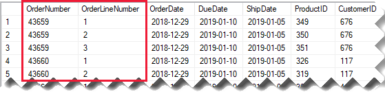
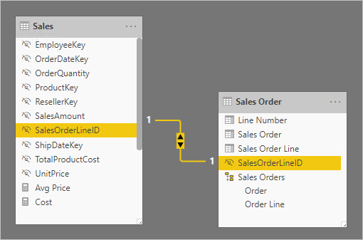
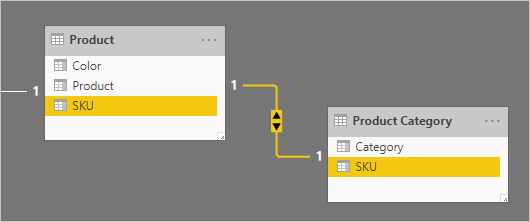
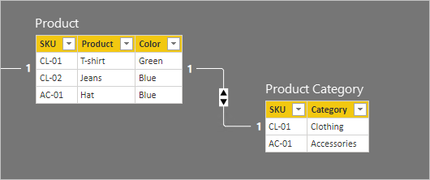
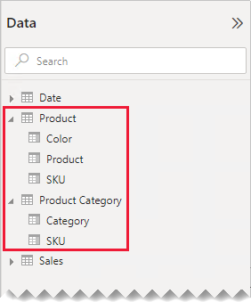
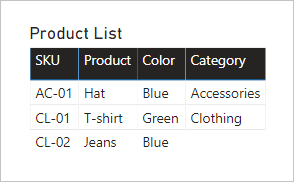
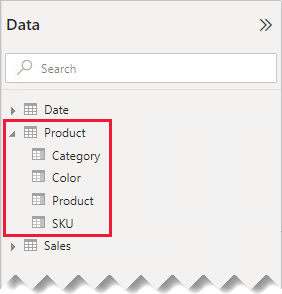
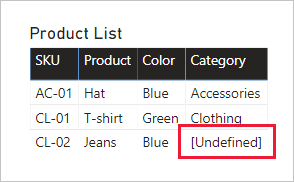
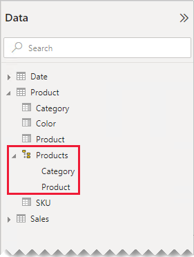
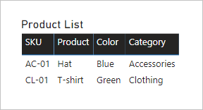

# One-to-one relationship guidance

This article targets you as a data modeler working with Power BI Desktop. It provides you with guidance on working with one-to-one model relationships. A one-to-one relationship can be created when both tables each contain a column of common and unique values.

[!INCLUDE [relationships-prerequisite-reading](includes/relationships-prerequisite-reading.md)]

There are two scenarios that involve one-to-one relationships:

- [Degenerate dimensions](#degenerate-dimensions): You can derive a [degenerate dimension](star-schema.md#degenerate-dimensions) from a fact-type table.
- [Row data spans across tables](#row-data-spans-across-tables): A single business entity or subject is loaded as two (or more) model tables, possibly because their data is sourced from different data stores. This scenario can be common for dimension-type tables. For example, master product details are stored in an operational sales system, and supplementary product details are stored in a different source.

    It's unusual, however, that you'd relate two fact-type tables with a one-to-one relationship. It's because both fact-type tables would need to have the same dimensionality and granularity. Also, each fact-type table would need unique columns to allow the model relationship to be created.

## Degenerate dimensions

When columns from a fact-type table are used for filtering or grouping, you can consider making them available in a separate table. This way, you separate columns used for filtering or grouping from those columns used to summarize fact rows. This separation can:

- Reduce storage space
- Simplify model calculations
- Contribute to improved query performance
- Deliver a more intuitive **Data** pane experience to your report authors

Consider a source sales table that stores sales order details in two columns.

The **OrderNumber** column stores the order number, and the **OrderLineNumber** column stores a sequence of lines within the order.

In the following model diagram, notice that the order number and order line number columns haven't been loaded to the **Sales** table. Instead, their values were used to create a [surrogate key](star-schema.md#surrogate-keys) column named **SalesOrderLineID**. (The key value is calculated by multiplying the order number by 1000, and then adding the order line number.)

The **Sales Order** table provides a rich experience for report authors with three columns: **Sales Order**, **Sales Order Line**, and **Line Number**. It also includes a hierarchy. These table resources support report designs that need to filter, group by, or drill down through orders and order lines.

As the **Sales Order** table is derived from the sales data, there should be exactly the same number of rows in each table. Further, there should be matching values between each **SalesOrderLineID** column.

## Row data spans across tables

Consider an example involving two one-to-one related dimension-type tables: **Product**, and **Product Category**. Each table represents imported data and has an **SKU** (Stock-Keeping Unit) column containing unique values.

Here's a partial model diagram of the two tables.

The first table is named **Product**, and it contains three columns: **Color**, **Product**, and **SKU**. The second table is named **Product Category**, and it contains two columns: **Category**, and **SKU**. A one-to-one relationship relates the two **SKU** columns. The relationship filters in both directions, which is always the case for one-to-one relationships.

To help describe how the relationship filter propagation works, the model diagram has been modified to reveal the table rows. All examples in this article are based on this data.

> [!NOTE]
> It's not possible to display table rows in the Power BI Desktop model diagram. It's done in this article to support the discussion with clear examples.

The row details for the two tables are described in the following bulleted list:

- The **Product** table has three rows:
  - **SKU** CL-01, **Product** T-shirt, **Color** Green
  - **SKU** CL-02, **Product** Jeans, **Color** Blue
  - **SKU** AC-01, **Product** Hat, **Color** Blue
- The **Product Category** table has two rows:
  - **SKU** CL-01, **Category** Clothing
  - **SKU** AC-01, **Category** Accessories

Notice that the **Product Category** table doesn't include a row for the product SKU CL-02. We'll discuss the consequences of this missing row later in this article.

In the **Data** pane, report authors will find product-related fields in two tables: **Product** and **Product Category**.

Let's see what happens when fields from both tables are added to a table visual. In this example, the **SKU** column is sourced from the **Product** table.

Notice that the **Category** value for product SKU CL-02 is BLANK. It's because there's no row in the **Product Category** table for this product.

### Recommendations

When possible, we recommend you avoid creating one-to-one model relationships when row data spans across model tables. It's because this design can:

- Contribute to **Data** pane clutter, listing more tables than necessary.
- Make it difficult for report authors to find related fields, because they're distributed across multiple tables.
- Limit the ability to create hierarchies, as their levels must be based on columns from the _same table_.
- Produce unexpected results when there isn't a complete match of rows between the tables.

Specific recommendations differ depending on whether the one-to-one relationship is _intra source group_ or _cross source group_. For more information about relationship evaluation, see [Model relationships in Power BI Desktop (Relationship evaluation)](../transform-model/desktop-relationships-understand.md#relationship-evaluation).

### Intra source group one-to-one relationship

When a one-to-one _intra source group_ relationship exists between tables, we recommend consolidating the data into a single model table. It's done by merging the Power Query queries.

The following steps present a methodology to consolidate and model the one-to-one related data:

1. **Merge queries**: When [combining the two queries](../connect-data/desktop-shape-and-combine-data.md#combine-queries), give consideration to the completeness of data in each query. If one query contains a complete set of rows (like a master list), merge the other query with it. Configure the merge transformation to use a _left outer join_, which is the default join type. This join type ensures you'll keep all rows of the first query, and supplement them with any matching rows of the second query. Expand all required columns of the second query into the first query.
2. **Disable query load**: Be sure to [disable the load](import-modeling-data-reduction.md#disable-power-query-query-load) of the second query. This way, it won't load its result as a model table. This configuration reduces the data model storage size, and helps to unclutter the **Data** pane.

    In our example, report authors now find a single table named **Product** in the **Data** pane. It contains all product-related fields.

    
3. **Replace missing values**: If the second query has unmatched rows, null values appear in the columns introduced from it. When appropriate, consider replacing null values with a token value. Replacing missing values is especially important when report authors filter or group by the column values, as BLANKs could appear in report visuals.

    In the following table visual, notice that the category for product SKU CL-02 now reads _[Undefined]_. In the query, null categories were replaced with this token text value.

    

4. **Create hierarchies**: If relationships exist _between the columns_ of the now-consolidated table, consider creating hierarchies. This way, report authors will quickly identify opportunities for report visual drilling.

    In our example, report authors now can use a hierarchy that has two levels: **Category** and **Product**.

    

If you like how separate tables help organize your fields, we still recommend consolidating into a single table. You can still organize your fields, but by using _display folders_ instead.

In our example, report authors can find the **Category** field within the **Marketing** display folder.

Should you still decide to define one-to-one intra source group relationships in your model, when possible, ensure there are matching rows in the related tables. As a one-to-one intra source group relationship is evaluated as a [regular relationship](../transform-model/desktop-relationships-understand.md#regular-relationships), data integrity issues could surface in your report visuals as BLANKs. (You can see an example of a BLANK grouping in the first table visual presented in this article.)

### Cross source group one-to-one relationship

When a one-to-one _cross source group_ relationship exists between tables, there's no alternative model design—unless you pre-consolidate the data in your data sources. Power BI will evaluate the one-to-one model relationship as a [limited relationship](../transform-model/desktop-relationships-understand.md#limited-relationships). Therefore, take care to ensure there are matching rows in the related tables, as unmatched rows will be eliminated from query results.

Let's see what happens when fields from both tables are added to a table visual, and a limited relationship exists between the tables.

The table displays two rows only. Product SKU CL-02 is missing because there's no matching row in the **Product Category** table.

## Related content

For more information related to this article, check out the following resources:

- [Model relationships in Power BI Desktop](../transform-model/desktop-relationships-understand.md)
- [Understand star schema and the importance for Power BI](star-schema.md)
- [Relationship troubleshooting guidance](relationships-troubleshoot.md)
- Questions? [Try asking the Power BI Community](https://community.powerbi.com/)
- Suggestions? [Contribute ideas to improve Power BI](https://ideas.powerbi.com/)
