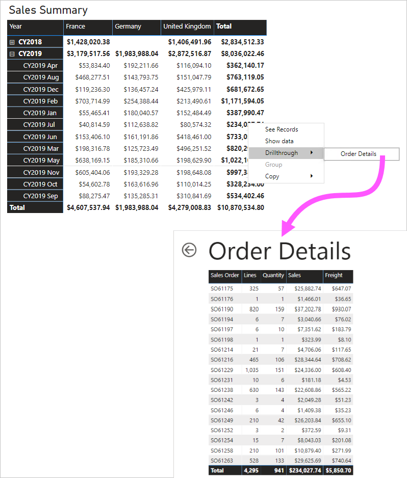
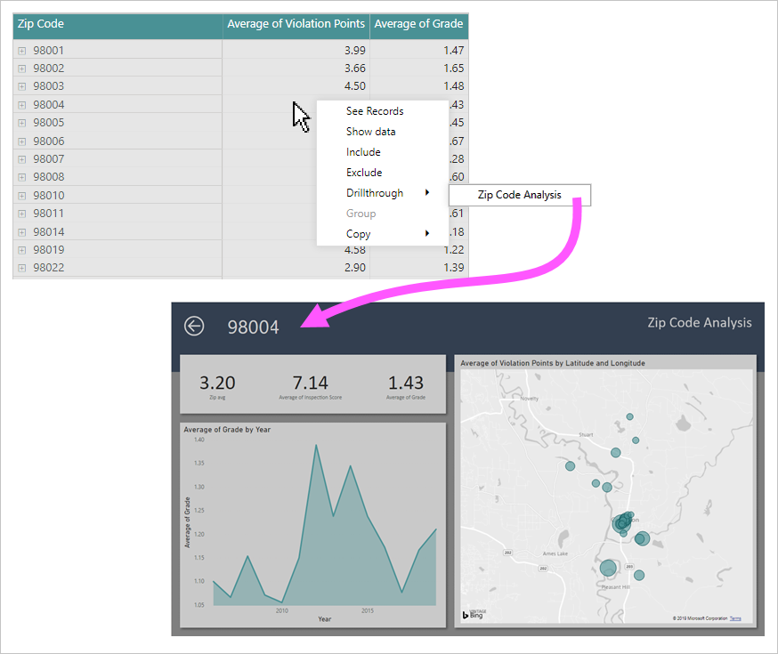

# Use report page drillthrough

This article targets you as a report author who designs Power BI reports. It provides suggestions and recommendations when creating [report page drillthrough](../create-reports/desktop-drillthrough.md).

It's recommended that you design your report to allow report users to achieve the following flow:

1. View a report page.
2. Identify a visual element to analyze more deeply.
3. Right-click the visual element to drill through.
4. Perform complimentary analysis.
5. Return to the source report page.

## Suggestions

We suggest that you consider two types of drillthrough scenarios:

- [Additional depth](#additional-depth)
- [Broader perspective](#broader-perspective)

### Additional depth

When your report page displays summarized results, a drillthrough page can lead report users to transaction-level details. This design approach allows them to view supporting transactions, and only when needed.

The following example shows what happens when a report user drills through from a monthly sales summary. The drillthrough page contains a detailed list of orders for a specific month.

### Broader perspective

A drillthrough page can achieve the opposite of additional depth. This scenario is great for drilling through to a holistic view.

The following example shows what happens when a report user drills through from a zip code. The drillthrough page displays general information about that zip code.

## Recommendations

At report design time, we recommend the following practices:

- **Style:** Consider designing your drillthrough page to use the same theme and style as the report. This way, users feel like they are in the same report.
- **Drillthrough filters:** Set drillthrough filters so you can preview a realistic result as you design the drillthrough page. Be sure to remove these filters before you publish the report.
- **Additional capabilities:** A drillthrough page is like any report page. You can even enhance it with additional interactive capabilities, including slicers or filters.
- **Blanks:** Avoid adding visuals that could display BLANK, or produce errors when drillthrough filters are applied.
- **Page visibility:** Consider hiding drillthrough pages. If you decide to keep a drillthrough page visible, be sure to add a button that allows users to clear any previously-set drillthrough filters. Assign a [bookmark](../create-reports/desktop-bookmarks.md) to the button. The bookmark should be configured to remove all filters.
- **Back button:** A back [button](../create-reports/desktop-buttons.md) is added automatically when you assign a drillthrough filter. It's a good idea to keep it. This way, your report users can easily return to the source page.
- **Discovery:** Help promote awareness of a drillthrough page by setting visual header icon text, or adding instructions to a text box. You can also design an overlay, as described in [this blog post](https://alluringbi.com/2019/10/23/overlays-for-true-self-serve-reporting/).

> [!TIP]
> It's also possible to configure drillthrough to your Power BI paginated reports. You can do this be adding links to Power BI reports. Links can define [URL parameters](https://powerbi.microsoft.com/blog/url-parameters-for-paginated-reports-are-now-available/).

## Related content

For more information related to this article, check out the following resources:

- [Use drillthrough in Power BI Desktop](../create-reports/desktop-drillthrough.md)
- Questions? [Try asking the Power BI Community](https://community.powerbi.com/)
- Suggestions? [Contribute ideas to improve Power BI](https://ideas.powerbi.com/)
