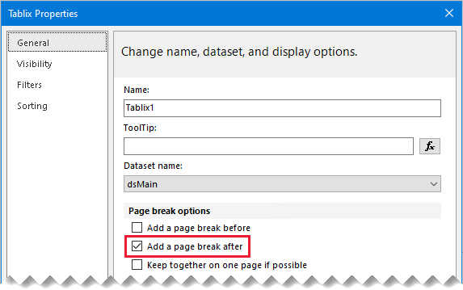

# Avoid blank pages when printing paginated reports

This article targets you as a report author designing Power BI [paginated reports](../paginated-reports/paginated-reports-report-builder-power-bi.md). It provides recommendations to help you avoid blank pages when your report is exported to a hard-page format—like PDF or Microsoft Word—or, is printed.

## Page setup

Report page size properties determine the page orientation, dimensions, and margins. Access these report properties by:

- Using the report **Property Page**: Right-click the dark gray area outside the report canvas, and then select _Report Properties_.
- Using the [**Properties** pane](../paginated-reports/paginated-reports-report-design-view.md#4-properties-pane): Click the dark gray area outside the report canvas to select the report object. Ensure the **Properties** pane is open.

The **Page Setup** page of the report **Property Page** provides a friendly interface to view and update the page setup properties.


Ensure all page size properties are correctly configured:

|Property|Recommendation|
|---------|---------|
|Page units|Select the relevant units—inches or centimeters.|
|Orientation|Select the correct option—portrait or landscape.|
|Paper size|Select a paper size, or assign custom width and height values.|
|Margins|Set appropriate values for the left, right, top, and bottom margins.|
|||

## Report body width

The page size properties determine the available space available for report objects. Report objects can be data regions, data visualizations, or other report items.

A common reason why blank pages are output, is the report body width _exceeds the available page space_.

You can only view and set the report body width using the **Properties** pane. First, click anywhere in an empty area of the report body.


Ensure the width value doesn't exceed available page width. Be guided by the following formula:

```Report body width <= Report page width - (Left margin + Right margin)```

> [!NOTE]
> It's not possible to reduce the report body width when there are report objects already in the space you want to remove. You must first reposition or resize them before reducing the width.
>
> Also, the report body width can increase automatically when you add new objects, or resize or reposition existing objects. The report designer always widens the body to accommodate the position and size of its contained objects.

## Report body height

Another reason why a blank page is output, is there's excess space in the report body, after the last object.

We recommend you always reduce the height of the body to remove any trailing space.


## Page break options

Each data region and data visualization has page break options. You can access these options in its property page, or in the **Properties** pane.

Ensure the **Add a page break after** property isn't unnecessarily enabled.



## Consume Container Whitespace

If the blank page issue persists, you can also try disabling the report **ConsumeContainerWhitespace** property. It can only be set in the **Properties** pane.


By default, it's enabled. It directs whether minimum whitespace in containers, such as the report body or a rectangle, should be consumed. Only whitespace to the right of, and below, the contents is affected.

## Printer paper size

Lastly, if you're printing the report to paper, ensure the printer has the correct paper loaded. The physical paper size should correspond to the [report paper size](#page-setup).

## Related content

For more information related to this article, check out the following resources:

- [What are paginated reports in Power BI?](../paginated-reports/paginated-reports-report-builder-power-bi.md)
- [Pagination in Power BI paginated reports](../paginated-reports/paginated-reports-pagination.md)
- Questions? [Try asking the Power BI Community](https://community.powerbi.com/)
- Suggestions? [Contribute ideas to improve Power BI](https://ideas.powerbi.com)
