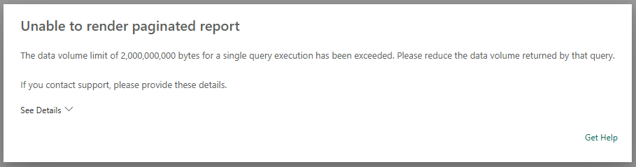

# Performance and scalability considerations for paginated reports in Power BI service

This article summarizes scalability and performance differences between paginated reports in the Power BI service versus SQL Server Reporting Services/Power BI Report Server. The article is intended for users migrating paginated reports from on-premises to the Power BI service. Additionally, it also provides insights on how to optimize the performance of paginated reports in the service.

## Scalability considerations

When comparing the scalability of paginated reports in the Power BI service versus on-premises, there are two main considerations: whether the execution environment is optimized to handle the expressions you are using and the volume of data. These are some of the factors that are crucial in improving the scalability of your paginated reports in the service. 

### Execution environment

A paginated report can run in two different execution environments: the **standard environment** and the **optimized environment**. The primary difference between these environments is that optimized environment can handle higher data volumes compared to the standard execution environment. The expressions used in the report determine the execution environment, and users are unable to modify it through any settings or configurations. The only way to ensure a report runs in an optimized environment is to remove any nonsupported expressions because the optimized environment only supports a specific subset of report expressions.

If your report includes non-supported expressions, consider removing or updating those expressions to ensure the report runs in an optimized environment. One approach is to move calculations into the dataset query. Additionally, another advantage of using calculated fields in the semantic model data sources is that other reports can also use them. Power Query is another option for performing advanced calculations and data processing operations outside of the paginated report. More information can be found [here](../paginated-reports/report-builder/connect-snowflake-databricks-power-query-online.md).

> [!Note]
> One example of unsupported expression is the usage of calculated fields in the RDL, such as this: `If(Weekday(Fields!SalesDate.Value) > 5, "Relax", "Work")`. Weekday is a function that is not yet optimized. Rather than using a report expression this could be calculated as a part of a SQL query. For SQL Server/ Azure SQL that could be done using the Transact SQL functions [`DATEPART`](/sql/t-sql/functions/datepart-transact-sql) and [`IF..ELSE`](/sql/t-sql/language-elements/if-else-transact-sql).

To check if a report was run in the optimized environment, click on the Diagnostics button in the paginated report and check the 'Execution environment' section. If the report is running in the optimized environment, then 'Optimized' shows 'Yes.' If the report is running in the standard, nonoptimized environment, the Execution environment section shows a list of nonsupported report expressions. More details on the performance metrics displayed on the Diagnostics card can be found [here](../paginated-reports/paginated-reports-diagnostics.md).

:::image type="content" source="media/reports-paginated-performance-scalability/diagnostics-card.png" alt-text="Screenshot of the diagnostics card for paginated reports." border="false":::

### Large data volumes

Both the standard and optimized execution environments for paginated reports have specific data volume limits that, when exceeded, will halt report processing and result in an error. 
> [!NOTE]
> Previously when data volume limits were exceeded the result was slowed report execution. This has been changed to failure by design. Follow the guidance in this article to optimize your reports to avoid these failures.

This issue typically occurs in two scenarios:
-	Data dumps of tables with no groupings and many columns/rows: these data dumps require significant resources when exporting the paginated report to Excel. Alternatively, consider exporting the report to CSV format, which is less intensive.

- Aggregation of large volumes of data during report processing: instead of aggregating large data volumes inside paginated reports, perform those aggregations in the query used by a paginated reports dataset. This approach reduces the amount of data processed by paginated reports and typically enhances overall performance because data sources such as SQL Server or Power BI Semantic Model are highly optimized for data aggregation.

The recommended threshold for data volume in a standard execution environment before report processing slows significantly is **1,000,000 rows with 15-20 columns**, consisting of a mixture of numeric, date, and small to medium length string data types. **This limit doubles for optimized execution environments**. Adding image data (`byte[]`) to data dumps significantly increases data volumes. Similarly, selecting more or fewer columns than specified would also affect data volumes, as would the mix of data types. 

> [!WARNING]
> #### Data volume limits per query execution
> > If a single paginated report dataset query fetches more than 2,000,000,000 bytes (~2GB), query execution is aborted, and rendering fails with the following error:
> > 
> > To prevent this error, ensure each paginated report query retrieves less than 2,000,000,000 bytes.

## Performance considerations   

Even for medium to low-sized data volumes, there are more factors that can impact the performance of paginated reports in the service for these scenarios:
-	Processing report *parameters* each time a report is opened in the Power BI service.
-	Rendering the report whenever a user clicks on the "View report" button.  
-	Retrieving data from various data sources

### Best practices to improve report parameters processing

Report parameters can be backed by datasets with available and default values, which is often the case for multiple parameters. Parameters can also depend on other parameters such as cascading parameters. As a result, parameter queries are executed sequentially. When a report has cascading parameters, each parameterized query runs each time subsequent values are selected.

Given that parameter values are usually static and don't change frequently, SQL Server Reporting Services (‘SSRS’) uses this advantage to offer robust support for dataset caches (as explained [here](/sql/reporting-services/report-server/cache-shared-datasets-ssrs)), which improves report parameter processing in SSRS. However, paginated reports in the service don't support dataset caches. Therefore, users should follow these best practices to improve execution time for parameter queries for paginated reports in the service:

-	Avoid using parameter queries that run against on-premises data sources accessed via a Power BI Gateway. Instead, use a Power BI semantic model as a cache.
-	Reduce the amount of data fetched by parameter queries to ensure efficiency. Fetching more than 1,000 values can be time-consuming and may not be user-friendly in the UI.
-	Use the [EnterData data extension](../paginated-reports/paginated-reports-enter-data.md) for a static set of parameter values in order to embed them in the RDL. Besides providing parameter values, these datasets can also be utilized in your report without running a query.

### Best practices to improve paginated report rendering

Similar to the guidelines provided in the scalability section, avoid using live queries for on-premises data sources that are accessed via a Power BI Gateway. To improve report rendering in paginated reports, use a Power BI semantic model as a cache instead. Rather than aggregating data within the paginated report, perform aggregations inside the dataset query to reduce data volume and enhance performance. Use data sources such as Azure SQL  or Power BI semantic models which are highly optimized for processing aggregates. 

Additionally, avoid using dataset or table/matrix filters, as paginated reports fetch all data first, then apply filters internally, affecting performance. Instead, use filters in dataset queries whenever possible. 

### Best practices for efficient data retrieval

Multi-geo environments, where the report and the data source like a semantic model are in different regions, slow down data retrieval. More guidance for efficient data retrieval for paginated reports can be found [here](report-paginated-data-retrieval.md).

## Related content

For more information related to this article, check out the following resources:

- [What are paginated reports in Power BI?](../paginated-reports-report-builder-power-bi.md)
- [Power BI paginated reports diagnostics](../paginated-reports/paginated-reports-diagnostics.md)
- [Paginated reports data retrieval guidance](report-paginated-data-retrieval.md)
- Questions? [Try asking the Fabric Community](https://community.fabric.microsoft.com/)
- Suggestions? [Contribute ideas to improve Fabric](https://ideas.fabric.microsoft.com/)

