# Distribute Power BI content to external guest users using Microsoft Entra B2B

**Summary:** This is a technical whitepaper outlining how to distribute content to users outside the organization using the integration of Microsoft Entra ID ([previously known as Azure Active Directory](/azure/active-directory/fundamentals/new-name)) business-to-business (Microsoft Entra B2B).

**Writers:** Lukasz Pawlowski, Kasper de Jonge

**Technical Reviewers:** Adam Wilson, Sheng Liu, Qian Liang, Sergei Gundorov, Jacob Grimm, Adam Saxton, Maya Shenhav, Nimrod Shalit, Elisabeth Olson

> [!NOTE]
> You can save or print this whitepaper by selecting **Print** from your browser, then selecting **Save as PDF**.

## Introduction

Power BI gives organizations a 360-degree view of their business and empowers everyone in these organizations to make intelligent decisions using data. Many of these organizations have strong and trusted relationships with external partners, clients, and contractors. These organizations need to provide secure access to Power BI dashboards and reports to users in these external partners.

Power BI integrates with [Microsoft Entra business-to-business (Microsoft Entra B2B)](/azure/active-directory/b2b/what-is-b2b) to allow secure distribution of Power BI content to guest users outside the organization – while still maintaining control and governing access to internal data.

This white paper covers the all the details you need to understand Power BI's integration with Microsoft Entra B2B. We cover its most common use case, setup, licensing, and row level security.

## Scenarios

Contoso is an automotive manufacturer and works with many diverse suppliers who provide it with all the components, materials, and services necessary to run its manufacturing operations. Contoso wants to streamline its supply chain logistics and plans to use Power BI to monitor key performance metrics of its supply chain. Contoso wants to share with external supply chain partners analytics in a secure and manageable way.

Contoso can enable the following experiences for external users using Power BI and Microsoft Entra B2B.

### Ad hoc per item sharing

Contoso works with a supplier who builds radiators for Contoso's cars. Often, they need to optimize the reliability of the radiators using data from all of Contoso's cars. An analyst at Contoso uses Power BI to share a radiator reliability report with an Engineer at the supplier. The Engineer receives an email with a link to view the report.

As described above, this ad-hoc sharing is performed by business users on an as needed basis. The link sent by Power BI to the external user is a Microsoft Entra B2B invite link. When the external user opens the link, they're asked to join Contoso's Microsoft Entra organization as a guest user. After the invite is accepted, the link opens the specific report or dashboard. The Microsoft Entra admin delegates permission to invite external users to the organization and chooses what those users can do once they accept the invite as described in the Governance section of this document. The Contoso analyst can invite the Guest user only because the Microsoft Entra administrator allowed that action and the Power BI administrator allowed users to invite guests to view content in Power BI's tenant settings.

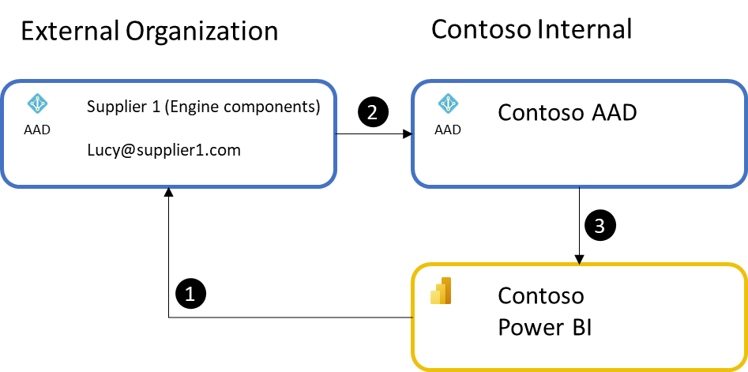

1. The process starts with a Contoso internal user sharing a dashboard or a report with an external user. If the external user isn't already a guest in Contoso's Microsoft Entra ID, they're invited. An email is sent to their email address that includes an invite to Contoso's Microsoft Entra ID.
2. The recipient accepts the invite to Contoso's Microsoft Entra ID and is added as a Guest user in Contoso's Microsoft Entra ID.
3. The recipient is then redirected to the Power BI dashboard, report, or app.

The process is considered ad-hoc since business users in Contoso perform the invite action as needed for their business purposes. Each item shared is a single link the external user can access to view the content.

Once the external user has been invited to access Contoso resources, a shadow account may be created for them in Contoso Microsoft Entra ID, and they don't need to be invited again. The first time they try to access a Contoso resource like a Power BI dashboard, they go through a consent process, which redeems the invitation.  If they don't complete the consent, they can't access any of Contoso's content.  If they have trouble redeeming their invitation via the original link provided, a Microsoft Entra administrator can resend a specific invitation link for them to redeem.

### Planned per item sharing

Contoso works with a subcontractor to perform reliability analysis of radiators. The subcontractor has a team of 10 people who need access to data in Contoso's Power BI environment. The Contoso Microsoft Entra administrator is involved to invite all the users and to handle any additions/changes as personnel at the subcontractor change. The Microsoft Entra administrator creates a security group for all the employees at the subcontractor. Using the security group, Contoso's employees can easily manage access to reports and ensure all required subcontractor personnel have access to all the required reports, dashboards, and Power BI apps. The Microsoft Entra administrator can also avoid being involved in the invitation process altogether by choosing to delegate invitation rights to a trusted employee at Contoso or at the subcontractor to ensure timely personnel management.

Some organizations require more control over when external users are added, are inviting many users in an external organization, or many external organizations. In these cases, planned sharing can be used to manage the scale of sharing, to enforce organizational policies, and even to delegate rights to trusted individuals to invite and manage external users. Microsoft Entra B2B supports planned invites to be sent directly [from the Azure portal by an IT administrator](/azure/active-directory/b2b/add-users-administrator), or through [PowerShell using the invitation manager API](/azure/active-directory/b2b/customize-invitation-api) where a set of users can be invited in one action. Using the planned invites approach, the organization can control who can invite users and implement approval processes. Advanced Microsoft Entra capabilities like dynamic groups can make it easy to maintain security group membership automatically.

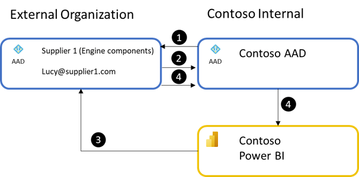

1. The process starts with an IT administrator inviting the guest user either manually or through the API provided by Microsoft Entra ID.
2. The user accepts the invite to the organization.
3. Once the user has accepted the invitation, a user in Power BI can share a report or dashboard with the external user, or a security group they are in. Just like with regular sharing in Power BI the external user receives an email with the link to the item.
4. When the external user accesses the link, their authentication in their directory is passed to Contoso's Microsoft Entra ID and used to gain access to the Power BI content.

### Ad hoc or planned sharing of Power BI Apps

Contoso has a set of reports and dashboards they need to share with one or more Suppliers. To ensure all required external users have access to this content, it is packaged as a Power BI app. The external users are either added directly to the app access list or through security groups. Someone at Contoso then sends the app URL to all the external users, for example in an email. When the external users open the link, they see all the content in a single easy to navigate experience.

Using a Power BI app makes it easy for Contoso to build a BI Portal for its suppliers. A single access list controls access to all the required content reducing wasted time checking and setting item level permissions. Microsoft Entra B2B maintains security access using the Supplier's native identity so users don't need additional sign-in credentials. If using planned invites with security groups, access management to the app as personnel rotate into or out of the project is simplified. Membership in security groups manually or by using [dynamic groups](/azure/active-directory/b2b/use-dynamic-groups), so that all external users from a supplier are automatically added to the appropriate security group.

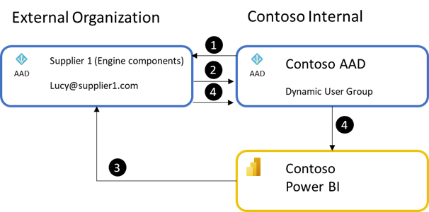

1. The process starts by the user being invited to Contoso's Microsoft Entra organization through the Azure portal or PowerShell.
2. The user can be added to a user group in Microsoft Entra ID. A static or dynamic user group can be used, but dynamic groups help reduce manual work.
3. The external users are given access to the Power BI App through the user group. The app URL should be sent directly to the external user or placed on a site they have access to. Power BI makes the best effort to send an email with the app link to external users but when using user groups whose membership can change, Power BI isn't able to send to all external users managed through user groups.
4. When the external user accesses the Power BI app URL, they're authenticated by Contoso's Microsoft Entra ID, the app is installed for the user, and the user can see all the contained reports and dashboards within the app.

Apps also have a unique feature that allows app authors to install the application automatically for the user, so it's available when the user logs in. This feature only installs automatically for external users who are already part of Contoso's organization at the time the application is published or updated. Thus, it's best used with the planned invites approach, and depends on the app being published or updated after the users are added to Contoso's Microsoft Entra ID. External users can always install the app using the app link.

### Commenting and subscribing to content across organizations

As Contoso continues to work with its subcontractors or suppliers, the external Engineers need to work closely with Contoso's analysts. Power BI provides several collaboration features that help users communicate about content they can consume. Dashboard commenting (and soon Report commenting) allows users to discuss data points they see and communicate with report authors to ask questions.

Currently, external guest users can participate in comments by leaving comments and reading the replies. However, unlike internal users, guest users can't be @mentioned and don't receive notifications that they've received a comment. Guest users can use the subscriptions feature within Power BI to subscribe themselves to a report or dashboard. Learn more in [Email subscriptions for reports and dashboards in the Power BI service](../collaborate-share/end-user-subscribe.md).  

### Access content in Power BI mobile apps

When the guest user opens the link to the report or dashboard on their mobile device, the content will open in the native Power BI mobile apps on their device, if they're installed. The guest user will then be able to navigate between content shared with them in the external tenant, and back to their own content from their home tenant. For more information about accessing content that has been shared with you from an external organization via Power BI mobile apps, see [View Power BI content shared with you from an external organization](../consumer/mobile/mobile-apps-b2b.md).

## Organizational relationships using Power BI and Microsoft Entra B2B

When all the users of Power BI are internal to the organization, there's no need to use Microsoft Entra B2B. However, once two or more organizations want to collaborate on data and insights, Power BI's support for Microsoft Entra B2B makes it easy and cost effective to do so.

Below are typically encountered organizational structures that are well suited for Microsoft Entra B2B style cross-organization collaboration in Power BI. Microsoft Entra B2B works well in most cases, but in some situations the Common alternative approaches covered at the end of this document are worth considering.

### Case 1: Direct collaboration between organizations

Contoso's relationship with its radiator supplier is an example of direct collaboration between organizations. Since there are relatively few users at Contoso and its supplier who need access to radiator reliability information, using Microsoft Entra B2B based external sharing is ideal. It's easy to use and simple to administer. This is also a common pattern in consulting services where a consultant may need to build content for an organization.

Typically, this sharing occurs initially using Ad hoc per item sharing. However, as teams grow or relationships deepen, the Planned per item sharing approach becomes the preferred method to reduce management overhead. Additionally, the Ad hoc or planned sharing of Power BI Apps, Commenting and subscribing to content across organizations, access to content in mobile apps can come into play as well. Importantly, if both organizations' users have Power BI Pro licenses in their respective organizations, they can use those Pro licenses in each other's Power BI environments. This provides advantageous licensing since the inviting organization may not need to pay for a Power BI Pro license for the external users. This is discussed in more detail in the Licensing section later in this document.

### Case 2: Parent and its subsidiaries or affiliates

Some organization structures are more complex, including partially or wholly owned subsidiaries, affiliated companies, or managed service provider relationships. These organizations have a parent organization such as a holding company, but the underlying organizations operate semi-autonomously, sometimes under different regional requirements. This leads to each organization having its own Microsoft Entra environment and separate Power BI tenants.

In this structure, the parent organization typically needs to distribute standardized insights to its subsidiaries. Typically, this sharing occurs using the Ad hoc or planned sharing of Power BI Apps approach as illustrated in the following image, since it allows distribution of standardized authoritative content to broad audiences. In practice a combination of all the Scenarios mentioned earlier in this document is used.

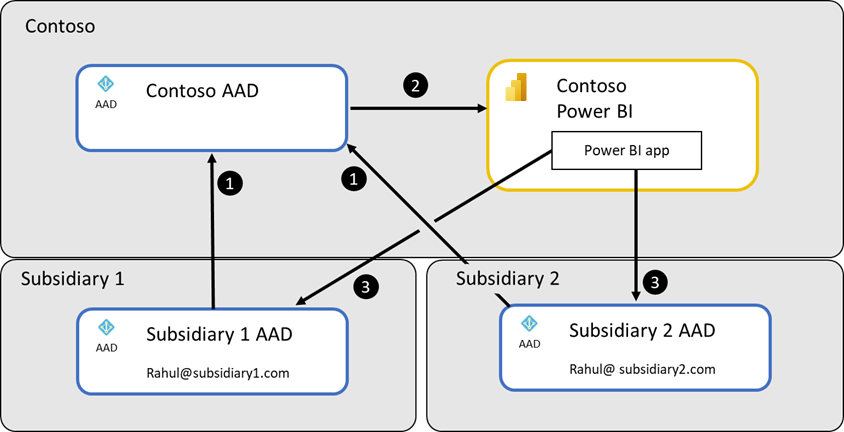

This follows the following process:

1. Users from each Subsidiary are invited to Contoso's Microsoft Entra ID
2. Then the Power BI app is published to give these users access to the required data
3. Finally, the users open the app through a link they've been given to see the reports

Several important challenges are faced by organizations in this structure:

- How to distribute links to content in the Parent organization's Power BI
- How to allow subsidiary users to access data source hosted by the parent organization

#### Distributing links to content in the Parent organization's Power BI

Three approaches are commonly used to distribute links to the content. The first and most basic is to send the link to the app to the required users or to place it in a SharePoint Online site from which it can be opened. Users can then bookmark the link in their browsers for faster access to the data they need.

The second approach is where the parent organization allows users from the subsidiaries to access its Power BI and controls that they can access through permission. This gives access to Power BI Home where the user from the subsidiary sees a comprehensive list of content shared to them in the Parent organization's tenant. Then the URL to the Parent organizations' Power BI environment is given to the users at the subsidiaries.

The final approach uses a Power BI app created within the Power BI tenant for each subsidiary. The Power BI app includes a dashboard with [tiles configured with the external link option](../create-reports/service-dashboard-edit-tile.md#hyperlink). When the user presses the tile, they're taken to the appropriate report, dashboard, or app in the parent organization's Power BI. This approach has the added advantage that the app can be installed automatically for all users in the subsidiary and is available to them whenever they sign in to their own Power BI environment. An added advantage of this approach is that it works well with Power BI mobile apps that can open the link natively. You can also combine this with the second approach to enable easier switching between Power BI environments.

#### Allowing subsidiary users to access data sources hosted by the parent organization

Often analysts at a subsidiary need to create their own analytics using data supplied by the parent organization. In this case, commonly cloud data sources are used to address the challenge.

The first approach uses [Azure Analysis Services](/azure/analysis-services/analysis-services-overview) to build an enterprise grade data warehouse that serves the needs of Analysts across the parent and its subsidiaries as shown the following image. Contoso can host the data and use capabilities like row level security to ensure users in each subsidiary can access only their data. Analysts at each organization can access the data warehouse through Power BI Desktop and publish resulting analytics to their respective Power BI tenants.

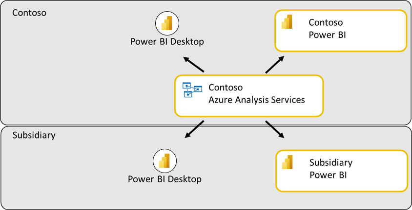

The second approach uses [Azure SQL Database](https://azure.microsoft.com/services/sql-database/) to build a relational data warehouse to provide access to data. This works similarly to the Azure Analysis Services approach, though some capabilities like row level security may be harder to deploy and maintain across subsidiaries.

More sophisticated approaches are also possible, however the above are by far the most common.

### Case 3: Shared environment across partners

Contoso may enter into a partnership with a competitor to jointly build a car on a shared assembly line, but to distribute the vehicle under different brands or in different regions. This requires extensive collaboration and co-ownership of data, intelligence, and analytics across organizations. This structure is also common in the consulting services industry where a team of consultants may do project-based analytics for a client.

In practice, these structures are complex as shown in the following image, and require staff to maintain. To be effective, Organizations are allowed to reuse Power BI Pro licenses purchased for their respective Power BI tenants.

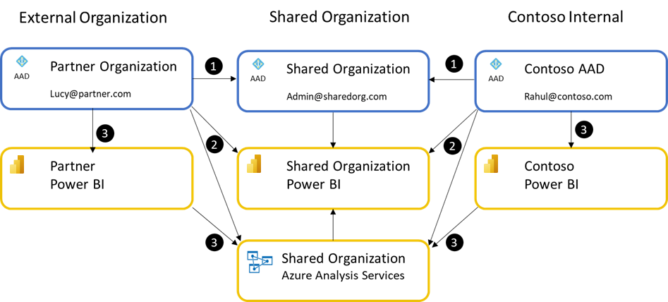

To establish a shared Power BI tenant, a Microsoft Entra ID needs to be created and at least one Power BI Pro user account needs to be purchased for a user in that tenant. This user invites the required users to the shared organization. Importantly, in this scenario, Contoso's users are treated as external users when they operate within the Shared Organization's Power BI.

The process is as follows:

1. The Shared Organization is established as a new Microsoft Entra ID and at least one user account is created in the new tenant. That user should have a Power BI Pro license assigned to them.
2. This user then establishes a Power BI tenant and invites the required users from Contoso and the Partner organization. The user also establishes any shared data assets like Azure Analysis Services. Contoso and the Partner's users can access the shared organization's Power BI as guest users. Typically, all shared assets are stored and accessed from the shared organization.
3. Depending on how the parties agree to collaborate, it's possible for each organization to develop their own proprietary data and analytics using shared data warehouse assets. They can distribute those to their respective internal users using their internal Power BI tenants.

### Case 4: Distribution to hundreds or thousands of external partners

While Contoso created a radiator reliability report for one Supplier, now Contoso desires to create a set of standardized reports for hundreds of Suppliers. This allows Contoso to ensure all suppliers have the analytics they need to make improvements or to fix manufacturing defects.

When an organization needs to distribute standardized data and insights to many external users/organizations, they can use the Ad hoc or planned sharing of Power BI Apps scenario to build a BI Portal quickly and without extensive development costs. The process to build such a portal using a Power BI app is covered in the Case Study: Building a BI Portal using Power BI + Microsoft Entra B2B – Step-by-Step instructions later in this document.

A common variant of this case is when an organization is attempting to share insights with consumers, especially when looking to use Azure Active Directory B2C with Power BI. Power BI doesn't natively support Azure Active Directory B2C. If you're evaluating options for this case, consider using Alternative Option 2 in the Common alternative approaches the section later in this document.

## Case Study: Building a BI Portal using Power BI + Microsoft Entra B2B – Step-by-Step instructions

Power BI's integration with Microsoft Entra B2B gives Contoso a seamless, hassle-free way to provide guest users with secure access to its BI portal. Contoso can set this up with three steps:

1. Create BI portal in Power BI

    The first task for Contoso is to create their BI portal in Power BI. Contoso's BI portal will consist of a collection of purpose-built dashboards and reports that will be made available to many internal and guest users. The recommended way for doing this in Power BI is to build a Power BI app. Learn more about [apps in Power BI](https://powerbi.microsoft.com/blog/distribute-to-large-audiences-with-power-bi-apps/).

- Contoso's BI team creates a workspace in Power BI

    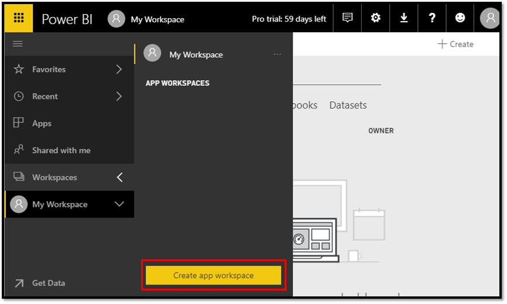
    
- Other authors are added to the workspace

    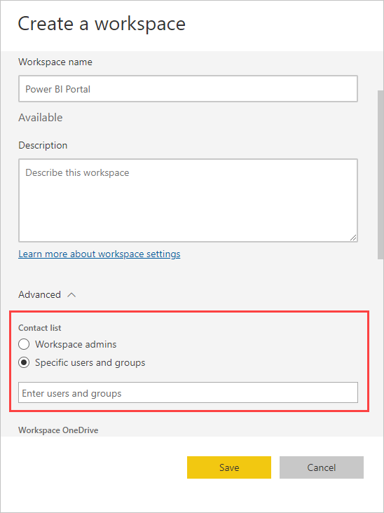

- Content is created inside the workspace

    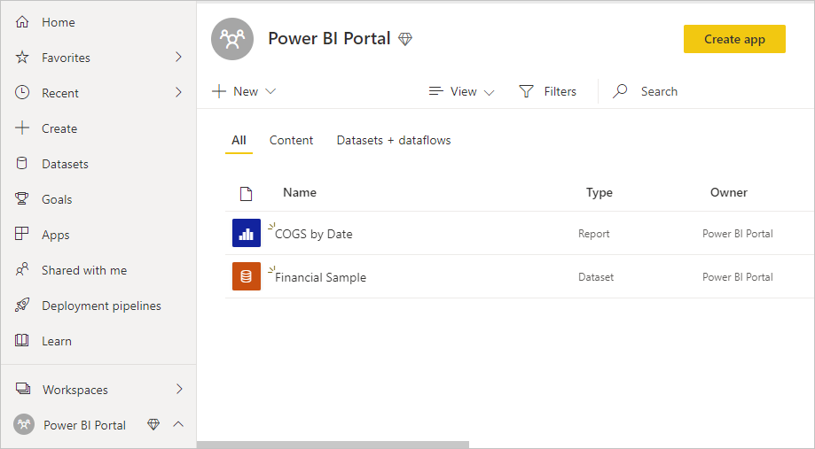

    Now that the content is created in a workspace, Contoso is ready to invite guest users in partner organizations to consume this content.

2. Invite Guest Users

    There are two ways for Contoso to invite guest users to its BI portal in Power BI:

    * Planned Invites
    * Ad hoc Invites

    **Planned Invites**

    In this approach, Contoso invites the guest users to its Microsoft Entra ahead of time and then distributes Power BI content to them. Contoso can invite guest users from the Azure portal or using PowerShell. Here are the steps to invite guest users from the Azure portal:

    - Contoso's Microsoft Entra administrator navigates to **Azure portal** > **Microsoft Entra ID** > **Users** > **All users** > **New guest user**

    

    - Add an invitation message for the guest users and select Invite

    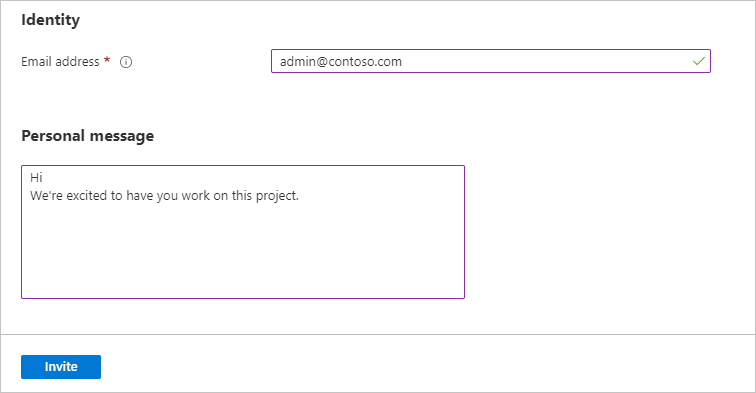

    > [!NOTE]
    > To invite guest users from the Azure portal, you need a Microsoft Entra administrator for your tenant.

    If Contoso wants to invite many guest users, they can do so using PowerShell. Contoso's Microsoft Entra administrator stores the email addresses of all the guest users in a CSV file. Here are [Microsoft Entra B2B collaboration code and PowerShell samples](/azure/active-directory/b2b/code-samples) and instructions.

    After the invitation, guest users receive an email with the invitation link.

    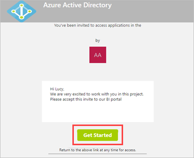

    Once the guest users select the link, they can access content in the Contoso Microsoft Entra tenant.

    > [!NOTE]
    > It is possible to change the layout of the invitation email using the Microsoft Entra ID branding feature as described [here](/azure/active-directory/active-directory-b2b-invitation-email).

    **Ad hoc Invites**

    What if Contoso doesn't know all the guest users it wants to invite ahead of time? Or, what if the analyst in Contoso who created the BI portal wants to distribute content to guest users herself? We also support this scenario in Power BI with ad-hoc invites.

    The analyst can just add the external users to the access list of the app when they're publishing it. The guest users get an invite and once they accept it, they're automatically redirected to the Power BI content.

    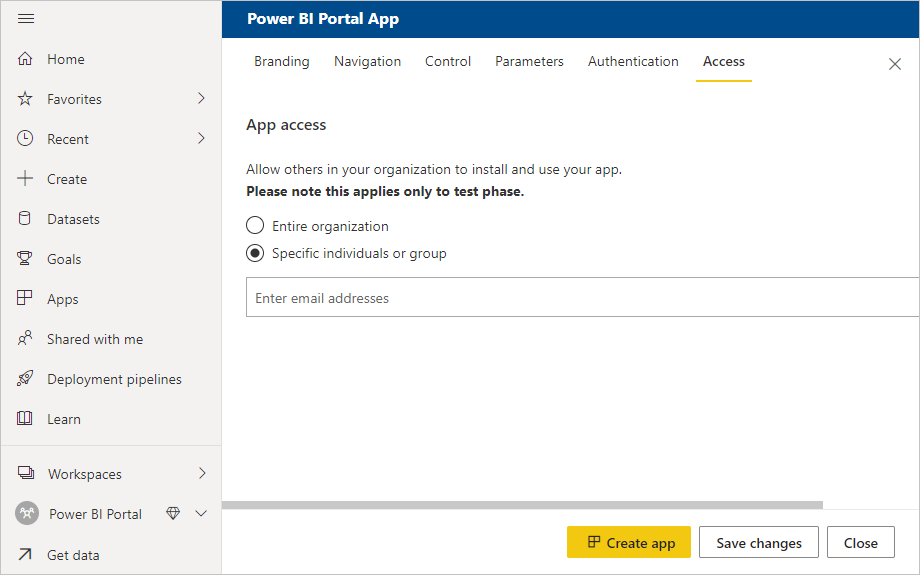

    > [!NOTE]
    > Invites are needed only the first time an external user is invited to your organization.

3. Distribute Content

    Now that Contoso's BI team has created the BI portal and invited guest users, they can distribute their portal to their end users by giving guest users access to the app and publishing it. Power BI autocompletes names of guest users who have been previously added to the Contoso tenant. Adhoc invitations to other guest users can also be added at this point.

    > [!NOTE]
    > If using Security groups to manage access to the app for external users, use the Planned Invites approach and share the app link directly with each external user who must access it. Otherwise, the external user may not be able to install or view content from within the app._

    Guest users get an email with a link to the app.

    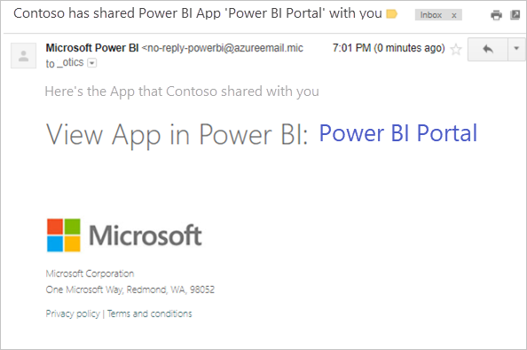

    On clicking this link, guest users are asked to authenticate with their own organization's identity.

    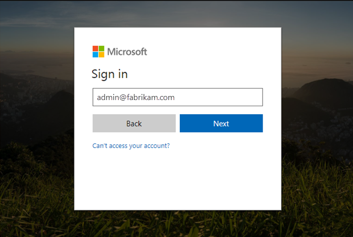

    Once they're successfully authenticated, they're redirected to Contoso's BI app.

    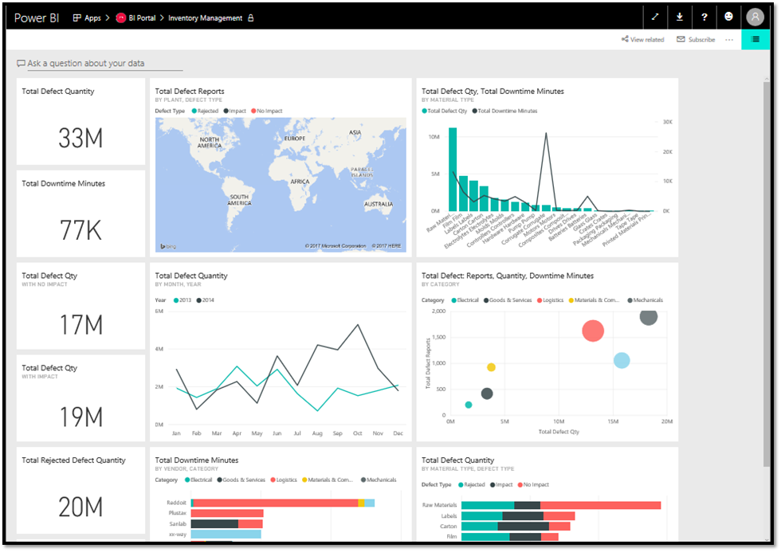

    Guest users can later get to Contoso's app by clicking the link in the email or bookmarking the link. Contoso can also make it easier for guest users by adding this link to any existing extranet portal that the guest users already use.

4. Next steps

    Using a Power BI app and Microsoft Entra B2B, Contoso was able to quickly create a BI Portal for its suppliers in a no-code way. This greatly simplified distributing standardized analytics to all the suppliers who needed it.

    While the example showed how a single common report could be distributed among suppliers, Power BI can go much further. To ensure each partner sees only data relevant to themselves, Row Level Security can be added easily to the report and data model. The Data security for external partners section later in this document describes this process in detail.

    Often individual reports and dashboards need to be embedded into an existing portal. This can also be accomplished by reusing many of the techniques shown in the example. However, in those situations it may be easier to embed reports or dashboards directly from a workspace. The process for inviting and assigning security permission to the required users remain the same.

## Under the hood: How is Lucy from Supplier1 able to access Power BI content from Contoso's tenant?

Now that we have seen how Contoso is able to seamlessly distribute Power BI content to guest users in partner organizations, let's look at how this works under the hood.

When Contoso invited [lucy@supplier1.com](mailto:lucy@supplier1.com) to its directory, Microsoft Entra ID creates a link between [Lucy@supplier1.com](mailto:Lucy@supplier1.com) and the Contoso Microsoft Entra tenant. This link lets Microsoft Entra ID know that Lucy@supplier1.com can access content in the Contoso tenant.

When Lucy tries to access Contoso's Power BI app, Microsoft Entra ID verifies that Lucy can access the Contoso tenant, and then provides Power BI a token that indicates that Lucy is authenticated to access content in the Contoso tenant. Power BI uses this token to authorize and ensure that Lucy has access to Contoso's Power BI app.

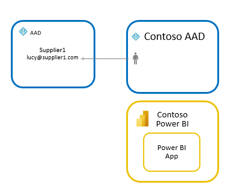

Power BI's integration with Microsoft Entra B2B works with all business email addresses. If the user doesn't have a Microsoft Entra identity, they may be prompted to create one. The following image shows the detailed flow:

It's important to recognize that the Microsoft Entra account will be used or created in the external party's Microsoft Entra ID, this will make it possible for Lucy to use their own username and password and their credentials will automatically stop working in other tenants whenever Lucy leaves the company when their organization also uses Microsoft Entra ID.

## Licensing

Contoso can choose one of three approaches to license guest users from its suppliers and partner organizations to have access to Power BI content.

> [!NOTE]
> The Microsoft Entra B2B's free tier is enough to use Power BI with Microsoft Entra B2B. Some advanced Microsoft Entra B2B features like dynamic groups require additional licensing. For more information, see the [Microsoft Entra B2B documentation](/azure/active-directory/b2b/licensing-guidance).

### Approach 1: Contoso uses Power BI Premium

With this approach, Contoso purchases Power BI Premium capacity and assigns its BI portal content to this capacity. This allows guest users from partner organizations to access Contoso's Power BI app without any Power BI license.

External users are also subject to the consumption only experiences offered to "Free" users in Power BI when consuming content within Power BI Premium.

Contoso can also take advantage of other Power BI premium capabilities for its apps like increased refresh rates, capacity, and large model sizes.

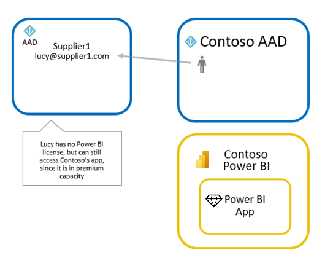

### Approach 2: Contoso assigns Power BI Pro licenses to guest users

With this approach, Contoso assigns pro licenses to guest users from partner organizations – this can be done from Contoso's Microsoft 365 admin center. This allows guest users from partner organizations to access Contoso's Power BI app without purchasing a license themselves. This can be appropriate for sharing with external users whose organization hasn't adopted Power BI yet.

> [!NOTE]
> Contoso's pro license applies to guest users only when they access content in the Contoso tenant. Pro licenses enable access to content that is not in a Power BI Premium capacity.

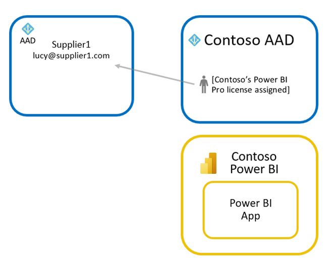

### Approach 3: Guest users bring their own Power BI Pro license

With this approach, Supplier 1 assigns a Power BI Pro license to Lucy. They can then access Contoso's Power BI app with this license. Since Lucy can use their Pro license from their own organization when accessing an external Power BI environment, this approach is sometimes referred to as _bring your own license_ (BYOL). If both organizations are using Power BI, this offers advantageous licensing for the overall analytics solution and minimizes overhead of assigning licenses to external users.

> [!NOTE]
> The pro license given to Lucy by Supplier 1 applies to any Power BI tenant where Lucy is a guest user. Pro licenses enable access to content that is not in a Power BI Premium capacity.

## Data security for external partners

Commonly when working with multiple external suppliers, Contoso needs to ensure that each supplier sees data only about its own products. User-based security and dynamic row level security make this easy to accomplish with Power BI.

### User-based security

One of the most powerful features of Power BI is Row Level Security. This feature allows Contoso to create a single report and semantic model ([previously known as a dataset](../connect-data/service-datasets-rename.md)) but still apply different security rules for each user. For an in-depth explanation, see [Row-level security (RLS)](https://powerbi.microsoft.com/documentation/powerbi-admin-rls/).

Power BI's integration with Microsoft Entra B2B allows Contoso to assign Row Level Security rules to guest users as soon as they're invited to the Contoso tenant. As we have seen before, Contoso can add guest users through either planned or ad-hoc invites. If Contoso wants to enforce row level security, it's strongly recommended to use planned invites to add the guest users ahead of time and assigning them to the security roles before sharing the content. If Contoso instead uses ad-hoc invites, there might be a short period of time when the guest users won't be able to see any data.

> [!NOTE]
> This delay in accessing data protected by RLS when using ad-hoc invites can lead to support requests to your IT team because users will see either blank or broken looking reports/dashboards when opening a sharing link in the email they receive. Therefore, it is strongly recommended to use planned invites in this scenario.

Let's walk through this with an example.

As mentioned before, Contoso has suppliers around the globe, and they want to make sure that the users from their supplier organizations get insights from data from just their territory.  But users from Contoso can access all the data. Instead of creating several different reports, Contoso creates a single report and filters the data based on the user viewing it.

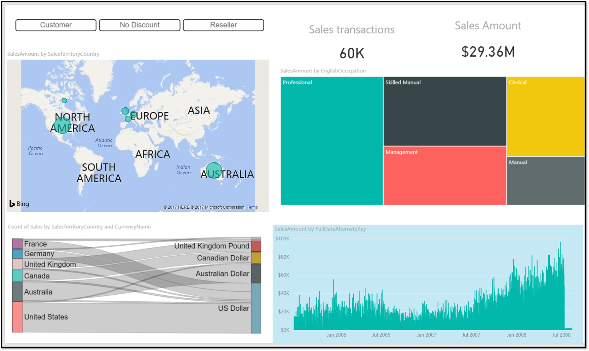

To make sure Contoso can filter data based on who is connecting, two roles are created in Power BI desktop. One to filter all the data from the SalesTerritory "Europe" and another for "North America".

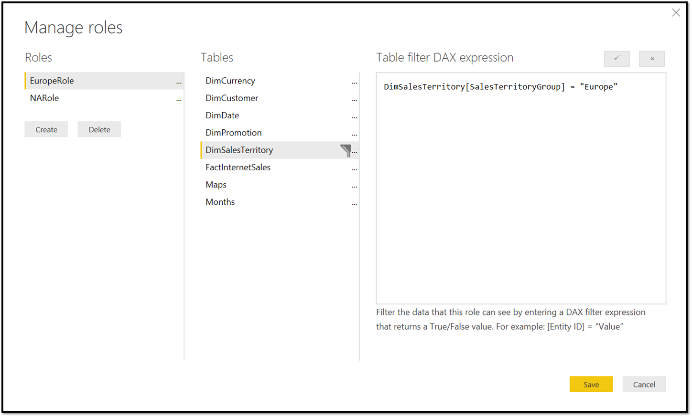

Whenever roles are defined in the report, a user must be assigned to a specific role for them to get access to any data. The assignment of roles happens inside the Power BI service ( **Semantic models > Security** ).

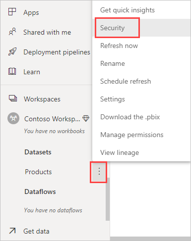

This opens a page where Contoso's BI team can see the two roles they created.  Now Contoso's BI team can assign users to the roles.

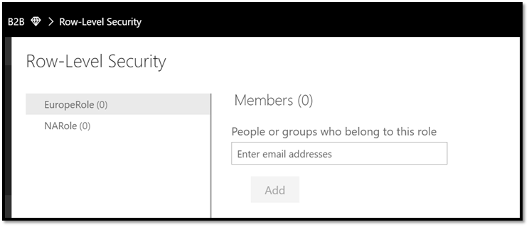

In the example Contoso is adding a user in a partner organization with email address `admin@fabrikam.com` to the Europe role:

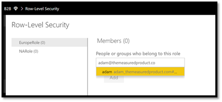

When this gets resolved by Microsoft Entra ID, Contoso can see the name show up in the window ready to be added:

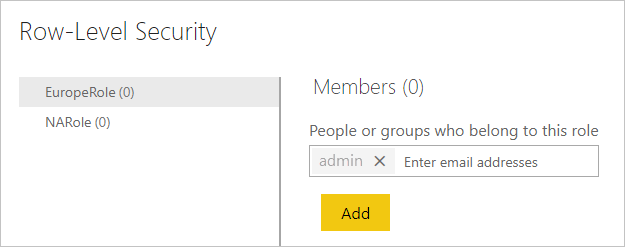

Now when this user opens the app that was shared with them, they only see a report with data from Europe:

### Dynamic row level security

Another interesting topic is to see how dynamic row level security (RLS) work with Microsoft Entra B2B.

In short, Dynamic row level security works by filtering data in the model based on the username of the person connecting to Power BI. Instead of adding multiple roles for groups of users, you define the users in the model. We won't describe the pattern in detail here. Kasper de Jong offers a detailed write up on all the flavors of row level security in [Power BI Desktop Dynamic security cheat sheet](https://www.kasperonbi.com/power-bi-desktop-dynamic-security-cheat-sheet/), and in [this whitepaper](https://download.microsoft.com/download/D/2/0/D20E1C5F-72EA-4505-9F26-FEF9550EFD44/Securing%20the%20Tabular%20BI%20Semantic%20Model.docx) .

Let's look at a small example - Contoso has a simple report on sales by groups:

Now this report needs to be shared with two guest users and an internal user - the internal user can see everything, but the guest users can only see the groups they have access to. This means we must filter the data only for the guest users. To filter the data appropriately, Contoso uses the Dynamic RLS pattern as described in the whitepaper and blog post. This means, Contoso adds the usernames to the data itself:

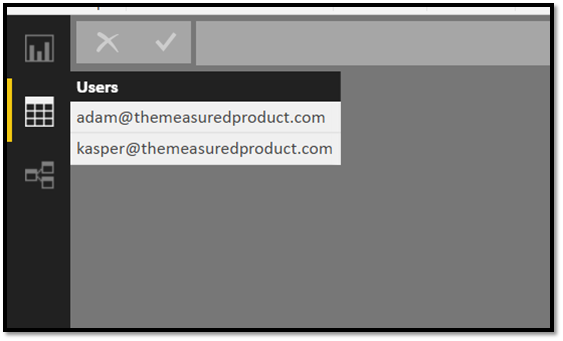

Then, Contoso creates the right data model that filters the data appropriately with the right relationships:

To filter the data automatically based on who is logged in, Contoso needs to create a role that passes in the user who is connecting. In this case, Contoso creates two roles – the first is the "securityrole" that filters the Users table with the current username of the user logged in to Power BI (this works even for Microsoft Entra B2B guest users).

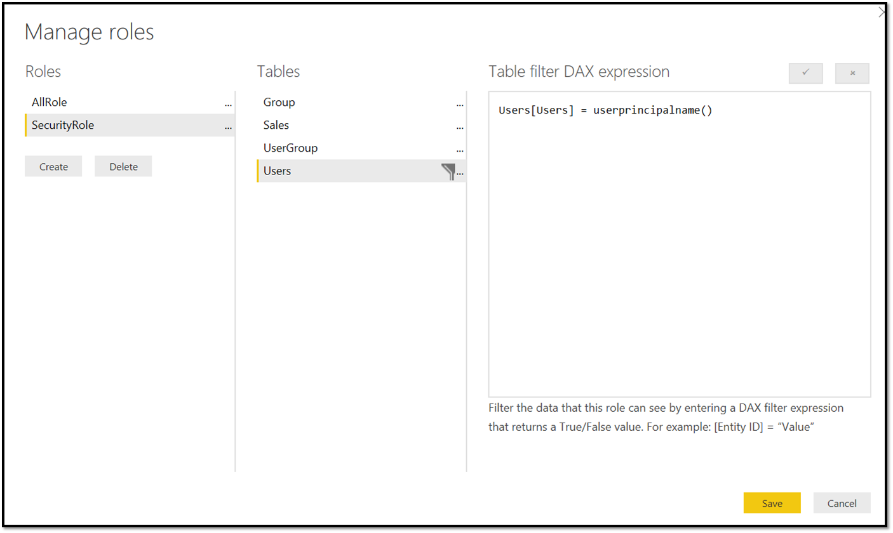

Contoso also creates another "AllRole" for its internal users who can see everything – this role doesn't have any security predicate.

After uploading the Power BI desktop file to the service, Contoso can assign guest users to the  "SecurityRole" and internal users to the "AllRole"

Now, when the guest users open the report, they only see sales from group A:

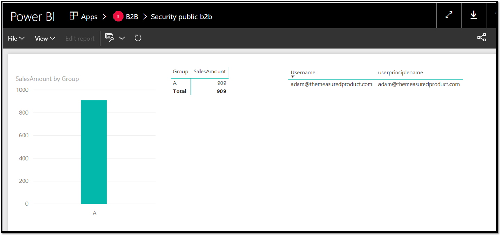

In the matrix to the right you can see the result of the USERNAME() and USERPRINCIPALNAME() function both return the guest users email address.

Now the internal user gets to see all the data:

As you can see, Dynamic RLS works with both internal or guest users.

> [!NOTE]
> This scenario also works when using a model in Azure Analysis Services. Usually your Azure Analysis Service is connected to the same Microsoft Entra ID as your Power BI - in that case, Azure Analysis Services also knows the guest users invited through Microsoft Entra B2B.

## Connecting to on premises data sources

Power BI offers the capability for Contoso to use on premises data sources like [SQL Server Analysis Services](https://powerbi.microsoft.com/documentation/powerbi-gateway-enterprise-manage-ssas/) or [SQL Server](https://powerbi.microsoft.com/documentation/powerbi-gateway-kerberos-for-sso-pbi-to-on-premises-data/) directly thanks to the [on-premises data gateway](https://powerbi.microsoft.com/documentation/powerbi-gateway-onprem/). It's even possible to sign on to those data sources with the same credentials as used with Power BI.

> [!NOTE]
> When installing a gateway to connect to your Power BI tenant, you must use a user created within your tenant. External users cannot install a gateway and connect it to your tenant._

For external users, this might be more complicated as the external users are usually not known to the on-premises AD. Power BI offers a workaround for this by allowing Contoso administrators to map the external usernames to internal usernames as described in [Manage your data source - Analysis Services](https://powerbi.microsoft.com/documentation/powerbi-gateway-enterprise-manage-ssas/). For example, [lucy@supplier1.com](mailto:lucy@supplier1.com) can be mapped to [lucy\_supplier1\_com#EXT@contoso.com](mailto:lucy_supplier1_com).

This method is fine if Contoso only has a handful of users or if Contoso can map all the external users to a single internal account. For more complex scenarios where each user needs their own credentials, there's a more advanced approach that uses [custom AD attributes](/previous-versions/windows/it-pro/windows-2000-server/cc961737(v=technet.10)) to do the mapping as described in [Manage your data source - Analysis Services](https://powerbi.microsoft.com/documentation/powerbi-gateway-enterprise-manage-ssas/). This would allow the Contoso administrator to define a mapping for every user in your Microsoft Entra ID (also external B2B users). These attributes can be set through the AD object model using scripts or code so Contoso can fully automate the mapping on invite or on a scheduled cadence.

## Governance

### Additional Microsoft Entra ID settings that affect experiences in Power BI related to Microsoft Entra B2B

When using Microsoft Entra B2B sharing, the Microsoft Entra administrator controls aspects of the external user's experience. These are controlled on the External collaboration settings page within the Microsoft Entra ID settings for your tenant.

For more information, see [Configure external collaboration settings](/azure/active-directory/b2b/delegate-invitations).

> [!NOTE]
> By default, the Guest users permissions are limited option is set to Yes, so Guest users within Power BI have limited experiences especially surround sharing where people picker UIs do not work for those users. It is important to work with your Microsoft Entra administrator to set it to No, as shown below to ensure a good experience.

### Control guest invites

Power BI administrators can control external sharing just for Power BI by visiting the Power BI admin portal. But admins can also control external sharing with various Microsoft Entra policies. These policies allow admins to:

- Turn off invitations by end users
- Only admins and users in the Guest Inviter role can invite
- Admins, the Guest Inviter role, and members can invite
- All users, including guests, can invite

You can read more about these policies in [Delegate invitations for Microsoft Entra B2B collaboration](/azure/active-directory/active-directory-b2b-delegate-invitations).

All Power BI actions by external users are also [audited in our auditing portal](https://powerbi.microsoft.com/documentation/powerbi-admin-auditing/).

### Conditional Access policies for guest users

Contoso can enforce conditional access policies for guest users who access content from the Contoso tenant. You can find detailed instructions in [Conditional access for B2B collaboration users](/azure/active-directory/active-directory-b2b-mfa-instructions).

## Common alternative approaches

While Microsoft Entra B2B makes it easy to share data and reports across organizations, there are several other approaches that are commonly used and may be superior in certain cases.

### Alternative Option 1: Create duplicate identities for partner users

With this option, Contoso had to manually create duplicate identities for each partner user in the Contoso Tenant, as shown in the following image. Then within Power BI, Contoso can share to the assigned identities the appropriate reports, dashboards, or apps.

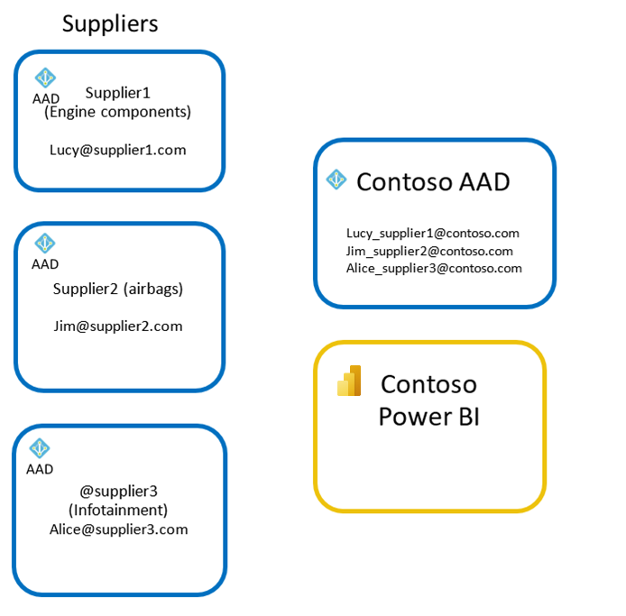

Reasons to choose this alternative:

- Since the user's identity is controlled by your organization, any related service such as email, SharePoint, etc. are also within the control of your organization. Your IT Administrators can reset passwords, disable access to accounts, or audit activities in these services.
- Users who use personal accounts for their business often are restricted from accessing certain services so may need an organizational account.
- Some services only work over your organization's users. For example, using Intune to manage content on the personal/mobile devices of external users using Microsoft Entra B2B may not be possible.

Reasons not to choose this alternative:

- Users from partner organizations must remember two sets of credentials– one to access content from their own organization and the other to access content from Contoso. This is a hassle for these guest users and many guest users are confused by this experience.
- Contoso must purchase and assign per-user licenses to these users. If a user needs to receive email or use office applications, they need the appropriate licenses, including Power BI Pro to edit and share content in Power BI.
- Contoso might want to enforce more stringent authorization and governance policies for external users compared to internal users. To achieve this, Contoso needs to create an in-house nomenclature for external users and all Contoso users need to be educated about this nomenclature.
- When the user leaves their organization, they continue to have access to Contoso's resources until the Contoso admin manually deletes their account
- Contoso admins have to manage the identity for the guest, including creation, password resets, etc.

### Alternative Option 2: Create a custom Power BI Embedded application using custom authentication

Another option for Contoso is to build its own custom embedded Power BI application with custom authentication (['App owns data'](../developer/embedded/embed-sample-for-customers.md)). While many organizations don't have the time or resources to create a custom application to distribute Power BI content to their external partners, for some organizations this is the best approach and deserves serious consideration.

Often, organizations have existing partner portals that centralize access to all organizational resources for partners, provide isolation from internal organizational resources, and provide streamlined experiences for partners to support many partners and their individual users.

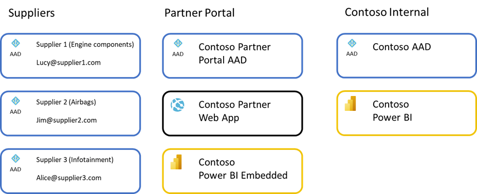

In the example above, users from each supplier sign in to Contoso's Partner Portal that uses Microsoft Entra ID as an identity provider. It could use Microsoft Entra B2B, Azure Active Directory B2C, native identities, or federate with any number of other identity providers. The user would sign in and access a partner portal build using Azure Web App or a similar infrastructure.

Within the web app, Power BI reports are embedded from a Power BI Embedded deployment. The web app would streamline access to the reports and any related services in a cohesive experience aimed at making it easy for suppliers to interact with Contoso. This portal environment would be isolated from the Contoso internal Microsoft Entra ID and Contoso's internal Power BI environment to ensure suppliers couldn't access those resources. Typically, data would be stored in a separate Partner data warehouse to ensure isolation of data as well. This isolation has benefits since it limits the number of external users with direct access to your organization's data, limiting what data could potentially be available to the external user, and limiting accidental sharing with external users.

Using Power BI Embedded, the portal can use advantageous licensing, using an app token or the master user plus premium capacity purchased in Azure model, which simplifies concerns about assigning licenses to end users, and can scale up/down based on expected usage. The portal can offer an overall higher quality and consistent experience since partners access a single portal designed with all of a Partner's needs in mind. Lastly, since Power BI Embedded based solutions are typically designed to be multi-tenant, it makes it easier to ensure isolation between partner organizations.

Reasons to choose this alternative:

- Easier to manage as the number of partner organizations grows. Since partners are added to a separate directory isolated from Contoso's internal Microsoft Entra directory, it simplifies IT's governance duties and helps prevent accidental sharing of internal data to external users.
- Typical Partner Portals are highly branded experiences with consistent experiences across partners and streamlined to meet the needs of typical partners. Contoso can therefore offer a better overall experience to partners by integrating all required services into a single portal.
- Licensing costs for advanced scenarios like Editing content within the Power BI Embedded is covered by the Azure purchased Power BI Premium, and doesn't require assignment of Power BI Pro licenses to those users.
- Provides better isolation across partners if architected as a multi-tenant solution.
- The Partner Portal often includes other tools for partners beyond Power BI reports, dashboards, and apps.

Reasons not to choose this alternative:

- Significant effort is required to build, operate, and maintain such a portal making it a significant investment in resources and time.
- Time to solution is much longer than using B2B sharing since careful planning and execution across multiple workstreams is required.
- Where there are a smaller number of partners the effort required for this alternative is likely too high to justify.
- Collaboration with ad-hoc sharing is the primary scenario faced by your organization.
- The reports and dashboards are different for each partner. This alternative introduces management overhead beyond just sharing directly with Partners.

## FAQ

**Can Contoso send an invitation that is automatically redeemed, so that the user is just "ready to go"? Or does the user always have to click through to the redemption URL?**

The end user must always click through the consent experience before they can access content.

If you'll be inviting many guest users, we recommend that you delegate this from your core Microsoft Entra admins by [adding a user to the guest inviter role in the resource organization](/azure/active-directory/external-identities/add-users-administrator). This user can invite other users in the partner organization by using the sign-in UI, PowerShell scripts, or APIs. This reduces the administrative burden on your Microsoft Entra admins to invite or resent invites to users at the partner organization.

**Can Contoso force multi-factor authentication for guest users if its partners don't have multi-factor authentication?**

Yes. For more information, see [Conditional access for B2B collaboration users](/azure/active-directory/active-directory-b2b-mfa-instructions).

**How does B2B collaboration work when the invited partner is using federation to add their own on-premises authentication?**

If the partner has a Microsoft Entra tenant that is federated to the on-premises authentication infrastructure, on-premises single sign-on (SSO) is automatically achieved. If the partner doesn't have a Microsoft Entra tenant, a Microsoft Entra account may be created for new users.

**Can I invite guest users with consumer email accounts?**

Inviting guest users with consumer email accounts is supported in Power BI. This includes domains such as hotmail.com, outlook.com, and gmail.com. However, those users may experience limitations beyond what users with work or school accounts encounter.
