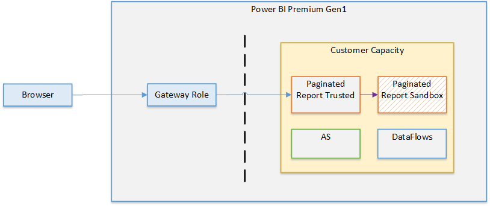
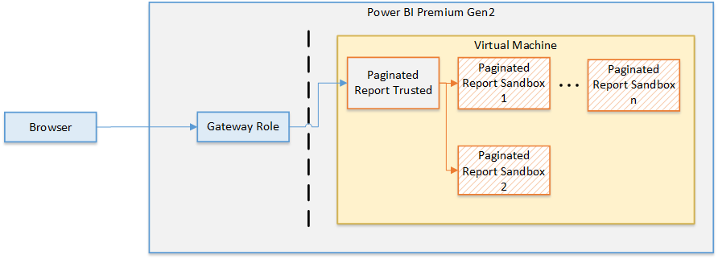

# Power BI security whitepaper

**Summary:** Power BI is an online software service (*SaaS*, or Software as a Service) offering from Microsoft that lets you easily and quickly create self-service Business Intelligence dashboards, reports, datasets, and visualizations. With Power BI, you can connect to many different data sources, combine and shape data from those connections, then create reports and dashboards that can be shared with others.

**Writers:** Yitzhak Kesselman, Paddy Osborne, Matt Neely, Tony Bencic, Srinivasan Turuvekere, Cristian Petculescu, Adi Regev, Naveen Sivaraj, Ben Glastein, Evgeny Tshiorny, Arthi Ramasubramanian Iyer, Sid Jayadevan, Ronald Chang, Ori Eduar, Anton Fritz, Idan Sheinberg, Ron Gilad, Sagiv Hadaya, Paul Inbar, Igor Uzhviev, Michael Roth, Jamie Tarquino, Gennady Pats, Orion Lee, Yury Berezansky, Maya Shenhav, Romit Chattopadhyay, Yariv Maimon, Bogdan Crivat

**Technical Reviewers:** Cristian Petculescu, Amir Netz, Sergei Gundorov

**Applies to:** Power BI SaaS, Power BI Desktop, Power BI Premium, Power BI Embedded, Power BI Mobile

> [!NOTE]
> You can save or print this whitepaper by selecting **Print** from your browser, then selecting **Save as PDF**.

## Introduction

**Power BI** is an online software service (*SaaS*, or Software as a Service) offering from Microsoft that lets you easily and quickly create self-service Business Intelligence dashboards, reports, datasets, and visualizations. With Power BI, you can connect to many different data sources, combine and shape data from those connections, then create reports and dashboards that can be shared with others.

The world is rapidly changing; organizations are going through an accelerated digital transformation, and we are seeing a massive increase in remote working, increased customer demand for online services, and increased use of advanced technologies in operations and business decision-making. And all of this is powered by the cloud.

As the transition to the cloud has changed from a trickle to a flood, and with the new, exposed surface area that comes with it, more and more companies are asking *how secure is my data in the cloud?* and *what end-to protection is available to prevent my sensitive data from leaking?* And for the BI platforms that often handle some of the most strategic information in the enterprise, these questions are doubly important.

The decades-old foundation of the BI security model - object-level and row-level security - while still important, are clearly no longer sufficient for providing the kind of security that is needed in the cloud era. Instead, organizations must look for a cloud-native, multi-tiered, defense-in-depth security solution for their business intelligence data.

Power BI was built to provide industry-leading complete and hermetic protection for data. The product has earned the highest security classifications available in the industry, and today many national security agencies, financial institutions, and health care providers entrust it with their most sensitive information.

It all starts with the foundation. After a rough period in the early 2000s, Microsoft made massive investments to address its vulnerabilities, and in the following decades built a very strong security stack that goes as deep as the machine on-chip bios kernel and extends all the way up to the end-user experience. These deep investments continue, and today over 3,500 Microsoft engineers are engaged in building and enhancing its security stack and proactively addressing the ever-shifting threat landscape. With billions of computers, trillions of logins, and countless zettabytes of information entrusted to Microsoft’s protection, the company now possesses the most advanced security stack in the tech industry and is broadly viewed as the global leader in fighting malicious actors.

Power BI builds on this very strong foundation. It uses the same security stack that earned Azure the right to serve and protect the world’s most sensitive data, and it integrates with the most advanced information protection and compliance tools of Microsoft 365. On top of these, it delivers security through multi-layered security measures, resulting in end-to-end protection designed to deal with the unique challenges of the cloud.

+++++++

To provide an end-to-end solution to protect sensitive assets, the product team needed to address challenges on multiple simultaneous fronts: “How we control who connects? From where they can connect? How they connect and how we can control connections?” it continues to “how is the data stored? How is it encrypted? What controls do I have on my data?” Moreover, “How can I control and protect sensitive data? How do I ensure this data cannot leak outside the organization?” and ends with, “How do I audit who conducts what operations? How do I react quickly in case of suspicious activity within the service?”.

+++++++

This article provides a comprehensive answer to all these questions. It starts with an overview of the service architecture and explains how the main flows in the system work. It then moves on to describe how users authenticate to Power BI, how data connections are established, and how Power BI stores and moves data through the service. The last section discusses the security features that allow you as the service admin to protect your most valuable assets.

The Power BI service is governed by the [Microsoft Online Services Terms](https://www.microsoftvolumelicensing.com/DocumentSearch.aspx?Mode=3&amp;DocumentTypeId=31) **[link in word doc: https://www.microsoft.com/en-us/licensing/product-licensing/products]**, and the [Microsoft Enterprise Privacy Statement](https://www.microsoft.com/privacystatement/OnlineServices/Default.aspx). For the location of data processing, refer to the Location of Data Processing terms in the Microsoft Online Services Terms and to the Data Protection Addendum **[where is this??]**. For compliance information, the [Microsoft Trust Center](https://www.microsoft.com/trust-center/product-overview) **[docx has https://www.microsoft.com/trustcenter]** is the primary resource for Power BI. The Power BI team is working hard to bring its customers the latest innovations and productivity. Learn more about compliance in the [Microsoft compliance offerings](/compliance/regulatory/offering-home).

Power BI service follows the Security Development Lifecycle (SDL), strict security practices that support security assurance and compliance requirements. The SDL helps developers build more secure software by reducing the number and severity of vulnerabilities in software, while reducing development cost. Learn more at [Microsoft Security Development Lifecycle Practices](https://www.microsoft.com/securityengineering/sdl/practices).

## Power BI Architecture

The **Power BI** service is built on **Azure**, Microsoft's [cloud computing platform](https://azure.microsoft.com/overview/what-is-azure/). Power BI is currently deployed in many datacenters around the world – there are many active deployments made available to customers in the regions served by those datacenters, and an equal number of passive deployments that serve as backups for each active deployment.

### Web Front End Cluster (WFE)

The **WFE** cluster provides the user's browser with the initial HTML page contents on site load and manages the initial connection and authentication process for Power BI, using AAD to authenticate clients and provide tokens for subsequent client connections to the Power BI Band End service.

A WFE cluster consists of an ASP.NET website running in the [Azure App Service Environment](/azure/app-service/environment/intro). When users attempt to connect to the Power BI service, the client's DNS service may communicate with the Azure Traffic Manager to find the most appropriate (usually nearest) datacenter with a Power BI deployment. For more information about this process, see [Performance traffic-routing method for Azure Traffic Manager](/azure/traffic-manager/traffic-manager-routing-methods#performance-traffic-routing-method).

The WFE cluster assigned to the user manages the login and authentication sequence (described later in this article) and obtains an AAD access token once authentication is successful. The ASP.NET component within the WFE cluster parses the token to determine which organization the user belongs to, and then consults the Power BI Global Service. The WFE specifies to the browser which Back End cluster houses the organization's tenant. Once a user is authenticated, subsequent client interactions for customer data occur with the Back End or Premium cluster directly, without the WFE being an intermediator for those requests.

Static resources such as *.js, *.css, and image files are mostly stored on Azure CDN and retrieved directly by the browser. Note that Sovereign Government cluster deployments are an exception to this rule, will omit the CDN and instead use a WFE cluster from a compliant region for hosting static content for compliance reasons.

### Power BI Back End Cluster (BE)

The backend cluster is a backbone of all the functionality available in Power BI. It consists of several service endpoints consumed by Web Front End and API clients as well as background working services, databases, caches, and a variety of other components.

The Back End is available in most Azure regions, and is being deployed into new regions as they become available. A single Azure region hosts one or more Back End clusters that allow unlimited horizontal scaling of the Power BI service once the vertical and horizontal scaling limits of a single cluster are exhausted.

Each Back End cluster is stateful and hosts all the data of all the tenants assigned to that cluster. A cluster that contains the data of a specific tenant is referred to as the tenant’s home cluster. The home cluster information of an authenticated user is provided by Global Service and used by the Web Front End to route requests to the tenant’s home cluster. 

Each Back End cluster consists of multiple virtual machines combined into multiple resizable scale sets tuned for performing specific tasks, stateful resources such as SQL databases, storage accounts, service buses, caches, and other necessary cloud components.

Tenant metadata and data are stored within cluster limits except for data replication to a secondary backend cluster in a paired Azure region in the same Azure geography. 
The secondary backend cluster serves as a failover cluster in case of regional outage, and is passive at any other time.

The Back End functionality is served by micro-services running on different machines within the cluster’s virtual network not accessible from outside except for two components accessible from public internet:
* Gateway Service
* Azure API Management

### Power BI Premium Infrastructure

Power BI Premium offers a service for subscribers that require premium Power BI features (for instance, Dataflows, Paginated Reports, AI, etc.). When a customer signs up for a Power BI Premium subscription, the Premium capacity is created through the Azure Resource Manager. 

Power BI Premium capacities are hosted in independent (from regular Power BI Backend – see above) backend clusters. This provides better isolation, resource allocation, supportability, security isolation, and scalability of the Premium offering.

The following diagram illustrates the architecture of Power BI Premium infrastructure:

The connection to Power BI Premium infrastructure can be done in multiple ways, depending on the user scenario. Power BI Premium clients can be a user's browser, a regular Power BI Backend, direct connections via XMLA clients, ARM APIs, etc.

Power BI Premium infrastructure in an Azure region consists of multiple Power BI Premium clusters (minimum 1). The majority of the Premium resources are incapsulated inside a cluster (for instance, compute), and there are some common regional resources (e.g. Metadata store). Premium infrastructure allows two ways of horizontal scalability in a region: increase resources inside clusters, and/or add more clusters on demand as needed (if cluster resources are approaching their limits).

The backbone of each cluster are compute resources managed by VMSS and Service Fabric. VMSS and Service Fabric allows fast and painless increase of compute nodes as usage growth and orchestrates Power BI Premium services and applications deployment, management and monitoring. 

There are many surrounding resources which ensure secure and reliable infrastructure: load balancers, virtual networks, network security groups, service bus, storage, etc. Any secrets, keys, certificates required for Power BI Premium are managed by Azure Key Vault exclusively. Any authentication is done via integration with Azure Active Directory exclusively.

Any request that comes to Power BI Premium infrastructure goes to Frontend nodes first – they are the only nodes available for external connections, the rest of the resources are hidden behind virtual networks. Frontend nodes authenticate the request, handle it or forward it to the appropriate resources (e.g. backend nodes).

Backend nodes provide most of the Power BI Premium capabilities and features.

### Power BI Mobile   

Power BI Mobile is a collection of apps designed for the three primary mobile platforms: Android, iOS, and Windows (UWP). Security considerations for Power BI Mobile apps fall into two categories:
* Device communication
* The application and data on the device

For device communication, all Power BI Mobile applications communicate with the Power BI service, and use the same connection and authentication sequences used by browsers, which are described in detail earlier in this whitepaper. The iOS and Android Power BI mobile applications bring up a browser session within the application itself, and the Windows mobile app brings up a broker to establish the communication channel with Power BI (for the sign in process).

The following table lists support of certificate-based authentication (CBA) for Power BI Mobile based on mobile device platform:

|CBA support  |iOS  |Android  |Windows  |
|---------|---------|---------|---------|
|Power BI (sign in to service)    |Supported         |Supported         |Not supported         |
|SSRS ADFS on-prem (connect to SSRS server)     |Not supported         |Supported         |Not supported         |
|SSRS App Proxy     |Supported         |Supported         |Not supported         |

Power BI Mobile apps actively communicate with the Power BI service. Telemetry is used to gather mobile app usage statistics and similar data, which is transmitted to services that are used to monitor usage and activity; no customer data is sent with telemetry.

The Power BI application stores data on the device that facilitates use of the app:
* Azure Active Directory and refresh tokens are stored in a secure mechanism on the device, using industry standard security measures.
* Data and settings (key-value pairs for user configuration) is cached in storage on the device, and can be encrypted by the OS (in iOS this is automatically done when the user sets passcode, in Android this can be configured in the setting and in Windows by using bit-locker)
* For the Android and iOS apps the data and settings (key-value pairs for user configuration) are cached in a storage on the device in a sandbox and internal storage which is accessible only to the app. For the Windows app the data is only accessible by the user (and system admin).
* Geolocation are enabled or disabled explicitly by the user. If enabled, the geolocation data is not saved on the device and it is not shared with Microsoft.
* Notifications are enabled or disabled explicitly by the user. If enabled, Android and iOS do not support geo-residency for notifications.

Data encryption can be enhanced by applying file-level encryption via Microsoft Intune.

All three platforms for which Power BI Mobile is available support Microsoft Intune, a software service that provides mobile device and application management. With Intune enabled and configured, data on the mobile device is encrypted, and the Power BI application itself cannot be installed on an SD card. You can [learn more about Microsoft Intune](https://www.microsoft.com/cloud-platform/microsoft-intune).

The Windows app also supports WIP - [learn more about it](/windows/security/information-protection/windows-information-protection/protect-enterprise-data-using-wip).

In order to implement SSO - some secured storage values related to the token-based authentication are available for other Microsoft 1st party apps (like Microsoft Authenticator) and are managed by the ADAL SDK.  

The Power BI Mobile cached data is deleted when the app is removed; the user signs out of Power BI Mobile; or the user fails to sign in (such as a token expiration event, or password change). The data cache includes dashboards and reports previously accessed from the Power BI Mobile app.

Power BI Mobile does not access other applications folders or files on the device.

The Power BI apps for iOS and Android let you protect your data by configuring additional identification - providing Face ID, Touch ID, or a passcode for iOS and biometric data (Fingerprint ID) for Android. [Learn more about it](../consumer/mobile/mobile-native-secure-access.md).

## Authentication to the Power BI Service

User authentication to the Power BI service consists of a series of requests, responses, and redirects between the user's browser and the Power BI service or the Azure services used by Power BI. That sequence describes the process of user authentication in Power BI, which follows [Azure Active Directory's auth code grant flow](/azure/active-directory/develop/v2-oauth2-auth-code-flow). For more information about options for an organization's user authentication models (sign-in models), see [Choosing a sign-in model for Microsoft 365](https://blogs.office.com/2014/05/13/choosing-a-sign-in-model-for-office-365/).

### Authentication Sequence

The user authentication sequence for the Power BI service occurs as described in the following steps, which are illustrated in the following image.

1. A user initiates a connection to the Power BI service from a browser, either by typing in the Power BI address in the address bar or by selecting "Sign In" from the Power BI landing page (https://powerbi.microsoft.com). The connection is established using TLS 1.2 and HTTPS, and all subsequent communication between the browser and the Power BI service uses HTTPS.

1. The Azure Traffic Manager checks the user's DNS record to determine the most appropriate (usually nearest) datacenter where Power BI is deployed and responds to the DNS with the IP address of the WFE cluster to which the user should be sent.

1. WFE then redirects the user to Microsoft Online Services login page.

1. Once the user is authenticated, the login page redirects the user to the previously determined nearest Power BI service WFE cluster with an auth code.

1. The WFE cluster checks with the Azure Active Directory (AAD) service to obtain an AAD security token by using the auth code. When AAD returns successful authentication of the user and returns an AAD security token, the WFE cluster consults the Power BI Global Service, which maintains a list of tenants and their Power BI Back-End cluster locations and determines which Power BI Back-End service cluster contains the user's tenant. The WFE cluster then returns an application page to the user's browser with session, access and routing information required for its operation. 

1. Now when the client's browser requires customer data, it will send requests to the Back-End cluster address with the AAD access token in the Authorization header. The Power BI Back-End cluster will read the AAD access token and validates the signature to ensure that the identity for the request is valid. The [AAD access token has a default lifetime of 1 hour](/azure/active-directory/develop/active-directory-configurable-token-lifetimes#configurable-token-lifetime-properties-after-the-retirement), and the user's browser will make periodic requests to renew the access token before it reaches expiry to maintain the current session.

## Data Residency

Unless otherwise indicated in documentation, Power BI stores customer data in an Azure geography that is assigned when an [Azure Active Directory (AAD) tenant](/office365/enterprise/subscriptions-licenses-accounts-and-tenants-for-microsoft-cloud-offerings) signs-up for Power BI services for the first time. An AAD tenant houses the user and application identities, groups and other relevant information pertaining to an organization and its security. 

The assignment of Azure geography for tenant data storage is done by mapping the country or region that is selected as part of the AAD tenant setup to the best Azure geography where a Power BI deployment exists. Once this determination is made, all Power BI customer data will be stored in this chosen Azure geography (aka home geo), except in cases where organizations utilize multi-geo deployments.

### Multiple Geographies (Multi-geo)

Some organizations have a global presence and may require Power BI services in multiple Azure geographies. For example, a business may have their headquarters in the United States but may also do business in other geographical areas, such as Australia. In such cases the business may additionally require that certain Power BI data remains stored at rest in the remote region to comply with local regulations. This feature of the Power BI service is referred to as multi-geo.

The query execution layer, query caches and artifact data that is assigned to a multi-geo workspace are hosted and remain in the remote capacity Azure geography. However, some artifact metadata like report structure may remain stored at rest in the tenant home geography. Additionally, some data transit and processing may still happen in the tenant home geography even for workspaces that are hosted in a multi-geo Premium capacity.
Please see Configure Multi-Geo support for Power BI Premium(../admin/service-admin-premium-multi-geo.md) for more information about creating and managing Power BI deployments that span multiple Azure geographies.

### Regions and Datacenters

Power BI services are available in specific Azure geographies as described in the [Microsoft Trust Center](https://www.microsoft.com/TrustCenter/CloudServices/business-application-platform/data-location). For more information on where your data is stored and how it is used, please refer to the [Microsoft Trust Center](https://www.microsoft.com/TrustCenter/Transparency/default.aspx#_You_know_where). Commitments about the location of customer data at rest are specified in the Data Processing Terms of the [Microsoft Online Services Terms](https://www.microsoftvolumelicensing.com/DocumentSearch.aspx?Mode=3&DocumentTypeId=31).

Microsoft also provides datacenters for sovereignties. For more information about Power BI service availability for national clouds, see [Power BI national clouds](https://powerbi.microsoft.com/clouds/). 

## Data Handling

This section outlines Power BI data handling practices when it comes to storing, processing, and transferring customer data.

### Data at Rest

Power BI uses two primary data storage resource types:
* Azure Storage
* Azure SQL Databases

In majority of scenarios Azure Storage is utilized to persist the data of Power BI artifacts, while Azure SQL Databases are used to persist artifact metadata. 

All data persisted by Power BI is encrypted by default using Microsoft managed keys. Customer data that is stored in Azure SQL Databases is fully encrypted using [Azure SQL's Transparent Data Encryption](/azure/sql-database/transparent-data-encryption-azure-sql) (TDE) technology. Customer data that is stored in Azure Blob storage is encrypted using [Azure Storage Encryption](/azure/storage/common/storage-service-encryption).

Optionally, organizations can utilize Power BI Premium to use their own keys to encrypt data at rest that is imported into a dataset. This approach is often described as bring your own key (BYOK). Utilizing BYOK helps ensure that even in cases of a service operator error, customer data will not be exposed – something that cannot be easily achieved using transparent service side encryption. Please see [Bring Your Own Encryption Keys for Power BI](../admin/service-encryption-byok.md) for more information.

Power BI datasets allow for a variety of data source connection modes which will determine whether the data source data is persisted in the service or not.

|Dataset Mode (Kind)   |Data Persisted in Power BI |
|----------------------|---------------------------|
|**Import**            |Yes |
|**Direct Query**      |No |
|**Live Connect**      |No |
|**Composite**         |If contains an Import data source |
|**Streaming**         |If configured to persist |

Regardless of the dataset mode utilized, Power BI may temporarily cache any retrieved data to optimize query and report load performance.

### Data in Processing

Data is in processing when it is either actively being used by one or more users as part of an interactive scenario, or when a background process like refresh touches this data. When data is processed in this way, Power BI loads it into the memory space of a service workload dedicated to processing that the associated asset. The processed data in memory is not encrypted to facilitate the functionality required by the workload.

### Data in Transit
Power BI requires all incoming HTTP traffic to be encrypted using TLS 1.2 or above. Any requests attempting to use the service with TLS 1.1 or lower will be rejected.

## Authentication to Data Sources

When connecting to a data source, a user can choose to import a copy of the data to Power BI or connect directly to the data source. 

In the import case, a user establishes a connection based on the user's login and accesses the data with the credential. After the dataset is published to Power BI service, Power BI always uses this user's credential to import data. Once data is imported, viewing the data in reports and dashboard does not access underly data source. Power BI supports single sign-on authentication for selected data sources. If the connection is configured to use single sign-on, dataset owner's credential is used to connect with the data source.

If a data source is connected directly using pre-configured credential, the pre-configured credential is used to connect to data source when any user views the data. If a data source is connected directly using single sign-on, the current user's credential is used to connect to the data source when a user views the data. When using with single sign-on, Row Level Security (RLS) could be implemented on the data source and that allows users to view data they have privilege to access. When connection is to data sources in the cloud, AAD authentication is used for single sign on; for on prem data sources Kerberos, SAML and AAD are supported.

If the data source is Azure Analysis Services or on-premises Analysis Services and Row Level Security (RLS) is configured, Power BI service will apply that row level security, and users who do not have sufficient credentials to access the underlying data (which could be a query used in a dashboard, report, or other data artifact) will not see data for which the user does not have sufficient privileges.

## Premium Features

### Dataflows Architecture

Dataflows provide users the capability to configure backend data processing operations that will extract data from polymorphous data sources, execute transformation logic against the data, and then land it in a target model for use across various reporting presentation technologies. Any user who has either the member or admin role in a workspace may create a dataflow. Users in the reader role may view data processed by the dataflow but may not make changes to its composition. Once a dataflow has been authored, any member or admin of the workspace may schedule refreshes as well as view and edit the dataflow by taking ownership of it.

Each configured data source is bound to a client technology for accessing that data source. The structure of credentials required to access them is formed to match required implementation details of the data source. Transformation logic is applied by power query services while the data is in flight. For premium dataflows, power query services execute in backend nodes. Data may be pulled directly from the cloud sources or through a gateway installed on premises. When pulled directly from a cloud source to the service or to the gateway, the transport uses protection methodology specific to the client technology, if applicable. When data is transferred from the gateway to the cloud service, it is encrypted . See the Data in Process section below.

When customer specified data sources require credentials for access, the owner/creator of the dataflow will provide them during authoring. They are the stored using standard product wide credential storage. See the User Authentication to Data Sources section below. There are various approaches users may configure to optimize data persistence and access. By default, the data is placed in a Power BI owned and protected storage account. Store encryption is enabled on the Blob storage containers to protect the data while it is at rest. See the Data Encryption at Rest section below. Users may, however, configure their own storage account associated with their own Azure subscription. When doing so, Power BI service principal is granted access to that store, so that it may write the data there during refresh. In this case, users are in control of whatever store-based encryption methods they choose to use in their ALDS instance.  Data is always transmitted to blob storage using encryption.

Since performance when accessing storage accounts may be suboptimal for some data, users also have the option to use a Power BI hosted compute engine to increase performance. In this case, data is redundantly stored in a SQL database available for direct query through access by the back end Power BI system. Data is always encrypted on the file system. If the user provides a key for encrypting the data stored in the SQL database, then that key will be used to doubly encrypt it. 

When querying using direct query, the encrypted transport protocol https is used to access to the API. All secondary or indirect use of it is controlled by the same access controls previously described. Since dataflows are always bound to a workspace, access to the data is always gated by the users' role in that workspace. A user must have at least read access to be able to query the data via any means.

When Power BI desktop is used to access data in a dataflow, it must first authenticate the user using Active Directory to determine if the user has sufficient rights to view the data. If so, a SaS key is acquired and used to access storage directly using the encrypted transport protocol https.

The processing of data throughout the pipeline will emit Office 365 auditing events. Some of these events will capture security and privacy-related operations. 

### Paginated Reports

Paginated reports are designed to be printed or shared. They're called paginated because they're formatted to fit well on a page. They display all the data in a table, even if the table spans multiple pages. They're also called pixel perfect because you can control their report page layout exactly.

Paginated reports support rich and powerful expressions written in Microsoft Visual Basic .Net, expressions are widely used throughout Power BI Report Builder paginated reports to retrieve, calculate, display, group, sort, filter, parameterize, and format data.

Expressions are created by the author of the report with access to a broad range of features of the .Net framework, in lieu of this flexibility the processing and execution of paginated reports is performed inside a sandbox.

The paginated report definitions (.rdl) are stored in Power BI, and a user needs to authenticate and authorize in the same way as described in the user authentication section.

The AAD token obtained during the authentication is used to communicate directly from the browser to the Power BI Premium cluster.
For Premium Gen1, a single sandbox exists per each one of the capacities of the tenant, and is shared for by the workspaces assigned to the capacity.

For Premium Gen2 (in preview), an individual and exclusive ephemeral sandbox is created for each one of the renders of a report, providing a higher level of isolation among users.

A paginated report can access a wide set of data sources as part of the rendering of the report, the sandbox doesn't communicate directly with any of the data sources but instead it communicates with the trusted process to request data and then the trusted process appends the required credentials to the connection, in this way the sandbox never has access to any credential or secret. 

In order to support features like Bing maps or calls to Azure Functions, the sandbox does have access to the internet.

### AI Features

PowerBI currently supports two broad categories of AI features in the product today: AI visuals and AI enrichments. The visual level AI features include capabilities like Key-Influencers, Decomposition-Tree, Smart-Narrative, Anomaly-Detection, R-visual, Python-visual, Clustering, Forecasting, Q&A, Quick-Insights etc. The AI enrichment capabilities include capabilities like AutoML, AzureML, CognitiveServices, R/Python transforms etc. 

Most of the above features are supported in both Shared and Premium workspaces today. However, AutoML and CognitiveServices are supported only on premium workspaces due to some IP restrictions. Today, with AutoML integration in PowerBI, a user can build and train a custom ML model (e.g. Prediction, Classification, Regression etc) and apply it to get predictions while loading data into a dataflow defined in a premium workspace. Additionally, PowerBI users can apply several CognitiveServices APIs like TextAnalytics & ImageTagging to transform data before loading into a Dataflow/Dataset defined in a premium workspace. 

The Premium AI enrichment features can be best viewed as a collection of stateless AI functions/transforms that can be used by PowerBI users in their data integration pipelines used by a PowerBI dataset or dataflow. Note that these functions can also be accessed from current dataflow/dataset authoring environments in PowerBI Service and PowerBI Desktop. These AI functions/transforms always run in aa premium workspace/capacity. Hence, these functions are surfaced using in PowerBI as a Datasource that requires an AAD Token for the PowerBI user who is using the AI function. These AI Datasources are special because they do not surface any of their own data and they only supply these functions/transforms. During execution, these features do not make any outbound calls to other services to transmit customer's data. Now let us look at the premium scenarios individually to understand the communication patterns and relevant security related details pertaining to those. 

For training and applying an AutoML model, PowerBI uses Azure AutoML SDK and runs all the training in the customer's PowerBI capacity. During training iterations, PowerBI calls an experimentation AzureML service to select a suitable model and hyper-parameters for the current iteration. In this outbound call, only relevant experiment metadata (e.g. accuracy, ml algorithm, algorithm parameters etc) from the previous iteration is sent. The AutoML training produces an ONNX model and training report data that is then saved in the dataflow. Later PowerBI users can then apply the  trained ML model as a transform to operationalize the ML model on a scheduled basis.For TextAnalytics and Imagetagging APIs, PowerBI does not directly call the CognitiveServices service APIs but instead uses an internal SDK to run the APIs in the PowerBI premium capacity. These APIs are today supported in both PowerBI dataflows and datasets. While authoring a dataset in PowerBI Desktop, users can only access this functionality if they have access to a premium PowerBI workspace. Hence, customers are prompted to specify their AAD credential. 

## Network Isolation

This section outlines advanced security features in Power BI. Some of the features have specific licensing requirements. See the sections below for details.

### Service Tags

A service tag represents a group of IP address prefixes from a given Azure service. It helps to minimize complexity of frequent updates on network security rules. Customers can use service tags to define network access controls on [Network Security Groups](/azure/virtual-network/security-overview#security-rules) or [Azure Firewall](/azure/firewall/service-tags). Customers can use service tags in place of specific IP addresses when creating security rules. By specifying the service tag name (e.g., PowerBI) in the appropriate source or destination (for APIs) field of a rule, customers can allow or deny the traffic for the corresponding service. Microsoft manages the address prefixes encompassed by the service tag and automatically updates the service tag as addresses change.

### Private links integration

Azure networking provides the Azure Private Links feature that enables Power BI to provide secure access via Azure Networking Private endpoints. With Azure Private Links and Private Endpoints, data traffic is sent privately using Microsoft's backbone network infrastructure, and thus the data doesn't traverse the Internet.

Private links ensure that Power BI users use the Microsoft private network backbone when going to resources in the Power BI service.

Using Private Links with Power BI provides the following benefits:
* Private Links ensure that traffic will flow over the Azure backbone to a private endpoint for Azure cloud-based resources.
* Network traffic isolation from non-Azure based infrastructure, such as on-premises access, would require customers to have ExpressRoute or a Virtual Private Network (VPN) configured.

See [Private Links for Power BI](../admin/service-security-private-links.md) for additional information.

### VNet Connectivity (Preview- Coming Soon)

While the private links integration feature provides secure inbound connections to Power BI, this VNet connectivity feature enables secure outbound connectivity from Power BI to data sources within a VNet. 

VNet gateways (Microsoft-managed) will eliminate the overhead of installing and monitoring on-premises data gateways for connecting to data sources associated with a VNet. They would however, still follow the familiar process of managing security and data sources as with an on-premises data gateway. 

An overview of what happens when you interact with a Power BI report that is connected to a data source within a VNet using VNet gateways:

1. Power BI cloud service (or one of the other supported cloud services) kicks off a query and sends the query, data source details and credentials to the Power platform VNet service (PP VNet).

1. The PP VNet service then securely injects a container running a VNet gateway into the subnet. This container can now connect to data services accessible from within this subnet.

1. The PP VNet service then sends the query, data source details and credentials to the VNet gateway. 

1. The VNet gateway gets the query and connects to the data sources with those credentials.
1. The query is then sent to the data source for execution.
1. After execution, the results are sent to the VNet gateway and the PP VNet service securely pushes the data from the container to the Power BI cloud service.

This feature will be available in Public preview soon.

### Service Principals

Power BI support the use of Service Principals. Store any Service Principal credentials used for encrypting or accessing Power BI in a Key Vault, assign proper access policies to the vault and regularly review access permissions.
See [Automate Premium workspace and dataset tasks with service principals](../admin/service-premium-service-principal.md) for additional details.

## Data loss prevention 

### M365 sensitivity labels

Power BI has deep integration with Microsoft Information Protection sensitivity labels, which enable organizations to have a single, integrated DLP policy management, audit and compliance together with the rest of Office. 

When sensitivity labels are enabled in Power BI:
* Classify and label sensitive data both in Power BI service (GA) and in Power BI desktop (Preview) using the familiar Microsoft Information Protection sensitivity labels used in Office and in Azure Purview. 
* Enforce governance policies even when Power BI content is exported to Excel, PowerPoint, PDF or PBIX file to help ensure data is protected even when it leaves Power BI.
* Encrypt PBIX file according to MIP label policy when apply MIP label on the PBIX file in desktop, ensuring only authorized users can edit this file.
* It's easy to classify and protect .pbix files like it is done with Excel, Word, and PowerPoint files. With just 2 clicks, your file can be tagged according to its level of sensitivity and, even further, be encrypted if it contains business-confidential data.
* Excel workbooks automatically inherit the security labels when they connect to Power BI (Preview) enabling to maintain E2E classification and apply protection when analyze Power BI dataset in Excel.
* Sensitivity labels applied on Power BI reports and dashboards are also visible in the Power BI iOS and Android mobile apps.
* Sensitivity labels persist when a Power BI report is embedded in Teams, SharePoint, or a secure website (Preview) - helping organizations to maintain classification and protection on export when embedding Power BI content.
* Label inheritance upon creation of new content in Power BI service ensuring the label applied on a dataset in Power BI service will be applied on new content created on top of this dataset. 
* [Power BI admin scan API](/rest/api/power-bi/admin/workspaceinfo_getscanresult) extract Power BI artifact's sensitivity label, enabling Power BI and InfoSec admins to monitor labeling in Power BI service and produce executive reports. 
* Power BI make sure that only authorized users can change or remove labels with protection settings in Power BI service. 
* Coming soon
    * Power BI admin API to apply MIP labels to enable central teams to programmatically label content in Power BI service.  
    * Admins will be able to enforce apply label on new or edited content with mandatory label policy in Power BI service (Preview)
    * Automatic downstream artifact labeling within Power BI service. Upon label apply or change on Power BI dataset the label will be automatically applied on all content connected to this artifact. 

See [MIP sensitivity labels documentation in Power BI](../admin/service-security-sensitivity-label-overview.md) for additional details.

## Microsoft Cloud App Security (MCAS) for Power BI

Microsoft Cloud App Security is one of the world's leading cloud access security brokers, named as leader in Gartner's Magic Quadrant for Cloud Access Security Broker (CASB) market. Cloud app security is used to secure the use of cloud apps. It enables organizations to monitor and control, in real time, risky Power BI sessions such as user access from unmanaged devices. Security administrators can define policies to control user actions, such as downloading reports with sensitive information.

With Cloud App security organization can gain the following DLP capabilities: 
* Set real-time controls to enforce risky user sessions in Power BI - For example, if a user connects to Power BI from outside of their country, the session can be monitored by Cloud App Security's real-time controls, and risky actions, such as downloading data tagged with a "Highly Confidential" sensitivity label, can be blocked immediately.
* Investigate Power BI user activity with Cloud App Security activity log - The Cloud App Security activity log includes Power BI activity as captured in the Office 365 audit log, which contains information about all user and admin activities, as well as sensitivity label information for relevant activities such as apply, change, and remove label. Admins can leverage Cloud App Security advanced filters and quick actions for effective issue investigations. 
* Create custom policies to alert on suspicious user activity in Power BI - The next step is to leverage Cloud App Security's activity policy feature to define your own custom rules, to help you detect user behavior that deviates from the norm, and even possibly act upon it automatically, if it seems too dangerous.
* Work with Cloud App Security built-in anomaly detections - Cloud App Security's anomaly detection policies provide out-of-the-box user behavioral analytics and machine learning so that you are ready from the outset to run advanced threat detection across your cloud environment. When an anomaly detection policy identifies a suspicious behavior, it triggers a security alert. 
* Power BI admin role in Cloud App Security portal - Cloud App Security does provide an app-specific admin role that can be used to grant Power BI admins only the permissions they need to access Power BI-relevant data in the portal, such as alerts, users at risk, activity logs, and other Power BI-related information.

See [Using Microsoft Cloud App Security Controls in Power BI](../admin/service-security-using-microsoft-cloud-app-security-controls.md) for additional details.

## Preview Security Features

This topic lists features that are planned to release through March 2021. Because this topic lists features that may not have released yet, **delivery timelines may change and projected functionality may be released later than March 2021, or may not be released at all**. For more information, about Previews, please review the [Online Services Terms](https://www.microsoft.com/licensing/product-licensing/products).

### Bring Your Own Log Analytics (BYOLA)

Bring Your Own Log Analytics enables integration between Power BI and Azure Log Analytics. This integration includes Azure Log Analytics' advanced analytic engine, interactive query language, and built-in machine learning constructs.

## Power BI Security Questions and Answers

The following questions are common security questions and answers for Power BI. These are organized based on when they were added to this whitepaper, to facilitate your ability to quickly find new questions and answers when this paper is updated. The newest questions are added to the end of this list.

**How do users connect to, and gain access to data sources while using Power BI?**

Power BI manages credential to data sources for each user for cloud credentials or for connectivity through personal gateway.  Data sources managed by an on-premises data gateway can be shared across the enterprise and permissions to these data sources could be managed by the Gateway Admin.  When configuring a dataset user is allowed to select a credential from their personal store or use an on-premises data gateway to use a shared credential.   

In the import case, a user establishes a connection based on the user's login and accesses the data with the credential. After the dataset is published to Power BI service, Power BI always uses this user's credential to import data. Once data is imported, viewing the data in reports and dashboard does not access underly data source. Power BI supports single sign-on authentication for selected data sources. If the connection is configured to use single sign-on, dataset owner’s credential is used to connect with the data source.

For reports that are connected with Direct Query the data source is connected directly using pre-configured credential, the pre-configured credential is used to connect to data source when any user views the data. If a data source is connected directly using single sign-on, the current user's credential is used to connect to the data source when a user views the data. When using with single sign-on, Row Level Security (RLS) could be implemented on the data source and that allows users to view data they have privilege to access. When connection is to data sources in the cloud, AAD authentication is used for single sign on; for on prem data sources Kerberos, SAML and AAD are supported.  

When connecting with Kerberos, users UPN is passed to the gateway and using Kerberos constrained delegation, the user is impersonated and connect to the respective data sources. SAML is also supported on the Gateway for SAP HANA datasource. More information is available in [overview of single sign-on for gateways](../connect-data/service-gateway-sso-overview.md).

If the data source is Azure Analysis Services or on-premises Analysis Services and Row Level Security (RLS) is configured, Power BI service will apply that row level security, and users who do not have sufficient credentials to access the underlying data (which could be a query used in a dashboard, report, or other data artifact) will not see data for which the user does not have sufficient privileges.

[Row Level security with Power BI](../admin/service-admin-rls.md) can be used to restrict data access for given users. Filters restrict data access at the row level, and you can define filters within role.  

**How is data transferred to Power BI?**

* All data requested and transmitted by Power BI is encrypted in transit using HTTPS (except when the data source chosen by the customer does not support HTTPS) to connect from the data source to the Power BI service. A secure connection is established with the data provider, and only once that connection is established will data traverse the network.

**How does Power BI cache report, dashboard, or model data, and is it secure?**

* When a data source is accessed, the Power BI service follows the process outlined in the **Data Storage and Movement [WHERE IN THE CURRENT DOC-DATA IN TRANSIT??]** section earlier in this document.

**Do clients cache web page data locally?**

* When browser clients access Power BI, the Power BI web servers set the *Cache-Control* directive to *no-store*. The *no-store* directive instructs browsers not to cache the web page being viewed by the user, and not to store the web page in the client's cache folder.

**What about role-based security, sharing reports or dashboards, and data connections? How does that work in terms of data access, dashboard viewing, report access or refresh?**

* For **non-Role Level Security (RLS)** enabled data sources, if a dashboard, report, or data model is shared with other users through Power BI, the data is then available for users with whom it is shared to view and interact with. Power BI *does not* re-authenticate users against the original source of the data; once data is uploaded into Power BI, the user who authenticated against the source data is responsible for managing which other users and groups can view the data.

  When data connections are made to an **RLS** -capable data source, such as an Analysis Services data source, only dashboard data is cached in Power BI. Each time a report or dataset is viewed or accessed in Power BI that uses data from the RLS-capable data source, the Power BI service accesses the data source to get data based on the user's credentials, and if sufficient permissions exist, the data is loaded into the report or data model for that user. If authentication fails, the user will see an error.

  For more information, see the **User Authentication to Data Sources [WHICH SECTION IN THE CURRENT DOCUMENT??]** section earlier in this document.

**Our users connect to the same data sources all the time, some of which require credentials that differ from their domain credentials. How can they avoid having to input these credentials each time they make a data connection?**

* Power BI offers the [Power BI Personal Gateway](https://support.powerbi.com/knowledgebase/articles/649846), which is a feature that lets users create credentials for multiple different data sources, then automatically use those credentials when subsequently accessing each of those data sources. For more information, see [Power BI Personal Gateway](https://support.powerbi.com/knowledgebase/articles/649846).

**Which ports are used by on-premises data gateway and personal gateway? Are there any domain names that need to be allowed for connectivity purposes?**

* The detailed answer to this question is available at the following link: [Gateway ports](/data-integration/gateway/service-gateway-communication#ports)**[BROKEN LINK]**

**When working with the on-premises data gateway, how are recovery keys used and where are they stored? What about secure credential management?**

* During gateway installation and configuration, the administrator types in a gateway **Recovery Key**. That **Recovery Key** is used to generate a strong **AES** symmetric key. An **RSA** asymmetric key is also created at the same time.

    Those generated keys (**RSA** and **AES**) are stored in a file located on the local machine. That file is also encrypted. The contents of the file can only be decrypted by that particular Windows machine, and only by that particular gateway service account.

    When a user enters data source credentials in the Power BI service UI, the credentials are encrypted with the public key in the browser. The gateway decrypts the credentials using the RSA private key and re-encrypts them with an AES symmetric key before the data is stored in the Power BI service. With this process, the Power BI service never has access to the unencrypted data.

**Which communication protocols are used by the on-premises data gateway, and how are they secured?**

* The gateway supports the following two communications protocols:

  - **AMQP 1.0 – TCP + TLS**: This protocol requires ports 443, 5671-5672, and 9350-9354 to be open for outgoing communication. This protocol is preferred, since it has lower communication overhead.

  - **HTTPS – WebSockets over HTTPS + TLS**: This protocol uses port 443 only. The WebSocket is initiated by a single HTTP CONNECT message. Once the channel is established, the communication is essentially TCP+TLS. You can force the gateway to use this protocol by modifying a setting described in the [on-premises gateway article](/data-integration/gateway/service-gateway-communication#force-https-communication-with-azure-service-bus).

**What is the role of Azure CDN in Power BI?**

* As mentioned previously, Power BI uses the **Azure Content Delivery Network (CDN)** to efficiently distribute the necessary static content and files to users based on geographical locale. To go into further detail, the Power BI service uses multiple **CDNs** to efficiently distribute necessary static content and files to users through the public Internet. These static files include product downloads (such as **Power BI Desktop**, the **on-premises data gateway**, or Power BI apps from various independent service providers), browser configuration files used to initiate and establish any subsequent connections with the Power BI service, as well as the initial secure Power BI login page.

  Based on information provided during an initial connection to the Power BI service, a user's browser contacts the specified Azure **CDN** (or for some files, the **WFE**) to download the collection of specified common files necessary to enable the browser's interaction with the Power BI service. The browser page then includes the AAD token, session information, the location of the associated **Back-End** cluster, and the collection of files downloaded from the Azure **CDN** and **WFE** cluster, for the duration of the Power BI service browser session.

**For Power BI visuals, does Microsoft perform any security or privacy assessment of the custom visual code prior to publishing items to the Gallery?**

* No. It is the customer's responsibility to review and determine whether custom visual code should be relied upon. All custom visual code is operated in a sandbox environment, so that any errant code in a custom visual does not adversely affect the rest of the Power BI service.

**Are there other Power BI visuals that send information outside the customer network?**

* Yes. Bing Maps and ESRI visuals transmit data out of the Power BI service for visuals that use those services.

**For Template Apps, does Microsoft perform any security or privacy assessment of the Template app prior to publishing items to the Gallery?**
* No. The app publisher is responsible for the content while t is the customer's responsibility to review and determine whether to trust the Template app publisher. 

**Are there Template apps that can send information outside the customer network?**
* Yes. It is the customer's responsibility to review the publisher's privacy policy and determine whether to install the Template app on Tenant. Furthermore, the publisher is responsible to notify of the app's behavior and capabilities.

**What about data sovereignty? Can we provision tenants in data centers located in specific geographies, to ensure data doesn't leave the country borders?**

* Some customers in certain geographies have an option to create a tenant in a national cloud, where data storage and processing is kept separate from all other datacenters. National clouds have a slightly different type of security, since a separate data trustee operates the national cloud Power BI service on behalf of Microsoft.

  Alternatively customers can also set up a tenant in a specific region, however, such tenants do not have a separate data trustee from Microsoft. Pricing for national clouds is different from the generally available commercial Power BI service. For more information about Power BI service availability for national clouds, see [Power BI national clouds](https://powerbi.microsoft.com/clouds/).

**How does Microsoft treat connections for customers who have Power BI Premium subscriptions? Are those connections different than those established for the non-Premium Power BI service?**

* The connections established for customers with Power BI Premium subscriptions implement an [Azure Business-to-Business (B2B)](/azure/active-directory/active-directory-b2b-what-is-azure-ad-b2b) authorization process, using Azure Active Directory (AD) to enable access control and authorization. Power BI handles connections from Power BI Premium subscribers to Power BI Premium resources just as it would any other Azure AD user.

## Feedback and Suggestions

We appreciate your feedback. We're interested in hearing any suggestions you have for improvement, additions, or clarifications to this whitepaper, or other content related to Power BI. Send your suggestions to ????

## Additional Resources

For more information on Power BI, see the following resources.

- [Groups in Power BI](https://support.powerbi.com/knowledgebase/articles/654247)
- [Getting Started with Power BI Desktop](https://support.powerbi.com/knowledgebase/articles/471664)
- [Power BI REST API - Overview](/rest/api/power-bi/)
- [Power BI API reference](/rest/api/power-bi/)
- [On-premises data gateway](../connect-data/service-gateway-onprem.md)
- [Power BI National Clouds](https://powerbi.microsoft.com/clouds/)
- [Power BI Premium](https://aka.ms/pbipremiumwhitepaper)
- [Use Kerberos for SSO from Power BI to on-premises data sources](../connect-data/service-gateway-sso-overview.md)
