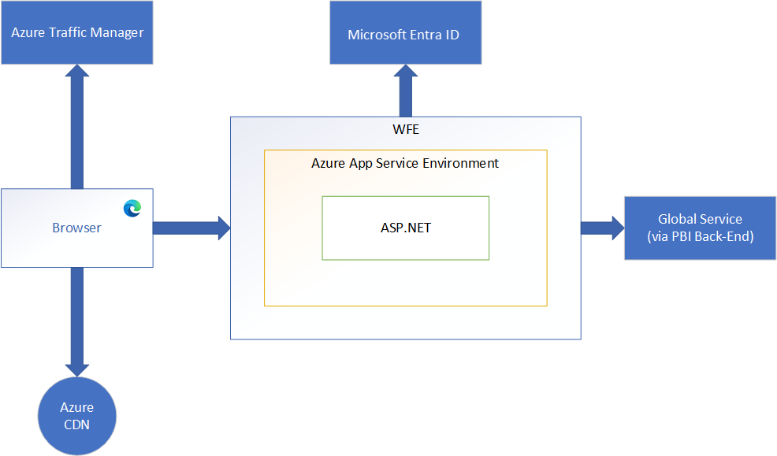

# Power BI security white paper

**Summary:** Power BI is an online software service (*SaaS*, or Software as a Service) offering from Microsoft that lets you easily and quickly create self-service Business Intelligence dashboards, reports, semantic models ([previously known as datasets](../connect-data/service-datasets-rename.md)), and visualizations. With Power BI, you can connect to many different data sources, combine and shape data from those connections, then create reports and dashboards that can be shared with others.

<!-- cspell:disable -->

**Writers:** Yitzhak Kesselman, Paddy Osborne, Matt Neely, Tony Bencic, Srinivasan Turuvekere, Cristian Petculescu, Adi Regev, Naveen Sivaraj, Ben Glastein, Evgeny Tshiorny, Arthi Ramasubramanian Iyer, Sid Jayadevan, Ronald Chang, Ori Eduar, Anton Fritz, Idan Sheinberg, Ron Gilad, Sagiv Hadaya, Paul Inbar, Igor Uzhviev, Michael Roth, Jaime Tarquino, Gennady Pats, Orion Lee, Yury Berezansky, Maya Shenhav, Romit Chattopadhyay, Yariv Maimon, Bogdan Crivat

**Technical Reviewers:** Cristian Petculescu, Amir Netz, Sergei Gundorov

<!-- cspell:enable -->

**Applies to:** Power BI SaaS, Power BI Desktop, Power BI Premium, Power BI Embedded Analytics, Power BI Mobile.

> [!NOTE]
> You can save or print this white paper by selecting **Print** from your browser, then selecting **Save as PDF**.

## Introduction

Power BI is an online software service (*SaaS*, or Software as a Service) offering from Microsoft that lets you easily and quickly create self-service Business Intelligence dashboards, reports, semantic models, and visualizations. With Power BI, you can connect to many different data sources, combine and shape data from those connections, then create reports and dashboards that can be shared with others.

The world is rapidly changing; organizations are going through an accelerated digital transformation, and we're seeing a massive increase in remote working, increased customer demand for online services, and increased use of advanced technologies in operations and business decision-making. And all of this is powered by the cloud.

As the transition to the cloud has changed from a trickle to a flood, and with the new, exposed surface area that comes with it, more companies are asking *How secure is my data in the cloud?* and *What end-to-end protection is available to prevent my sensitive data from leaking?* And for the BI platforms that often handle some of the most strategic information in the enterprise, these questions are doubly important.

The decades-old foundations of the BI security model - object-level and row-level security - while still important, clearly no longer suffice for providing the kind of security needed in the cloud era. Instead, organizations must look for a cloud-native, multi-tiered, defense-in-depth security solution for their business intelligence data.

Power BI was built to provide industry-leading complete and hermetic protection for data. The product has earned the highest security classifications available in the industry, and today many national security agencies, financial institutions, and health care providers entrust it with their most sensitive information.

It all starts with the foundation. After a rough period in the early 2000s, Microsoft made massive investments to address its security vulnerabilities, and in the following decades built a strong security stack that goes as deep as the machine on-chip bios kernel and extends all the way up to end-user experiences. These deep investments continue, and today over 3,500 Microsoft engineers are engaged in building and enhancing Microsoft's security stack and proactively addressing the ever-shifting threat landscape. With billions of computers, trillions of logins, and countless zettabytes of information entrusted to Microsoft's protection, the company now possesses the most advanced security stack in the tech industry and is broadly viewed as the global leader in the fight against malicious actors.

Power BI builds on this strong foundation. It uses the same security stack that earned Azure the right to serve and protect the world's most sensitive data, and it integrates with the most advanced information protection and compliance tools of Microsoft 365. On top of these, it delivers security through multi-layered security measures, resulting in end-to-end protection designed to deal with the unique challenges of the cloud era.

To provide an end-to-end solution for protecting sensitive assets, the product team needed to address challenging customer concerns on multiple simultaneous fronts:

* *How do we control who can connect, where they connect from, and how they connect?* *How can we control the connections?*
* *How is the data stored?* *How is it encrypted?* *What controls do I have on my data?*
* *How do I control and protect my sensitive data?* *How do I ensure this data can't leak outside the organization?*
* *How do I audit who conducts what operations?* *How do I react quickly if there's suspicious activity on the service?*

This article provides a comprehensive answer to all these questions. It starts with an overview of the service architecture and explains how the main flows in the system work. It then moves on to describe how users authenticate to Power BI, how data connections are established, and how Power BI stores and moves data through the service. The last section discusses the security features that allow you, as the service admin, to protect your most valuable assets.

The Power BI service is governed by the [Microsoft Online Services Terms](https://www.microsoftvolumelicensing.com/DocumentSearch.aspx?Mode=3&DocumentTypeId=31), and the [Microsoft Enterprise Privacy Statement](https://www.microsoft.com/privacystatement/OnlineServices/Default.aspx). For the location of data processing, refer to the Location of Data Processing terms in the [Microsoft Online Services Terms](https://www.microsoftvolumelicensing.com/Downloader.aspx?DocumentId=9555) and to the [Data Protection Addendum](https://www.microsoft.com/download/details.aspx?id=101581). For compliance information, the [Microsoft Trust Center](https://www.microsoft.com/trustcenter) is the primary resource for Power BI. The Power BI team is working hard to bring its customers the latest innovations and productivity. Learn more about compliance in the [Microsoft compliance offerings](/compliance/regulatory/offering-home).

The Power BI service follows the Security Development Lifecycle (SDL), strict security practices that support security assurance and compliance requirements. The SDL helps developers build more secure software by reducing the number and severity of vulnerabilities in software, while reducing development cost. Learn more at [Microsoft Security Development Lifecycle Practices](https://www.microsoft.com/securityengineering/sdl/practices).

## Power BI architecture

The Power BI service is built on Azure, Microsoft's [cloud computing platform](https://azure.microsoft.com/overview/what-is-azure/). Power BI is currently deployed in many datacenters around the world – there are many active deployments made available to customers in the regions served by those datacenters, and an equal number of passive deployments that serve as backups for each active deployment.

### Web front-end cluster (WFE)

The WFE cluster provides the user's browser with the initial HTML page contents on site load, and pointers to CDN content used to render the site in the browser.

A WFE cluster consists of an ASP.NET website running in the [Azure App Service Environment](/azure/app-service/environment/intro). When users attempt to connect to the Power BI service, the client's DNS service may communicate with the Azure Traffic Manager to find the most appropriate (usually nearest) datacenter with a Power BI deployment. For more information about this process, see [Performance traffic-routing method for Azure Traffic Manager](/azure/traffic-manager/traffic-manager-routing-methods#performance-traffic-routing-method).

Static resources such as **.js*, **.css*, and image files are mostly stored on an Azure Content Delivery Network (CDN) and retrieved directly by the browser. Note that Sovereign Government cluster deployments are an exception to this rule, and for compliance reasons will omit the CDN and instead use a WFE cluster from a compliant region for hosting static content.

### Power BI back-end cluster (BE)

The back-end cluster is the backbone of all the functionality available in Power BI. It consists of several service endpoints consumed by Web Front End and API clients as well as background working services, databases, caches, and various other components.

The back end is available in most Azure regions, and is being deployed in new regions as they become available. A single Azure region hosts one or more back-end clusters that allow unlimited horizontal scaling of the Power BI service once the vertical and horizontal scaling limits of a single cluster are exhausted.

Each back-end cluster is stateful and hosts all the data of all the tenants assigned to that cluster. A cluster that contains the data of a specific tenant is referred to as the tenant's home cluster. An authenticated user's home cluster information is provided by Global Service and used by the Web Front End to route requests to the tenant's home cluster.

Each back-end cluster consists of multiple virtual machines combined into multiple resizable-scale sets tuned for performing specific tasks, stateful resources such as SQL databases, storage accounts, service buses, caches, and other necessary cloud components.

Tenant metadata and data are stored within cluster limits except for data replication to a secondary back-end cluster in a paired Azure region in the same Azure geography. The secondary back-end cluster serves as a failover cluster in case of regional outage, and is passive at any other time.

Back-end functionality is served by micro-services running on different machines within the cluster's virtual network that aren't accessible from the outside, except for two components that can be accessed from the public internet:

* Gateway Service
* Azure API Management

### Power BI Premium infrastructure

Power BI Premium offers a service for subscribers who require premium Power BI features, such as advanced AI, distribution to unlicensed users, etc. When a customer signs up for a Power BI Premium subscription, the Premium capacity is created through the Azure Resource Manager.

Power BI Premium capacities are hosted in back-end clusters that are independent of the regular Power BI back end – see above). This provides better isolation, resource allocation, supportability, security isolation, and scalability of the Premium offering.

The following diagram illustrates the architecture of the Power BI Premium infrastructure:

The connection to the Power BI Premium infrastructure can be done in many ways, depending on the user scenario. Power BI Premium clients can be a user's browser, a regular Power BI back end, direct connections via XMLA clients, ARM APIs, etc.

The Power BI Premium infrastructure in an Azure region consists of multiple Power BI Premium clusters (the minimum is one). Most Premium resources are encapsulated inside a cluster (for instance, compute), and there are some common regional resources (for example, metadata storage). Premium infrastructure allows two ways of achieving horizontal scalability in a region: increasing resources inside clusters and/or adding more clusters on demand as needed (if cluster resources are approaching their limits).

The backbone of each cluster are compute resources managed by [Virtual Machine Scale Sets](/azure/virtual-machine-scale-sets/overview) and [Azure Service Fabric](/azure/service-fabric/service-fabric-overview). Virtual Machine Scale Sets and Service Fabric allow fast and painless increase of compute nodes as usage grows and orchestrates the deployment, management, and monitoring of Power BI Premium services and applications.

There are many surrounding resources that ensure a secure and reliable infrastructure: load balancers, virtual networks, network security groups, service bus, storage, etc. Any secrets, keys, and certificates required for Power BI Premium are managed by [Azure Key Vault](/azure/key-vault/general/basic-concepts) exclusively. Any authentication is done via integration with Microsoft Entra ID ([previously known as Azure Active Directory](/azure/active-directory/fundamentals/new-name)) exclusively.

Any request that comes to Power BI Premium infrastructure goes to front-end nodes first – they're the only nodes available for external connections. The rest of the resources are hidden behind virtual networks. The front-end nodes authenticate the request, handle it, or forward it to the appropriate resources (for example, back-end nodes).

Back-end nodes provide most of the Power BI Premium capabilities and features.

### Power BI Mobile

Power BI Mobile is a collection of apps designed for the three primary mobile platforms: Android, iOS, and Windows (UWP). Security considerations for the Power BI Mobile apps fall into two categories:

* Device communication
* The application and data on the device

For device communication, all Power BI Mobile applications communicate with the Power BI service, and use the same connection and authentication sequences used by browsers, which are described in detail earlier in this white paper. The Power BI mobile applications for iOS and Android bring up a browser session within the application itself, while the Windows mobile app brings up a broker to establish the communication channel with Power BI (for the sign-in process).

The following table shows certificate-based authentication (CBA) support for Power BI Mobile, based on the mobile device platform:

|CBA support  |iOS  |Android  |Windows  |
|---------|---------|---------|---------|
|Power BI (sign in to service)    |Supported         |Supported         |Not supported         |
|SSRS ADFS on-premises (connect to SSRS server)     |Not supported         |Supported         |Not supported         |
|SSRS App Proxy     |Supported         |Supported         |Not supported         |

Power BI Mobile apps actively communicate with the Power BI service. Telemetry is used to gather mobile app usage statistics and similar data, which is transmitted to services that are used to monitor usage and activity; no customer data is sent with telemetry.

The Power BI application stores data on the device that facilitates use of the app:

* Microsoft Entra ID and refresh tokens are stored in a secure mechanism on the device, using industry-standard security measures.
* Data and settings (key-value pairs for user configuration) is cached in storage on the device, and can be encrypted by the OS. In iOS this is automatically done when the user sets a passcode. In Android this can be configured in the settings. In Windows it's accomplished by using BitLocker.
* For the Android and iOS apps, the data and settings (key-value pairs for user configuration) are cached in storage on the device in a sandbox and internal storage that is accessible only to the app. For the Windows app, the data is only accessible by the user (and system admin).
* Geolocation is enabled or disabled explicitly by the user. If enabled, geolocation data isn't saved on the device and isn't shared with Microsoft.
* Notifications are enabled or disabled explicitly by the user. If enabled, Android and iOS don't support geographic data residency requirements for notifications.

Data encryption can be enhanced by applying file-level encryption via Microsoft Intune, a software service that provides mobile device and application management. All three platforms for which Power BI Mobile is available support Intune. With Intune enabled and configured, data on the mobile device is encrypted, and the Power BI application itself can't be installed on an SD card. [Learn more about Microsoft Intune](https://www.microsoft.com/cloud-platform/microsoft-intune).

The Windows app also supports [Windows Information Protection (WIP)](/windows/security/information-protection/windows-information-protection/protect-enterprise-data-using-wip).

In order to implement SSO, some secured storage values related to the token-based authentication are available for other Microsoft first party apps (such as Microsoft Authenticator) and are managed by the [Microsoft Authentication Library](/azure/active-directory/develop/msal-overview) (MSAL).

Power BI Mobile cached data is deleted when the app is removed, when the user signs out of Power BI Mobile, or when the user fails to sign in (such as after a token expiration event or password change). The data cache includes dashboards and reports previously accessed from the Power BI Mobile app.

Power BI Mobile doesn't access other application folders or files on the device.

The Power BI apps for iOS and Android let you protect your data by configuring additional identification, such as providing Face ID, Touch ID, or a passcode for iOS, and biometric data (Fingerprint ID) for Android. [Learn more about additional identification](../consumer/mobile/mobile-native-secure-access.md).

## Authentication to the Power BI service

User authentication to the Power BI service consists of a series of requests, responses, and redirects between the user's browser and the Power BI service or the Azure services used by Power BI. That sequence describes the process of user authentication in Power BI, which follows the [Microsoft Entra auth code grant flow](/azure/active-directory/develop/v2-oauth2-auth-code-flow). For more information about options for an organization's user authentication models (sign-in models), see [Choosing a sign-in model for Microsoft 365](https://www.microsoft.com/en-us/microsoft-365/blog/2014/05/13/choosing-a-sign-in-model-for-office-365/).

### Authentication sequence

The user authentication sequence for the Power BI service occurs as described in the following steps, which are illustrated in the image that follows them.

1. A user initiates a connection to the Power BI service from a browser, either by typing in the Power BI address in the address bar or by selecting **Sign** in from the Power BI marketing page (https://powerbi.microsoft.com). The connection is established using TLS and HTTPS, and all subsequent communication between the browser and the Power BI service uses HTTPS.

1. The Azure Traffic Manager checks the user's DNS record to determine the most appropriate (usually nearest) datacenter where Power BI is deployed, and responds to the DNS with the IP address of the WFE cluster to which the user should be sent.

1. WFE then returns an HTML page to the browser client, which contains a MSAL.js library reference necessary to initiate the sign-in flow.

1. The browser client loads the HTML page received from the WFE, and redirects the user to the Microsoft Online Services sign-in page.

1. After the user has been authenticated, the sign-in page redirects the user back to the Power BI WFE page with an auth code.

1. The browser client loads the HTML page, and uses the auth code to request tokens (access, ID, refresh) from Microsoft Entra ID.

1. The user's tenant ID is used by the browser client to query the Power BI Global Service, which maintains a list of tenants and their Power BI back-end cluster locations. The Power BI Global Service determines which Power BI back-end service cluster contains the user's tenant, and returns the Power BI back-end cluster URL back down to the client.

1. The client is now able to communicate with the Power BI back-end cluster URL API, using the access token in the Authorization header for the HTTP requests. The Microsoft Entra access token will [have an expiry date set according to Microsoft Entra policies](/azure/active-directory/develop/active-directory-configurable-token-lifetimes#token-lifetime-policies-for-access-saml-and-id-tokens), and to maintain the current session the Power BI Client in the user's browser will make periodic requests to renew the access token before it expires.

In the rare cases where client-side authentication fails due to an unexpected error, the code attempts to fall back to using server-side authentication in the WFE. Refer to the questions and answers section at the end of this document for details about the server-side authentication flow.

## Data residency

Unless otherwise indicated in the documentation, Power BI stores customer data in an Azure geography that is assigned when an [Microsoft Entra tenant](/office365/enterprise/subscriptions-licenses-accounts-and-tenants-for-microsoft-cloud-offerings) signs up for Power BI services for the first time. A Microsoft Entra tenant houses the user and application identities, groups, and other relevant information that pertain to an organization and its security.

The assignment of an Azure geography for tenant data storage is done by mapping the country or region selected as part of the Microsoft Entra tenant setup to the most suitable Azure geography where a Power BI deployment exists. Once this determination is made, all Power BI customer data will be stored in this selected Azure geography (also known as the *home geo*), except in cases where organizations utilize multi-geo deployments.

### Multiple geographies (multi-geo)

Some organizations have a global presence and may require Power BI services in multiple Azure geographies. For example, a business may have their headquarters in the United States but may also do business in other geographical areas, such as Australia. In such cases the business may require that certain Power BI data remain stored at rest in the remote region to comply with local regulations. This feature of the Power BI service is referred to as *multi-geo*.

The query execution layer, query caches, and artifact data assigned to a multi-geo workspace are hosted and remain in the remote capacity Azure geography. However, some artifact metadata, such as report structure, may remain stored at rest in the tenant's home geo. Additionally, some data transit and processing may still happen in the tenant's home geo, even for workspaces that are hosted in a multi-geo Premium capacity.

See [Configure Multi-Geo support for Power BI Premium](../admin/service-admin-premium-multi-geo.md) for more information about creating and managing Power BI deployments that span multiple Azure geographies.

### Regions and datacenters

Power BI services are available in specific Azure geographies as described in the [Microsoft Trust Center](https://www.microsoft.com/TrustCenter/CloudServices/business-application-platform/data-location). For more information about where your data is stored and how it's used, refer to the [Microsoft Trust Center](https://www.microsoft.com/TrustCenter/Transparency/default.aspx#_You_know_where). Commitments concerning the location of customer data at rest are specified in the Data Processing Terms of the [Microsoft Online Services Terms](https://www.microsoftvolumelicensing.com/DocumentSearch.aspx?Mode=3&DocumentTypeId=31).

Microsoft also provides datacenters for sovereign entities. For more information about Power BI service availability for national/regional clouds, see [Power BI national/regional clouds](https://powerbi.microsoft.com/clouds/).

## Data handling

This section outlines Power BI data handling practices when it comes to storing, processing, and transferring customer data.

### Data at rest

Power BI uses two primary data storage resource types:

* Azure Storage
* Azure SQL Databases

In most scenarios, Azure Storage is utilized to persist the data of Power BI artifacts, while Azure SQL Databases are used to persist artifact metadata.

All data persisted by Power BI is encrypted by default using Microsoft-managed keys. Customer data stored in Azure SQL Databases is fully encrypted using [Azure SQL's Transparent Data Encryption (TDE)](/azure/sql-database/transparent-data-encryption-azure-sql) technology. Customer data stored in Azure Blob storage is encrypted using [Azure Storage Encryption](/azure/storage/common/storage-service-encryption).

Optionally, organizations can utilize Power BI Premium to use their own keys to encrypt data at rest that is imported into a semantic model. This approach is often described as bring your own key (BYOK). Utilizing BYOK helps ensure that even in case of a service operator error, customer data won't be exposed – something that can't easily be achieved using transparent service-side encryption. See [Bring your own encryption keys for Power BI](../enterprise/service-encryption-byok.md) for more information.

Power BI semantic models allow for various data source connection modes that determine whether the data source data is persisted in the service or not.

|Semantic Model Mode (Kind)   |Data Persisted in Power BI |
|----------------------|---------------------------|
|Import                |Yes |
|DirectQuery           |No |
|Live Connect          |No |
|Composite             |If contains an Import data source |
|Streaming             |If configured to persist |

Regardless of the semantic model mode utilized, Power BI may temporarily cache any retrieved data to optimize query and report load performance.

### Data in processing

Data is in processing when it's either actively being used by one or more users as part of an interactive scenario, or when a background process, such as refresh, touches this data. Power BI loads actively processed data into the memory space of one or more service workloads. To facilitate the functionality required by the workload, the processed data in memory isn't encrypted.

### Data in transit

Power BI requires all incoming HTTP traffic to be encrypted using TLS 1.2 or above. Any requests attempting to use the service with TLS 1.1 or lower will be rejected.

## Authentication to data sources

When connecting to a data source, a user can choose to import a copy of the data into Power BI or to connect directly to the data source.

In the case of import, a user establishes a connection based on the user's sign in and accesses the data with the credential. After the semantic model is published to the Power BI service, Power BI always uses this user's credential to import data. Once data is imported, viewing the data in reports and dashboards doesn't access the underlying data source. Power BI supports single sign-on authentication for selected data sources. If the connection is configured to use single sign-on, the semantic model owner's credentials are used to connect to the data source.

If a data source is connected directly using preconfigured credentials, the preconfigured credentials are used to connect to the data source when any user views the data. If a data source is connected directly using single sign-on, the current user's credentials are used to connect to the data source when a user views the data. When used with single sign-on, Row Level Security (RLS) and/or object-level security (OLS) can be implemented on the data source. This allows users to view only data they have privileges to access. When the connection is to data sources in the cloud, Microsoft Entra authentication is used for single sign-on; for on-premises data sources, Kerberos, Security Assertion Markup Language (SAML), and Microsoft Entra ID are supported.

If the data source is Azure Analysis Services or on-premises Analysis Services, and RLS and/or OLS is configured, the Power BI service will apply that row level security, and users who don't have sufficient credentials to access the underlying data (which could be a query used in a dashboard, report, or other data artifact) won't see data they don't have sufficient privileges for.

## Premium features

### Dataflows architecture

Dataflows provide users the ability to configure back-end data processing operations that will extract data from polymorphous data sources, execute transformation logic against the data, and then land it in a target model for use across various reporting presentation technologies. Any user who has either a member, contributor, or admin role in a workspace may create a dataflow. Users in the viewer role may view data processed by the dataflow but may not make changes to its composition. Once a dataflow has been authored, any member, contributor, or admin of the workspace may schedule refreshes, as well as view and edit the dataflow by taking ownership of it.

Each configured data source is bound to a client technology for accessing that data source. The structure of credentials required to access them is formed to match required implementation details of the data source. Transformation logic is applied by Power Query services while the data is in flight. For premium dataflows, Power Query services execute in back-end nodes. Data may be pulled directly from the cloud sources or through a gateway installed on premises. When pulled directly from a cloud source to the service or to the gateway, the transport uses protection methodology specific to the client technology, if applicable. When data is transferred from the gateway to the cloud service, it is encrypted. See the [Data in Transit](#data-in-transit) section above.

When customer specified data sources require credentials for access, the owner/creator of the dataflow will provide them during authoring. They're stored using standard product-wide credential storage. See the [Authentication to Data Sources](#authentication-to-data-sources) section above. There are various approaches users may configure to optimize data persistence and access. By default, the data is placed in a Power BI owned and protected storage account. Storage encryption is enabled on the Blob storage containers to protect the data while it is at rest. See the [Data at Rest](#data-at-rest) section below. Users may, however, configure their own storage account associated with their own Azure subscription. When doing so, a Power BI service principal is granted access to that storage account so that it may write the data there during refresh. In this case, the storage resource owner is responsible for configuring encryption on the configured ADLS storage account. Data is always transmitted to Blob storage using encryption.

Since performance when accessing storage accounts may be suboptimal for some data, users also have the option to use a Power BI-hosted compute engine to increase performance. In this case, data is redundantly stored in an SQL database that is available for DirectQuery through access by the back-end Power BI system. Data is always encrypted on the file system. If the user provides a key for encrypting the data stored in the SQL database, that key will be used to doubly encrypt it.

When querying using DirectQuery, the encrypted transport protocol HTTPS is used to access the API. All secondary or indirect use of DirectQuery is controlled by the same access controls previously described. Since dataflows are always bound to a workspace, access to the data is always gated by the user's role in that workspace. A user must have at least read access to be able to query the data via any means.

When Power BI Desktop is used to access data in a dataflow, it must first authenticate the user using Microsoft Entra ID to determine if the user has sufficient rights to view the data. If so, a SaS key is acquired and used to access storage directly using the encrypted transport protocol HTTPS.

The processing of data throughout the pipeline emits Office 365 auditing events. Some of these events will capture security and privacy-related operations.

### Paginated reports

Paginated reports are designed to be printed or shared. They're called paginated because they're formatted to fit well on a page. They display all the data in a table, even if the table spans multiple pages. You can control their report page layout exactly.

Paginated reports support rich and powerful expressions written in Microsoft Visual Basic .NET. Expressions are widely used throughout Power BI Report Builder paginated reports to retrieve, calculate, display, group, sort, filter, parameterize, and format data.

Expressions are created by the author of the report with access to the broad range of features of the .NET framework. The processing and execution of paginated reports is performed inside a sandbox.

Paginated report definitions (.rdl) are stored in Power BI, and to publish and/or render a paginated report a user needs to authenticate and authorize in the same way as described in the [Authentication to the Power BI Service](#authentication-to-the-power-bi-service) section above.

The Microsoft Entra token obtained during the authentication is used to communicate directly from the browser to the Power BI Premium cluster.

In Power BI Premium, the Power BI service runtime provides an appropriately isolated execution environment for each report render. This includes cases where the reports being rendered belong to workspaces assigned to the same capacity.

A paginated report can access a wide set of data sources as part of the rendering of the report. The sandbox doesn't communicate directly with any of the data sources but instead communicates with the trusted process to request data, and then the trusted process appends the required credentials to the connection. In this way, the sandbox never has access to any credential or secret.

In order to support features such as Bing maps, or calls to Azure Functions, the sandbox does have access to the internet.

### Power BI embedded analytics

Independent Software Vendors (ISVs) and solution providers have two main modes of embedding Power BI artifacts in their web applications and portals: [embed for your organization](../developer/embedded/embed-sample-for-your-organization.md) and [embed for your customers](../developer/embedded/embed-sample-for-customers.md). The artifact is embedded into an IFrame in the application or portal. An IFrame is not allowed to read or write data from the external web application or portal, and the communication with the IFrame is done by using the Power BI Client SDK using POST messages.

In an [embed for your organization](../developer/embedded/embed-sample-for-your-organization.md) scenario, Microsoft Entra users access their own Power BI content through portals customized by their enterprises and ITs. All Power BI policies and capabilities described in this paper such as Row Level Security (RLS) and object-level security (OLS) are automatically applied to all users independently of whether they access Power BI through the [Power BI portal](https://app.powerbi.com/) or through customized portals.

In an [embed for your customers](../developer/embedded/embed-sample-for-customers.md) scenario, ISVs typically own Power BI tenants and Power BI items (dashboards, reports, semantic models, and others). It's the responsibility of an ISV back-end service to authenticate its end users and decide which artifacts and which access level is appropriate for that end user. ISV policy decisions are encrypted in an [embed token](/rest/api/power-bi/embedtoken) generated by Power BI and passed to the ISV back-end for further distribution to the end users according to the business logic of the ISV. End users using a browser or other client applications aren't able to decrypt or modify embed tokens. Client-side SDKs such as [Power BI Client APIs](/javascript/api/overview/powerbi/) automatically append the encrypted embed token to Power BI requests as an *Authorization: EmbedToken* header. Based on this header, Power BI will enforce all policies (such as access or RLS) precisely as was specified by the ISV during generation.

To enable embedding and automation, and to generate the embed tokens described above, Power BI exposes a rich set of [REST APIs](/rest/api/power-bi/embedtoken). These Power BI REST APIs support both user [delegated](/azure/active-directory/develop/v2-permissions-and-consent) and [service principal](../enterprise/service-premium-service-principal.md) Microsoft Entra methods of authentication and authorization.

Power BI embedded analytics and its REST APIs support all Power BI network isolation capabilities described in this article: For example, [Service Tags](#service-tags) and [Private Links](#private-link-integration).

### AI features

Power BI currently supports two broad categories of AI features in the product today: AI visuals and AI enrichments. The visual-level AI features include capabilities such as Key-Influencers, Decomposition-Tree, Smart-Narrative, Anomaly Detection, R-visual, Python-visual, Clustering, Forecasting, Q&A, Quick-Insights etc. The AI enrichment capabilities include capabilities such as AutoML, Azure Machine Learning, CognitiveServices, R/Python transforms etc.

Most of the features mentioned above are supported in both Shared and Premium workspaces today. However, AutoML and CognitiveServices are supported only in Premium workspaces, due to IP restrictions. Today, with the AutoML integration in Power BI, a user can build and train a custom ML model (for example, Prediction, Classification, Regression, etc.) and apply it to get predictions while loading data into a dataflow defined in a Premium workspace. Additionally, Power BI users can apply several CognitiveServices APIs, such as TextAnalytics and ImageTagging, to transform data before loading it into a dataflow/semantic model defined in a Premium workspace.

The Premium AI enrichment features can be best viewed as a collection of stateless AI functions/transforms that can be used by Power BI users in their data integration pipelines used by a Power BI semantic model or dataflow. Note that these functions can also be accessed from current dataflow/semantic model authoring environments in the Power BI Service and Power BI Desktop. These AI functions/transforms always run in a Premium workspace/capacity. These functions are surfaced in Power BI as a data source that requires a Microsoft Entra token for the Power BI user who is using the AI function. These AI data sources are special because they don't surface any of their own data and they only supply these functions/transforms. During execution, these features don't make any outbound calls to other services to transmit the customer's data. Let us look at the Premium scenarios individually to understand the communication patterns and relevant security-related details pertaining to them.

For training and applying an AutoML model, Power BI uses the Azure AutoML SDK and runs all the training in the customer's Power BI capacity. During training iterations, Power BI calls an experimentation Azure Machine Learning service to select a suitable model and hyper-parameters for the current iteration. In this outbound call, only relevant experiment metadata (for example, accuracy, ml algorithm, algorithm parameters, etc.) from the previous iteration is sent. The AutoML training produces an ONNX model and training report data that is then saved in the dataflow. Later, Power BI users can then apply the trained ML model as a transform to operationalize the ML model on a scheduled basis. For TextAnalytics and ImageTagging APIs, Power BI doesn't directly call the CognitiveServices service APIs, but rather uses an internal SDK to run the APIs in the Power BI Premium capacity. Today these APIs are supported in both Power BI dataflows and semantic models. While authoring a data model in Power BI Desktop, users can only access this functionality if they have access to a Premium Power BI workspace. Hence customers are prompted to supply their Microsoft Entra credentials.

## Network isolation

This section outlines advanced security features in Power BI. Some of the features have specific licensing requirements. See the sections below for details.

### Service tags

A service tag represents a group of IP address prefixes from a given Azure service. It helps minimize the complexity of frequent updates to network security rules. Customers can use service tags to define network access controls on [Network Security Groups](/azure/virtual-network/security-overview#security-rules) or [Azure Firewall](/azure/firewall/service-tags). Customers can use service tags in place of specific IP addresses when creating security rules. By specifying the service tag name (such as `PowerBI`) in the appropriate source or destination (for APIs) field of a rule, customers can allow or deny the traffic for the corresponding service. Microsoft manages the address prefixes encompassed by the service tag and automatically updates the service tag as addresses change.

### Private Link integration

Azure networking provides the Azure Private Link feature that enables Power BI to provide secure access via Azure Networking private endpoints. With Azure Private Link and private endpoints, data traffic is sent privately using Microsoft's backbone network infrastructure, and thus the data doesn't traverse the Internet.

Private Link ensures that Power BI users use the Microsoft private network backbone when going to resources in the Power BI service.

Using Private Link with Power BI provides the following benefits:

* Private Link ensures that traffic will flow over the Azure backbone to a private endpoint for Azure cloud-based resources.
* Network traffic isolation from non-Azure-based infrastructure, such as on-premises access, would require customers to have ExpressRoute or a Virtual Private Network (VPN) configured.

See [Private links for accessing Power BI](/fabric/security/security-private-links-overview) for additional information.

### VNet connectivity (preview - coming soon)

While the Private Link integration feature provides secure inbound connections to Power BI, the VNet connectivity feature enables secure outbound connectivity from Power BI to data sources within a VNet.

VNet gateways (Microsoft-managed) will eliminate the overhead of installing and monitoring on-premises data gateways for connecting to data sources associated with a VNet. They will, however, still follow the familiar process of managing security and data sources, as with an on-premises data gateway.

The following is an overview of what happens when you interact with a Power BI report that is connected to a data source within a VNet using VNet gateways:

1. The Power BI cloud service (or one of the other supported cloud services) kicks off a query and sends the query, data source details, and credentials to the Power Platform VNet service (PP VNet).

1. The PP VNet service then securely injects a container running a VNet gateway into the subnet. This container can now connect to data services accessible from within this subnet.

1. The PP VNet service then sends the query, data source details, and credentials to the VNet gateway.

1. The VNet gateway gets the query and connects to the data sources with those credentials.

1. The query is then sent to the data source for execution.

1. After execution, the results are sent to the VNet gateway, and the PP VNet service securely pushes the data from the container to the Power BI cloud service.

This feature will be available in public preview soon.

### Service principals

Power BI supports the use of service principals. Store any service principal credentials used for encrypting or accessing Power BI in a Key Vault, assign proper access policies to the vault, and regularly review access permissions.

See [Automate Premium workspace and semantic model tasks with service principals](../enterprise/service-premium-service-principal.md) for additional details.

## Microsoft Purview for Power BI

### Microsoft Purview Information Protection

Power BI is deeply integrated with Microsoft Purview Information Protection. Microsoft Purview Information Protection enables organizations to have a single, integrated solution for classification, labeling, auditing, and compliance across Azure, Power BI, and Office.

When information protection is enabled in Power BI:

* Sensitive data, both in the Power BI service and in Power BI Desktop, can be classified and labeled using the same sensitivity labels used in Office and in Azure.
* Governance policies can be enforced when Power BI content is exported to Excel, PowerPoint, PDF, Word, or *.pbix* files, to help ensure that data is protected even when it leaves Power BI.
* It's easy to classify and protect *.pbix* files in Power BI Desktop, just like it's done in Excel, Word, and PowerPoint applications. Files can be easily tagged according to their level of sensitivity. Even further, they can be encrypted if they contain business-confidential data, ensuring that only authorized users can edit these files.
* Excel workbooks automatically inherit sensitivity labels when they connect to Power BI (preview), making it possible to maintain end-to-end classification and apply protection when Power BI semantic models are analyzed in Excel.
* Sensitivity labels applied to Power BI reports and dashboards are visible in the Power BI iOS and Android mobile apps.
* Sensitivity labels persist when a Power BI report is embedded in Teams, SharePoint, or a secure website. This helps organizations maintain classification and protection upon export when embedding Power BI content.
* Label inheritance upon the creation of new content in the Power BI service ensures that labels applied to semantic models or datamarts in the Power BI service will be applied to new content created on top of those semantic models and datamarts.
* [Power BI admin scan APIs](/rest/api/power-bi/admin/workspaceinfo_getscanresult) can extract a Power BI item's sensitivity label, enabling Power BI and InfoSec admins to monitor labeling in the Power BI service and produce executive reports.
* Power BI admin APIs enable central teams to programmatically apply sensitivity labels to content in the Power BI service.
* Central teams can create mandatory label policies to enforce applying labels on new or edited content in Power BI.
* Central teams can create default label policies to ensure that a sensitivity label is applied to all new or changed Power BI content.
* Automatic downstream sensitivity labeling in the Power BI service ensures that when a label on a semantic model or datamart is applied or changed, the label will automatically be applied or changed on all downstream content connected to the semantic model or datamart.

For more information, see [Sensitivity labels in Power BI](../enterprise/service-security-sensitivity-label-overview.md).

### Microsoft Purview Data Loss Prevention (DLP) Policies for Power BI (preview)

Microsoft Purview's DLP policies can help organizations reduce the risk of sensitive business data leakage from Power BI. DLP policies can help them meet compliance requirements of government or industry regulations, such as GDPR (the European Union's General Data Protection Regulation) or CCPA (the California Consumer Privacy Act) and make sure their data in Power BI is managed.

When DLP policies for Power BI are set up:

* All semantic models within the workspaces specified in the policy are evaluated by the policy.
* You can detect when sensitive data is uploaded into your Premium capacities. DLP policies can detect:
    * Sensitivity labels.
    * Sensitive info types. Over 260 types are supported. Sensitive info type detection relies on Microsoft Purview content scanning.
* When you encounter a semantic model identified as sensitive, you can see a customized policy tip that helps you understand what you should do.
* If you are a semantic model owner, you can override a policy and prevent your semantic model from being identified as "sensitive" if you have a valid reason for doing so.
* If you are a semantic model owner, you can report an issue with a policy if you conclude that a sensitive info type has been falsely identified.
* Automatic risk mitigations, such as alerts to the security admin, can be invoked.

For more information, see [Data loss prevention policies for Power BI](../enterprise/service-security-dlp-policies-for-power-bi-overview.md).

## Microsoft Defender for Cloud Apps for Power BI

Microsoft Defender for Cloud Apps is one of the world's leading cloud access security brokers, named as leader in Gartner's Magic Quadrant for the cloud access security broker (CASB) market. Defender for Cloud Apps is used to secure the use of cloud apps. It enables organizations to monitor and control, in real time, risky Power BI sessions such as user access from unmanaged devices. Security administrators can define policies to control user actions, such as downloading reports with sensitive information.

With Defender for Cloud Apps, organizations can gain the following DLP capabilities:

* Set real-time controls to enforce risky user sessions in Power BI. For example, if a user connects to Power BI from outside of their country or region, the session can be monitored by the Defender for Cloud Apps real-time controls, and risky actions, such as downloading data tagged with a "Highly Confidential" sensitivity label, can be blocked immediately.
* Investigate Power BI user activity with the Defender for Cloud Apps activity log. The Defender for Cloud Apps activity log includes Power BI activity as captured in the Office 365 audit log, which contains information about all user and admin activities, as well as sensitivity label information for relevant activities such as apply, change, and remove label. Admins can leverage the Defender for Cloud Apps advanced filters and quick actions for effective issue investigation.
* Create custom policies to alert on suspicious user activity in Power BI. The Defender for Cloud Apps activity policy feature can be leveraged to define your own custom rules, to help you detect user behavior that deviates from the norm, and even possibly act upon it automatically, if it seems too dangerous.
* Work with the Defender for Cloud Apps built-in anomaly detection. The Defender for Cloud Apps anomaly detection policies provide out-of-the-box user behavioral analytics and machine learning so that you're ready from the outset to run advanced threat detection across your cloud environment. When an anomaly detection policy identifies a suspicious behavior, it triggers a security alert.
* Power BI admin role in the Defender for Cloud Apps portal. Defender for Cloud Apps provides an app-specific admin role that can be used to grant Power BI admins only the permissions they need to access Power BI-relevant data in the portal, such as alerts, users at risk, activity logs, and other Power BI-related information.

See [Using Microsoft Defender for Cloud Apps Controls in Power BI](../enterprise/service-security-using-defender-for-cloud-apps-controls.md) for additional details.

## Preview security features

This section lists features that are planned to release through March 2021. Because this topic lists features that may not have released yet, **delivery timelines may change and projected functionality may be released later than March 2021, or may not be released at all**. For more information, about previews, please review the [Online Services Terms](https://www.microsoft.com/licensing/product-licensing/products).

### Bring Your Own Log Analytics (BYOLA)

Bring Your Own Log Analytics enables integration between Power BI and Azure Log Analytics. This integration includes Azure Log Analytics' advanced analytic engine, interactive query language, and built-in machine learning constructs.

## Power BI security questions and answers

The following questions are common security questions and answers for Power BI. These are organized based on when they were added to this white paper, to facilitate your ability to quickly find new questions and answers when this paper is updated. The newest questions are added to the end of this list.

**How do users connect to, and gain access to data sources while using Power BI?**

* Power BI manages credentials to data sources for each user for cloud credentials or for connectivity through a personal gateway. Data sources managed by an on-premises data gateway can be shared across the enterprise and permissions to these data sources can be managed by the Gateway Admin. When configuring a semantic model, the user is allowed to select a credential from their personal store or use an on-premises data gateway to use a shared credential.

    In the import case, a user establishes a connection based on the user's sign in and accesses the data with the credential. After the semantic model is published to Power BI service, Power BI always uses this user's credential to import data. Once data is imported, viewing the data in reports and dashboard doesn't access the underlying data source. Power BI supports single sign-on authentication for selected data sources. If the connection is configured to use single sign-on, the semantic model owner's credential is used to connect with the data source.

    For reports that are connected with DirectQuery, the data source is connected directly using a preconfigured credential, the preconfigured credential is used to connect to the data source when any user views the data. If a data source is connected directly using single sign-on, the current user's credential is used to connect to the data source when the user views the data. When using with single sign-on, Row Level Security (RLS) and/or object-level security (OLS) can be implemented on the data source, and this allows users to view data they have privileges to access. When the connection is to data sources in the cloud, Microsoft Entra authentication is used for single sign-on; for on-premises data sources, Kerberos, SAML, and Microsoft Entra ID are supported.

    When connecting with Kerberos, the user's UPN is passed to the gateway, and using Kerberos constrained delegation, the user is impersonated and connected to the respective data sources. SAML is also supported on the Gateway for SAP HANA datasource. More information is available in [overview of single sign-on for gateways](../connect-data/service-gateway-sso-overview.md).

    If the data source is Azure Analysis Services or on-premises Analysis Services and Row Level Security (RLS) and/or object-level security (OLS) is configured, the Power BI service will apply that row level security, and users who don't have sufficient credentials to access the underlying data (which could be a query used in a dashboard, report, or other data artifact) won't see data for which the user doesn't have sufficient privileges.

    [Row Level security with Power BI](/fabric/security/service-admin-rls) can be used to restrict data access for given users. Filters restrict data access at the row level, and you can define filters within role.

    [Object-level security (OLS)](https://powerbi.microsoft.com/blog/object-level-security-ols-now-available-for-public-preview-in-power-bi-premium/) can be used to secure sensitive tables or columns. However, unlike row-level security, object-level security also secures object names and metadata. This helps prevent malicious users from discovering even the existence of such objects. Secured tables and columns are obscured in the field list when using reporting tools like Excel or Power BI, and moreover, users without permissions can't access secured metadata objects via DAX or any other method. From the standpoint of users without proper access permissions, secured tables and columns simply don't exist.

    Object-level security, together with row-level security, enables enhanced enterprise grade security on reports and semantic models, ensuring that only users with the requisite permissions have access to view and interact with sensitive data.

**How is data transferred to Power BI?**

* All data requested and transmitted by Power BI is encrypted in transit using HTTPS (except when the data source chosen by the customer doesn't support HTTPS) to connect from the data source to the Power BI service. A secure connection is established with the data provider, and only once that connection is established will data traverse the network.

**How does Power BI cache report, dashboard, or model data, and is it secure?**

* When a data source is accessed, the Power BI service follows the process outlined in the [Authentication to Data Sources](#authentication-to-data-sources) section earlier in this document.

**Do clients cache web page data locally?**

* When browser clients access Power BI, the Power BI web servers set the *Cache-Control* directive to *no-store*. The *no-store* directive instructs browsers not to cache the web page being viewed by the user, and not to store the web page in the client's cache folder.

**What about role-based security, sharing reports or dashboards, and data connections? How does that work in terms of data access, dashboard viewing, report access or refresh?**

* For **non-Role Level Security (RLS)** enabled data sources, if a dashboard, report, or data model is shared with other users through Power BI, the data is then available for users with whom it's shared to view and interact with. Power BI *does not* reauthenticate users against the original source of the data; once data is uploaded into Power BI, the user who authenticated against the source data is responsible for managing which other users and groups can view the data.

  When data connections are made to an **RLS**-capable data source, such as an Analysis Services data source, only dashboard data is cached in Power BI. Each time a report or semantic model is viewed or accessed in Power BI that uses data from the RLS-capable data source, the Power BI service accesses the data source to get data based on the user's credentials, and if sufficient permissions exist, the data is loaded into the report or data model for that user. If authentication fails, the user will see an error.

  For more information, see the [Authentication to Data Sources](#authentication-to-data-sources) section earlier in this document.

**Our users connect to the same data sources all the time, some of which require credentials that differ from their domain credentials. How can they avoid having to input these credentials each time they make a data connection?**

* Power BI offers the [Power BI Personal Gateway](../connect-data/service-gateway-personal-mode.md), which is a feature that lets users create credentials for multiple different data sources, then automatically use those credentials when subsequently accessing each of those data sources. For more information, see [Power BI Personal Gateway](../connect-data/service-gateway-personal-mode.md).

**Which ports are used by on-premises data gateway and personal gateway? Are there any domain names that need to be allowed for connectivity purposes?**

* The detailed answer to this question is available at the following link: [Gateway ports](/data-integration/gateway/service-gateway-communication#ports)

**When working with the on-premises data gateway, how are recovery keys used and where are they stored? What about secure credential management?**

* During gateway installation and configuration, the administrator types in a gateway **Recovery Key**. That **Recovery Key** is used to generate a strong AES symmetric key. An RSA asymmetric key is also created at the same time.

    Those generated keys (RSA and AES) are stored in a file located on the local machine. That file is also encrypted. The contents of the file can only be decrypted by that particular Windows machine, and only by that particular gateway service account.

    When a user enters data source credentials in the Power BI service UI, the credentials are encrypted with the public key in the browser. The gateway decrypts the credentials using the RSA private key and re-encrypts them with an AES symmetric key before the data is stored in the Power BI service. With this process, the Power BI service never has access to the unencrypted data.

**Which communication protocols are used by the on-premises data gateway, and how are they secured?**

* The gateway supports the following two communications protocols:

  * AMQP 1.0 – TCP + TLS: This protocol requires ports 443, 5671-5672, and 9350-9354 to be open for outgoing communication. This protocol is preferred, since it has lower communication overhead.

  * HTTPS – WebSockets over HTTPS + TLS: This protocol uses port 443 only. The WebSocket is initiated by a single HTTP CONNECT message. Once the channel is established, the communication is essentially TCP+TLS. You can force the gateway to use this protocol by modifying a setting described in the [on-premises gateway article](/data-integration/gateway/service-gateway-communication#force-https-communication-with-azure-service-bus).

**What is the role of Azure CDN in Power BI?**

* As mentioned previously, Power BI uses the Azure Content Delivery Network (CDN) to efficiently distribute the necessary static content and files to users based on geographical locale. To go into further detail, the Power BI service uses multiple CDNs to efficiently distribute necessary static content and files to users through the public Internet. These static files include product downloads (such as Power BI Desktop, the on-premises data gateway, or Power BI apps from various independent service providers), browser configuration files used to initiate and establish any subsequent connections with the Power BI service, as well as the initial secure Power BI sign-in page.

  Based on information provided during an initial connection to the Power BI service, a user's browser contacts the specified Azure CDN (or for some files, the WFE) to download the collection of specified common files necessary to enable the browser's interaction with the Power BI service. The browser page then includes the Microsoft Entra token, session information, the location of the associated back-end cluster, and the collection of files downloaded from the Azure CDN and WFE cluster, for the duration of the Power BI service browser session.

**For Power BI visuals, does Microsoft perform any security or privacy assessment of the custom visual code prior to publishing items to the Gallery?**

* No. It is the customer's responsibility to review and determine whether custom visual code should be relied upon. All custom visual code is operated in a sandbox environment, so that any errant code in a custom visual doesn't adversely affect the rest of the Power BI service.

**Are there other Power BI visuals that send information outside the customer network?**

* Yes. Bing Maps and ESRI visuals transmit data out of the Power BI service for visuals that use those services.

**For template apps, does Microsoft perform any security or privacy assessment of the template app prior to publishing items to the Gallery?**

* No. The app publisher is responsible for the content while it's the customer's responsibility to review and determine whether to trust the template app publisher.

**Are there template apps that can send information outside the customer network?**

* Yes. It's the customer's responsibility to review the publisher's privacy policy and determine whether to install the template app on tenant. The publisher is responsible for informing the customer about the app's behavior and capabilities.

**What about data sovereignty? Can we provision tenants in data centers located in specific geographies, to ensure data doesn't leave the country or region borders?**

* Some customers in certain geographies have an option to create a tenant in a national/regional cloud, where data storage and processing is kept separate from all other datacenters. National/Regional clouds have a slightly different type of security, since a separate data trustee operates the national/regional cloud Power BI service on behalf of Microsoft.

  Alternatively, customers can also set up a tenant in a specific region. However, such tenants do not have a separate data trustee from Microsoft. Pricing for national/regional clouds is different from the generally available commercial Power BI service. For more information about Power BI service availability for national/regional clouds, see [Power BI national/regional clouds](https://powerbi.microsoft.com/clouds/).

**How does Microsoft treat connections for customers who have Power BI Premium subscriptions? Are those connections different than those established for the non-Premium Power BI service?**

* The connections established for customers with Power BI Premium subscriptions implement a [Microsoft Entra business-to-business (B2B)](/azure/active-directory/active-directory-b2b-what-is-azure-ad-b2b) authorization process, using Microsoft Entra ID to enable access control and authorization. Power BI handles connections from Power BI Premium subscribers to Power BI Premium resources just as it would any other Microsoft Entra user.

**How does server-side authentication work in the WFE?**

* The user authentication sequence service-side authentication occurs as described in the following steps, which are illustrated in the image that follows them.  
1.	A user initiates a connection to the Power BI service from a browser, either by typing in the Power BI address in the address bar or by selecting **Sign in** from the Power BI marketing page (https://powerbi.microsoft.com). The connection is established using TLS 1.2 and HTTPS, and all subsequent communication between the browser and the Power BI service uses HTTPS.

1.	The Azure Traffic Manager checks the user's DNS record to determine the most appropriate (usually nearest) datacenter where Power BI is deployed, and responds to the DNS with the IP address of the WFE cluster to which the user should be sent.

1.	WFE then redirects the user to the Microsoft Online Services sign-in page.

1.	After the user has been authenticated, the sign-in page redirects the user to the previously determined nearest Power BI service WFE cluster with an auth code.

1.	The WFE cluster checks with Microsoft Entra ID to obtain a Microsoft Entra security token by using the auth code. When Microsoft Entra ID returns the successful authentication of the user and returns a Microsoft Entra security token, the WFE cluster consults the Power BI Global Service, which maintains a list of tenants and their Power BI back-end cluster locations and determines which Power BI back-end service cluster contains the user's tenant. The WFE cluster then returns an application page to the user's browser with the session, access, and routing information required for its operation.

1.	Now, when the client's browser requires customer data, it will send requests to the back-end cluster address with the Microsoft Entra access token in the Authorization header. The Power BI back-end cluster reads the Microsoft Entra access token and validates the signature to ensure that the identity for the request is valid. The Microsoft Entra access token will [have an expiry date set according to Microsoft Entra policies](/azure/active-directory/develop/active-directory-configurable-token-lifetimes#token-lifetime-policies-for-access-saml-and-id-tokens), and to maintain the current session the Power BI Client in the user's browser will make periodic requests to renew the access token before it expires.

## Additional resources

For more information on Power BI, see the following resources.

* [Getting Started with Power BI Desktop](../fundamentals/desktop-getting-started.md)
* [Power BI REST API - Overview](/rest/api/power-bi/)
* [Power BI API reference](/rest/api/power-bi/)
* [On-premises data gateway](../connect-data/service-gateway-onprem.md)
* [Power BI National/Regional Clouds](https://powerbi.microsoft.com/clouds/)
* [Power BI Premium](https://aka.ms/pbipremiumwhitepaper)
* [Overview of single sign-on (SSO) for gateways in Power BI](../connect-data/service-gateway-sso-overview.md)
