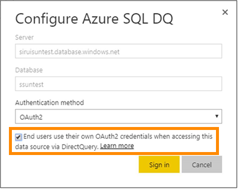

## Single sign-on

After you publish an Azure SQL DirectQuery dataset to the service, you can enable single sign-on (SSO) using Azure Active Directory (Azure AD) OAuth2 for your end users.

To enable SSO, go to settings for the dataset, open the **Data Sources** tab, and check the SSO box.

When the SSO option is enabled and your users access reports built atop the data source, Power BI sends their authenticated Azure AD credentials in the queries to the Azure SQL database or data warehouse. This option enables Power BI to respect the security settings that are configured at the data source level.

The SSO option takes affect across all datasets that use this data source. It does not affect the authentication method used for import scenarios.

> [!NOTE]
> For SSO to work properly, the dataset must be on the same tenant as the Azure SQL resource.

