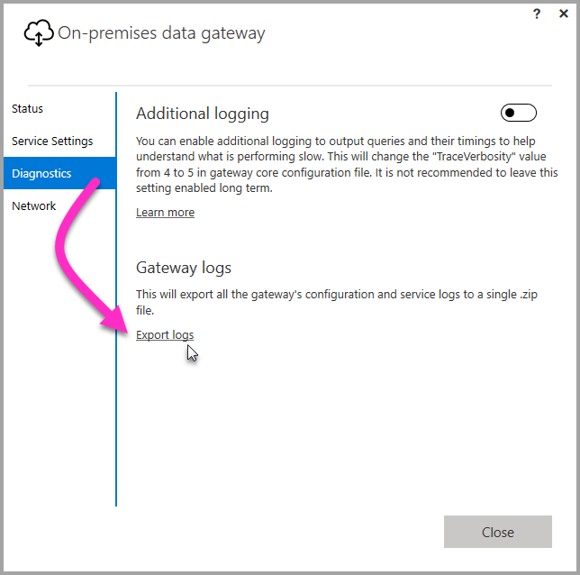

## Tools for troubleshooting
<a name="logs" />

### Collecting logs from the gateway configurator
There are several logs you can collect for the gateway, and you should always start with the logs. The simplest way to collect logs after installing the gateway is through the user interface. In the **On-premises data gateway** user interface, select **Diagnostics** and then select the **Export logs** link near the bottom of the page, as shown in the following image.

**Installer logs**

    %localappdata%\Temp\On-premises_data_gateway_*.log

**Configuration logs**

    %localappdata%\Microsoft\On-premises Data Gateway\GatewayConfigurator*.log

**On-premises data gateway service logs**

    C:\Users\PBIEgwService\AppData\Local\Microsoft\On-premises Data Gateway\Gateway*.log

### Event Logs
The **On-premises data gateway service** event logs are present under **Application and Services Logs**.

<a name="fiddler" />

### Fiddler Trace
[Fiddler](http://www.telerik.com/fiddler) is a free tool from Telerik that monitors HTTP traffic.  You can see the back and forth with the Power BI service from the client machine. This may show errors and other related information.

