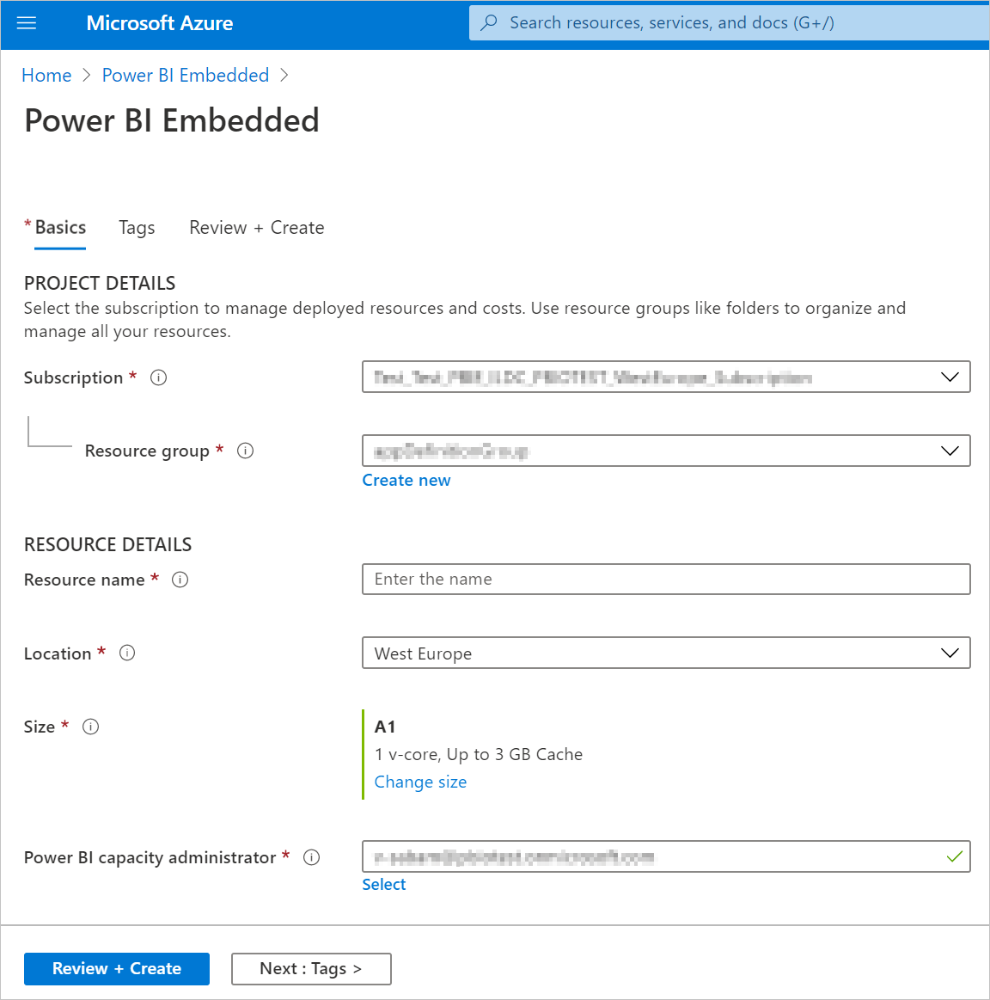

1. Fill in the required information and then click **Review + Create**.

    

    * **Subscription** - The subscription you would like to create the capacity against.

    * **Resource group** - The resource group that contains this new capacity. Pick from an existing resource group, or create another. For more information, see [Azure Resource Manager overview](https://docs.microsoft.com/azure/azure-resource-manager/resource-group-overview).

    * **Resource name** - The resource name of the capacity.

    * **Location** - The location where Power BI is hosted for your tenant. Your default location is your home region, but you can change the location using [Multi-Geo options](embedded-multi-geo.md).

    * **Size** - The [A SKU](../../admin/service-admin-premium-purchase.md#purchase-a-skus-for-testing-and-other-scenarios) you require. For more information see [SKU memory and computing power](embedded-capacity.md#sku-memory-and-computing-power).

    * **Power BI capacity administrator** - An admin for the capacity.