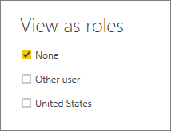
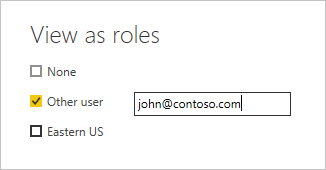

## Validate the roles within Power BI Desktop

After you've created your roles, test the results of the roles within Power BI Desktop.

1. From the **Modeling** tab, select **View as**. 

    

    The **View as roles** window appears, where you see the roles you've created.

    

1. Select a role you created, and then select **OK** to apply that role. 

   The report renders the data relevant for that role.

1. You can also select **Other user** and supply a given user. 

    

   It's best to supply the User Principal Name (UPN) as that's what the Power BI service and Power BI Report Server use.

   Within Power BI Desktop, **Other user** displays different results only if you're using dynamic security based on your DAX expressions.

1. Select **OK**.

   The report renders based on what that user can see.
   
   > [!NOTE]
   > The View as role feature doesn't work for DirectQuery models with Single Sign-On (SSO) enabled.
