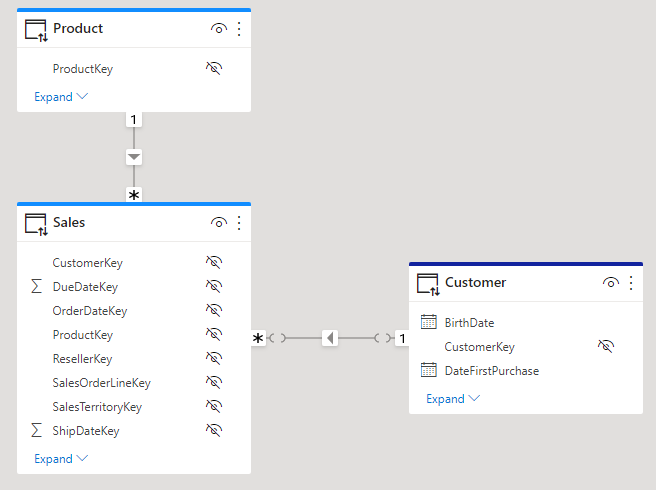

## Considerations and limitations

The current limitations for row-level security on cloud models are as follows:

* If you previously defined roles and rules in the Power BI service, you must re-create them in Power BI Desktop.
* You can define RLS only on the datasets created with Power BI Desktop. If you want to enable RLS for datasets created with Excel, you must convert your files into Power BI Desktop (PBIX) files first. [Learn more](../connect-data/desktop-import-excel-workbooks.md).
* Service principals cannot be added to an RLS role. Accordingly, RLS won’t be applied for apps using a service principal as the final effective identity.
* Only Import and DirectQuery connections are supported. Live connections to Analysis Services are handled in the on-premises model.
* The Test as role/View as role feature doesn't work for DirectQuery models with Single Sign-On (SSO) enabled.

## Republishing when RLS is configured

There's a known issue where you'll get an error message if you try to publish a previously published report from Power BI Desktop. The scenario is as follows:

1. Anna has a dataset that is published to the Power BI service and has configured RLS.

1. Anna updates the report in Power BI Desktop and republishes.

1. Anna receives an error.

### Workaround

Republish the Power BI Desktop file from the Power BI service until this issue is resolved. You can do that by selecting **Get Data** > **Files**.

## Multiple roles and limited relationships

You will get an error message if you belong to multiple RLS roles and at least one of the roles relies on a [limited relationship](../transform-model/desktop-relationships-understand#limited-relationships).
Consider the following data model:

In this simplified data model, which combines data from two Power BI Datasets, two relationships exist:
- a regular relationship between Sales and Product
- a limited relationship between Sales and Customer. The reason this is a limited relationship is because Customer is in a different source group. Note that this is not the only reason a relationship is limited. For more information, please refer to [limited relationships](../transform-model/desktop-relationships-understand#limited-relationships).

Additionally, two RLS rules have been defined in this data model:
- RLS_Product which is defined on Product and restricts access to product information
- RLS_Customer which is defined on Customer and restricts access to customer information.

User 1 belongs both RLS_Product and RLS_Customer. When User 1 accesses the data in the report, both RLS_Product and RLS_Customer will get evaluated. To evaluate RLS_Customer, data will need to be shared across the limited relationship between Sales and Customer and this might disclose potential unintentional information about Products. Therefore, Power BI will not allow this to happen and instead will generate the following error:

`The user belongs to multiple roles 'RLS_Product, RLS_Customer' that have security filters, which isn't supported when one of the roles has filters affecting table 'Sales' with SecurityFilteringBehavior=Both relationships.`

### Workaround

Please adopt one of the following workarounds to avoid this error:
1. If feasible, do not put any user into multiple RLS rules. In the scenario above, we can create another RLS role, e.g. RLS_Product_Customer which combines the RLS filters set in both RLS_Product and RLS_Customer. Next, we can assign User 1 to just RLS_Product_Customer and remove the user from RLS_Product and RLS_Customer.
2. Define RLS roles only on one source group. If it's necessary for a user to belong to multiple RLS roles, make sure all RLS filters set in the roles are defined on tables from a single source group. In the scenario above, if we could define RLS_Customer on the source group that contains Sales and Product the error would be avoided.

> [!NOTE]
> We are aware that in many situations Power BI is too restrictive and the information can safely be shared between the sources involved. While we are working on releasing a solution for this situation, please consider adopting one of the workarounds above.

