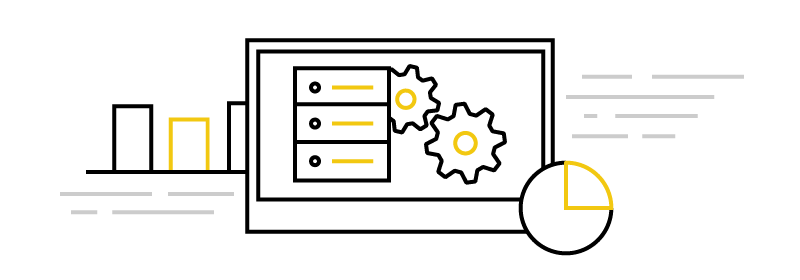

    

        <h1>Power BI documentation</h1>
        
Power BI amplifies your insights and the value of your data. With Power BI documentation, you get expert information and answers to address your needs, regardless of how you use Power BI.

        <ul class="pivots">
            <li>
                
                <ul id="home">
                    <li>
                        
                        <ul id="home-all" class="cardsA">
                            <li>
                                <a href="consumer/power-bi-consumer-landing.md">
                                    

                                        

                                            

                                                

                                                    

                                                        
                                                    

                                                

                                                

                                                    <h3>Power BI for report consumers</h3>
                                                    
Getting started with Power BI? Get to know the different products and services that make up Power BI, and see what you can do with them.

                                                

                                            

                                        

                                    

                                </a>
                            </li>
                            <li>
                                <a href="power-bi-creator-landing.md">
                                    

                                        

                                            

                                                

                                                    

                                                        
                                                    

                                                

                                                

                                                    <h3>Power BI for report designers</h3>
                                                    
Are you a Power BI report designer? Learn how to connect to data, design queries, and create reports and dashboards.

                                                

                                            

                                        

                                    

                                </a>
                            </li>
                            <li>
                                <a href="service-admin-administering-power-bi-in-your-organization.md">
                                    

                                        

                                            

                                                

                                                    

                                                        
                                                    

                                                

                                                

                                                    <h3>Power BI for admins</h3>
                                                    
Learn to manage a Power BI tenant, including configuring policies, monitoring usage, and provisioning licenses and capacities.

                                                

                                            

                                        

                                    

                                </a>
                            </li>
                            <li>
                                <a href="developer/what-can-you-do.md">
                                    

                                        

                                            

                                                

                                                    

                                                        
                                                    

                                                

                                                

                                                    <h3>Power BI for developers</h3>
                                                    
Power BI offers a wide range of options for developers, from embedding to custom visuals and streaming datasets.

                                                

                                            

                                        

                                    

                                </a>
                            </li>
                            <li>
                                <a href="https://powerbi.microsoft.com/blog/">
                                    

                                        

                                            

                                                

                                                    

                                                        
                                                    

                                                

                                                

                                                    <h3>Power BI blog</h3>
                                                    
Keep up to date on all the latest developments in Power BI.

                                                

                                            

                                        

                                    

                                </a>
                            </li>
                            <li>
                                <a href="guided-learning/index.md">
                                    

                                        

                                            

                                                

                                                    

                                                        
                                                    

                                                

                                                

                                                    <h3>Guided learning</h3>
                                                    
Start your learning journey through Power BI with this sequenced collection of courses.

                                                

                                            

                                        

                                    

                                </a>
                            </li>
                        </ul>
                    </li>
                </ul>
            </li>
        </ul>
    

