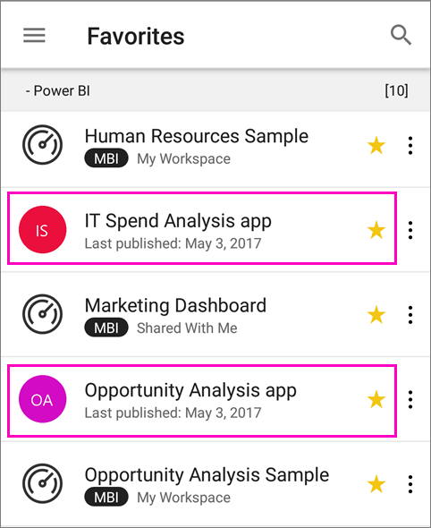
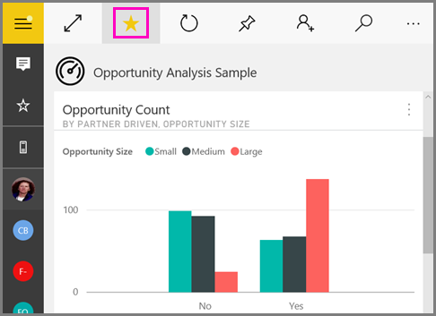

# Make favorite dashboards, apps, and on-premises reports in the Power BI mobile apps
Applies to:

|  |  |  |  |  |
|:--- |:--- |:--- |:--- |:--- |
| iPhones |iPads |Android phones |Android tablets |Windows 10 devices |

On the Favorites page in the mobile apps, you see your favorite Power BI dashboards and apps, together with favorite on-premises Power BI Report Server and Reporting Services KPIs and mobile reports. When you make a dashboard or an app a *favorite* in the Power BI mobile apps, you see it on your Favorites page the Power BI service ([https://powerbi.com](https://powerbi.com)) and all of your mobile devices. 

You can also [make Power BI dashboards and apps favorites in the Power BI service](service-dashboard-favorite.md). Then you see them on the Favorites page in the mobile app.

You can mark KPIs and reports as favorites on a Power BI Report Server or Reporting Services web portal, and then view them in one convenient folder on your mobile device, along with your Power BI favorite dashboards.

## View your favorite Power BI dashboards and apps, and on-premises reports and KPIs
* Tap the top navigation menu , then tap **Favorites**.
  
  
  
  You see all your favorites together on this page:
  
  

## Make an app a favorite
1. In the list of apps in the mobile app, tap the ellipsis (...) next to the app > **Favorite**.
   
    
   
    Now it's listed with your other favorite dashboards and apps.
   
    

## Make a dashboard a favorite in the iOS and Windows 10 mobile apps
You can make a Power BI dashboard or an app a favorite from the list of dashboards or from the dashboard itself.

* In the list of dashboards in the mobile app, tap the empty star next to the dashboard name . The star turns yellow .
  
    
* On the dashboard, tap the empty star in the ribbon at the top . The star turns yellow .
  
    

## Make a dashboard a favorite in the Android mobile apps
You can make a dashboard a favorite from the list of dashboards or from the dashboard itself.

* In the list of dashboards in the mobile app, tap the vertical ellipsis (...) next to the dashboard name, then tap **Favorite**. You see a yellow star next to the name .
  
    
* On the dashboard, tap the empty star in the ribbon at the top . The star turns dark gray .
  
    

## Make favorite Power BI Report Server and Reporting Services reports and KPIs
You can view your favorite Power BI Report Server and Reporting Services reports and KPIs in the Power BI mobile apps, but you can't make them favorites in the mobile apps. You [tag them as favorites in the web portal](report-server/getting-around.md#tag-your-favorite-reports-and-kpis). 

## Next steps
* [Favorite dashboards in the Power BI service](service-dashboard-favorite.md) 
* Questions? [Try asking the Power BI Community](http://community.powerbi.com/)

