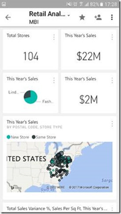

# Optimize Power BI dashboard for phones
### Anytime is the right time to create a great dashboard
| **Go from this...** | **... to this in just a few minutes** |
|:---:|:---:|
|  | |

### Book some time on your calendar, or [start optimizing now](service-create-dashboard-mobile-phone-view.md).
> [!NOTE]
> Only dashboard owners can create a phone view for a dashboard. If you’re not the owner, let the owner know how they can make a great dashboard.
> 
> 

