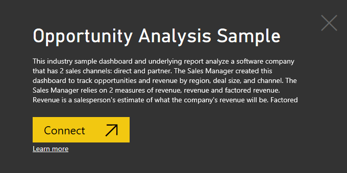
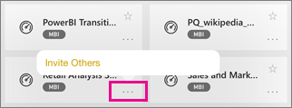

# Quickstart: View dashboards and reports in the Power BI mobile apps
In this quickstart, you interact with a sample dashboard and report in the Power BI mobile app for Android devices, but you can follow along in the other mobile apps. 

Applies to:

|  |  |  |  |  |
|:--- |:--- |:--- |:--- |:--- |
| [iPhones](mobile-apps-view-dashboard.md#view-dashboards-on-your-iphone) |[iPads](mobile-apps-view-dashboard.md#view-dashboards-on-your-ipad) |[Android phones](mobile-apps-view-dashboard.md#view-dashboards-on-your-android-phone) |[Android tablets](mobile-apps-view-dashboard.md#view-dashboards-on-your-android-tablet) |[Windows 10 devices](mobile-apps-view-dashboard.md#view-dashboards-on-your-windows-10-device) |

Dashboards are a portal to your company's life cycle and processes. A dashboard is an overview, a single place to monitor the current state of the business.

## Prerequisites

### Sign up for Power BI
If you're not signed up for Power BI, [sign up for a free trial](https://app.powerbi.com/signupredirect?pbi_source=web) before you begin.

### Install the Power BI for Android app
[Download the Power BI for Android app](http://go.microsoft.com/fwlink/?LinkID=544867) from Google Play.

Power BI can run on a number of different Android devices, running the Android 5.0 operating system or later. To check on your device, go to **Settings** > **About device** > **Android version**.

### Download the Opportunity Analysis sample
The first step in the quickstart is to download the Opportunity Analysis sample in the Power BI service.

1. Open the Power BI service in your browser (app.powerbi.com) and sign in.

2. In the left navigation pane, select **Workspaces** > **My Workspace**.

3. In the lower-left corner select **Get data**.
   
    

3. On the Get Data page, select the **Samples** icon.
   
   

4. Select the **Opportunity Analysis sample**.
 
    
 
8. Select **Connect**.  
  
   
   
5. Power BI imports the sample, adding a new dashboard, report, and dataset to your My Workspace.
   
   

OK, you're ready to view the sample on your Android device.

## View dashboards on your Android phone
1. Open the Power BI app on your Android phone and sign in.
   
1. Tap a dashboard to open it.   
   
   

    A notation below a dashboard name (in this case, "C")  shows how the data in each dashboard is classified. Read more about [data classification in Power BI](service-data-classification.md).

    Power BI dashboards look a little different on your Android phone. All the tiles appear the same width, and they're arranged one after another from top to bottom.

    

     Turn your phone sideways to view the dashboard in landscape mode on your phone.

1. While on the dashboard, you can tap the vertical ellipsis (...) next to the name to invite a colleague, refresh, or get information about the dashboard:
   
   
1. You can share a dashboard from your workspace. Tap the ellipsis (**...**) in the lower-right corner of the dashboard tile, and tap **Invite Others**.
   
   
4. You can also tap a dashboard to open it and see the tiles in that dashboard. While on the dashboard you can interact with it:
   
   * [Tap a tile to interact](mobile-tiles-in-the-mobile-apps.md) with the tile.
   * [Open the reports](mobile-reports-in-the-mobile-apps.md) behind the tiles.
   * [Annotate and share a snapshot](mobile-annotate-and-share-a-tile-from-the-mobile-apps.md) of a tile.

   * Tap the **Full Screen** icon  to present your Power BI dashboard without borders or menus, like **Slide Show** view in PowerPoint.
   * Tap the **Invite** icon  to [share your dashboard](mobile-share-dashboard-from-the-mobile-apps.md) with a colleague.
   * Tap the star  to [make the dashboard a favorite](mobile-apps-favorites.md).

## Next steps

In this quickstart, you explored a sample dashboard and report on your Android device. Read more about working in the Power BI service. 

> [!div class="nextstepaction"]
> [Quickstart: Getting around in Power BI service](service-the-new-power-bi-experience.md)

