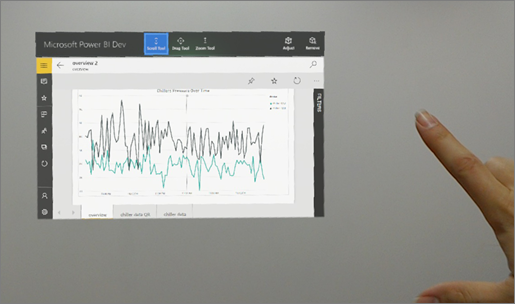

# Power BI for Mixed Reality
View your dashboards and reports in Power BI for Mixed Reality while immersed in the virtual world, or place them in specific locations in the context of your environment. 

Download the Power BI for Mixed Reality app from the Windows store to view your dashboards and reports. Interact with them in the virtual world, then select the ones you want to place. 

## Two views: Windows classic and holographic

Power BI for Mixed Reality is based on the Windows Power BI mobile app with additional capabilities unique to HoloLens. When you start Power BI for Mixed Reality, you're in this "classic" Windows view of Power BI. In this view, you can navigate between the dashboards and reports you have access to. When you find the one you want, you can switch from the classic Windows view to the holographic experience. 

## Power BI for Mixed Reality Windows classic view basics

If you're new to the HoloLens experience, this section is for you. Interacting with a HoloLens app is different from interacting with a computer, or even with a tablet or phone. In the Windows classic view, HoloLens apps respond to a set of gestures and voice commands that replace the traditional mouse and keyboard, or the phone tap. 

**Air tap**

The air tap is the most basic gesture you need to know to interact with almost every HoloLens app. You tap the thumb and forefinger together with your hand held upright, similar to a mouse click or select.  

In Power BI you use an air tap in the Windows classic app anywhere you would use a mouse click. You can air tap to open a dashboard or report in your workspace, or air tap part of a visual to filter or cross highlight other visual, and so on.

 

**Pin an item** 

Tap the **Pin** icon  to pin a dashboard, report, or visual from Windows classic view to holographic view. You can pin a number of items to holographic view. When you enter holographic view, you can place them in a specific location in the physical space -- for example, next to a particular piece of equipment.

**Switch to holographic view**

After you've pinned items in the Windows classic view, you air tap the **Full Screen** icon  to switch to holographic view. 

In holographic view, the visuals and reports are somewhat static. You can't interact with them, but they do refresh every minute or so, as data changes. 

## HoloLens holographic view basics

Now that you're in holographic view, voice commands complement the hand gestures. Here are some common voice commands.

**"Follow me"** 

Pick up a Power BI artifact, so it will stay in your main field of vision and follow your gaze until you place it somewhere.

**"Dock"** 

Use the “dock” command to place an artifact in your Power BI docking belt, so it will follow you, outside of your main field of vision, for easy access.

**"Place here"**

This command places a visual on a wall or object, or hovering in space.

**"Go home"**

Say “go home” to return to the Power BI classic Windows view. 

**"Remove"**

Use this command to remove an artifact from holographic view.

**"Remove all"** 

Use this command to remove all artifacts from holographic view.

## Scan a QR code in holographic view

You can scan a QR code with HoloLens in holographic view, just as you can [scan QR codes with the Power BI mobile apps](mobile-apps-qr-code.md) for iPhone and Android.

- While in holographic view, gaze at a QR code. Power BI opens the report associated with that QR code.

## Limitations and considerations

- When you pin a report or visual, you dont see any cross-filtering or highlighting you may have set in Windows classic view.
- Even if your coworkers have HoloLens, only you can see the visuals you pin in a location.

## Next steps

- [Get data from the real world with the Power BI mobile apps](mobile-apps-data-in-real-world-context.md)

 

