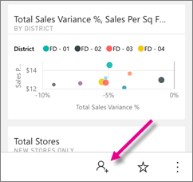

# Share a dashboard from the Power BI mobile apps
Applies to:

|  |  |  |  |  |
|:--- |:--- |:--- |:--- |:--- |
| iPhones |iPads |Android phones |Android tablets |Windows 10 devices |

With a [Power BI Pro license](service-free-vs-pro.md), you can invite colleagues to view your dashboards by sharing links from the Power BI mobile apps. The people you share dashboards with need to be the same email domain as you and have a Power BI Pro license, too, or the content needs to be in a [Premium capacity](service-premium.md).

From the Power BI mobile apps for iOS and Android, you can also [annotate and share a snapshot of a tile, report, or visual](mobile-annotate-and-share-a-tile-from-the-mobile-apps.md) with anyone. 

## Share a dashboard from your iPhone
1. In the actions bar at the bottom of the dashboard, tap the share icon .
   
   
2. Tap **Invite a colleague**.
3. Type names, separated by commas, and a message to accompany your dashboard invitation.
4. To allow resharing, leave **Allow recipients to share this dashboard** selected.
   
   Resharing allows your colleagues to forward the email invitation to others in your organization, either through the web or the mobile apps.
5. Tap **Send** in the upper-right corner.
   
   Your colleagues get an email invitation with a direct link to the dashboard. The invitation expires after one month. When they open it, in a browser or in the Power BI mobile app, it's added to the **Shared with me** section of their Power BI account.
   
   
   
   Read more [notes about sharing dashboards with colleagues](service-share-dashboards.md).

### Unshare a dashboard from your iPhone
You can only unshare a dashboard if you're the dashboard owner.

1. In the actions bar at the bottom of the dashboard, tap the share icon .
2. Tap **Invite a colleague**.
   
   You see the list of colleagues with whom you've shared this dashboard, with these phrases:
   
   * **Can View**: They can view the dashboard but not share it.
   * **Can View & Invite**: They can view the dashboard and share it with other colleagues.
3. Tap **Edit**.
   
    
4. To unshare, tap the red circle next to a name and tap **Delete**.

## Share a dashboard from your iPad
1. Tap the Share icon  icon in the upper-right corner of your dashboard.
2. Tap **Invite a colleague**, then type email addresses and a message to accompany your dashboard invitation.
3. To allow resharing, leave **Allow recipients to share this dashboard** selected.
   
   > [!NOTE]
   > Resharing allows your coworkers to forward the email invitation to others in your organization, either through the web or the mobile apps.
   > 
   > 
4. Tap **Send** in the upper-right corner.
   
   Your colleagues get an email invitation with a direct link to the dashboard. The invitation expires after one month. When they open it, in a browser or in the Power BI mobile app, it's added to the **Shared with me** section of their Power BI account
   
   
   
   Read more [notes about sharing dashboards with colleagues](service-share-dashboards.md).

### Unshare a dashboard from your iPad
You can only unshare a dashboard if you're the dashboard owner.

1. Tap the Share icon  in the upper-right corner of your dashboard.
   
   You see the list of colleagues with whom you've shared this dashboard. Below their names are these words:
   
   * **Pending**: They haven't viewed the dashboard yet.
   * **Can View**: They can view the dashboard but not share it.
   * **Can View & Invite**: They can view the dashboard and share it with other colleagues.
2. Tap **Edit**.
3. To unshare, tap the red circle next to a name and tap **Delete**.

## Share a dashboard from your Android device
1. On the dashboards home page, tap the ellipsis (...) and tap **Invite a colleague**.
   
   
2. Or, in the upper-right corner of a dashboard, tap the invite icon .

    If you're the owner of the dashboard, you see the list of colleagues with whom you've shared this dashboard, with these notes:

    -   **Can view**: They have viewed the dashboard but can't share it.

    -   **Can view & invite**: They have viewed the dashboard and can share it with other colleagues.

1. Type email addresses, and a message to accompany your dashboard invitation. Otherwise Power BI sends a default message.
2. To allow resharing, leave **Allow recipients to share this dashboard** selected.
   
   > [!NOTE]
   > Resharing allows your coworkers to forward the email invitation to others in your organization, either through the browser or the mobile apps.
   > 
   > 
3. Tap the Send icon  in the upper-right corner to send the mail.
   
   Your colleagues get an email invitation with a direct link to the dashboard. The invitation expires after one month. When they open it, in a browser or in the Power BI mobile app, it's added to the **Shared with me** section of their Power BI account
   
   
   
   Read more [notes about sharing dashboards with colleagues](service-share-dashboards.md).

### Unshare a dashboard from your Android device
Only the dashboard owner can unshare a dashboard.

1. In the upper-right corner of your dashboard, tap the invite icon . 
   
   You see the list of colleagues with whom you've shared this dashboard.
2. To stop sharing the dashboard with a colleague, tap the **X** next to a name \> **Remove**.

## Share a dashboard from your Windows 10 device
1. In a dashboard, tap the Invite icon .
   
   Or on the dashboards home page, right-click or press and hold, and tap **Invite**.
   
   
   
   If you're the owner of the dashboard, you see the list of colleagues with whom you've shared this dashboard, with these notes:
   
   **Read only**: They have viewed the dashboard but can't share it.
   
   **Read and reshare**: They have viewed the dashboard and can share it with other colleagues.
2. Type email addresses, and a message to accompany your dashboard invitation. Otherwise Power BI sends a default message.
   
   
3. To allow resharing, leave **Allow recipients to share this dashboard** selected.
   
   > [!NOTE]
   > Resharing allows your coworkers to share this dashboard with others in your organization, either through the browser or the mobile apps.
   > 
   > 
4. Tap the Send icon .
   
   Your colleagues get an email invitation with a direct link to the dashboard. The invitation expires after one month. When they open it, in a browser or in the Power BI mobile app, it's added to the **Shared with me** section of their Power BI account
   
   
   
   Read more [notes about sharing dashboards with colleagues](service-share-dashboards.md).

## Next steps
* [Annotate & share a snapshot of a tile, report, or visual in the mobile apps](mobile-annotate-and-share-a-tile-from-the-mobile-apps.md)
* [Share a dashboard in Power BI](service-share-dashboards.md)
* Questions? [Try asking the Power BI Community](http://community.powerbi.com/)

