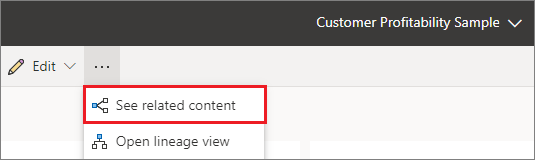
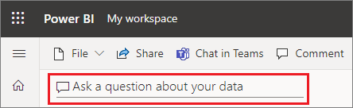
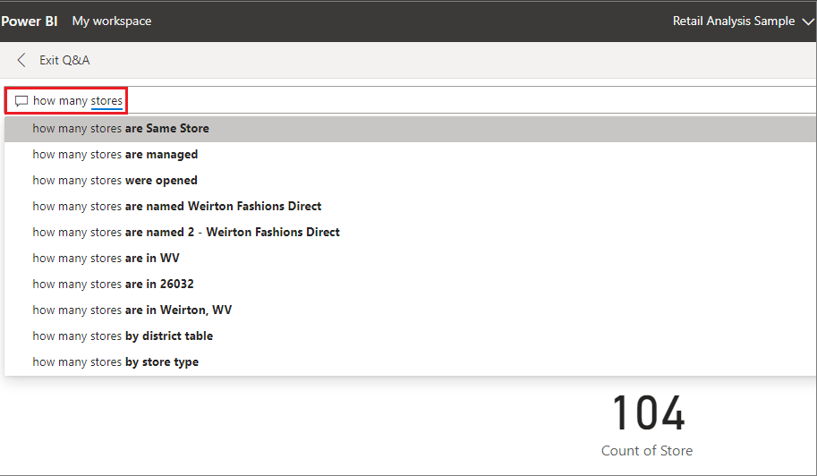
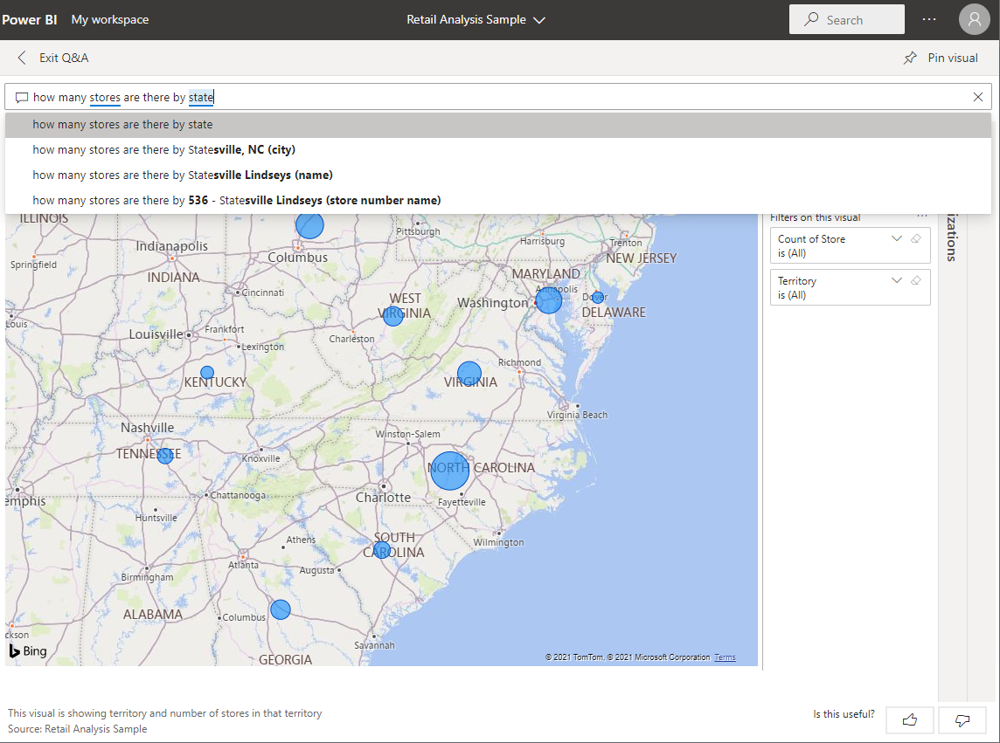
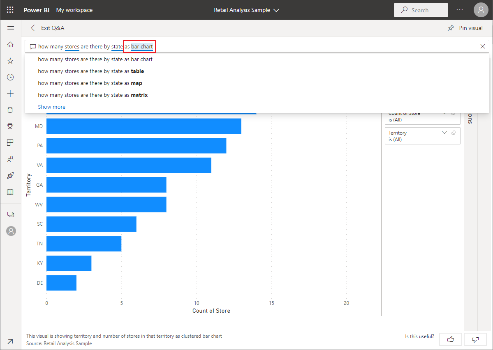
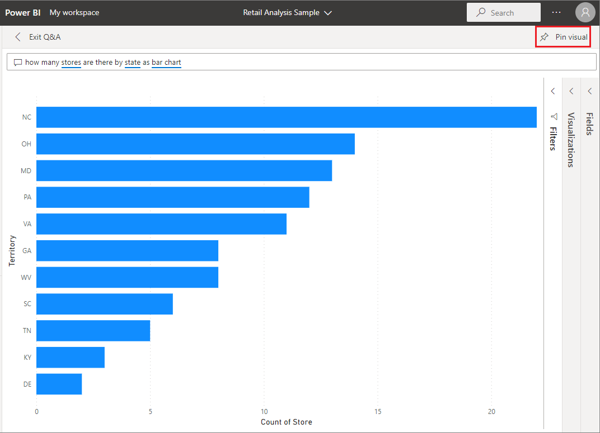

# Tutorial: Use Power BI Q&A to explore your data and create visuals on a dashboard

[!INCLUDE [applies-yes-desktop-yes-service](../includes/applies-yes-desktop-yes-service.md)]

Q&A is available throughout Power BI, and this article focuses on using Q&A on a dashboard. We import a sample and use Q&A to explore our data and pin interesting findings to our dashboard.

## Prerequisites  

- Read the Q&A intro article [Q&A for Power BI business users](../consumer/end-user-q-and-a.md).
- Sign up for a [free or trial license for the Power BI service](../fundamentals/service-self-service-signup-purchase-for-power-bi.md).

- Open the Power BI service in a browser.

- [Download and open the Retail analysis sample.](#import-the-sample-in-the-power-bi-service)

## Import the sample in the Power BI service

1. Open the Power BI service (`app.powerbi.com`), and select **Learn** in the left navigation pane.

1. On the **Learning center** page, under **Sample reports**, scroll until you see the **Retail Analysis Sample.**

1. Select the sample. It opens in Reading mode.

   :::image type="content" source="media/end-user-q-and-a-tutorial/power-bi-sample-read-mode.png" alt-text="Screenshot shows the Retail Analysis Sample in reading mode." lightbox="media/end-user-q-and-a-tutorial/power-bi-sample-read-mode.png":::

1. Select **My workspace** in the left navigation pane and scroll until you find the Retail Analysis sample. Power BI imports the built-in sample, adding a new dashboard, report, and semantic model to the current Retail Analysis workspace.

   :::image type="content" source="media/end-user-q-and-a-tutorial/retail-entry.png" alt-text="Screenshot shows dashboard, report, and semantic model for Retail Analysis Sample.":::

## Get started using Q&A on a dashboard

In the Power BI service (app.powerbi.com), a dashboard contains tiles pinned from one or more semantic models, so you can ask questions about any of the data contained in any of those semantic models. To see what reports and semantic models were used to create the dashboard, select **More options (...)** from the menu bar, and then choose **See related content**.

When you type a question, Power BI looks for the best answer using any semantic model that has a tile on that dashboard. If all the tiles are from *semantic modelA*, then your answer comes from *semantic modelA*. If there are tiles from *semantic modelA* and *semantic modelB*, then Q&A searches for the best answer from those two semantic models.

> [!TIP]
> Be careful. If you only have one tile from *semantic modelA* and you remove it from your dashboard, Q&A will no longer have access to *semantic modelA*.

In our example, most of the tiles on this dashboard are from the Retail analysis sample. To help form your questions, get familiar with the Retail analysis sample content. Take a look at the visuals on the dashboard and in the report. Get a feel for the type and range of data that is available to you. Optionally, read the article that describes the sample, [Retail Analysis sample for Power BI: Take a tour](../create-reports/sample-retail-analysis.md).

> [!NOTE]
> If you already feel comfortable with the data, just place your cursor in the question box to open the Q&A screen.

For example:

- If a visual's axis labels and values include "sales",  "account", "month", and "opportunities", then you can confidently ask questions such as: "Which *account* has the highest *opportunity*" or "show *sales* by month as a bar chart."

- If your semantic model has website performance data for Google Analytics, you can ask Q&A about time spent on a web page, number of unique page visits, and user engagement rates. Or, if you're querying demographic data, you might ask questions about age and household income by location.

Once you're familiar with the data, head back to the dashboard and place your cursor in the question box. The Q&A screen opens.

:::image type="content" source="media/end-user-q-and-a-tutorial/power-bi-suggestion.png" alt-text="Screenshot shows the Q&A screen with suggested questions.":::

Don't see the Q&A box? See [Considerations and limitations](../consumer/end-user-q-and-a.md#considerations-and-limitations) in the **Q&A for for Power BI business users** article. 

## Use Q&A on a dashboard in the Power BI service

The Q&A field is where you type your question using natural language. It's located in the upper-left corner of your dashboard. Q&A recognizes the words you type and figures out where, and in which semantic model, to find the answer. [Q&A also helps you form your question with autocompletion, restatement, and other textual and visual aids](q-and-a-intro.md). 

Let's try it out. 

### Create a visual using the Q&A field on a dashboard

1. Open a dashboard and place your cursor in the Q&A field. 

    

    Even before you start typing, Q&A displays a new screen with suggestions to help you form your question. You see phrases and complete questions containing the names of the tables in the underlying semantic models and might even see complete questions listed if the semantic model owner has created [featured questions](../create-reports/service-q-and-a-create-featured-questions.md).

    :::image type="content" source="media/end-user-q-and-a-tutorial/power-bi-show-all.png" alt-text="Screenshot shows Q&A with Show all suggestions selected.":::

1. You can select any of these options to add them to the question box and then refine the question to find a specific answer.

   :::image type="content" source="media/end-user-q-and-a-tutorial/power-bi-results.png" alt-text="Screenshot shows Q&A with a query.":::

1. If you're unsure what type of questions to ask or terminology to use, expand **Show all suggestions** or look through the other visuals in the report. These techniques get you familiar with the terms and content of the semantic model.

   :::image type="content" source="media/end-user-q-and-a-tutorial/power-bi-qna-suggested.png" alt-text="Screenshot highlighting Q&A suggested questions.":::

1. Choose one of these questions as a starting point or begin typing your own question and select from the dropdown suggestions.

   

1. As you type a question, Power BI helps you with autocomplete, visual cues, restatement, and feedback. Power BI also picks the best visualization to display your answer. 

   

1. The visualization changes dynamically as you modify the question.

   

1. Don't like the default visualization that Power BI Q&A chose? Edit the natural language question to include the visualization type that you'd prefer.

    :::image type="content" source="media/end-user-q-and-a-tutorial/power-bi-specify.png" alt-text="Screenshot shows Q&A visual with as a column chart added to the question.":::

1. When you're happy with the result, pin the visualization to a dashboard by selecting the pin icon in the top right corner. If the dashboard was shared with you, or is part of an app, you might not be able to pin.

   

## Considerations and limitations

- If you've connected to a semantic model using a live connection or gateway, Q&A needs to be [enabled for that semantic model](../create-reports/service-q-and-a-direct-query.md).

- At the current time, Power BI Q&A only supports answering natural language queries asked in English. There's a preview available for Spanish that your Power BI administrator can enable.

## Related content

- [Q&A for Power BI business users](../consumer/end-user-q-and-a.md)
- [Tips for asking questions in Power BI Q&A](../consumer/end-user-q-and-a-tips.md)
- [Make Excel data work well with Q&A in Power BI](../create-reports/service-prepare-data-for-q-and-a.md)
- [Enable Q&A for live connections in Power BI](../create-reports/service-q-and-a-direct-query.md)
- [Pin a tile to the dashboard from Q&A](../create-reports/service-dashboard-pin-tile-from-q-and-a.md)