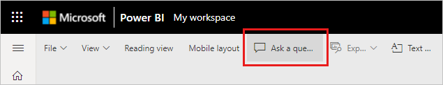
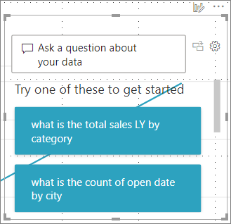
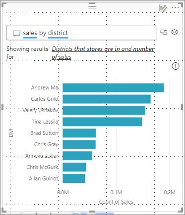
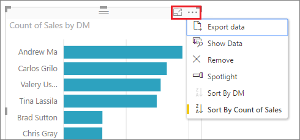

# Tutorial: Use Power BI Q&A to explore your data and create visuals

[!INCLUDE [applies-yes-desktop-yes-service](../includes/applies-yes-desktop-yes-service.md)]

Sometimes the fastest way to get an answer from your data is to ask a question using natural language. The Q&A feature in Power BI lets you explore your data in your own words. The first part of this article shows how you use Q&A in dashboards in the Power BI service. The second part shows how you use Q&A in reports in the Power BI service and Desktop. For a quick explanation of Q&A, see [Q&A for Power BI business users](../consumer/end-user-q-and-a.md).

These articles cover using Q&A in other scenarios in Power BI:

- [Q&A virtual analyst in Power BI iOS apps](../consumer/mobile/mobile-apps-ios-qna.md)
- [Q&A in Power BI embedded analytics](../developer/embedded/qanda.md)

Q&A is interactive and fun. Often one question leads to others as the visualizations reveal interesting paths to pursue. Watch Amanda demonstrate using Q&A to create visualizations, dig into those visuals, and then pin them to dashboards.

> [!NOTE]
> This video might use earlier versions of Power BI Desktop or the Power BI service.

<iframe width="560" height="315" src="https://www.youtube.com/embed/qMf7OLJfCz8?list=PL1N57mwBHtN0JFoKSR0n-tBkUJHeMP2cP" frameborder="0" allowfullscreen></iframe>

## Import the sample in the Power BI service

1. Open the Power BI service (`app.powerbi.com`), and select **Learn** in the left navigation pane.

1. On the **Learning center** page, under **Sample reports**, scroll until you see the **Retail Analysis Sample**.

1. Select the sample. It opens in Reading mode.

   :::image type="content" source="media/end-user-q-and-a-tutorial/power-bi-sample-read-mode.png" alt-text="Screenshot shows the Retail Analysis Sample in reading mode." lightbox="media/end-user-q-and-a-tutorial/power-bi-sample-read-mode.png":::

1. Select **My workspace** in the left navigation pane and scroll until you find the Retail Analysis sample. Power BI imports the built-in sample, adding a new dashboard, report, and dataset to the current Retail Analysis workspace.

   :::image type="content" source="media/end-user-q-and-a-tutorial/retail-entry.png" alt-text="Screenshot shows dashboard, report, and dataset for Retail Analysis Sample.":::

## Get started

First, get familiar with the content. Take a look at the visuals on the dashboard and in the report. Get a feel for the type and range of data that is available to you.

For example:

- If a visual's axis labels and values include "sales",  "account", "month", and "opportunities", then you can confidently ask questions such as: "Which *account* has the highest *opportunity*" or "show *sales* by month as a bar chart."

- If your dataset has website performance data for Google Analytics, you can ask Q&A about time spent on a web page, number of unique page visits, and user engagement rates. Or, if you're querying demographic data, you might ask questions about age and household income by location.

- In the [Power BI service](/app.powerbi.com), a dashboard contains tiles pinned from one or more datasets, so you can ask questions about any of the data contained in any of those datasets. To see what reports and datasets were used to create the dashboard, select **More options (...)** from the menu bar, and then choose **See related content**.

    

- When you type a question, Power BI looks for the best answer using any dataset that has a tile on that dashboard. If all the tiles are from *datasetA*, then your answer will come from *datasetA*. If there are tiles from *datasetA* and *datasetB*, then Q&A searches for the best answer from those two datasets.

   > [!TIP]
   > Be careful. If you only have one tile from *datasetA* and you remove it from your dashboard, Q&A will no longer have access to *datasetA*.

Once you're familiar with the data, head back to the dashboard and place your cursor in the question box. The Q&A screen opens.

:::image type="content" source="media/end-user-q-and-a-tutorial/power-bi-suggestion.png" alt-text="Screenshot shows the Q&A screen with suggested questions.":::

Don't see the Q&A box? See [Considerations and troubleshooting](../consumer/end-user-q-and-a.md#considerations-and-troubleshooting) in the **Q&A for for Power BI business users** article. 

## Part 1: Use Q&A on a dashboard in the Power BI service

The Q&A field is where you type your question using natural language. It's located in the upper-left corner of your dashboard. Q&A recognizes the words you type and figures out where, and in which dataset, to find the answer. [Q&A also helps you form your question with auto-completion, restatement, and other textual and visual aids](q-and-a-intro.md). 

Let's try it out. 

### Create a visual using the Q&A field on a dashboard

1. Open a dashboard and place your cursor in the Q&A field. 

    

    Even before you start typing, Q&A displays a new screen with suggestions to help you form your question. You see phrases and complete questions containing the names of the tables in the underlying datasets and might even see complete questions listed if the dataset owner has created [featured questions](service-q-and-a-create-featured-questions.md).

    :::image type="content" source="media/end-user-q-and-a-tutorial/power-bi-show-all.png" alt-text="Screenshot shows Q&A with Show all suggestions selected.":::

1. If you're unsure what type of questions to ask or terminology to use, expand **Show all suggestions** or look through the other visuals in the report. These techniques get you familiar with the terms and content of the dataset.

   :::image type="content" source="media/end-user-q-and-a-tutorial/power-bi-qna-suggested.png" alt-text="Screenshot highlighting Q&A suggested questions.":::

2. Choose one of these questions as a starting point or begin typing your own question and select from the dropdown suggestions.

   

3. As you type a question, Q&A picks the best visualization to display your answer.

   

4. The visualization changes dynamically as you modify the question.

   

6. When you're happy with the result, pin the visualization to a dashboard by selecting the pin icon in the top right corner. If the dashboard was shared with you, or is part of an app, you won't be able to pin.

   

## Part 2: Use Q&A in a report in Power BI service or Power BI Desktop

Use Q&A to explore your dataset and to add visualizations to a report. A report is based on a single dataset and might be blank or contain pages full of visualizations. However, just because a report is blank, doesn't mean there isn't any data for you to explore--the dataset is linked to the report and is waiting for you to explore and create visualizations. To see which dataset is being used to create a report, open the report in Power BI service [Reading view](../consumer/end-user-reading-view.md) and select **More options (...)** > **See related content** from the menu bar.

> Note: This tutorial teaches you how to use Q&A in a report. To learn how to create a Q&A visual and add it to a report, see [Q&A report visual](../visuals/power-bi-visualization-q-and-a.md). And, to learn how to add a Q&A button to a report, see [../create-reports/power-bi-customize-button.md]

To use Q&A in a report, you must have edit permissions for the report and underlying dataset. If instead you have a free license and haven't been given edit permissions to the report, then you won't be able to interact with Q&A in the report. 

# [Power BI Desktop](#tab/powerbi-desktop)

1. In Power BI Desktop Report view, select **Q&A** from the **Insert** tab.

    **Power BI Desktop**
    

# [Power BI service](#tab/powerbi-service)

1. In the Power BI service, open a report in Editing view and select **Ask a question** from the menu bar.

    **Service**
    

---

2. A Q&A question box displays on your report canvas. In the following example, the question box displays on top of another visualization. This is fine, but it might be better to add a blank page to the report before asking a question.

   

3. Place your cursor in the question box. As you type, Q&A displays suggestions to help you form your question.

   

4. As you type a question, Q&A picks the best [visualization](../visuals/power-bi-visualization-types-for-reports-and-q-and-a.md) to display your answer. The visualization changes dynamically as you modify the question.

   

5. When you have the visualization you like, select **Enter**. To save the visualization with the report, select **File > Save**.

6. Interact with the new visualization. It doesn't matter how you created the visualization. All of the same interactivity, formatting, and features are available.

   

   If you've created the visualization in the Power BI service, you can even [pin it to a dashboard](service-dashboard-pin-tile-from-q-and-a.md).

## Tell Q&A which visualization to use

With Q&A, not only can you ask your data to speak for itself, you can tell Power BI how to display the answer. Just add "as a \<visualization type>" to the end of your question. For example, "show inventory volume by plant as a map" and "show total inventory as a card". Try it for yourself.

his example uses **top states by total sales**. Power BI does its best to select which visual type to use. In this case, it's a basic map.

:::image type="content" source="../consumer/media/end-user-q-and-a-tutorial/power-bi-qna-suggest.png" alt-text="Screenshot shows Q&A with a map visual.":::

You can tell Power BI which visual type to use by adding it to your natural language query. Keep in mind that not all visual types work or make sense with your data. For example, this data wouldn't produce a meaningful scatter chart. But it works as a filled map.

:::image type="content" source="../consumer/media/end-user-q-and-a-tutorial/power-bi-filled-map.png" alt-text="Screenshot shows Q&A visual as a filled map.":::

## Considerations and troubleshooting

- If you've connected to a dataset using a live connection or gateway, Q&A needs to be [enabled for that dataset](service-q-and-a-direct-query.md).

- Say you've opened a report and don't see the Q&A option. If you're using the Power BI service, make sure the report is open in Editing view. If you can't open Editing view, you don't have edit permissions for that report, and you can't use Q&A with that specific report.

## Next steps

- [Q&A for Power BI business users](../consumer/end-user-q-and-a.md)
- [Tips for asking questions in Power BI Q&A](../consumer/end-user-q-and-a-tips.md)
- [Make Excel data work well with Q&A in Power BI](service-prepare-data-for-q-and-a.md)
- [Enable Q&A for live connections in Power BI](service-q-and-a-direct-query.md)
- [Pin a tile to the dashboard from Q&A](service-dashboard-pin-tile-from-q-and-a.md)

Another way Power BI helps you ask questions is with features such as: *prompts*, *autocomplete*, and *visual cues*. Power BI provides this help for Q&A on dashboards and with the Q&A visual in reports. For more information, see  [Create a visual using your own Q&A question](#create-a-visual-using-your-own-qa-question).
