# Best practices to optimize Q&A in Power BI
Using common phrases and natural language to ask questions of your data is powerful. Even more powerful is when your data answers, which is what Q&A in Power BI does.

To enable Q&A to successfully interpret the large collection of questions it's capable of responding to, Q&A must make assumptions about the model. If the structure of your model doesn't meet one or more of these assumptions, you need to adjust your model. Those adjustments for Q&A are the same best-practice optimizations for any model in Power BI, regardless whether you use Q&A.

In the following sections, we describe how to adjust your model so it works well with Q&A in Power BI.

## Automatic adjustments that Q&A makes

### Measure tables

In previous versions of Q&A, measure tables would confuse Q&A as the underlying table was disconnected. Q&A works just fine with measure tables now.

### Table names conflicting with column names

In previous versions of Q&A, if a table and column had the same name, the table would take preference. This issue has been addressed, so you don't have to fix this issue in your models anymore.

## Manual steps to improve Q&A

### Use the new Q&A tooling to fix your questions

With the Q&A tooling, you can teach your core business terms to Q&A and fix questions your end users ask. Sometimes, some questions still can't be addressed because the data is shaped incorrectly or data is missing. In this case, read the other sections below to help you optimize. Read more about [Q&A tooling](q-and-a-tooling-intro.md).

## Add missing relationships

If your model is missing relationships between tables, neither Power BI reports nor Q&A can interpret how to join those tables. Relationships are the cornerstone of a good model. For example, you can't ask for the “total sales for Seattle customers” if the relationship between the *orders* table and the *customers* table is missing. The following images show a model that needs work, and a model that is ready for Q&A. 

**Needs work**

In the first image, there are no relationships between the Customers, Sales, and Products tables.

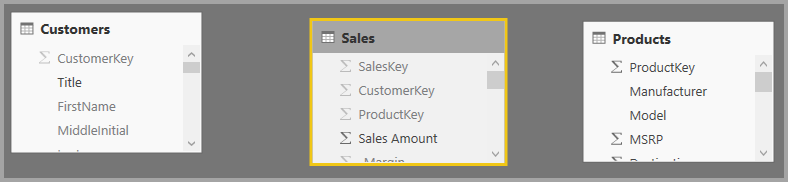

**Ready for Q&A**

In the first image, relationships are defined between the tables.

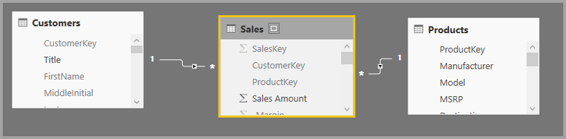

## Rename tables and columns

The choice of tables and columns is important for Q&A. For example, say you have a table named *CustomerSummary* that contains a list of your customers. You would need to ask questions like “List the customer summaries in Chicago” rather than “List the customers in Chicago”. 

While Q&A can do some basic word breaking and detecting plurals, Q&A assumes that your table and column names accurately reflect their content.

Consider another example. Imagine you have a table named *Headcount* that contains first and last names and employee numbers. You have another table named *Employees* that contains employee numbers, job numbers, and start dates. People familiar with the model might understand this structure. Someone else who asks “count the employees” is going to get a count of the rows from the “Employees” table. This result is probably not what they had in mind, because it’s a count of every job every employee has ever had. It would be better to rename those tables to truly reflect what they contain.

**Needs work**

Table names like *StoreInfo* and *Product List* need work.

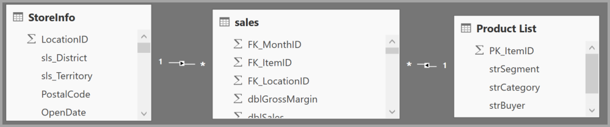

**Ready for Q&A**

Tables named *Store* and *Products* work better.

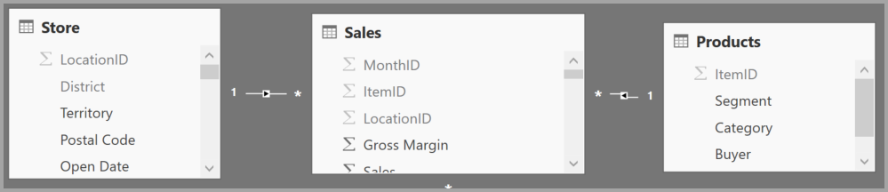

## Fix incorrect data types

Imported data can have incorrect data types. In particular, *date* and *number* columns that are imported as *strings* aren't interpreted by Q&A as dates and numbers. Make sure you select the correct data type in your Power BI model.

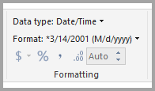

## Mark year and identifier columns as Don't Summarize

Power BI aggressively aggregates numeric columns by default, so questions like “total sales by year” can sometimes result in a grand total of sales alongside a grand total of years. If you have specific columns where you don't want Power BI to exhibit this behavior, set the **Default Summarization** property on the column to **Don’t Summarize**. Be mindful of **year**, **month**, **day**, and **ID** columns, as those columns are the most frequent problems. Other columns that aren’t sensible to sum, such as *age*, could also benefit from setting **Default Summarization** to **Don’t Summarize** or to **Average**. You'll find this setting in the **Modeling** tab.

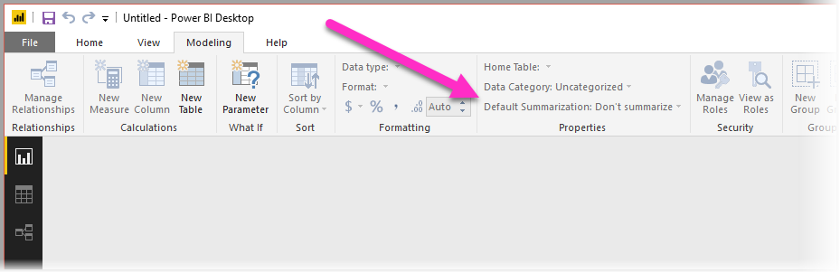

## Choose a Data Category for each date and geography column

The **Data Category** provides additional semantic knowledge about the content of a column beyond its data type. For example, you can mark an integer column as a zip code, a string column as a City, Country/Region, and so on. Q&A uses this information in two important ways: For visualization selection and for language biases.

First, Q&A uses the **Data Category** information to help make choices about what kind of visual display to use. For example, it recognizes that columns with date or time **Data Categories** are typically a good choice for the horizontal axis of a line chart or the play axis of a bubble chart. And it assumes that results containing columns with geographical **Data Categories** may look good on a map.

Second, Q&A makes some educated guesses about how users are likely to talk about date and geography columns, to help it understand certain types of questions. For example, the “when” in “When was John Smith hired?” is almost certain to map to a date column, and the “Brown” in “Count customers in Brown” is more likely to be a city than a hair color.

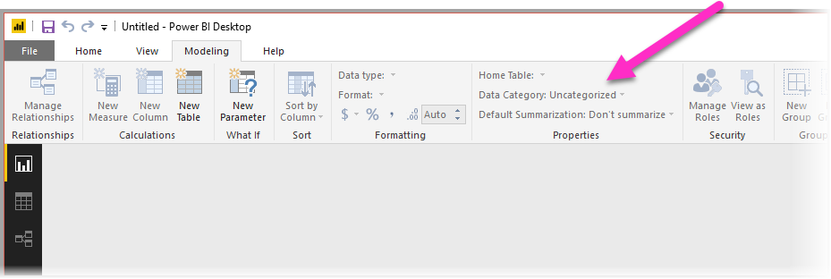

## Choose a Sort By Column for relevant columns

The **Sort By Column** property allows sorting in one column to automatically sort a different column instead. For example, when you ask “sort customers by shirt size”, you probably want your Shirt Size column to sort by the underlying size number (XS, S, M, L, XL) rather than alphabetically (L, M, S, XL, XS).

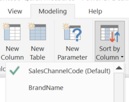

## Normalize your model

Rest assured that we’re not suggesting you need to reshape your entire model. However, certain structures are so difficult that Q&A doesn't handle them well. If you perform some basic normalization of the structure of your model, the usability of Power BI reports increases significantly, along with the accuracy of Q&A results.

Follow this general rule: Each unique “thing” the user talks about should be represented by exactly one model object (table or column). So, if your users talk about customers, there should be one *customer* object. And, if your users talk about sales, there should be one *sales* object. Sounds simple, doesn't it? Depending on the shape of the data you’re starting with, it can be. There are rich data shaping capabilities available in **Query Editor** if you need them, while many of the more straightforward transformations can happen simply using calculations in the Power BI model.

The following sections contain some common transformations you might need to perform.

### Create new tables for multi-column entities

If you have multiple columns that act as a single distinct unit within a larger table, those columns should be split out into their own table. For example, say you have a Contact Name, Contact Title, and Contact Phone column within your *Companies* table. A better design would be to have a separate *Contacts* table to contain the Name, Title, and Phone, and a link back to the *Companies* table. That makes it easier to ask questions about contacts independently of questions about companies for which they are the contact, and improves display flexibility.

**Needs work**

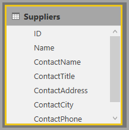

**Ready for Q&A**

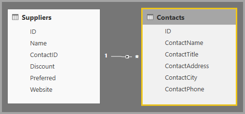

### Pivot to eliminate property bags

If you have *property bags* in your model, they should be restructured to have a single column per property. Property bags, while convenient for managing large numbers of properties, suffer from a number of inherent limitations that neither Power BI reports nor Q&A are designed to work around.

For example, consider a *CustomerDemographics* table with CustomerID, Property, and Value columns, where each row represents a different property of the customer (for example, age, marital status, city, and so on). By overloading the meaning of the Value column based on the content of the Property column, it becomes impossible for Q&A to interpret most queries that reference it. A simple question such as “show the age of each customer” might happen to work, since it could be interpreted as “show the customers and customer demographics where property is age”. However, the structure of the model simply doesn’t support slightly more complex questions like “average age of customers in Chicago.” While users who directly author Power BI reports can sometimes find clever ways to get the data they are looking for, Q&A only works when each column has only a single meaning.

**Needs work**

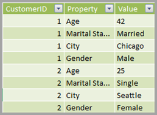

**Ready for Q&A**

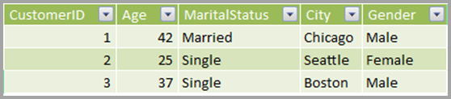

### Union to eliminate partitioning

If you've partitioned your data across multiple tables, or have pivoted values across multiple columns, a number of common operations are difficult or impossible for your users to achieve. Consider first a typical table partitioning: a *Sales2000-2010* table and a *Sales2011-2020* table. If all of your important reports are restricted to a specific decade, you could probably leave it this way for Power BI reports. However, the flexibility of Q&A leads your users to expect answers to questions like “total sales by year.” For this query to work, you need to union the data into a single Power BI model table.

Similarly, consider a typical pivoted value column: a *BookTour* table containing Author, Book, City1, City2, and City3 columns. With a structure like this, even simple questions like “count books by city” cannot be interpreted correctly. For this query to work, create a separate *BookTourCities* table, which unions the city values into a single column.

**Needs work**

**Ready for Q&A**

### Split formatted columns

If the source from which you're importing your data contains formatted columns, Power BI reports (and Q&A) don't reach inside the column to parse its contents. So if you have, for example, a **Full Address** column that contains the address, city, and country, you should also split it into Address, City, and Country columns so your users can query against them individually.

**Needs work**

**Ready for Q&A**

Similarly, if you have any full name columns for a person, add **First Name** and **Last Name** columns, just in case someone wants to ask questions using partial names. 

### Create new tables for multi-value columns

Also a similar situation, if the source from which you're importing your data contains multi-value columns, Power BI reports (and Q&A) can't reach inside the column to parse out the contents. So, if you have, for example, a Composer column that contains the names of multiple composers for a song, you should split it into multiple rows in a separate *Composers* table.

**Needs work**

**Ready for Q&A**

### Denormalize to eliminate inactive relationships

The one exception to the “normalization is better” rule occurs when there is more than one path to get from one table to another. For example, say you have a *Flights* table with both SourceCityID and DestinationCityID columns, each of which are related to the *Cities* table. One of those relationships has to be marked as inactive. Since Q&A can only use active relationships, you can't ask questions about either source or destination, depending on which you chose. If you instead denormalize the city name columns into the *Flights* table, you can ask questions like: “list the flights for tomorrow with a source city of Seattle and a destination city of San Francisco.”

**Needs work**

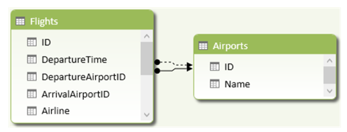

**Ready for Q&A**

### Add synonyms to tables and columns

This step applies specifically to Q&A (and not to Power BI reports in general). Users often have a variety of terms they use to refer to the same thing, such as total sales, net sales, total net sales. You can add these synonyms to tables and columns in the Power BI model. 

This step can be important. Even with straightforward table and column names, users of Q&A ask questions using the vocabulary that first comes to them. They're not choosing from a predefined list of columns. The more sensible synonyms you add, the better your users' experience is with your report. To add synonyms, in Power BI Desktop go to Model view, select the Modeling tab, and select a field or table. The Properties pane shows the **Synonyms** box, where you can add synonyms.

 Be careful when adding synonyms. Adding the same synonym to more than one column or table introduces ambiguity. Q&A uses context where possible to choose between ambiguous synonyms, but not all questions have sufficient context. For example, when your user asks “count the customers”, if you have three things with the synonym “customer” in your model, the users might not get the answer they're looking for. In these cases, make sure the primary synonym is unique, as that's what is used in the restatement. It can alert the user to the ambiguity (for example, a restatement of “show the number of archived customer records”), hinting they might want to ask it differently.

## Next steps

[Intro to Power BI Q&A](q-and-a-intro.md)
