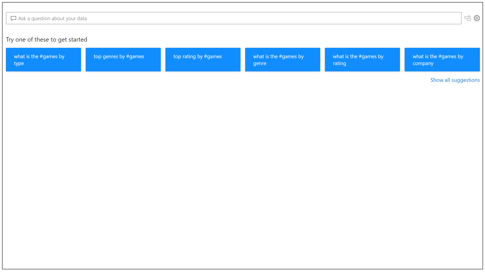
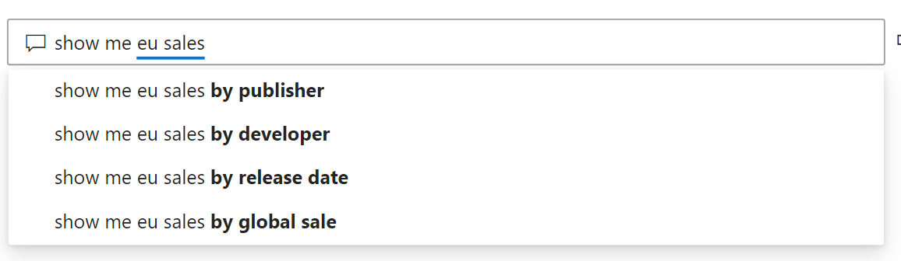
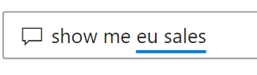
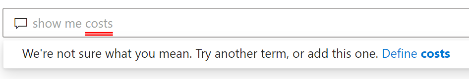
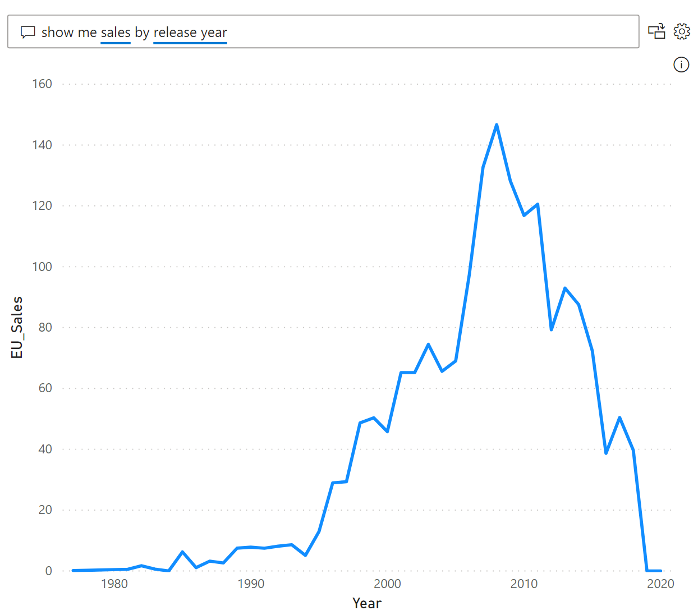
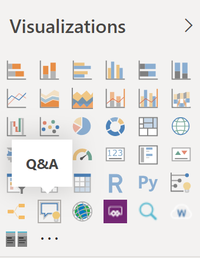
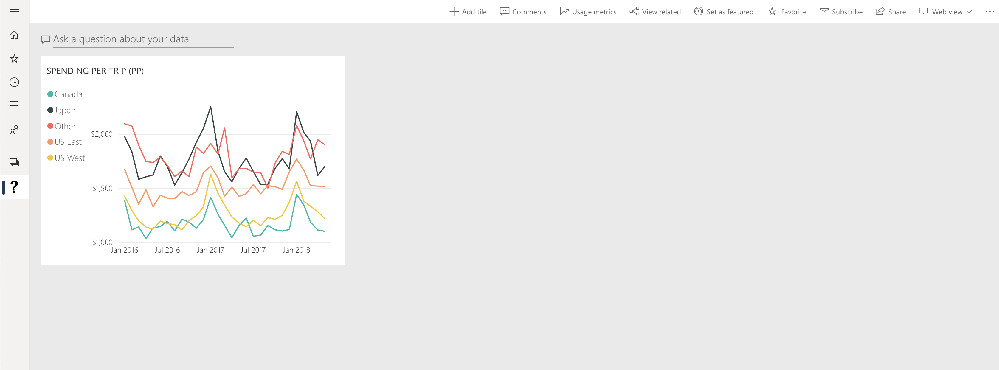

# Introduction: Use natural language to explore data with Power BI Q&A

Sometimes the fastest way to get an answer from your data is to perform a search over your data using natural language. The Q&A feature in Power BI lets you explore your data in your own words using natural language. Q&A is interactive, even fun. Often, one question leads to others as the visualizations reveal interesting paths to pursue. Asking the question is just the beginning. Travel through your data, refining or expanding your question, uncovering new information, zeroing in on details, or zooming out for a broader view. The experience is interactive and fast, powered by an in-memory storage. 

Power BI Q&A is free and available to all users. In Power BI Desktop, report designers can use Q&A to explore data and create visualizations. In the Power BI service, everyone can explore their data with Q&A. Our mobile apps support Q&A too, with the Q&A virtual assistant in iOS and the Q&A visual on Android devices. If you have permission to edit a dashboard or report, you can also pin your Q&A results.

## How to use Q&A

Even before you start typing, Q&A displays a new screen with suggestions to help you form your question. Start either from one of the suggested questions or type your own questions. Q&A supports a wide range of questions, including but not limited to:

- **Ask natural questions** Which sales has the highest revenue?
- **Use relative date filtering** Show me sales in the last year
- **Return only the top N** Top 10 products by sales
- **Provide a filter** Show me sales in the USA
- **Provide complex conditions** Show me sales where product category is Category 1 or Category 2
- **Return a specific visual** Show me sales by product as pie chart
- **Use complex aggregations** Show me median sales by product
- **Sort results** Show me top 10 countries by sales ordered by country code
- **Compare data** Show me date by total sales vs total cost
- **View trends** Show me sales over time

### Autocomplete

As you type your question, Power BI Q&A shows relevant and contextual suggestions to help you quickly become productive with natural language. As you type, you get immediate feedback and results. The experience is similar to typing in a search engine.

### Red/Blue/Orange underlines

Q&A shows words with underlines to help you see which words the system understood or didn't recognize. A solid blue underline indicates that the system successfully matched the word to a field or value in the data-model. The example below shows that Q&A recognized the word *EU Sales*.

 An orange dotted underline indicates the word/words is categorized as *low confidence*. If you type a vague or ambiguous word, the field is underlined in orange dots. An example could be the word 'Sales'. Multiple fields could contain the word 'Sales', so the system uses a orange dotted underline to prompt you to choose the field you meant. Another example of low confidence could be if you type the word 'area', but the column it matches is 'region'. Power BI Q&A recognizes words that mean the same thing, thanks to the integration with Bing and Office and also interpreting renames from within a report as potential suggestions. Q&A underlines the word with orange dots so you know it's not a direct match.

A red underline means Q&A didn't recognize the word at all. You could encounter this issue by using a domain-specific term that isn't mentioned anywhere in the data, or the data fields are incorrectly named. An example could be using the word 'Costs' though the word doesn't exist anywhere in the data. The word is in the English dictionary, but Q&A will mark this term with a red underline to indicate it didn't find this term with respect to the data.

> [!NOTE]
> You can customize the blue/red/orange underline colors in the Q&A **Visual formatting** pane. Also, the [Q&A tooling](q-and-a-tooling-teach-q-and-a.md) article explains *Teach Q&A*, which you use to define terms Q&A didn't recognize.

### Visualization results

As you type your question, Q&A tries to instantly interpret and visualize the answer. As part of the latest updates, Q&A now tries to interpret the question and plot the fields automatically to the correct axis. For example, if you type 'Sales by year', Q&A detects that year is a date field and always prioritizes placing this field on the X axis. If you want to change the visualization type, type 'as *chart type*' after the question. Q&A currently supports these types of visualizations:

- Line chart
- Bar chart
- Matrix
- Table
- Card
- Area
- Pie chart
- Scatter/Bubble chart
- Map
 

## Add Q&A to a report

You can add Q&A to a report in Power BI Desktop or the Power BI service in two different ways:

- Add a Q&A visual.
- Add a Q&A button.

To add the Q&A visual to a report, select the **Q&A** icon, or select the Q&A visual in the Visualization pane. Alternatively, double-clicking anywhere on the report canvas automatically inserts the Q&A visual.

To add a button, on the **Home** ribbon, select **Buttons** > **Q&A**. You can completely customize the Q&A button image.

> [!NOTE]
> When you start Q&A from the button, it still uses the old Q&A. Subsequent releases of Power BI will change that.

## Use Q&A for dashboards

By default, Q&A is available at the top of dashboards. To use Q&A, type in the **Ask a question about your data** box.

## Next steps

You can integrate natural language in your reports in a variety of ways. For more information, see these articles:

* [Q&A visual](../visuals/power-bi-visualization-q-and-a.md)
* [Q&A best practices](q-and-a-best-practices.md)
