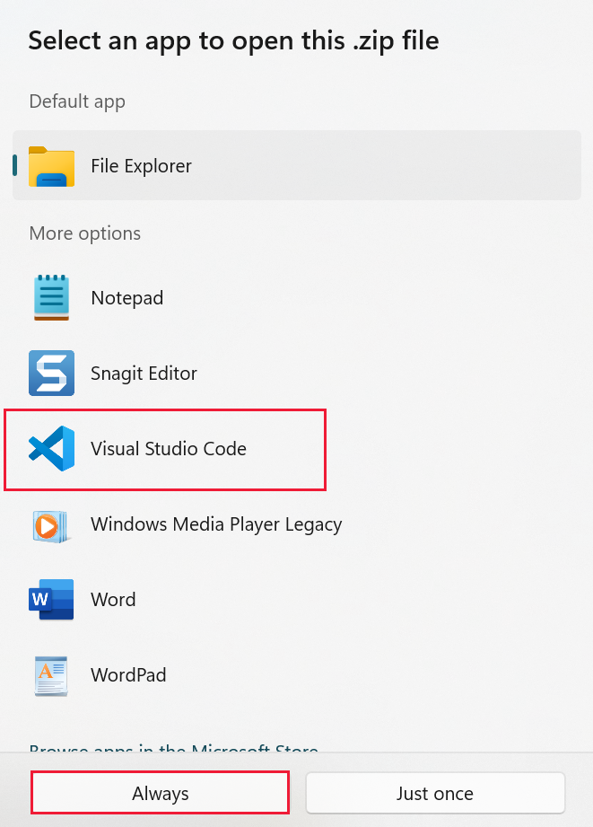
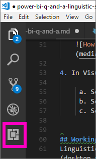
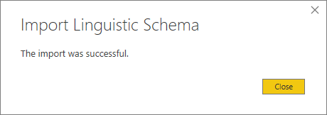

# Edit Q&A linguistic schema and add phrasings in Power BI Desktop 
Using common phrases and natural language to ask questions of your data is powerful. Even more powerful is when your data answers. When you ask Power BI Q&A a question, it makes a best effort to answer correctly. But for even better Q&A interactions, you can improve the answers. One way is by editing the linguistic schema. 

It all starts with your enterprise data.  The better the data model, the easier it will be for users to get quality answers. One way to improve the model is to add a linguistic schema that defines and categorizes terminology and relationships between table and column names in your dataset. Power BI Desktop is where you manage your linguistic schemas. 

There are two sides to Q&A.  The first side is the preparation, or *modeling*.  The second side is asking questions and exploring the data, or *consuming*. In some companies, employees known as *data modelers* or IT admins may be the ones to assemble the datasets, create the data models, and publish the datasets to Power BI.  A different set of employees would be the ones to "consume" the data online.  In other companies, these roles may be combined. 

This article is for the data modelers, the people who optimize datasets to provide the best possible Q&A results. 

## What is a linguistic schema?
A linguistic schema describes terms and phrases that Q&A should understand for objects within a dataset, including parts of speech, synonyms, and phrasings that relate to that dataset. When you import or connect to a dataset, Power BI creates a linguistic schema based on the structure of the dataset. When you ask Q&A a question, it looks for matches and relationships in the data to figure out the intention of your question. For example, it looks for nouns, verbs, adjectives, phrasings, and other elements. And it looks for relationships, such as which columns are objects of a verb. 

You're probably familiar with parts of speech (if not, see below), but *phrasings* may be a new term.  A phrasing is how you talk about (or *phrase*) the relationships between things. For example, to describe the relationship between customers and products, you might say “customers buy products”. Or to describe the relationship between customers and ages, you might say “ages indicate how old customers are”. Or to describe the relationship between customers and phone numbers, you might simply say “customers have phone numbers”.

These phrasings come in a variety of shapes and sizes. Some correspond directly with relationships in the data model. Some relate columns with their containing tables. Others relate multiple tables and columns together in complex relationships. In all cases, they describe how things are related using everyday terms.

Linguistic schemas are saved in a .yaml format. This format is related to the popular JSON format but provides a more flexible and easier-to-read syntax. Linguistic schemas can be edited, exported, and imported into Power BI Desktop.

## Prerequisites

- If you haven't already read the article on [improving your data model for Q&A](q-and-a-best-practices.md), you may want to read that article first. It includes numerous tips for designing and improving your data model and an important section on adding synonyms.  
- Download sample [.yaml and .pbix files](https://go.microsoft.com/fwlink/?linkid=871858).   
- Install a .yaml file editor. We recommend [Visual Studio Code](https://code.visualstudio.com/).

### Set up an editor for .yaml files
We recommend using Visual Studio Code to edit linguistic schema .yaml files. Visual Studio Code includes out-of-the-box support for .yaml files and can be extended to specifically validate the Power BI linguistic schema format.
1. Install [Visual Studio Code](https://code.visualstudio.com/).    

2. Select the sample linguistic schema that you saved earlier: [.yaml file](https://go.microsoft.com/fwlink/?linkid=871858) (SummerOlympics.lsdl.yaml).    
4. Select **Visual Studio Code** and **Always use this app to open .yaml files**.

    

4. In Visual Studio Code, install the YAML Support by Red Hat extension.    
    a. Select the **Extensions** tab (last one on the left) or CTRL+SHIFT+X.    
        
    b. Search for "yaml" and select **YAML Support by Red Hat** in the list.    
    c. Select **Install > Reload**.


## Working with linguistic schemas

There are two ways to work with linguistic schemas. One way is to edit, import, and export the .yaml from the ribbon in Power BI Desktop. That way is covered in the Power BI [Q&A Tooling experience](q-and-a-tooling-intro.md) article. You don't have to open the .yaml file in order to improve Q&A. 

The other way to edit a linguistic schema is to export and edit the .yaml file directly.  When you edit a linguistic schema .yaml file, you tag columns in the table as different grammatical elements, and define words that a colleague might use to phrase a question. For instance, you state the columns that are the subject and the object of the verb. You add alternative words that colleagues can use to refer to tables, columns, and measures in your model. 


Before you can edit a linguistic schema, you must open (export) it from Power BI Desktop. Saving the .yaml file back to the same location is considered importing.  But you can also import other .yaml files instead.  If, for instance, you have a similar dataset and you've already put in a lot of work adding parts of speech, identifying relationships, creating phrasings, and creating synonyms, you can use that .yaml file in a different Power BI Desktop file. 

Q&A uses all this information together with any enhancements that you make to provide a better answer, auto completion, and summary of the questions.

## Edit a linguistic schema
When you first export your linguistic schema from Power BI Desktop, most or all of the content in the file is automatically generated by the Q&A engine. These generated entities, words (synonyms), relationships, and phrasings are designated with a **State: Generated** tag. They're included in the file mostly for informational purposes but can be a useful starting point for your own changes. 

> [!NOTE]
> The sample .yaml file included with this tutorial doesn't contain **State:Generated** or **State:Deleted** tags since it was prepared specifically for this tutorial. To see these tags, open an unedited .pbix file in Relationship view and export the linguistic schema.


When you import your linguistic schema file back into Power BI Desktop, anything that is marked **State: Generated** is ignored, and later regenerated. Thus, if you’d like to change some generated content, remove the corresponding **State: Generated** tag as well. Similarly, if you want to remove some generated content, change the **State: Generated** tag to **State: Deleted** so that it isn't regenerated when you import your linguistic schema file.

### Export, then import a .yaml file

1. Open the dataset in Model view in Power BI Desktop. 
2. On the **Modeling** tab, select **Linguistic Schema** > **Export linguistic schema**.
3. Save it. The file name ends with .lsdl.yaml.
4. Open it in Visual Code or another editor.
4. In Model view in Power BI Desktop, on the **Modeling** tab, select **Linguistic Schema** > **Import linguistic schema**. 
6. Navigate to the location where you saved the edited .yaml file and select it. A Success message lets you know that the linguistic schema .yaml file was successfully imported.

    

## Phrasings in the linguistic schema
Again, a phrasing is how you talk about (or “phrase”) the relationships between things. For example, to describe the relationship between customers and products, you might say “customers buy products”.

## Where do phrasings come from?
Power BI adds many simple phrasings to the linguistic schema automatically, based on the structure of the model and some guesses based on column names. For example:
- Most columns relate to their containing table with a simple phrasing, like “products have descriptions”.
- Model relationships result in default phrasings for both directions of the relationship, like “orders have products” and “products have orders”.
- Some model relationships can, based on their column names, get a more complex default phrasing like “orders are shipped to cities”.

Your users talk about things in plenty of ways that Q&A can’t guess, however. Therefore, you may want to add your own phrasings manually.

## Why add phrasings?
The first reason for adding a phrasing is to define a new term. For example, if you want to be able to ask “list the oldest customers”, you must first teach Q&A what you mean by “old”. You would do so by adding a phrasing like “ages indicate how old customers are”.

The second reason for adding a phrasing is to resolve ambiguity. Basic keyword search only goes so far when words have more than one meaning. For example, “flights to Chicago” isn't the same as “flights from Chicago”. But Q&A won’t know which one you mean unless you add the phrasings “flights are from departure cities” and “flights are to arrival cities”. Similarly, Q&A will only understand the distinction between “cars that John sold to Mary” and “cars that John bought from Mary” after you add the phrasings “customers buy cars from employees” and “employees sell customers cars”.

The final reason for adding a phrasing is to improve restatements. Rather than Q&A echoing back to you “Show the customers and their products”, it would be clearer if it said “Show the customers and the products they bought” or “Show the customers and the products they reviewed”, depending on how it understood the question. Adding custom phrasings allows restatements to be more explicit and unambiguous.


## Kinds of phrasings
To understand the different types of phrasings, you’re first going to need to remember a couple of basic grammar terms:
- A *noun* is a person, place, or thing. 
    Examples: car, teenager, Marty, flux capacitor
- A *verb* is an action or state of being. 
    Examples: hatch, burst, devour, eject
- An *adjective* is a descriptive word that modifies a noun. 
    Examples: powerful, magical, golden, stolen
- A *preposition* is a word used before a noun to relate it to a previous noun, verb, or adjective 
    Examples: of, for, near, from
-  An *attribute* is a quality or feature of something.
-  A *name* is a word or set of words by which a person, animal, place, or thing is known or referred to.   


### Attribute phrasings
Attribute phrasings are the workhorse of Q&A, used when one thing is acting as an attribute of another thing. They’re simple and straightforward, and perform most of the heavy lifting when you haven't defined a subtler, more detailed phrasing. Attribute phrasings are described using the basic verb “have” (“products have categories” and "host countries have host cities"). They also automatically allow questions with the prepositions “of” and “for” (“categories of products”, “orders for products”) and possessive (“John’s orders”). Attribute phrasings are used in these kinds of questions:

- Which customers have orders?
- List host cities by country ascending
- Show orders that have chai
- List customers with orders
- What is the category of each product?
- Count Robert King's orders    

Power BI generates the overwhelming majority of attribute phrasings needed in your model, based on table/column containment and model relationships. Typically, you don’t need to create them yourself.
Here's an example of how an attribute phrasing looks inside the linguistic schema:

```json
product_has_category:
  Binding: {Table: Products}
  Phrasings:
  - Attribute: {Subject: product, Object: product.category}
```
 
### Name Phrasings
Name phrasings are helpful if your data model has a table that contains named objects such as athlete names and customer names. For example, a “product names are names of products” phrasing is essential for being able to use product names in questions. Name phrasing also enables “named” as a verb (for example, “List customers named John Smith”). However, it's most important when used in combination with other phrasings, to allow a name value to be used to refer to a particular table row. For example, in “Customers that bought chai”, Q&A can tell the value “chai” refers to the whole row of the product table, rather than just a value in the product name column. Name phrasings are used in these kinds of questions:    
- Which employees are named Robert King
- Who is named Ernst Handel
- Fernand De Montigny's sports
- Count of athletes named Mary
- What did Robert King buy?

Assuming you used a sensible naming convention for name columns in your model (for example, “Name” or “ProductName” rather than “PrdNm”), Power BI generates most of the name phrasings needed in your model automatically, so you usually don’t need to create them yourself.

Here's an example of how a name phrasing looks inside of the linguistic schema:

```json
employee_has_name:
  Binding: {Table: Employees}
  Phrasings:
  - Name:
      Subject: employee
      Name: employee.name
```

 
### Adjective phrasings
Adjective phrasings define new adjectives used describe things in your model. For example, “happy customers are customers where rating > 6” phrasing is needed to ask questions like “list the happy customers in Des Moines”. There are several forms of adjective phrasings, for use in different situations.

*Simple adjective phrasings* define a new adjective based on a condition, such as “discontinued products are products where status = D”. Simple adjective phrasings are used in these kinds of questions:
- Which products are discontinued?
- List the discontinued products
- List the gold medalists
- Products that are backordered

Here's an example of how a simple adjective phrasing looks inside of the linguistic schema:

product_is_discontinued:

```json
Binding: {Table: Products}
  Conditions:
  - Target: product.discontinued
    Operator: Equals
    Value: true
  Phrasings:
  - Adjective:
      Subject: product
      Adjectives: [discontinued]
```

*Measurement adjective phrasings* define a new adjective based on a numeric value that indicates the extent to which the adjective applies, such as “lengths indicate how long rivers are” and "small country/regions have small land areas". Measurement adjective phrasings are used in these kinds of questions:
- List the long rivers
- Which rivers are the longest?
- List the smallest country/regions that won gold in basketball
- How long is the Rio Grande?

Here's an example of how a measurement adjective phrasing looks inside of the linguistic schema:

river_has_length:

 ```json
Binding: {Table: Rivers}
  Phrasings:
  - Adjective:
      Subject: river
      Adjectives: [long]
      Antonyms: [short]
      Measurement: river.length
```

*Dynamic adjective phrasings* define a set of new adjectives based on values in a column in the model, such as “colors describe products” and "events have event genders". Dynamic adjective phrasings are used in these kinds of questions:
- List the red products
- Which products are green?
- Show skating events for females
- Count issues that are active

Here's an example of how a dynamic adjective phrasing looks inside the linguistic schema:

product_has_color:
```json
Binding: {Table: Products}
  Phrasings:
  - DynamicAdjective:
      Subject: product
      Adjective: product.color
```

 
### Noun phrasings
Noun phrasings define new nouns that describe subsets of things in your model. They often include some type of model-specific measurement or condition. For example, for our Olympics model we might want to add phrasings that distinguish champions from medalists, ball sports from water sports, teams versus individuals, age categories of athletes (teens, adults, seniors), etc. For our movie database, we might want to add noun phrasings for “flops are movies where net profit < 0” so that we can ask questions like “count the flops by year”. There are two forms of noun phrasings, for use in different situations.

*Simple noun phrasings* define a new noun based on a condition, such as “contractors are employees where full time = false” and "champion is athlete where count of medals >5". Simple noun phrasings are used in these kinds of questions:

- Which employees are contractors?
- Count the contractors in Portland
- How many champions in 2016

Here's an example of how a simple noun phrasing looks inside of the linguistic schema:

employee_is_contractor:

```json
Binding: {Table: Employees}
  Conditions:
  - Target: employee.full_time
    Operator: Equals
    Value: false
  Phrasings:
  - Noun:
      Subject: employee
      Nouns: [contractor]
```

*Dynamic noun phrasings* define a set of new nouns based on values in a column in the model, such as “jobs define subsets of employees”. Dynamic noun phrasings are used in these kinds of questions:

- List the cashiers in Chicago
- Which employees are baristas?
- List the referees in 1992

Here's an example of how a dynamic noun phrasing looks inside of the linguistic schema:
employee_has_job:

 ```json
Binding: {Table: Employees}
  Phrasings:
  - DynamicNoun:
      Subject: employee
      Noun: employee.job
```

### Preposition phrasings
Preposition phrasings are used to describe how things in your model are related via prepositions. For example, a “cities are in countries” phrasing improves understanding of questions like “count the cities in Washington”. Some preposition phrasings are created automatically when a column is recognized as a geographical entity. Preposition phrasings are used in these kinds of questions:

- Count the customers in New York
- List the books about linguistics
- Which city is Robert King in?
- How many books are by Stephen Pinker?
 
Here's an example of how a preposition phrasing looks inside of the linguistic schema:
customers_are_in_cities:

 ```json
Binding: {Table: Customers}
  Phrasings:
  - Preposition:
      Subject: customer
      Prepositions: [in]
      Object: customer.city
```

 
### Verb phrasings
Verb phrasings are used to describe how things in your model are related via verbs. For example, a “customers buy products” phrasing improves understanding of questions like “who bought cheese?” and “what did John buy?” Verb phrasings are the most flexible of all of the types of phrasings, often relating more than two things to each other, such as in “employees sell customers products”. Verb phrasings are used in these kinds of questions:

- Who sold what to whom?
- Which employee sold chai to John?
- How many customers were sold chai by Mary?
- List the products that Mary sold to John.
- Which discontinued products were sold to Chicago customers by Boston employees?

Verb phrasings can also contain prepositional phrases, thereby adding to their flexibility, such as in “athletes win medals at competitions” or “customers are given refunds for products”. Verb phrasings with prepositional phrases are used in these kinds of questions:

- How many athletes won a gold medal at the Visa Championships?
- Which customers were given a refund for cheese?
- At which competition did Danell Leyva win a bronze medal?

Some verb phrasings are created automatically when a column is recognized as containing both a verb and a preposition.

Here's an example of how a verb phrasing looks inside of the linguistic schema:
customers_buy_products_from_salespeople:

```json
Binding: {Table: Orders}
  Phrasings:
  - Verb:
      Subject: customer
      Verbs: [buy, purchase]
      Object: product
      PrepositionalPhrases:
      - Prepositions: [from]
        Object: salesperson
```

### Relationships with multiple phrasings
Frequently, a single relationship can be described in more than one way. In this case, a single relationship can have more than one phrasing. It's common for the relationship between a table entity and a column entity to have both an attribute phrasing and another phrasing. For example, in the relationship between customer and customer name, you will want both an attribute phrasing (for example, “customers have names”) and a name phrasing (for example, “customer names are the names of customers”) so you can ask both types of questions.

Here's an example of how a relationship with two phrasings looks inside of the linguistic schema:
customer_has_name:

  ```json
Binding: {Table: Customers}
  Phrasings:
    - Attribute: {Subject: customer, Object: customer.name}
    - Name:
        Subject: customer
        Object: customer.name
```

Another example would be adding the alternate phrasing “employees sell customers products” to the “customers buy products from employees” relationship. Note that you don't need to add variations like “employees sell products *to customers*” or “products are sold to customers *by employees*”, since the “by” and “to” variations of the subject and indirect object are inferred automatically by Q&A.

## Considerations and troubleshooting
If you make a change to a .lsdl.yaml file that does not conform to the linguistic schema format, you now see validation squiggles to indicate issues: 


More questions? [Try the Power BI Community](https://community.powerbi.com/)
