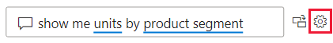
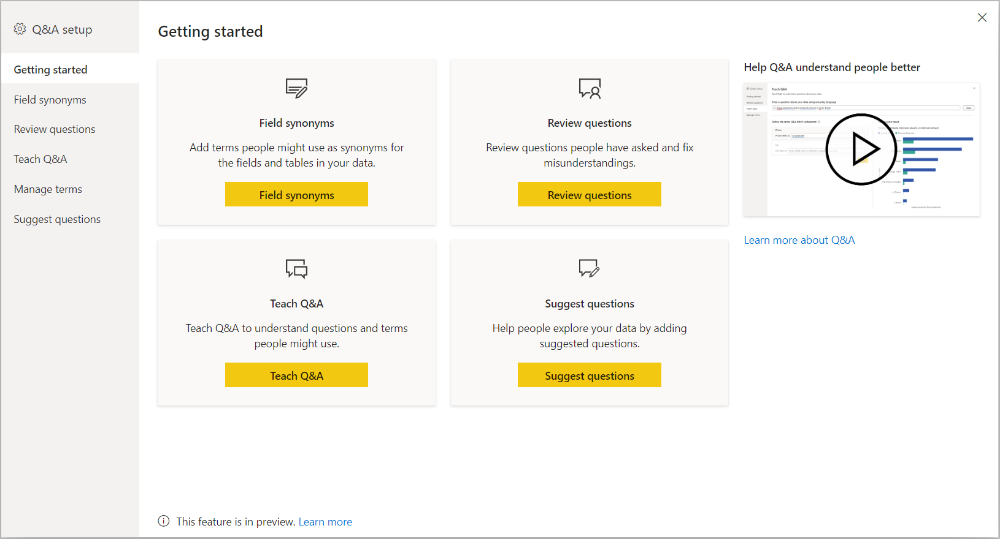
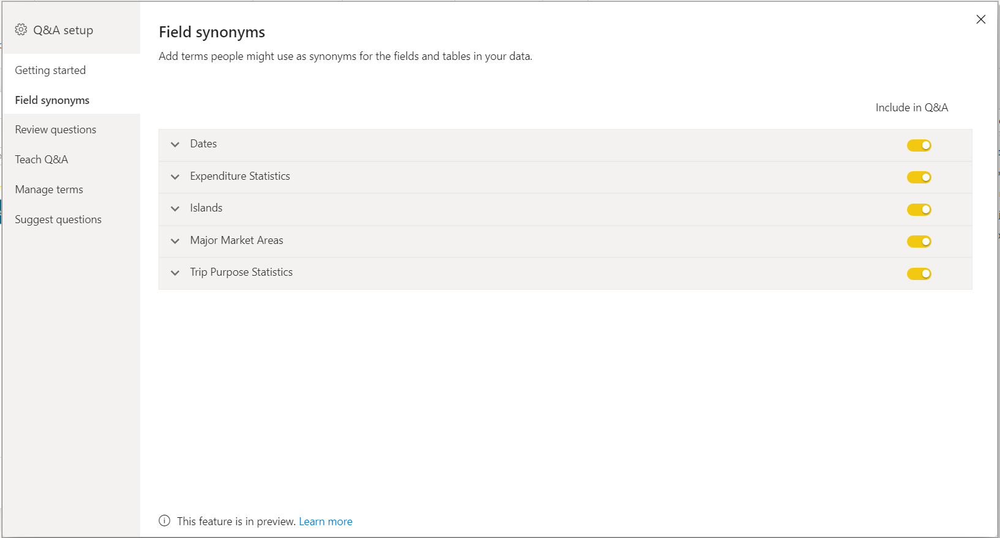
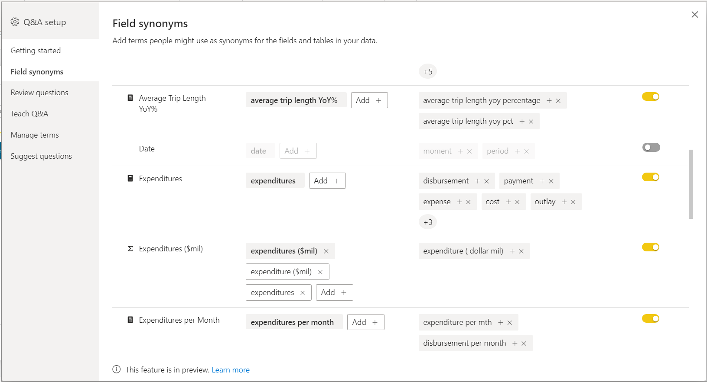
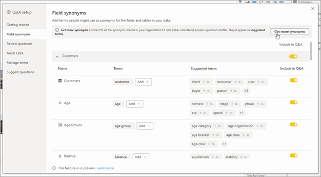
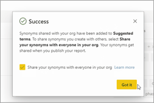
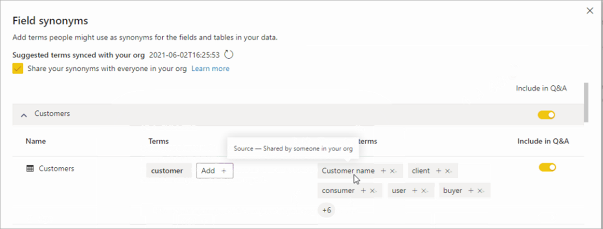
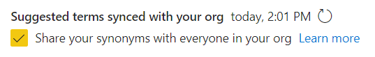
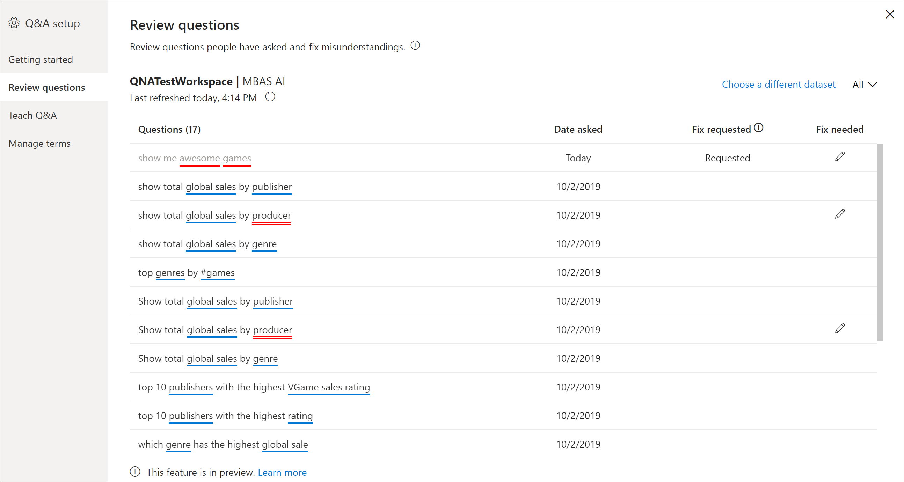
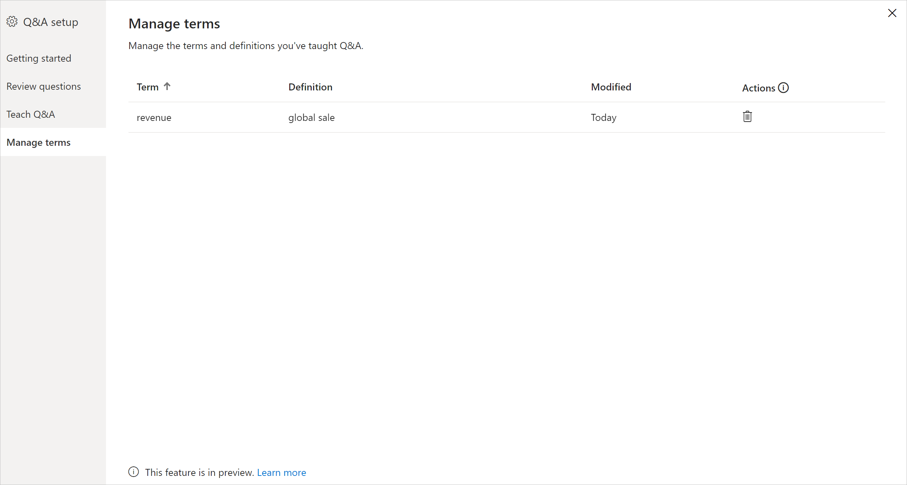

# Intro to Q&A tooling to train Power BI Q&A (preview)

With Power BI Q&A *tooling*, you can improve the natural language experience for your users. As a designer or administrator, you interact with the natural language engine and make improvements in three areas: 

- Review questions your users have asked.
- Teach Q&A to understand questions.
- Manage terms you've taught Q&A.

In addition to these dedicated tooling capabilities, the **Modeling** tab in Power BI Desktop offers more options:  

- Synonyms
- Row labels
- Hide from Q&A
- Configuring of the linguistic schema (advanced)

## Get started with Q&A tooling

Q&A tooling is only available in Power BI Desktop, and currently only supports import mode.

1. Open Power BI Desktop and use Q&A to create a visual. 
2. From the corner of the visual, select the gear icon. 

    

    The Getting started page opens.  

    

### Field Synonyms

Select **Field Synonyms** to see all the tables and columns that belong to the model. This view allows you to add alternative names to match the columns to help users. You can also choose whether or not a column or table should be hidden from Q&A.

Click on one of the tables to expand and you will see a dialog similar to the one below.

The dialog will show all the columns and tables and their respective terms/synonyms that users can use when asking questions against the dataset. You can quickly see all the terms in one place and also add or remove terms for multiple columns. 

- Add terms - If you have a field called sales, you may decide to add a term called revenue so a user can use this word instead of being required to use the word sales. Click the add sign to quickly add a new term

- Include in Q&A - This option allows a column or table to be omitted from Q&A meaning it will not be shown nor a result can be displayed with this column. A circumstance where you may decide to not include a column is when dealing with dates. If there are numerous date fields, or foreign keys, you may decide to remove all but one of the date fields so the correct date column is picked when a user asks a date related question.

- Suggested Terms - Q&A will also recommend suggested terms retrieved from our suggestions engine to help you quickly add terms/synonyms. If the suggestions are not added, They will still function but will give the user an orange dotted line indicating Q&A thinks it has an answer but is not sure. If the suggested synonym is correct, click the + icon so it can be used as a synonym. if the suggestion is incorrect, then click the x which will remove the term and ensure it will not be used as a term/synonym and will not function inside Q&A. The initial suggestions are powered by Office Dictionary or can come from renames found inside a report. Another way to get more suggested terms is through synonymn sharing within your organization. 

#### Synonym sharing
With synonym sharing you can leverage your coworkers’ synonyms and minimize duplicate effort when adding synonyms to your models. 
To connect to shared synonyms, navigate to **Q&A setup** > **Field synonyms** and click **Get more synonyms**.

This process may take a few seconds, but once it’s completed, you also have the option to share your synonyms to everyone in your org as well. 
> [!Note] 
> The synonyms will only get shared when you publish the report.

Any shared synonyms that match fields in your model will show up in the **Suggested terms** section. Then you can select the plus icon (+) on the suggested term to add it as a field synonym.

As new synonyms get shared within your organization, you can click the refresh icon to ensure that your **Suggested terms** are in sync with your organization:

### Review questions

Select **Review questions** to see a list of datasets being used in the Power BI service for your tenant. The **Review questions** page also displays the dataset owner, workspace, and last refreshed date. From here you can select a dataset and see what questions users have been asking. The data also shows words that were not recognized. All data shown here is for the last 28 days.

### Teach Q&A

The **Teach Q&A** section allows you to train Q&A to recognize words. To begin, type a question that contains a word or words that Q&A doesn't recognize. Q&A prompts you for the definition of that term. Enter either a filter or a field name that corresponds to what that word represents. Q&A then reinterprets the original question. If you're happy with the results, you can save your input. To learn more, see [Teach Q&A](q-and-a-tooling-teach-q-and-a.md)

### Manage terms

Anything you've saved from the Teach Q&A section shows up here, so you can review or delete terms you've defined. Currently you can't edit an existing definition, so to redefine a term you must delete and recreate that term.

### Suggest questions

> [!NOTE]
> The suggested questions will show up for all instances of the Q&A visual. It isn't possible to create a separate set of suggestions for each Q&A visual.
> 
> 

Without doing any setup, the Q&A visual will suggest several questions to get started with. These questions are automatically generated based on your data model. In **Suggest questions**, you can overwrite the auto-generated questions with your own questions.

To start, type the question you want to add in the text box. In the preview section, you see what the result will look like in the Q&A visual. 

:::image type="content" source="media/q-and-a-tooling-intro/power-bi-qna-suggest-questions.png" alt-text="Suggest Q&A questions":::
 
Select the **Add** button to add this question to **Your suggested questions**. Every additional question is added to the end of this list. The questions will show up in the Q&A visual in the same order as they do in this list. 

:::image type="content" source="media/q-and-a-tooling-intro/power-bi-qna-save-suggest-questions.png" alt-text="Screenshot of saving suggested questions.":::
 
Make sure to select **Save** to show your list of suggested questions in the Q&A visual. 

## Other Q&A settings

### Set a row label

A row label allows you to define which column (or *field*) best identifies a single row in a table. For example, for a table called 'Customer', the row label is usually 'Display Name'. Providing this extra metadata allows Q&A to plot a more helpful visual when users type in 'Show me sales by customer'. Instead of treating 'customer' as a table, it can instead use 'Display Name' and display a bar chart showing each customer's sales. You can only set the row label Modeling view. 

1. In Power BI Desktop, select Modeling view.

2. Select a table to display the **Properties** pane.

3. In the **Row label** box, select a field.

## Configure the linguistic schema (advanced)

In Power BI, you can completely train and enhance the natural language engine inside Q&A, including changing the scoring and weighting of the underlying natural language results. To learn how, see [Edit Q&A linguistic schema and add phrasings](q-and-a-tooling-advanced.md).

## Next steps

There are a number of best practices for improving the natural language engine. For more information, [Q&A best practices](q-and-a-best-practices.md).
