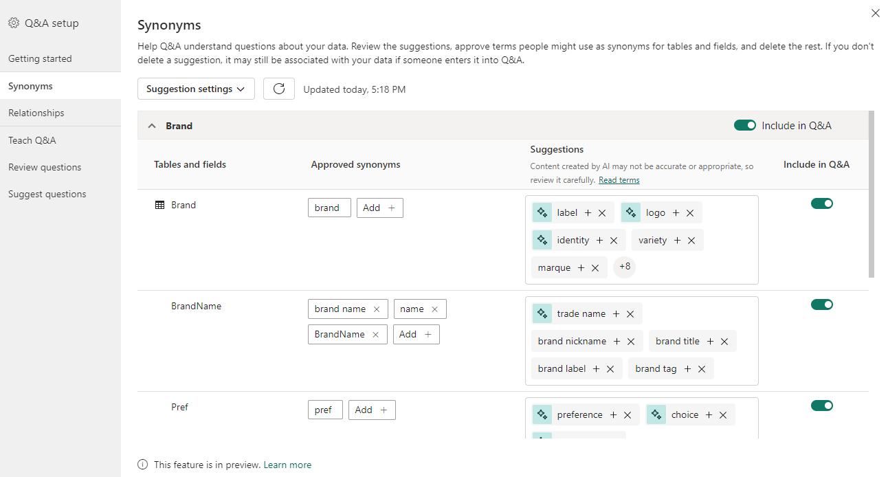

# Intro to Q&A tooling to train Power BI Q&A (preview)

With Power BI Q&A *tooling*, you can improve the natural language experience for your users. As a designer or administrator, you interact with the natural language engine and make improvements in three areas: 

- Review questions your users have asked.
- Teach Q&A to understand questions.
- Manage terms you've taught Q&A.

In addition to these dedicated tooling capabilities, the **Modeling** tab in Power BI Desktop offers more options:  

- Synonyms
- Linguistic relationships (Phrasings)
- Row labels
- Hide from Q&A
- Configuring of the linguistic schema (advanced)

## Opening the Q&A setup menu

Q&A tooling is most easily accessed through the *Q&A setup menu*, which is only available in Power BI Desktop, and currently only supports import mode.

1. Open Power BI Desktop and use Q&A to create a visual. 
1. From the corner of the visual, select the gear icon. 

    :::image type="content" source="media/q-and-a-tooling-intro/qna-visual-gear.png" alt-text="Screenshot of the Q and A search box with the gear icon highlighted.":::

    The Getting started page opens.  

    

## Field synonyms

One of the most basic and effective ways to improve the Q&A visual experience is through adding synonyms for the names of tables and fields in your data. The Q&A engine relies on these names and their synonyms to understand which data an input might be referring to. For example, a publishing company trying to see "novel sales last year" in the Q&A visual may not receive useful results without defining "novel" as a synonym for "product" in the data model. The strong emphasis the Q&A visual places on the names of data fields and their explicitly defined synonyms ensures that the visual output is reliable, precise, and consistent across the many possible users in your organization. 

1. The first time you create a Q&A visual or open the Q&A setup menu, you might see a banner at the top of the visual or menu prompting you to improve your Q&A visual by getting or adding synonyms. 

    

    The contents of this banner vary depending on several factors, like whether or not you are signed in, or if you have org synonyms or Copilot enabled. If the option is available to you, you can select **Add synonyms** to have Power BI automatically get synonyms [generated by Copilot](q-and-a-copilot-enhancements.md), [shared by others in your organization](#synonym-sharing), or both. 

    If you choose to add synonyms, once that content is added, you're prompted to review those synonyms. 

    

    Selecting the **Review synonyms** button takes you into the synonyms tab of the Q&A setup menu. You can also enter this tab directly via the Q&A setup menu.

1. The **Synonyms** tab shows you all of the tables and columns that belong to the model. This view allows you to add alternative names to match the columns to help users. You can also choose whether or not a column or table should be hidden from Q&A.

   

   The dialog shows all the columns, tables, and respective terms and synonyms that users can use when asking questions against the semantic model. You can quickly see all the terms in one place and add or remove terms for multiple columns. 

   **Approved synonyms** If you have a field called brand, you might decide to add a term called "label," so a user can use this word instead of being required to use the word brand. When Q&A is processing inputs, Q&A then treats the mentions of "label" as references to that field in your data. You can select **Add** to type in a new term.

   **Suggestions** Q&A also recommends suggested terms retrieved from our suggestions engine to help you quickly add terms and synonyms into the list of approved synonyms. If the suggestions aren't added, they're still used as synonyms with a lower priority than approved synonyms, but the results are shown with an orange dotted line indicating that it is low-confidence. You can select the plus icon (+) on a suggested synonym to add it to the list of approved synonyms. For example, "label" is already a suggested synonym in the brand row, so you can select the (+) icon to approve it. If the suggestion is incorrect, however, you can select the x to remove the term. That way, it won't be used even as a suggested term or synonym by Q&A. 
   
   The initial suggestions are powered by a built-in thesaurus or come from renames found inside a report. You can also get more suggested terms through Copilot or through shared synonyms from within your organization. 

   **Include in Q&A** This option allows a column or table to be omitted from Q&A, meaning it won't be shown and a result can't be displayed with this column. You might decide not to include a column when dealing with dates. If there are numerous date fields or foreign keys, you might decide to remove all but one of the date fields, so the correct date column is picked when a user asks a date related question.

   **Suggestion settings** Using the suggestion settings menu, you can enable or disable the different sources for suggested synonyms. Enabling a source prompts Q&A to get suggested synonyms from that source after you select apply; conversely, disabling a source removes suggested synonyms of that source from Q&A after you select apply. Synonyms which began as suggestions, but were promoted to approved synonyms, aren't affected. From this menu, you can also enable or disable sharing synonyms with your organization. 

### Synonym sharing

If synonym sharing is enabled within your organization, you can use your coworker's synonyms and minimize duplicate effort when adding synonyms to your models. When first creating a Q&A visual or opening the Q&A setup menu, if synonym sharing is available for you, a banner may prompt you to get org synonyms. You can also connect to shared synonyms by enabling the option in the suggestion settings menu and selecting Apply, or by selecting the refresh button next to the suggestion settings menu if org synonyms have already been enabled as a source. 

Getting org synonyms might take a few seconds, but once it’s completed, you can share your synonyms with everyone in your organization. 

> [!NOTE] 
> Synonyms are only shared when you publish the report.

Any shared synonyms that match fields in your model show up in the **Suggested terms** section. You can select the plus icon (+) on the suggested term to add it as a field synonym.

As new synonyms get shared within your organization, you can select the refresh icon to ensure that your **Suggested terms** are in sync with your organization.

## Relationships

Some terms and phrases can't be defined with simple mappings to terms in your data model. These terms, which qualify other terms or relate them together, must be understood as a part of a phrase. For example, “show me popular titles” requires Q&A to understand what a title is, and what makes a title popular. 

These linguistic relationships (or [*phrasings*](q-and-a-tooling-advanced.md#phrasings-in-the-linguistic-schema)) come in a wide variety of types. You can teach Q&A to recognize words as they relate to terms in your data using the Q&A setup menu. 

Select **Review questions** to see a list of semantic models being used in the Power BI service for your tenant. The **Review questions** page also displays the semantic model owner, workspace, and last refreshed date. From here, you can select a semantic model and see what questions users have been asking. The data also shows words that weren't recognized. All data shown here is for the last 28 days.

1. When you open the menu, you will see some relationships populated by Q&A by default. These are based on the relationships already present in the tables and model. You can create a new relationship by clicking the "new relationship" button. 

1. You can select the type of relationship you would like to define using the "relationship type" dropdown. 

    

1. After you've defined a relationship type, click apply to save it into your linguistic schema. 

    

1. Now, when you use words or phrases as you've defined, Q&A will understand the fields you are referring to. 

   

## Teach Q&A

The **Teach Q&A** section allows you to train Q&A to recognize words. To begin, type a question that contains a word or words that Q&A doesn't recognize. Q&A prompts you for the definition of that term. Enter a filter or a field name that corresponds to what that word represents. Q&A then reinterprets the original question. If you're happy with the results, you can save your input. For more information, see [Teach Q&A to understand questions and terms](q-and-a-tooling-teach-q-and-a.md).

## Review questions

Select **Review questions** to see a list of datasets being used in the Power BI service for your tenant. The **Review questions** page also displays the dataset owner, workspace, and last refreshed date. From here, you can select a dataset and see what questions users have been asking. The data also shows words that weren't recognized. All data shown here is for the last 28 days.

:::image type="content" source="media/q-and-a-tooling-intro/qna-tooling-review-questions.png" alt-text="Screenshot of the Q and A Review questions page." lightbox="media/q-and-a-tooling-intro/qna-tooling-review-questions.png":::

## Suggest questions

> [!NOTE]
> The suggested questions show up for all instances of the Q&A visual. It isn't possible to create a separate set of suggestions for each Q&A visual.

Without doing any setup, the Q&A visual suggests several questions to get started. These questions are automatically generated based on your data model. In **Suggest questions**, you can overwrite the autogenerated questions with your own questions.

1. To start, type the question you want to add in the text box. In the preview section, you see what the result will look like in the Q&A visual. 

   :::image type="content" source="media/q-and-a-tooling-intro/power-bi-qna-suggest-questions.png" alt-text="Screenshot of the Suggest questions page with the search box highlighted." lightbox="media/q-and-a-tooling-intro/power-bi-qna-suggest-questions.png":::
 
1. Select the **Add** button to add this question to **Your suggested questions**. Each question is added to the end of this list. The questions will show up in the Q&A visual in the same order as they do in this list. 

   :::image type="content" source="media/q-and-a-tooling-intro/power-bi-qna-save-suggest-questions.png" alt-text="Screenshot of the Suggest questions page with the section called Reorder your suggested questions highlighted." lightbox="media/q-and-a-tooling-intro/power-bi-qna-save-suggest-questions.png":::
 
1. Select **Save** to show your list of suggested questions in the Q&A visual.

## Set a row label

A row label allows you to define which column (or *field*) best identifies a single row in a table. For example, for a table called 'Customer', the row label is usually 'Display Name'. Providing this extra metadata allows Q&A to plot a more helpful visual when users type in 'Show me sales by customer'. Instead of treating 'customer' as a table, it can instead use 'Display Name' and display a bar chart showing each customer's sales. You can only set the row label in Modeling view. 

1. In Power BI Desktop, select Modeling view.

2. Select a table to display the **Properties** pane.

3. In the **Row label** box, select a field.

## Configure the linguistic schema (advanced)

In Power BI, you can completely train and enhance the natural language engine inside Q&A. You can change the scoring and weighting of the underlying natural language results. For more information, see [Edit Q&A linguistic schema and add phrasings](q-and-a-tooling-advanced.md).

## Related content

There are many other best practices for improving the natural language engine. For more information, see [Best practices to optimize Q&A](q-and-a-best-practices.md).
